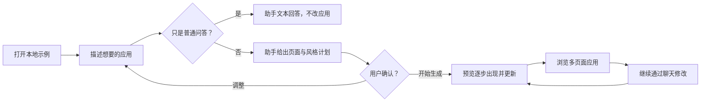

# Vite 多页面 Agent 示例实施计划

## 1. 目标

新增一个仅限本地使用的示例，演示 Agent 如何使用主包运行时生成和编辑多页面应用。

该示例由浏览器预览与本地 Node 服务端组成，不是生产托管应用：

- 使用 Vite + React 构建应用外壳。
- 使用 CopilotKit v2 构建常驻聊天区、确认卡片、服务器工具状态卡和浏览器前端工具；组件从 `@copilotkit/react-core/v2` 导入。
- 使用 Mastra Agent 处理聊天模型调用与工具编排；CopilotKit Runtime 以 AG-UI 连接浏览器和 Agent。
- 默认模型为 GPT-5.6。
- `@next-app-runtime/client` 是唯一的应用运行时。
- `NextAppSpec` / JSONL Patch 是唯一的应用修改格式；它由 `generate_spec` 工具内部生成，再由浏览器运行时提交，而不是模型聊天文本。
- Catalog 完整采用 `@json-render/shadcn 0.19.0`；`Link` 和 `Slot` 由运行时内置，不引入自定义业务组件。
- 浏览器通过本地 Hono 中的 CopilotKit Runtime 与 Mastra Agent 通信；所有 LLM 调用与 API Key 都只在服务端。

该演示需要证明：

> 用户可以与 Agent 对话、确认计划，然后看到生成的多页面应用通过 `@next-app-runtime/client` 增量呈现和更新。

## 2. 非目标

第一版明确不包含：

- 生产业务 API、数据库与服务端持久化。Hono 仅挂载本地 CopilotKit Runtime；浏览器刷新或 Hono 重启后，未完成的确认和生成不恢复、不重放。
- Vercel 部署。
- Vercel Sandbox。
- 生成源码文件。
- 文件写入。
- 项目持久化。会话状态（threadId、pending 决策）只存于浏览器与服务器进程内存，不落盘。
- 多用户状态、身份认证、分享或托管存储。
- API Key 长期存储。
- React Router 或 Next.js Router。

## 3. 核心架构

```text
Vite 浏览器应用                              Hono（Node.js 24）
  |                                                |
  | AG-UI（文本、工具、CUSTOM Patch 事件）         | CopilotKit Runtime
  v                                                v
CopilotKit 聊天、计划卡片与前端工具  <-->  CoordinatedMastraAgent（AG-UI wrapper）
  |                                                |
  | spec.patch.* CUSTOM / interrupt 事件           | Mastra Agent、服务端工具与生成器 LLM
  v                                                v
本地 TransformStream --> runtime.applySource({ kind: "jsonl-patch" })
  |
  `-- await_apply_result 前端工具结果 --> Mastra 才确认 committed
  v
@next-app-runtime/client 多页面应用预览
```

聊天状态不是应用真相。当前有效应用的真相始终是 `@next-app-runtime/client` 中的 `runtime.getSnapshot().current`。

### 会话与临时状态

浏览器在每个 tab 首次打开时生成 `threadId`，CopilotKit 在该 tab 内持有聊天消息与前端工具结果。每次 AG-UI run 均有新的 `runId`；前端工具结果以同一 `threadId` 的**下一次 run**回到 Mastra，而非在原 run 内继续。

Hono 的 `GenerationCoordinator` 是唯一的临时协调状态 owner，进程内保存：

```ts
type PendingDecision = { threadId: string; decisionId: string; toolCallId: string; plan: AppPlan };
type PendingGeneration = {
  threadId: string;
  generationId: string;
  startRunId: string;
  applyToolCallId?: string;
  status: "patch_streaming" | "awaiting_apply_result" | "committed" | "failed" | "aborted";
};
```

它不保存聊天历史、应用 Spec 或 API Key。刷新浏览器会创建新的 `threadId`；旧 `threadId` 的 pending 记录不再可寻址，不能触发提交。Hono 重启会清空所有 pending 记录；其后收到旧工具结果时统一返回 `aborted`，不恢复或重放。

`CoordinatedMastraAgent` 是 CopilotKit Runtime 注册的唯一 AG-UI Agent adapter。它包装 `@ag-ui/mastra` 的 `MastraAgent` 并拥有 `GenerationCoordinator`：透传正常 Mastra 事件；在 `generate_spec` 流中注入 `spec.patch.*` CUSTOM 事件；在需要浏览器输入时发出标准 TOOL_CALL 事件并以 `RUN_FINISHED` 的 `outcome: interrupt` 结束本次 run。不得让 Coordinator 以独立 Hono 路由或旁路 SSE 向浏览器发送事件。

系统有两个职责明确的 Prompt：`CHAT_SYSTEM_PROMPT` 负责普通问答、规划、澄清和工具选择；`SPEC_GENERATION_SYSTEM_PROMPT` 只在 `generate_spec` 工具内部调用 LLM 时使用，负责按 catalog 生成 JSONL Patch。普通问答直接使用聊天模型文本回答；规划、澄清、确认与应用修改仍通过工具完成。用户仍只看到一段连续聊天，不暴露创建或编辑模式。

## 4. 用户体验

用户看到的是一段连续对话，不暴露创建或编辑模式。

### 用户旅程



1. **进入本地示例**

   用户看到聊天区和应用预览区。模型固定为 `gpt-5.6`、推理强度固定为 `medium`；服务端从受保护环境读取 API Key，浏览器界面不显示也不保存 Key。

2. **描述想要的应用**

   用户通过自然语言描述目标，例如：“为一个开发者 API 平台构建 SaaS 网站，包含首页、定价和文档页面。”此时右侧保留最后一份有效预览，不因输入请求而提前变化。

3. **普通问答**

   用户可以问“当前有哪些页面？”、“为什么使用 Link？”或“这个应用现在的结构是什么？”。如需应用上下文，助手先读取摘要或 current，然后直接以普通文本作答；不调用修改工具，不产生 Patch，也不改变右侧预览。

4. **查看计划**

   对高层级需求，助手调用 `request_user_decision`，由 CopilotKit 在聊天中展示计划卡片，包括页面清单、导航关系、主要内容结构和视觉方向。工具调用不生成或应用 Patch。

5. **确认或调整**

   用户可以点击“开始生成”，也可以输入增加页面、删除页面或调整风格等反馈。CopilotKit 结束当前 run；用户决定作为同一 `threadId` 的下一次 AG-UI run 的前端工具结果返回。需求明确且低风险的小范围编辑可以不调用该工具，直接调用应用修改工具。

6. **观察应用生成**

   用户确认后，聊天 Agent 调用 `generate_spec`；工具内部的生成 LLM 输出 JSONL Patch，右侧预览随运行时接受 Patch 而逐步更新。Patch 日志默认折叠，用户可按需展开查看。

7. **浏览多页面结果**

   用户可以在预览中通过运行时 `Link` 切换首页、定价、文档等页面，检查页面内容、布局和导航是否符合预期。

8. **继续通过聊天修改**

   用户可以继续提出“在定价页增加 Enterprise 套餐”等编辑要求。如果要求明确，助手基于当前有效 Spec 直接调用修改工具；如果范围不清楚，助手通过 `request_user_decision` 提出一个简短问题。未要求修改的页面和内容必须保留。

9. **停止、重试与恢复**

   - **停止**：中止当前模型请求和 Patch 应用，保留上一份有效应用。
   - **重试**：重新执行最后一条用户请求，不复用已失效的流。
   - **生成失败**：聊天区显示错误，预览继续显示上一份有效应用。
   - **重置**：通过运行时提交 `minimalBaseSpec`，使其成为新的 current，再继续对话。

### 界面与恢复控制

桌面端是一个常驻双栏工作台：左侧聊天与决策区约占 40%，右侧多页面应用预览约占 60%。窄屏改为上下布局，默认先展示聊天与决策；预览可切换为独立区域，不能把两栏硬挤为窄列。用户只看到面向任务的状态，绝不显示 Patch 原文、AG-UI event、runId、toolCallId 或内部工具名。

```text
CopilotKit
  -> ChatPanel（CopilotChat / CopilotChatView）
       -> 消息与运行光标（CopilotChatMessageView）
       -> 计划或澄清卡（useInterrupt）
       -> 生成活动卡（useRenderTool: generate_spec）
       -> 快捷建议（useConfigureSuggestions）
       -> 输入与停止（CopilotChatInput）
  -> PreviewPanel
       -> 页面导航、当前版本状态、重置
       -> @next-app-runtime/client
```

- `CopilotKit` 是根 Provider；用 `useSingleEndpoint={false}` 接入 Hono 的多路由 Runtime，并在应用根部引入 `@copilotkit/react-core/v2/styles.css`。
- 聊天区使用 `CopilotChat`，但不直接采用默认外观作为最终产品 UI。用 `CopilotChatView` 的 `welcomeScreen`、`suggestionView`、`messageView`、`input` 和 `scrollView` 插槽接入工作台样式；用 `CopilotChatMessageView` 统一消息布局与运行光标。助手消息可复用 `CopilotChatAssistantMessage` 的 Markdown/复制能力，但默认隐藏评分、朗读和重新生成入口；用户消息使用 `CopilotChatUserMessage`。
- `request_user_decision` 使用 `useInterrupt` 渲染为聊天内的计划/澄清卡。卡片展示目标、页面、结构、视觉方向和“开始生成/继续调整”操作；它只在标准 AG-UI interrupt 到达且当前 run 结束后出现，用户选择由 `resolve` 产生下一次 run 的 `resume` 结果。
- `generate_spec` 是服务器工具，不注册为浏览器前端工具。用 `useRenderTool({ name: "generate_spec" })` 渲染一个活动卡，状态文案固定为“准备生成 → 正在生成应用 → 正在更新预览 → 已更新 / 更新失败”。`patch_streaming` 不能显示为“已更新”；只有 `await_apply_result` 回传 `committed` 后才显示成功。
- `spec.patch.*` CUSTOM 事件只驱动 `PreviewPanel` 的 `TransformStream`、预览状态和活动卡的进度，不作为聊天正文逐条展示。可折叠“技术详情”只提供脱敏的阶段、时间与错误摘要；不显示 Patch 内容。
- `get_current_spec`、`summarize_current_app` 与 `await_apply_result` 使用 `useFrontendTool` 的浏览器 handler；后者仅由协调器触发。不要用 `useComponent` 生成状态卡，避免将展示组件误注册成模型可自由选择的新工具。
- 首屏通过 `useConfigureSuggestions` 提供固定的快捷建议，例如“创建一个 SaaS 网站”“查看当前页面”“重置应用”；建议不包含模型、推理强度或内部命令。
- 预览顶栏显示页面导航、当前版本状态与“重置应用”。聊天输入区附近显示停止和重试，因为它们属于当前 Agent 请求。生成、取消或失败均保留右侧最后一份有效预览；刷新页面时显示一次性提示“未完成的生成已取消，预览保留最后成功版本”。
- 固定模型与推理强度提示：`gpt-5.6` / `medium`（只读，不提供选择器）。运行时状态：`idle`、`planning`、`awaiting_confirmation`、`generating`、`applying`、`committed`、`failed`、`aborted`。
- 不使用 `CopilotPopup` 或 `CopilotSidebar`：它们是浮动/可收起的辅助入口，不适合本示例的常驻主工作流。不使用 `CopilotThreadsDrawer` 或 `useThreads`：它们依赖 CopilotKit Intelligence 的持久化线程，与本示例“浏览器刷新或 Hono 重启后不恢复”的纯内存语义冲突。

## 5. 模型输入契约

聊天 Agent 与 Spec 生成器是两个明确的模型职责，分别使用独立 Prompt；它们不共享聊天状态，也不互相伪装为同一次模型 step。

```ts
const CHAT_SYSTEM_PROMPT = `
你是一个多页面应用助手。普通问答直接用清晰文本回答。

当前应用真相只能来自 get_current_spec 返回的 runtime.getSnapshot().current 与其 revision，不能根据聊天历史猜测；summarize_current_app 只提供规划摘要，不是应用真相。
当需求模糊、范围较大或需要确认时，调用 request_user_decision。用户确认或提出明确编辑请求时，调用 generate_spec；不得在文本中输出 Patch。
`.trim();

const SPEC_GENERATION_SYSTEM_PROMPT = catalog.prompt({
  system: `
你是 NextAppSpec 生成器。根据 GenerateSpecRequest 生成 RFC 6902 JSONL Patch。
你只处理应用创建或编辑，不回答普通问题。编辑时保留未要求修改的内容。
`.trim(),
});

const modelInput = {
  system: CHAT_SYSTEM_PROMPT,
  tools: {
    summarize_current_app,
    get_current_spec,
    request_user_decision,
    generate_spec,
  },
  messages,
};

// generate_spec 内部使用 SPEC_GENERATION_SYSTEM_PROMPT，且不会回到聊天文本流。
await runAgent(modelInput);
```

`catalog.prompt()` 保持当前真实行为，作为专用 `SPEC_GENERATION_SYSTEM_PROMPT`：它携带 catalog 规则并要求 JSONL Patch。聊天 Prompt 不需要、也不应携带完整组件目录或 JSONL-only 规则，因此不需要修改主包的 `catalog.prompt()`。

不要把 `currentSpec` 或完整 catalog-aware JSON Schema 拼接到任何消息中：

- 当前应用通过工具按需读取。
- NextAppSpec 核心规则和完整 shadcn 组件 props 契约只由权威的 `SPEC_GENERATION_SYSTEM_PROMPT` 携带。
- 完整 catalog-aware JSON Schema 只供运行时校验，不发送给模型。
- 规划、澄清、确认和应用修改只能通过工具调用表达；模型文本只用于不修改应用的普通问答。
- `GenerateSpecRequest` 是工具的显式输入，不是伪装成用户聊天消息的阶段控制文本。

### Prompt 职责

`CHAT_SYSTEM_PROMPT`：普通问答文本、读取当前状态、规划/澄清/确认和调用 `generate_spec`。

`SPEC_GENERATION_SYSTEM_PROMPT`：由 `catalog.prompt()` 生成；只接收 `GenerateSpecRequest`，输出 JSONL Patch，并遵循完整 shadcn catalog、`Link` / `Slot` 和 JSON Pointer 规则。

### 工具

第一版使用两个浏览器本地只读工具、一个 CopilotKit 人机决策前端工具和一个 Mastra 服务器 `generate_spec` 工具。该工具拥有生成器 LLM 与权威 `catalog.prompt()`；它通过 AG-UI `CUSTOM` 事件发送 Patch，不拥有浏览器运行时提交职责，也不维护第二份 catalog/schema 描述。

两个读取工具的原始结果不得显示或持久化到聊天记录、Patch 日志或普通日志；`request_user_decision` 的参数和用户结果是可见交互内容；`generate_spec` 只显示脱敏后的执行状态与可折叠 Patch 日志。

#### `get_current_spec`

用途：返回当前有效应用。

输入：

```ts
{}
```

输出：

```ts
{
  hasCurrentSpec: boolean;
  spec: NextAppSpec | null;
  revision: number | null;
}
```

规则：

- 如果 `runtime.getSnapshot().current` 存在，则返回它与 `runtime.getSnapshot().revision`。
- 否则返回 `{ hasCurrentSpec: false, spec: null, revision: null }`；不得把 `minimalBaseSpec` 伪装成 current。
- 只返回最后一份有效的 current，不返回失败的 candidate。
- 准备编辑现有应用时必须调用；规划需求只有在摘要不足以支持决定时才调用。`generate_spec` 编辑路径所需的 `target.baseRevision` 必须来自本工具输出的 `revision`。
- `minimalBaseSpec` 只用于显式重置和规划摘要的空状态回退；重置时必须通过运行时提交，使其成为新的 current。

#### `summarize_current_app`

用途：返回紧凑的结构摘要，用于规划和判断是否需要读取完整 current；实际编辑仍必须调用 `get_current_spec`。

输入：

```ts
{}
```

输出：

```ts
{
  title?: string;
  routes: Array<{
    path: string;
    title?: string;
    root: string;
    mainElements: string[];
  }>;
  navigation: {
    labels: string[];
    hrefs: string[];
  };
}
```

规则：

- 必须基于 `runtime.getSnapshot().current ?? minimalBaseSpec` 生成。
- 规划时优先使用该摘要，避免无必要地把完整 Spec 返回给模型。
- 不得成为应用真相。

#### `request_user_decision`

用途：通过 CopilotKit 展示澄清问题或应用计划，并暂停 Mastra Agent run 等待用户决定；模型不得用普通文本替代该工具。

内嵌计划采用命名的权威契约；第一版不新增独立的 plan 工具：

```ts
type AppPlan = {
  goal: string;
  pages: string[];
  structure: string[];
  style: string;
};
```

输入与用户结果：

```ts
type RequestUserDecisionInput =
  | { kind: "clarification"; message: string; question: string }
  | { kind: "plan_confirmation"; message: string; decisionId: string; plan: AppPlan };

type UserDecisionResult =
  | { action: "approve"; decisionId: string }
  | { action: "respond"; response: string }
```

规则：

- 这是 CopilotKit 的浏览器前端工具；`CoordinatedMastraAgent` 发出对应 TOOL_CALL 后，必须以 `RUN_FINISHED { outcome: { type: "interrupt", interrupts: [...] } }` 结束当前 run，interrupt 引用同一 `toolCallId`。普通文本不能替代它。
- `RequestUserDecisionInput` 是判别联合：澄清只含 `question`，计划确认只含 `decisionId` 与 `plan`。
- 工具 UI 显示 `message`、计划、问题以及“开始生成/调整”操作；用户输入的回答或调整内容写入 `response`。
- 工具参数和结果不得包含 Patch、完整 Spec、API Key、秘密或原始 URL。
- `kind: "clarification"` 只接受 `respond`；`kind: "plan_confirmation"` 可以接受 `approve` 或 `respond`。
- 服务器按 `{ threadId, decisionId, toolCallId }` 仅在当前进程内暂存原始 `AppPlan`；浏览器 approve 时只回传 `decisionId`。CopilotKit 在同一 `threadId` 的下一次 run 的 `resume` 中提交该前端工具结果；服务器由 `decisionId` 取回已批准计划；浏览器只回传 `decisionId`，不回传计划正文。threadId 与 decisionId 的绑定用于防止跨 thread 串扰与意外重放；本地单用户示例不将 decisionId 视为防伪凭证。浏览器刷新或 Hono 重启后，该决定失效且不恢复。
- 工具调用本身不改变 `runtime.getSnapshot().current`；只有后续 Patch 被运行时接受后才会提交新的 current。

#### `generate_spec`

用途：唯一能够改变应用的工具。它接收结构化请求，在工具内部调用生成 LLM，并将生成的 JSONL Patch 交给运行时；聊天模型不得在文本中输出 Patch。

输入：

```ts
{
  request: string;
  source:
    | { kind: "approved_plan"; decisionId: string }
    | { kind: "direct_edit" };
  target:
    | { base: "empty" }
    | { base: "current"; baseRevision: number; currentSpec: NextAppSpec };
}
```

输出：

```ts
{
  status: "patch_streaming";
  generationId: string;
}
```

规则：

- `target` 是判别联合：创建只能是 `empty`；编辑必须同时携带 `currentSpec` 与 `baseRevision`。
- `source.kind: "approved_plan"` 时，服务器必须用 `decisionId` 取回原始 `AppPlan`；直接编辑只能使用 `source.kind: "direct_edit"`。
- 工具将 Schema 校验后的 `GenerateSpecRequest` 和 `SPEC_GENERATION_SYSTEM_PROMPT` 传给生成 LLM；每段 JSONL 输出以 AG-UI `CUSTOM` 事件 `spec.patch.delta` 发送，由浏览器重建流并调用 `runtime.applySource`。
- 工具在执行时显示“正在生成/正在更新”，只在聊天中保留脱敏状态和可折叠 Patch 日志，不将完整 Spec 或原始读取结果写入聊天记录。
- 工具不能声明 `committed`：`patch_streaming` 只代表生成已启动。生成器结束后，`GenerationCoordinator`（而非模型）在原 run 发出内部 CopilotKit 前端工具 `await_apply_result({ generationId })`，记录 `applyToolCallId`，并以引用该工具调用的 `RUN_FINISHED { outcome: { type: "interrupt", interrupts: [...] } }` 结束 run。浏览器等待同一 generation 的 `runtime.applySource` 完成后，在同一 `threadId` 的下一次 run 的 `resume` 中回传 `{ generationId, status: "committed" | "failed" | "aborted", revision?, error? }`。Coordinator 校验 `{ threadId, generationId, applyToolCallId }` 后才将状态更新为最终结果；仅 `committed` 表示提交成功。
- 普通问答、计划展示、澄清和确认不得调用此工具。

`await_apply_result` 是协议内部动作，不是第五个允许聊天模型自由选择的业务工具。它没有 Prompt 描述，不能被普通问答路径调用；只由 `GenerationCoordinator` 在 `generate_spec` 成功启动后确定性发出。浏览器不主动调用回传 API。

编码前先实现并验证最小 transport 探针：Mastra 依次输出一个文本片段、一个 `request_user_decision` 前端工具调用、一个 `spec.patch.delta` CUSTOM 事件和一个 `await_apply_result` 前端工具调用；浏览器必须能显示文本、提交决定并续跑、把 Patch 片段写入本地流、并以最终应用结果恢复 Agent run。探针通过后才接入完整 UI。

### Prompt 与校验边界

以当前 `@json-render/shadcn 0.19.0` 为基线：

- shadcn 导出 36 个组件；去除由运行时接管的 `Link` 后，模型 catalog 包含 35 个组件。
- `Link` 和 `Slot` 作为运行时内置组件写入生成器使用的 `catalog.prompt()`。
- 完整 shadcn `catalog.prompt()` 约 11 KB，只发送给生成器 LLM。
- `catalog.prompt()` 维持其当前 JSONL-only 行为；不需要 `text-and-tools` 模式或主包改造。
- 完整 catalog-aware JSON Schema 约 31.5 MB，只用于程序校验，不进入任何模型消息。
- 不使用网站示例中的 `Header`、`Hero`、`Features` 等自定义组件。

### 不向模型暴露 `validate_patch`

第一版不向模型提供 `validate_patch` 工具。

原因：强制要求调用校验工具会鼓励“先生成、后校验”的模式，破坏 patch 边流式输出边应用的目标体验。校验应由 `@next-app-runtime/client` 在执行 `runtime.applySource({ kind: "jsonl-patch", base, value })` 时完成。

## 6. 输出协议

模型有两条明确、互斥的输出路径：

- **普通文本**：仅用于不改变应用的问答、解释与帮助；可以引用读取工具得到的脱敏事实，但不得包含 Patch、计划、确认事件或工具结果。
- **结构化工具调用**：规划、澄清和确认调用 `request_user_decision`；创建或修改应用调用 `generate_spec`。工具参数必须通过 Schema 校验。

修改应用时，聊天模型调用 `generate_spec` 的参数示例（Patch 不出现在参数中）：

```json
{
  "request": "把标题改成 Acme CRM",
  "source": { "kind": "direct_edit" },
  "target": { "base": "current", "baseRevision": 3, "currentSpec": { "metadata": {}, "layouts": {}, "routes": {} } }
}
```

Patch 由 `generate_spec` 内部的生成器 LLM 产出，经 AG-UI CUSTOM 事件以 JSONL 逐行下发（示例值）：

```jsonl
{"op":"add","path":"/metadata","value":{"title":"Acme API"}}
{"op":"add","path":"/layouts","value":{}}
{"op":"add","path":"/routes","value":{}}
```

普通问答的文本示例：

```text
当前应用有首页、定价和文档三个页面。顶部导航使用运行时内置的 Link，因此切换页面不会重新加载整个预览。
```

生成器输出中每一行是一个 `JsonPatchOperation`，不增加 `type: "patch"` 包装。是否提交成功由 `runtime.applySource` 的 `SourceResult` 决定；普通文本流正常关闭只代表回答结束，绝不代表应用已被修改。`await_apply_result` 回传的状态词表为 `committed | failed | aborted`，与 `SourceResult.status`（`committed | rejected | cancelled`）的映射为：`rejected` → `failed`，`cancelled` → `aborted`。

## 7. 流处理

每条用户消息创建一个 Mastra Agent run。它可以读取状态、调用人机决策或 `generate_spec` 工具；普通文本直接进入 CopilotKit 聊天消息，Patch 只存在于生成器调用、AG-UI CUSTOM 事件和可折叠日志中。

```text
每个 AG-UI run
  -> 普通文本或一个前端工具/服务器生成阶段
  -> 选择输出路径
       |-- 普通问答 -> 文本回复 -> run 完成，不改 runtime
       |-- 规划/澄清 -> request_user_decision 前端工具 -> RUN_FINISHED(interrupt) -> 下一 run 的 resume 处理用户结果
       `-- 创建/编辑 -> generate_spec（服务器内部 LLM） -> AG-UI spec.patch.* -> 浏览器 runtime.applySource
                                                                    -> Coordinator 发出 await_apply_result -> RUN_FINISHED(interrupt)
                                                                    -> 下一 run 的 resume 接收最终应用结果
```

高层级需求通常先调用 `request_user_decision`；用户批准后，CopilotKit 以同一 `threadId` 的下一次 AG-UI run 的 `resume` 提交前端工具结果。明确且低风险的编辑可以直接调用 `generate_spec`。服务器工具内部生成 Patch，并在同一条 AG-UI 流中发送 `spec.patch.start`、`spec.patch.delta`、`spec.patch.finish` 或 `spec.patch.error` CUSTOM 事件。浏览器运行时仍是最终校验者。

浏览器收到 `spec.patch.start` CUSTOM 事件后，按 `generationId` 创建本地 `TransformStream`，立即把其 `readable` 交给运行时；收到每条 `spec.patch.delta` 后向 `writer` 写入 UTF-8 Patch 片段，同时追加工具卡片日志；收到 `spec.patch.finish` 时关闭 writer，收到 `spec.patch.error` 或用户停止时 abort 并丢弃该 generation。

```ts
const base = runtime.getSnapshot().current ? "current" : "empty";
const patchStream = new TransformStream<Uint8Array>();
const writer = patchStream.writable.getWriter();

const applyPromise = runtime.applySource(
  {
    kind: "jsonl-patch",
    base,
    value: patchStream.readable,
  },
  { signal: abortController.signal },
);

// 每收到一条 spec.patch.delta CUSTOM 事件：
await writer.write(new TextEncoder().encode(event.data.text));
patchLogStore.append(event.generationId, event.data.text);

// 收到 spec.patch.finish：
await writer.close();

// Coordinator 发起 await_apply_result({ generationId }) 前端工具调用后：
// 原 run 以 outcome: interrupt 结束；浏览器 await applyPromise，并在同一 threadId
// 的下一 run.resume 中提交 { generationId, status, revision, error }。
```

失败行为：

- `request_user_decision` 参数或用户结果不符合 Schema 时，中止当前 run，并在聊天界面显示工具协议错误。
- `request_user_decision` 尚未收到 `resume` 时，当前 run 已中断；不得自动发起下一 run 或生成 Patch。
- `generate_spec` 的请求不合法、生成器输出不是有效 JSONL Patch、`base` 与 current 状态不匹配，或运行时拒绝时，中止当前修改路径并保留上一份有效预览。
- 普通问答路径调用了应用修改工具，或修改路径把 Patch 混入文本时，中止当前 run。
- `runtime.applySource` 拒绝时，保留最后一份有效预览，并显示运行时错误。
- `await_apply_result` 未收到、`threadId` / `toolCallId` / `generationId` 任一不匹配时，Coordinator 将状态标为 `aborted`；浏览器刷新或 Hono 重启时，本地未完成 generation 直接失效。两种情况都不得把 `spec.patch.finish` 误记为已提交，也不得恢复或重放 Patch。
- 用户点击“停止”时，同时中止模型请求和 `runtime.applySource`，状态进入 `aborted`。
- 必须通过 `generationId` 忽略旧运行产生的事件。

## 8. 服务器 LLM 设置

浏览器不持有 LLM API Key；服务器从受保护的运行环境读取 Key，并负责调用 LLM。

设置：

```ts
type ServerLlmSettings = {
  baseUrl: string;
  model: "gpt-5.6";
  reasoningEffort: "medium";
};
```

默认值：

```ts
{
  baseUrl: "https://api.openai.com/v1",
  model: "gpt-5.6",
  reasoningEffort: "medium"
}
```

安全规则：

- 绝不定义 `VITE_OPENAI_API_KEY`。
- 绝不提交 API Key。
- 浏览器不接收、保存或显示 API Key。
- 服务端只从进程环境读取 API Key，不写入日志、AG-UI 事件或错误正文。
- 本地开发通过未提交的环境配置注入 Key。
- 模型与推理强度是服务端固定值；请求体不接受、也不透传这两个字段。

编码前门禁：

- 验证服务器到模型的流式调用，以及服务器到浏览器的 AG-UI SSE 均正常。
- 验证 Vite `/api` 开发代理不会缓冲 AG-UI SSE（验证用例必须包含首个事件块 ≥1KB 的场景：Vite 内置 compression 在首块达到 1KB 时会激活 gzip 引入缓冲，必要时对 `/api` 路由禁用压缩）。

## 9. 文件落位

建议的工作区结构：

```text
./
  index.html
  package.json
  vite.config.ts
  src/
    main.tsx
    app.tsx
    chat-panel.tsx         # CopilotChat/CopilotChatView 工作台聊天区
    copilotkit-tools.tsx   # useInterrupt、useRenderTool、useFrontendTool 注册
    plan-confirmation-card.tsx # 计划/澄清卡
    generation-activity-card.tsx # generate_spec 执行与提交状态卡
    runtime-apply-controller.tsx # spec.patch.* -> TransformStream / applySource
    patch-log-store.ts       # Patch 日志（内存）
    preview-panel.tsx
    styles.css
    runtime/
      catalog.tsx
      minimal-base-spec.ts
      summarize-spec.ts
  server/
    index.ts              # Hono + @hono/node-server 入口
    copilotkit-runtime.ts # CopilotKit Runtime 与 Hono 挂载
    mastra-agent.ts       # 聊天 Agent、工具与确定性提交收尾
    coordinated-mastra-agent.ts # 包装 MastraAgent，注入 CUSTOM / interrupt AG-UI 事件
    generation-coordinator.ts # thread/run/toolCallId 关联、pending 状态、await_apply_result
    generate-spec-tool.ts # 内层生成 LLM、spec.patch.* CUSTOM 事件
    prompt.ts             # CHAT_SYSTEM_PROMPT / SPEC_GENERATION_SYSTEM_PROMPT
  tests/
    contract/
      decision-tool.test.ts
      generate-spec-stream.test.ts
      catalog-prompt.test.ts
      summarize-spec.test.ts
    browser/
      vite-multipage-agent.spec.ts
```

浏览器侧不承载任何 LLM 编排代码：Mastra Agent、全部工具定义（含前端工具的 server 侧声明）与 Prompt 统一由 `server/` 承载；浏览器前端工具 handler 通过 `useFrontendTool` / `useRenderTool` / `useInterrupt` 注册于 `copilotkit-tools.tsx`。

根目录中预计会修改的文件：

- `package.json`
- `package-lock.json`

示例必须依赖主包：

```json
{
  "dependencies": {
    "@next-app-runtime/client": "0.1.0",
    "@ag-ui/client": "0.0.57",
    "@ag-ui/core": "0.0.57",
    "@ag-ui/mastra": "1.1.1",
    "@ai-sdk/openai": "4.0.20",
    "@copilotkit/react-core": "1.64.1",
    "@copilotkit/runtime": "1.64.1",
    "@mastra/core": "1.51.0",
    "hono": "4.13.2",
    "@hono/node-server": "2.1.1",
    "@json-render/core": "0.19.0",
    "@json-render/react": "0.19.0",
    "@json-render/shadcn": "0.19.0",
    "react": "19.2.7",
    "react-dom": "19.2.7",
    "zod": "4.4.3"
  },
  "devDependencies": {
    "@playwright/test": "1.61.1",
    "@types/node": "24.10.1",
    "@types/react": "19.2.17",
    "@types/react-dom": "19.2.3",
    "@vitejs/plugin-react": "6.0.3",
    "typescript": "7.0.2",
    "vite": "8.1.5",
    "vitest": "4.1.10"
  }
}
```

依赖版本必须使用上述精确版本，不使用 `^` 或 `~`；这批外部依赖为本示例首次引入（根 lockfile 目前不含 `@ag-ui/*`、`@copilotkit/*`、`@mastra/core`、`@ai-sdk/openai`），安装后写入根 lockfile。`hono@4.13.2` 与 `@hono/node-server@2.1.1` 高于根 lockfile 现有版本（`4.12.31` / `1.19.14`），按 workspace 嵌套安装处理，不抬升根项目已解析版本；若包管理器提升策略导致根版本变化，必须先评估对根项目的影响后再提交 lockfile。客户端采用 CopilotKit v2 API：组件、Hooks 和样式均从 `@copilotkit/react-core/v2` 导入；`@copilotkit/react-ui` 不再作为直接依赖。首次安装前的 transport 探针还必须验证该精确的 `@copilotkit/react-core` 版本确实导出所需 v2 API；若不兼容，停止实现并同步更新本表。`@ai-sdk/openai` 是唯一模型 Provider：聊天 Agent 与生成器 LLM 都通过同一个服务端 Provider 工厂创建 `openai("gpt-5.6")`，仅 Prompt 和工具集合不同。首次安装前必须运行 transport 探针并以 lockfile 解析结果复核 CopilotKit、AG-UI、Mastra 的 peer dependency 组合；若不兼容，停止实现并同步更新本表。服务端采用 Node.js 24 LTS + Hono；Hono 通过 `createCopilotHonoHandler` 挂载 CopilotKit Runtime。Vite 开发服务器把 `/api/*` 代理到 Hono，避免浏览器跨域调用。

## 10. 实施顺序

### 步骤 0：Transport 探针（G1 门禁）

实现最小 AG-UI/CopilotKit 探针，验证 §14 G1 的全部结论（adapter 包装、interrupt/resume、CUSTOM 事件透传、Hono handler 接入）以及 §9 要求的 v2 API 导出与 peer dependency 复核；通过后才允许进入步骤 3、5、6。

验证：

- §5 末尾的四段探针场景全部通过。

### 步骤 1：示例工作区骨架

创建 Vite 工作区、package scripts、TypeScript 配置和静态外壳。

验证：

- `npm run --workspace vite-multipage-agent typecheck`
- `npm run --workspace vite-multipage-agent build`

### 步骤 2：不接入 LLM 的运行时预览

使用 `minimalBaseSpec`、完整 `@json-render/shadcn` catalog、对应 registry 和预览面板接入 `@next-app-runtime/client`。从 shadcn definitions/registry 中移除由运行时接管的 `Link`，不增加自定义业务组件。

验证：

- 浏览器测试能够加载预览。
- 根路由能够渲染。
- 重置操作能够恢复 `minimalBaseSpec`。
- `catalog.componentNames` 精确包含 35 个 shadcn 组件，不包含 `Link`、`Slot` 或自定义组件。
- 运行时仍能使用内置 `Link` 和 `Slot`。

### 步骤 3：人机决策、应用修改工具与双输出协议

新增 `request_user_decision` 与 `generate_spec` 参数/结果 Schema、CopilotKit v2 工具卡 UI 和单元测试。`useInterrupt` 负责计划/澄清，`useRenderTool` 负责服务器 `generate_spec` 状态，`useFrontendTool` 仅负责浏览器 handler；规划、澄清、确认和应用修改只通过工具表达；生成工具内部调用 LLM，`await_apply_result` 是不可由模型选择的协议收尾。

验证：

- `plan_confirmation` 缺少 `plan` 时失败关闭。
- 未解决的人机前端工具调用使当前 Agent run 以 `outcome: interrupt` 结束，不会提前生成 Patch。
- `approve` 或 `respond` 必须以相同 `threadId` 的下一次 run 的 `resume` 恢复；工具结果携带的 `toolCallId` 必须关联原调用。
- `generate_spec` 的生成输出必须是有效 RFC 6902 JSONL Patch，普通文本不能被当作 Patch 应用。
- 普通问答不会调用 `generate_spec`，也不会改变 runtime current。
- `spec.patch.finish` 与运行时 `committed` 明确区分；只有 `await_apply_result` 的 `committed` 结果才完成生成路径。
- 计划卡只在 interrupt 已结束当前 run 后出现；`generate_spec` 卡不显示内部 Patch、runId 或 toolCallId。

### 步骤 4：权威 Prompt 与统一工具集合

实现 `get_current_spec`、`summarize_current_app`、`request_user_decision` 和 `generate_spec`。聊天 Agent 使用 `CHAT_SYSTEM_PROMPT`；工具内部生成器使用权威 `catalog.prompt()`；不实现第二份手写 catalog/schema 描述。

验证：

- 工具结果来自当前运行时状态。
- `request_user_decision` 使用 CopilotKit 前端工具，并具有可见的计划/澄清 UI 和用户结果 Schema。
- 首屏快捷建议、停止/重试、生成活动卡、最后有效预览保留和刷新中止提示均有浏览器测试。
- `catalog.prompt()` 包含 NextAppSpec 0.19.0、35 个 shadcn 组件以及内置 `Link`、`Slot` 的用法。
- 聊天与生成器各自只使用其职责 Prompt。
- 两个 Prompt 都不包含完整 catalog-aware JSON Schema。
- Prompt、聊天记录和日志不包含源代码、原始工具结果或秘密；`get_current_spec` 返回的 Spec 只供当次模型调用使用。

### 步骤 5：CopilotKit Runtime、Mastra Agent 与 AG-UI 传输

实现 Hono 中的 CopilotKit Runtime、Mastra Agent、`CoordinatedMastraAgent` 和 `GenerationCoordinator`。Runtime 注册 wrapper 而不是裸 `MastraAgent`；wrapper 以 AG-UI 透传聊天文本、前端工具事件和 `spec.patch.*` CUSTOM 事件，并为所有浏览器前端工具发出 interrupt outcome；`generate_spec` 在服务器内部调用生成 LLM；Coordinator 负责 pending 状态与 `await_apply_result` 的确定性收尾。浏览器只保存并应用 current Spec。

验证：

- Mock 模型能够调用 `request_user_decision` 并暂停。
- 用户批准后，聊天 Agent 调用 `generate_spec`；生成器使用专用 Prompt。
- 普通问答能在不改变 current 的前提下生成文本回答。
- 明确的低风险编辑能够在一次调用中直接调用 `generate_spec`，不把 Patch 放入聊天文本。
- 状态读取前端工具以 interrupt 结束当前 run；其结果在同一 `threadId` 的下一 run 的 `resume` 中进入 Agent 上下文后，才能继续生成。
- “停止”操作能够中止当前运行。
- `generationId` 能够阻止陈旧流继续写入。

### 步骤 6：工具流式应用 Patch

`generate_spec` 将内层 LLM 的 JSONL 流写入 `spec.patch.delta` CUSTOM 事件；浏览器 AG-UI 接收器以 `generationId` 关联 Patch 日志和本地 `TransformStream`，再由 `runtime.applySource` 消费。生成结束后，`GenerationCoordinator` 通过 `CoordinatedMastraAgent` 发出 `await_apply_result` 和 interrupt outcome；浏览器工具结果在同一 `threadId` 的下一 run 的 `resume` 中返回。

验证：

- `base: "empty"` 的 Patch 流能够创建至少三个路由。
- `base: "current"` 的 Patch 流能够保留未要求修改的内容并更新指定页面。
- 生成仍在进行时，预览能够持续更新。
- `spec.patch.start`、`spec.patch.delta`、`spec.patch.finish` 能创建、写入和关闭同一个浏览器 `TransformStream`。
- transport 探针证明 wrapper 能透传文本与 `spec.patch.delta`，且 CopilotKit 能以 interrupt/resume 完成决策前端工具和 `await_apply_result` 的下一 run 回传。
- 浏览器刷新或 Hono 重启会使未完成的 `generationId` 在各自一端失效；服务器状态为 `aborted`，不会重放 Patch。
- 无效 patch 不会覆盖最后一份有效预览。

### 步骤 7：浏览器 E2E

使用 Mock LLM transport，为仅限本地的流程增加 Playwright 覆盖。

验证：

- 高层级需求会先生成计划并请求确认。
- 确认后调用 `generate_spec`，由工具内部启动生成模型调用。
- 普通问答显示文本且不改预览；规划和生成不把 Patch 混入聊天文本。
- 预览显示多页面应用。
- 导航使用运行时的 `Link`。
- 编辑请求能够更新现有页面。
- 停止和重置功能正常。
- 桌面双栏与窄屏上下布局均可使用；计划确认卡、生成活动卡和普通问答视觉上可区分。

### 步骤 8：可选的真实环境冒烟测试

仅在操作人员已配置服务端 API Key 环境变量时执行：

- 使用 GPT-5.6 运行一次真实的本地冒烟测试。
- 不记录 API Key。
- 不提交可能包含敏感内容的真实运行产物。

## 11. 验收标准

AC1. 顶层应用是位于仓库根目录的 Vite 工作区。

AC2. 预览运行时仅在浏览器运行；服务器仅提供 Hono 中的 CopilotKit Runtime、Mastra LLM 调用与 AG-UI 转发，不写入应用文件。

AC3. 聊天 Agent 使用 `CHAT_SYSTEM_PROMPT`，普通问答直接输出文本；`generate_spec` 内部 LLM 使用独立的 `SPEC_GENERATION_SYSTEM_PROMPT`。

AC4. 当前应用状态通过工具提供；NextAppSpec 和完整 shadcn catalog 契约只通过生成器的权威 `catalog.prompt()` 提供；完整 catalog-aware JSON Schema 不进入模型消息。

AC5. 面对模糊的高层级需求时，助手先调用 `request_user_decision` 展示计划或澄清问题，不输出规划文本协议，也不生成 Patch。

AC6. 用户确认后，CopilotKit 以同一 `threadId` 的下一次 run 的 `resume` 提交只含 `decisionId` 的 AG-UI 前端工具结果；服务器取回批准计划并调用 `generate_spec`。浏览器应用其 Patch 流后，`GenerationCoordinator` 经 `CoordinatedMastraAgent` 发出 `await_apply_result` 和 interrupt outcome；其下一次 run 的 `resume` 工具结果才回传最终状态。

AC6a. `plan_confirmation` 获得 approve 后，服务器必须按 `decisionId` 取回原始 `AppPlan` 并传入生成器；第一版不新增独立 plan 工具。

AC7. Patch 响应使用 `kind: "jsonl-patch"` 和正确的 `base` 增量应用到 `@next-app-runtime/client`。

AC8. 生成完成后，预览至少渲染三个可导航路由。

AC9. 运行时校验失败不会覆盖最后一份有效预览。

AC10. API Key 绝不被打包或提交，默认也不保存到 `localStorage`。

AC11. 提供停止、重试、重置和 patch 日志功能。

AC12. 单元测试和浏览器测试覆盖聊天/生成 Prompt、AG-UI 文本与 CUSTOM Patch 事件、人机决策、`await_apply_result`、普通问答、应用修改、运行时应用、导航、失败和中止路径。

AC13. Catalog 精确采用 35 个 `@json-render/shadcn 0.19.0` 组件，加运行时内置 `Link` 和 `Slot`，不包含自定义业务组件。

AC14. 聊天 Agent 工具集合固定为 `get_current_spec`、`summarize_current_app`、`request_user_decision` 和 `generate_spec`；第四个工具是唯一的应用修改入口。

AC15. 用户提出不修改应用的普通问题时，助手直接显示文本回答；如读取应用状态，只能读取当前事实，且不得调用 `generate_spec` 或改变 `runtime.getSnapshot().current`。

AC16. 每个浏览器 tab 都拥有独立 `threadId`；前端工具结果只能在相同 `threadId` 的后续 run 的 `resume` 中恢复。刷新浏览器或 Hono 重启后，所有未完成 `decisionId` / `generationId` 均为 `aborted`，不得恢复、重放或提交。

## 12. 验证矩阵

最低本地检查项：

```bash
npm run --workspace @next-app-runtime/client build
npm run --workspace vite-multipage-agent typecheck
npm run --workspace vite-multipage-agent test
npm run --workspace vite-multipage-agent build
PLAYWRIGHT_CHROMIUM_EXECUTABLE="$PLAYWRIGHT_CHROMIUM_EXECUTABLE" \
  npm run --workspace vite-multipage-agent test:browser
```

根依赖检查：

```bash
npm ls --all --workspaces
npm query ':invalid'
npm query ':extraneous'
npm query ':missing'
```

安全扫描：

```bash
git grep -n -I -E '(OPENAI_API_KEY|sk-[A-Za-z0-9_-]{20,}|https?://[^[:space:]"'"'"'<>]+:[^[:space:]"'"'"'<>@]+@)' \
  -- package.json package-lock.json
```

预期结果：不存在已提交的 API Key 或含凭据的 URL。

## 13. 风险与缓解措施

风险：服务器与浏览器对 current Spec/revision 认知不一致。

缓解措施：浏览器随请求提交 current Spec 与 revision；服务器只把它作为本次生成快照，返回 Patch 与 base revision，浏览器运行时最终校验。

风险：裸 `@ag-ui/mastra` adapter 不能满足 Coordinator 注入连续 `CUSTOM` Patch 事件和确定性 interrupt 的要求。

缓解措施：使用 `CoordinatedMastraAgent` 作为唯一注册 adapter；编码前完成 transport 探针，验证 wrapper 透传文本、`request_user_decision` 的 interrupt/resume、`spec.patch.delta`、Coordinator 发出的 `await_apply_result` 及其 interrupt/resume 回传。未通过前不实现完整示例。

风险：前端工具结果被错误地当作原 run 内结果，或被另一个 tab / 过期 generation 重放。

缓解措施：Coordinator 对全部 `decisionId` 和 `generationId` 绑定 `threadId`、原 `runId` 与 `toolCallId`；只接受同一 thread 中的后续工具结果，任何关联不匹配均为 `aborted`。

风险：模型用普通文本输出计划或 Patch，或者 `request_user_decision` / `generate_spec` 参数无效。

缓解措施：计划、澄清和确认只允许走带 Schema 的 CopilotKit 前端工具；应用修改只允许走带 Schema 的 `generate_spec`；普通文本只允许不改变应用的问答。

风险：未解决的人机工具调用被错误地当成已完成，导致未经确认就开始生成。

缓解措施：`request_user_decision` 缺少结果时当前 Mastra Agent run 必须以 interrupt 结束；只有带匹配 `threadId` 与 `toolCallId` 的合法 resume `approve` 结果可以继续生成，`respond` 必须携带并处理用户回答或调整反馈。

风险：聊天 Prompt 与生成 Prompt 职责混淆。

缓解措施：契约测试固定两个 Prompt 的调用点：聊天模型不能生成 Patch；生成器只能接收 `GenerateSpecRequest` 并输出 JSONL。

风险：CopilotKit/AG-UI 聊天或共享状态与应用真相发生混淆。

缓解措施：聊天消息只用于 UI 展示；应用真相始终是 `runtime.getSnapshot().current`。

风险：生成的应用虚构不存在的组件。

缓解措施：以生成器的 `catalog.prompt()` 为模型侧权威依据，只允许 35 个 shadcn catalog 组件以及运行时内置的 `Slot` 和 `Link`；运行时 catalog 门禁拒绝无效 Spec。

风险：误把完整 catalog-aware JSON Schema 放进模型上下文。

缓解措施：生成器侧只使用约 11 KB 的 `catalog.prompt()`；约 31.5 MB 的完整 Schema 只保留在运行时校验路径。

## 14. 编码前开放门禁

G1. 确认 Hono 中的 CopilotKit Runtime 到浏览器的 AG-UI 流式传输正常，并通过四段 transport 探针。

G2. 确认服务器 API Key 的安全配置与本地开发注入方式。

G3. 确认是否应将该示例排除在所有正式 Oracle 一致性流程之外。

## 15. 建议的第一版范围

使用完整 `@json-render/shadcn 0.19.0` catalog：

- 使用 shadcn 导出的全部组件定义与 registry，但移除由运行时接管的 `Link`。
- 模型可用 catalog 精确包含 35 个 shadcn 组件。
- `Link` 和 `Slot` 由 `@next-app-runtime/client` 内置。
- 不复用网站构建器的 `Header`、`Hero`、`Features` 等自定义组件。
- 不新增 `Section` 或其他不在 shadcn catalog 中的组件。

第一版应优先保证聊天/生成 Prompt 分工、普通文本问答、CopilotKit 前端工具规划确认、`generate_spec`、AG-UI 传输、`await_apply_result`、完整 shadcn catalog 和运行时集成正确。

稳定后，第二版可以增加：

- 经单独设计和确认的业务组件或 catalog 扩展。
- 经过单独产品设计并引入持久化语义后，再考虑 CopilotThreadsDrawer 或自定义会话历史。
- 图片或资源工具。
- 服务端会话持久化。
- Vercel Sandbox 源码生成。

## 16. 参考资料

- CopilotKit 架构：<https://docs.copilotkit.ai/concepts/architecture>
- CopilotKit Hono Runtime：<https://docs.copilotkit.ai/langgraph-typescript/runtime-server-adapter>
- CopilotKit v2 React 组件：<https://docs.copilotkit.ai/reference/v2>
- CopilotKit `useInterrupt`：<https://docs.copilotkit.ai/reference/hooks/useInterrupt>
- CopilotKit `useRenderTool`：<https://docs.copilotkit.ai/reference/hooks/useRenderTool>
- AG-UI 事件：<https://docs.ag-ui.com/sdk/js/core/events> （`RUN_FINISHED` 的 `outcome: interrupt` 结构以 `@ag-ui/core@0.0.57` 的 zod schema 为准；该文档页暂未收录 `outcome` 字段）
- `@ag-ui/mastra`：<https://www.npmjs.com/package/@ag-ui/mastra>
- Mastra Agent 与工具：<https://mastra.ai/docs/agents/mcp-guide>
- OpenAI Structured Outputs：<https://developers.openai.com/api/docs/guides/structured-outputs>
- OpenAI Streaming Responses：<https://developers.openai.com/api/docs/guides/streaming-responses>
