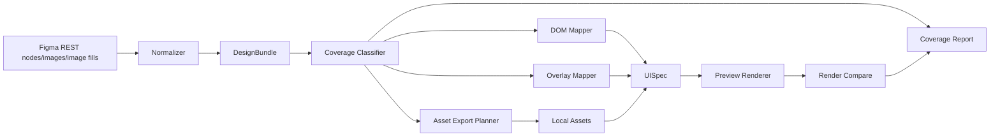

---worktrail
{
  "schema": "worktrail.knowledge.v1",
  "id": "architecture-figma-coverage-engine-design",
  "scope": "project",
  "type": "architecture",
  "title": "Figma Coverage Engine 设计文档",
  "status": "active",
  "lifecycle": "current",
  "topic": "figma-to-ui-agent"
}
---

# Figma Coverage Engine 设计文档

## 1. 背景

M5 live blind 已证明当前链路可以从真实 Figma 文件读取设计、保存 `DesignBundle`、生成 `UISpec`，并执行 render-and-compare。但是三例受限 live blind 的结果仍未达到视觉目标：

| case | 结果 | diff | 主要现象 |
| --- | --- | ---: | --- |
| case-a | partial | 14.12% | 17 个 vector 未映射，visual layer 为 0 |
| case-b | partial | 71.44% | 34 个 vector 未映射，只有 1 个 visual layer |
| case-c | partial | 34.58% | 79 个 vector 未映射，长页面 expected 1778px 但 actual 900px |

结论：问题不是 Figma REST 可行性，也不是单一页面特化缺陷，而是当前 `DesignBundle -> UISpec` 缺少系统性的 Figma 覆盖决策。M5 只证明了“能生成静态 UISpec”，尚未证明“能充分理解 Figma 并稳定保留关键视觉信号”。

Figma Coverage Engine 的目标是补上这一层：让每个 Figma 节点都经过可审计的覆盖分类、渲染策略选择和报告追踪，不再静默丢失 vector、图标、装饰层、图片填充、遮罩、长画布等关键设计信息。

## 2. 设计目标

### 2.1 完全实现的含义

这里的“完全实现”不是支持 Figma 产品的所有能力，也不是承诺任意 Figma 文件都能达到 0 diff。工程上可接受的完整实现定义为：

1. **节点全量归类**：进入 `DesignBundle` 的每个可见 Figma 节点，都必须得到一个覆盖分类结果。
2. **策略可解释**：每个节点必须明确为什么被结构化 DOM 渲染、为什么导出为 asset、为什么作为装饰层、为什么安全忽略，或为什么 unsupported。
3. **关键视觉不静默丢失**：vector、icon、logo、line、decorative shape、image fill、illustration、background 等视觉节点必须被渲染或进入 `unsupportedFeatures`。
4. **结构化交互保留**：input、button、link、text、section、stack 等真实 DOM 语义优先，禁止整页截图 fallback 伪通过。
5. **坐标和层级可复现**：局部 asset / overlay 必须按 Figma page-relative bounds、zIndex、opacity、clip/mask 约束渲染。
6. **长画布完整比较**：页面高度、scroll capture、viewport 与 Figma 画板尺寸必须一致或有明确裁剪策略。
7. **诊断可排期**：报告必须能回答“还有哪些 Figma 能力没覆盖、影响哪个区域、下一步该补 schema 还是 renderer”。
8. **闭环验证**：每次改动都能用 fixture、integration、e2e 和 live blind 回归证明覆盖率和 diff 改善。

完整实现的判断标准不是“没有任何 unsupported”，而是：

- 无静默丢失；
- 无整页截图伪通过；
- 未支持能力有稳定分类和证据；
- 对常见 UI 文件，perceptual fidelity 稳定接近目标 `<5%`，高质量样本 `<3%`。

完整度可以分为四层：

| 层级 | 名称 | 含义 | 是否属于 v1 |
| --- | --- | --- | --- |
| L0 | 链路可跑 | 能读取 Figma、生成 UISpec、执行 compare | 已由 M5 证明 |
| L1 | 覆盖可见 | 每个节点都有 classification，未覆盖项不再静默丢失 | v1 必须完成 |
| L2 | 视觉可用 | 高频 UI 的 text/image/vector/icon/layout/viewport 有稳定渲染策略，diff 明显下降 | v1 目标 |
| L3 | 高保真泛化 | 常见 UI 文件 blind 测稳定接近 `<5%`，复杂文件有完整 unsupported 解释 | v1 后继续演进 |

因此，v1 的定位不是最终 L3，而是把系统从 L0 推到 L1，并尽量推进到 L2。只有 L1 成立后，后续 `<5%` 目标才有可持续迭代基础。

### 2.2 v1 目标

Coverage Engine v1 的目标是先覆盖当前 live blind 暴露出的高频视觉缺口：

1. 每个可见节点都有 coverage classification。
2. vector/icon/line/logo/decorative shape 不再只输出 `unmapped_node_vector`。
3. 小但关键的视觉节点可以导出为局部 asset。
4. `pixel_overlay` / `image` 的 page-relative 坐标、zIndex、opacity 更接近 Figma。
5. 修复长页面高度与 screenshot capture。
6. M5 report 升级为 coverage matrix，能统计 text、image、vector、visual layer、ignored、unsupported 覆盖率。
7. 三个 live blind case 重新跑通，并看到 diff 明显下降。

v1 不承诺一次性支持 Figma 的全部复杂能力。prototype interaction、组件变体语义、复杂变量模式、真实业务状态机仍属于 M6/M7 或后续增强。

## 3. 约束与非目标

### 3.1 当前架构约束

- 正式 Figma 通道仍是项目自有 Figma REST Adapter。
- 模型可见工具仍保持四个：`inspect_figma`、`load_ui_spec`、`save_ui_spec`、`render_and_compare`。
- `Variables` 是可选增强，不是硬门。
- 不使用 Figma Desktop MCP、Remote MCP、第三方 MCP 或浏览器抓取作为默认 fallback。
- 不允许整页 `backgroundSnapshot` / screenshot fallback。
- 真实 DOM 交互层必须继续负责 input、button、link、focus、keyboard 和测试。
- 局部 asset 可以用于复杂视觉层，但不能替代交互控件。

### 3.2 v1 非目标

- 不支持任意 Figma 插件私有数据。
- 不完整实现 prototype interaction。
- 不实现完整组件变体语义推断。
- 不还原所有 blend mode、mask、boolean operation 的原生矢量几何。
- 不把所有 vector 转成 CSS 手写形状。
- 不追求固定 `<1%` pixel diff。
- 不调用 `/v1/me` 作为功能路径。
- 不改变模型可见工具列表。

## 4. 架构概览



Coverage Engine 不是新模型工具，而是一组内部能力。它分成两个阶段：

1. **inspect-time coverage export**：运行在 `inspect_figma` 内部，仍在 Figma fileKey 可用的上下文中。该阶段负责识别需要远端导出的局部 vector/icon/logo/line/decorative asset，并通过 Figma REST `/v1/images/:file_key` 保存为 project-local asset。
2. **static-time coverage mapping**：运行在 M5/M5.1 static generation 内部，只消费已保存的 `DesignBundle`、screenshots、assets 和 provenance，不重新访问 Figma，也不需要原始 fileKey。

这个拆分是硬边界：如果 static-time 发现缺少必要局部 asset，它只能写入 coverage report / unsupportedFeatures，不能私自再次访问 Figma。需要补导出时，必须重新执行受授权的 `inspect_figma`。

Coverage Engine 消化 `DesignBundle` 中的节点、bounds、视觉元数据、图片资源、provenance，然后输出：

- 可保存的 `UISpecDraft`；
- 可审计的 `CoverageReport` / `M5StaticReport`；
- 对后续 `render_and_compare` 的诊断区域和覆盖矩阵。

## 5. 核心组件

### 5.1 Coverage Classifier

职责：给每个可见 Figma 节点生成覆盖决策。

输入：

- `DesignBundle.pages[].nodes[]`
- page bounds / root bounds
- node kind、name、parent/children、bounds、visual metadata
- imageRefs、styleRefs、designValueRefs、provenance

输出：

```ts
type CoverageDecision =
  | "structured_dom"
  | "visual_asset"
  | "decorative_layer"
  | "layout_container"
  | "ignored_safe"
  | "unsupported";
```

建议 v1 字段：

```ts
type CoverageRecord = {
  sourceNodeId: string;
  sourcePageId: string;
  nodeKind: "container" | "text" | "vector" | "image" | "instance" | "component" | "unsupported";
  decision: CoverageDecision;
  reasonCode:
    | "text_semantic"
    | "form_control"
    | "button_or_link"
    | "layout_only"
    | "image_fill"
    | "large_visual"
    | "named_icon"
    | "named_logo"
    | "line_or_divider"
    | "decorative_shape"
    | "tiny_safe"
    | "hidden"
    | "duplicate_visual"
    | "unsupported_missing_asset"
    | "unsupported_renderer_limit";
  bounds?: { x: number; y: number; width: number; height: number };
  pageRelativeBounds?: { x: number; y: number; width: number; height: number };
  zOrder: number;
  area: number;
  areaRatio: number;
  confidence: "high" | "medium" | "low";
  uiSpecNodeId?: string;
  assetRef?: string;
  impact: Array<"visual" | "interaction" | "layout" | "text" | "accessibility">;
};
```

关键规则：

- `TEXT` 优先走 `structured_dom`。
- 表单、按钮、链接语义优先走 `structured_dom`。
- `FRAME/GROUP/INSTANCE/COMPONENT` 有可见子节点时优先走 `layout_container`。
- 有 image fill 且可下载时走 `visual_asset` 或 structured `image`。
- `VECTOR/LINE/ELLIPSE/RECTANGLE` 若是图标、logo、分隔线、装饰形状或大面积视觉层，走 `visual_asset` / `decorative_layer`。
- 很小、不可见、重复或完全被父 asset 覆盖的节点可以 `ignored_safe`，但必须计入报告。
- 无法表达的能力进入 `unsupported`，不得只写 warning。

### 5.2 Asset Export Planner

职责：决定哪些 Figma 节点需要通过 `/v1/images/:file_key` 导出局部图片。

阶段边界：

- **inspect-time planner**：拥有 fileKey，可以请求 Figma `/images` 并把结果写入 DesignBundle 的 project-local screenshots/assets/provenance。
- **static-time planner**：没有 fileKey，只能根据 DesignBundle 里已存在的 local asset/provenance 选择 `image` / `pixel_overlay` / unsupported。
- 若 static-time 需要但找不到 asset，必须记录 `unsupported_missing_asset` 或 `visual_layer_no_asset`，并建议重新 inspect；不得在 static generation 中重新调用 Figma。

v1 必须覆盖：

- vector icon；
- logo；
- line/divider；
- named decorative shape；
- large visual；
- structural visual；
- image fill；
- illustration / hero image。

当前 `visual-layer-planner` 的问题是面积阈值偏大，导致小图标和线条漏掉。v1 应把“关键性”从“面积大”扩展为：

- 名称命中：`icon`、`logo`、`arrow`、`search`、`cart`、`google`、`github`、`divider`、`line`、`shape`、`blob`、`background`；
- 类型命中：`vector`、`line`、有 stroke/fill/effect；
- 语义位置：button 内 icon、header icon、tab/nav icon、form divider；
- 可见影响：虽然面积小，但高对比或独立可见。

导出策略：

- 优先导出局部节点，不导出整页 root。
- 每页设置 asset 数量上限，防止爆量。
- 对同一 source node 去重。
- 对父级已导出且完全覆盖的子节点标记 `ignored_safe: covered_by_parent_asset`。
- 所有导出资产进入 project-local `figma/screenshots` 或 `figma/assets`，不保存远端 URL。

v1 API budget：

- 每页最多导出 80 个 visual asset，与当前 `MAX_VISUAL_LAYERS_PER_PAGE` 对齐。
- 单个 `/images` 请求最多 100 个 node id，遵守当前 REST client 限制。
- 优先级顺序：真实 image fill、button 内 icon、logo、导航/header icon、line/divider、large visual、named decorative、structural visual、其他 vector。
- 超过预算的节点不得静默丢弃，必须进入 coverage report，reason 为 `budget_exceeded`，decision 为 `unsupported` 或 `ignored_safe`。
- 429 按现有 Figma REST client 的 `Retry-After` / bounded retry 处理；重试后仍失败时，本次 inspect 失败关闭或将非核心 visual asset 标记为 `unsupported_missing_asset`，具体取决于该 asset 是否属于核心页面截图/图片填充之外的可选视觉增强。

### 5.3 DOM Mapper

职责：把结构化节点映射为真实 `UISpec` 节点。

v1 重点：

- text：字体、字号、字重、行高、颜色、文本框宽度、换行策略；
- input：email/password/search/text；
- button：真实 button 语义，支持 leading/trailing icon asset；
- link：若当前 schema 无 link，可先用 button/text 并记录 `link_semantics_deferred`；
- stack/section/grid：只承载布局，不吞掉视觉子节点。

DOM Mapper 不应该为了降低 diff 把交互控件替换成图片。

### 5.4 Overlay Mapper

职责：把 `visual_asset` / `decorative_layer` 转成 `image` 或 `pixel_overlay`。

v1 重点：

- 使用 page-relative bounds；
- 保留 width、height、left、top；
- 保留 zIndex/zOrder；
- 保留 opacity；
- `pointerEvents: none`，避免覆盖真实交互；
- 支持 parent clipping；
- 避免 root 单 overlay 伪通过。

关键设计：

- `image` 用于独立图片、产品图、头像、插画。
- `pixel_overlay` 用于复杂矢量、装饰、图标、线条、无法结构化表达的视觉层。
- 若 icon 在 button 内，优先用 button icon asset，而不是绝对定位 overlay。

### 5.5 Page/Viewport Mapper

职责：决定 UISpec page 的尺寸、viewport 和截图比较策略。

当前 case-c 暴露出 expected `375x1778`、actual `375x900` 的问题。v1 必须明确：

- page/root bounds 是内容高度来源；
- mobile artboard 的实际高度可以大于固定 viewport height；
- render compare 应支持 full-page capture 或按 DesignBundle screenshot 高度比较；
- viewport 只表示设备宽度/DPR，不应截断页面内容；
- 对长页面，actual screenshot 高度必须覆盖 Figma expected 高度，除非报告明确 `cropped_by_policy`。

建议：

- UISpec page 增加或推导 `canvasSize` / `contentBounds`。
- RenderAndCompare 在比较 Figma page screenshot 时，`canvasHeight = expectedRef.height` 或页面内容高度，而不是固定 viewport height。
- 报告增加 `heightMatch`：

```ts
type PageSizeDiagnostic = {
  expectedWidth: number;
  expectedHeight: number;
  actualWidth: number;
  actualHeight: number;
  widthMatched: boolean;
  heightMatched: boolean;
  policy: "full_page" | "viewport_crop" | "explicit_region";
};
```

### 5.6 Coverage Report

职责：把覆盖事实变成可排期证据。

v1 报告应从当前 `M5StaticReport` 扩展，而不是用自由文本替代。

新增矩阵：

```ts
type CoverageMatrix = {
  sourceNodeCount: number;
  visibleNodeCount: number;
  byKind: Record<string, {
    total: number;
    structuredDom: number;
    visualAsset: number;
    decorativeLayer: number;
    layoutContainer: number;
    ignoredSafe: number;
    unsupported: number;
  }>;
  vector: {
    total: number;
    rendered: number;
    ignoredSafe: number;
    unsupported: number;
    unmapped: number;
  };
  imageFill: {
    total: number;
    rendered: number;
    missingAsset: number;
  };
  text: {
    total: number;
    rendered: number;
    styleComplete: number;
  };
};
```

Coverage matrix 必须逐页存在，不能只放一个全局 `pageSize`。建议结构：

```ts
type PageCoverageMatrix = CoverageMatrix & {
  pageId: string;
  sourcePageId: string;
  pageSize: PageSizeDiagnostic;
};

type CoverageReport = {
  coverageVersion: "1";
  pages: PageCoverageMatrix[];
  records: CoverageRecord[];
  aggregate: {
    sourceNodeCount: number;
    visibleNodeCount: number;
    unsupportedCount: number;
    unmappedCount: number;
  };
};
```

报告必须回答：

- 哪些节点被 DOM 渲染？
- 哪些节点被 asset/overlay 渲染？
- 哪些节点被安全忽略？
- 哪些节点 unsupported？
- 哪些节点仍 unmapped？
- diff 最大的区域是什么？
- 下一步应该补 classifier、asset export、schema、renderer 还是 viewport？

## 6. 数据模型与存储

### 6.1 DesignBundle

v1 尽量复用现有 `DesignBundle`：

- `pages[].nodes[]`
- `bounds`
- `visual`
- `imageRefs`
- `provenance`
- `screenshots`
- `assets`

若要新增字段，优先 additive：

- `coverageHints` 不建议先写入 DesignBundle，避免把生成策略混入设计事实。
- Coverage 结果应由 M5/M5.1 report 持有。

### 6.2 UISpec

UISpec 只保存渲染需要的结构化节点，不保存完整 Figma coverage 事实。

v1 允许使用既有能力：

- `text`
- `input`
- `button`
- `image`
- `pixel_overlay`
- `section`
- `stack`
- style/frame/icon asset 字段

只有当现有 schema 不能表达必要渲染时，才进入独立 gate 修改 UISpec。候选 additive 字段：

- page `canvasSize` / `contentBounds`；
- image/pixel overlay clipping metadata；
- button icon asset 的尺寸/位置控制增强。

### 6.3 Coverage Report

Coverage Report 是 v1 的一等产物。建议落点：

- `src/static-generation/coverage.ts`
- `src/static-generation/report.ts`
- `reports/m5-live-blind-*`

报告可以作为 `M5StaticReport` 的扩展字段：

```ts
type M5StaticReportV2 = M5StaticReport & {
  coverageVersion: "1";
  coverage: CoverageReport;
};
```

## 7. 接口契约

### 7.1 内部接口

```ts
function classifyCoverage(input: {
  bundle: DesignBundle;
  pagePlan: StaticPagePlan;
}): CoverageClassificationResult;

function planCoverageAssets(input: {
  bundle: DesignBundle;
  coverage: CoverageClassificationResult;
}): CoverageAssetPlan;

function mapCoverageToUISpec(input: {
  bundle: DesignBundle;
  pagePlan: StaticPagePlan;
  coverage: CoverageClassificationResult;
  assets: CoverageAssetPlan;
}): MappedPageNodes;

function buildCoverageReport(input: {
  bundle: DesignBundle;
  uiSpecDraft: UISpecDraft;
  coverage: CoverageClassificationResult[];
  comparison?: RenderAndCompareOutput;
}): CoverageReport;
```

### 7.2 外部接口

不新增模型可见工具。现有工具语义保持：

- `inspect_figma`：仍负责从 Figma REST 生成 DesignBundle。
- `save_ui_spec`：仍保存 UISpec。
- `render_and_compare`：仍执行渲染比较。
- `run:m5:static` 或后续 `run:m5:coverage`：作为本地验证 runner。

### 7.3 Figma REST 边界

v1 功能路径只需要：

- `/v1/files/:file_key/nodes` 或 `/v1/files/:file_key`
- `/v1/images/:file_key`
- `/v1/files/:file_key/images`

Variables 仍是可选增强。产品默认 `inspect_figma` 可以继续按既有 optional policy 调用 Variables：可用则提取，不可用则记录 `unavailable_optional` 并降级。

受限 live blind 是更窄的验证模式：默认不调用 Variables，也不调用 `/v1/me`。`/v1/me` 不属于 Coverage Engine 功能路径，不作为 live blind 验收必需接口。

## 8. 算法策略

### 8.1 覆盖优先级

同一个节点只能有一个主决策：

1. hidden -> `ignored_safe`
2. text semantic -> `structured_dom`
3. form/button/link semantic -> `structured_dom`
4. layout parent with children -> `layout_container`
5. image fill -> `visual_asset`
6. vector/icon/logo/line/decorative -> `visual_asset` or `decorative_layer`
7. covered by parent asset -> `ignored_safe`
8. unsupported capability -> `unsupported`

### 8.2 vector 处理

v1 不手写 SVG path，也不猜 CSS 形状。策略是：

- 小图标、logo、line：导出局部 asset，作为 icon asset 或 pixel overlay。
- 大装饰、blob、插画碎片：导出局部 asset，作为 pixel overlay。
- 简单 rectangle/ellipse 若已有 style 能表达，可以走 DOM style；否则导出 asset。
- mask/clip/boolean operation 暂不原生重建，优先导出父级局部 asset。

### 8.3 zIndex 与父子关系

Figma 节点顺序是视觉层级的重要来源。v1 需要：

- 记录每个 source node 的 DFS/z-order；
- 同父级内保持 Figma 顺序；
- overlay 插入到对应父容器或 page root；
- 若无法安全插入，放到 page root 并记录 `parent_relocation` warning；
- 交互 DOM 节点应在 pointer overlay 之上可点击，overlay 默认 `pointerEvents: none`。

### 8.4 ignored_safe 判定

不是所有未渲染节点都是问题。可安全忽略的情况：

- hidden；
- 0 面积；
- 完全透明；
- 被父级局部 asset 覆盖；
- layout-only container 且所有子节点已覆盖；
- 低影响的极小装饰点，且不属于 icon/logo/line。

ignored 必须进入 coverage report，不能从统计里消失。

## 9. 验证设计

### 9.1 本地测试

必须覆盖：

- classifier：text、input、button、container、image、vector、line、hidden、covered-by-parent；
- asset planner：小 icon、logo、line、大装饰、父级 asset 去重；
- node mapper：DOM 与 overlay 合成顺序；
- report schema：coverage matrix、coverage records、unsupportedFeatures；
- render compare：长页面 full-page capture；
- ProjectStore：仍拒绝 root 单截图/单 overlay 伪通过。

### 9.2 live blind 回归

重跑当前三例：

- case-a：目标先把 14.12% 显著降低，vector unmapped 接近 0。
- case-b：目标先从 71.44% 降到可诊断区间；若商品图/大 asset 仍缺失，报告必须能指出原因。
- case-c：先修高度，actual height 应覆盖 1778px；再看 vector/overlay 后的 diff。

v1 验收不要求三例一次全部 `<5%`，但必须满足：

- no silent unmapped vector；
- no full page screenshot fallback；
- height diagnostics 正确；
- coverage matrix 完整；
- diff 有明确下降或每个剩余差距都有可排期原因。

量化建议：

- `unmapped_node_vector` 不再作为主要缺口形式出现；vector 必须进入 rendered、ignored_safe、unsupported 或 budget_exceeded。
- case-c 的 actual capture height 必须覆盖 expected 1778px，或显式标记为 `viewport_crop` 且不能作为视觉通过证据。
- 相比当前受限 live blind baseline，至少一项成立：
  - case-a/b/c 任一 case diff 相对下降 30%；
  - 三例 aggregate diff 相对下降 20%；
  - 若 diff 未下降，报告必须把剩余差距归因到明确的 unsupported/budget/renderer/schema 项，且没有 unmapped 节点。

## 10. 实施顺序

### Step 1：Coverage schema 与 classifier

落点：

- `src/static-generation/coverage.ts`
- `tests/unit/static-generation/coverage-classifier.test.ts`

验收：

- 每个可见节点都有 decision。
- vector 不再只作为 warning 丢弃。

### Step 2：Asset export 计划接入

落点：

- `src/figma/inspector.ts`
- `src/static-generation/visual-layer-planner.ts`
- `tests/integration/figma/inspector.test.ts`

验收：

- icon/logo/line/decorative vector 能导出局部 asset。
- 每页 asset 数量有上限。
- 不导出整页 root fallback。

### Step 3：DOM/Overlay 合成升级

落点：

- `src/static-generation/node-mapper.ts`
- `src/static-generation/style-mapper.ts`
- `src/preview/json-render-adapter.ts`

验收：

- DOM 控件保持可编辑、可聚焦、可点击。
- overlay 不遮挡交互。
- zIndex、opacity、bounds 生效。

### Step 4：长页面 full-page capture

落点：

- `src/static-generation/page-mapper.ts`
- `src/validation/render-and-compare.ts`
- `tests/integration/validation/render-and-compare.test.ts`

验收：

- expected/actual 高度一致或报告明确裁剪策略。
- case-c 不再出现 `1778 -> 900` 的隐式截断。

### Step 5：Coverage report 升级

落点：

- `src/static-generation/report.ts`
- `scripts/run-m5-static.mjs`

验收：

- `summary.json` 包含 coverage matrix。
- `summary.md` 从 JSON 派生。
- live blind 报告能按原因解释剩余 diff。

### Step 6：回归验证

命令：

- `npm run typecheck`
- `npm run test:unit`
- `npm run test:integration`
- `npm run test:e2e`
- 受限接口版 live M5 blind

验收：

- 本地测试通过。
- live 三例有完整 coverage 报告。
- 受限 live blind 不调用 `/v1/me`，不调用 OpenAI，不调用 Variables；产品默认 inspect 的 Variables optional policy 不因此改变。

## 11. 风险与缓解

| 风险 | 影响 | 缓解 |
| --- | --- | --- |
| 局部 asset 数量过多 | Figma API 请求量和本地存储膨胀 | 每页上限、去重、父级覆盖合并、429 退避 |
| overlay 遮挡交互 | 功能测试失败 | `pointerEvents: none`，DOM 控件优先，e2e keyboard/click 回归 |
| 过度导出导致“截图化” | 真实 DOM 价值降低 | 禁止 root fallback，控件/text 优先 DOM，coverage report 标记 asset 占比 |
| 小 vector 全量导出仍漏细节 | diff 仍高 | coverage report 标记剩余 unsupported/unmapped，迭代阈值 |
| mask/clip/blend 复杂 | 局部 asset 位置正确但视觉仍差 | 父级 asset 合并，unsupported 标记 renderer_limit |
| 长页面截图成本增加 | 测试变慢 | 只在 page expected 高度超过 viewport 时启用 full-page policy |

## 12. ADR 索引

| ADR | 标题 | 状态 | 说明 |
| --- | --- | --- | --- |
| ADR-COV-001 | Coverage 结果归 Report 所有，不写入 DesignBundle 作为设计事实 | Proposed | 避免把生成策略污染 Figma 事实层 |
| ADR-COV-002 | 复杂 vector 优先导出局部 asset，不手写 CSS/SVG 猜形状 | Proposed | 提高泛化和视觉一致性 |
| ADR-COV-003 | 禁止整页截图 fallback，允许局部 asset/overlay | Accepted by existing M5 constraints | 保护真实 DOM 交互 |
| ADR-COV-004 | `/v1/me` 不作为 Coverage Engine 功能路径 | Proposed | live blind 只使用目标文件必要接口 |

## 13. 待确认假设

- 假设 v1 可以继续把 Coverage Report 作为 M5 report 扩展，而不新增正式 Worktrail validation 类型。
- 假设当前 UISpec 的 `image`、`pixel_overlay`、button icon asset 足以承载 v1；若不够，再进入 schema additive gate。
- 假设受限 live blind 的三个社区文件可以继续作为 v1 回归样本。
- 假设 `<5%` 仍作为推荐目标，而不是 v1 硬门；v1 硬门先以 coverage completeness、无静默 unmapped、长页面高度正确和量化 diff 下降为准。

## 14. v1 验收清单

- [ ] 每个可见 Figma 节点都有 `CoverageRecord`。
- [ ] `unmapped_node_vector` 不再作为主要缺口形式出现；vector 必须 rendered、ignored_safe、unsupported 或 budget_exceeded。
- [ ] icon/logo/line/decorative vector 有局部 asset 导出策略。
- [ ] 长页面 expected/actual 高度一致或有显式裁剪策略。
- [ ] Coverage matrix 输出 text/vector/image/visual/unsupported 覆盖率。
- [ ] DOM 控件仍可编辑、可聚焦、可点击。
- [ ] 禁止整页截图 fallback 的既有测试仍通过。
- [ ] 三个 live blind case 能生成新的逐页 coverage 报告。
- [ ] 报告能解释剩余 diff 的主要来源。
- [ ] 受限 live blind 默认路径不调用 `/v1/me`、OpenAI 或 Variables；产品默认 inspect 仍保留 Variables optional policy。

## 15. 推荐下一步

先对本文档做设计审核。审核通过后，进入 `M5.1 Figma Coverage Engine 实施计划`，按以下顺序规划代码：

1. Coverage classifier 与 report schema。
2. vector/icon/logo/line asset export。
3. DOM/overlay 合成与 zIndex。
4. 长页面 full-page capture。
5. live blind 回归与 Worktrail validation。
