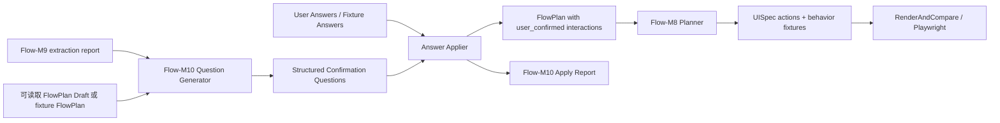

---worktrail
{
  "schema": "worktrail.knowledge.v1",
  "id": "figma-to-ui-agent-flow-m10-confirmation-semantics-design",
  "scope": "project",
  "type": "architecture",
  "title": "Figma-to-UI Agent Flow-M10 真实语义补全与用户确认设计",
  "status": "active",
  "lifecycle": "current",
  "topic": "figma-to-ui-agent-flow-m10"
}
---

# Figma-to-UI Agent Flow-M10 真实语义补全与用户确认设计

## 1. 背景

Flow-M8 已在本地实现 submit、postcondition、select/radio 行为、状态机和 Playwright 因果校验。Flow-M9 已在真实 Figma restricted-live 样本中证明 interaction 抽取和分类可用：3 个 primary 样本全部 readable，`trustedStateChange=5`，`submitLikeNeedsConfirmation=8`，`openaiCalled=false`。

Flow-M10 的任务不是继续扩大 Figma 抽取范围，而是把 Flow-M9 产生的 `needs_confirmation.submit_like` 候选变成结构化、可审计、可拒绝、可应用的用户确认结果。只有确认后的业务语义才能进入 Flow-M8 已有 submit/stateMachine 执行链路。

## 2. 架构澄清与输入事实

本设计基于当前仓库和已推广 Worktrail 事实，不新增外部系统：

- 已知组件边界：`src/flow-plan/schema.ts`、`service.ts`、`confirmation-questions.ts`、`apply-confirmations.ts`、`m8-planner.ts`、`m8-runner.ts`、`m9-extractor.ts`、`m9-report.ts`、`run-flow-m9-restricted-live.mjs`。
- 已知数据特征：FlowPlan 已有 `source`、`intent`、`postconditions`、`stateMachines`、`confirmationQuestions`、`confirmations`；当前 confirmation 仍以字符串 DSL 为主，M10 需要引入结构化答案并保留旧接口兼容。
- 已知 M9 artifact 限制：Flow-M9 summary report 保存的是样本级 classification 和脱敏 artifact refs，其中 `flowPlanPath` 当前可能为 `ephemeral-flow-plan`，不能假设 restricted-live report 中一定有完整可读取 FlowPlan。
- 已知非功能约束：默认 local-only，不调用 OpenAI，不默认访问 Figma，不新增依赖，不改变四工具边界，所有报告脱敏。
- 已知 Product 边界：Product 线后置；M10 只提供 Flow 能力，不做 PI/mono agent 产品包装。

未单独做多方案技术选型，因为当前约束已经把实现限定在现有 FlowPlan/UISpec/ProjectStore/Preview/Playwright 栈内；引入新存储、DSL 引擎或外部确认服务都会违反本阶段最小边界。

## 3. 目标

1. 定义 Flow-M10 结构化 confirmation question schema，能表达 submit-like、postcondition、state transition、navigate/dialog/set_state 等候选补全需求。
2. 定义结构化 answer schema，替代仅靠字符串编码的答案 DSL。
3. 建立可信来源规则：只有 `figma` 与 `user_confirmed` 可以生成业务行为；`inferred`、`missing`、scenario-only 只能生成问题或 rejected/unresolved。
4. 建立拒绝规则：缺 postcondition、悬空引用、类型不匹配、来源不可信、答案与问题类型不匹配时 fail closed。
5. 输出 Flow-M10 confirmation apply report，说明应用、拒绝、未匹配、残留风险和 artifact refs。
6. 与 Flow-M8 submit/stateMachine 衔接：M10 只负责确认语义写回 FlowPlan，M8 继续负责 UISpec action、behavior fixture 和 Playwright 验证。
7. 支持复用 Flow-M9 restricted-live 三个样本做回归，验证真实 submit-like 候选能安全进入确认链路。

## 4. 非目标

- 不调用 OpenAI 解释业务语义。
- 不把按钮文案自动变成业务逻辑。
- 不实现真实后端、登录、支付、订单、数据库或网络提交。
- 不改变 Pi 暴露给模型的四工具边界。
- 不新增依赖或 package-lock 变更。
- 不让 restricted-live 结果默认写入正式知识；真实 Figma 网络仍需显式 gate。
- 不把 Flow-M9 extraction report 当作业务 truth；它只提供候选来源和证据摘要。
- 不要求 M9 report 中的 ephemeral FlowPlan 可直接 apply；apply 必须使用当前可读取的 FlowPlan draft 或受控 fixture FlowPlan。

## 5. 组件分解



### 5.1 Question Generator

落点：`src/flow-plan/m10-confirmation-questions.ts`。

职责：

- 输入 FlowPlanDraft、可选 Flow-M9 sample report 或 M9 sample classifications。
- 对 `source="inferred" | "missing"`、`blockedReason`、`needs_confirmation.submit_like`、缺 postcondition 的 submit-like 候选生成问题。
- 当输入只有 M9 summary classification、没有可读取 FlowPlan 时，只生成带 `sampleId` 和 `interactionId` 的问题候选，并把 apply 标记为需要本地 FlowPlan 载体。
- 输出结构化问题，不直接修改业务行为。
- 对已有可信 `figma` interaction 不重复提问，除非其 `blockedReason` 表示缺证据。

### 5.2 Answer Applier

落点：`src/flow-plan/m10-apply-confirmations.ts`。

职责：

- 解析结构化答案。
- 校验问题存在、问题类型匹配、引用闭合、postcondition 可观察。
- 只对当前可读取 FlowPlan 中存在的 interaction 执行写回；M9 summary-only question 不得被假装写回。
- 将合法答案写回对应 interaction：`source="user_confirmed"`、`confirmed=true`、`intent="submit" | "navigate" | "set_state" | "open_dialog"`。
- 对非法答案写入 rejected result，不产生业务 action。
- 保持幂等：同一 questionId + answerId 重复应用不重复计数。

### 5.3 M10 Report

落点：`src/flow-plan/m10-report.ts`。

职责：

- 记录 runId、mode、input refs、sampleIds、question/answer/apply counts、rejected reasons、redaction status。
- 支持 `passed | partial | failed`。
- `passed` 必须至少证明：生成了 submit-like 问题，合法答案在可读取 FlowPlan 载体上产生了 `user_confirmed` submit 或 stateMachine transition，非法答案被拒绝。
- restricted-live regression 可以证明真实 M9 submit-like classification 进入 question 链路；若没有完整 FlowPlan artifact，报告必须把 apply 证据归属到受控 local fixture，不得把 M9 summary 冒充为 apply 载体。

### 5.4 Runner

落点：`scripts/run-flow-m10-confirmation.mjs`。

职责：

- local 模式：使用 fixture FlowPlan/M9-like report/answer file，不访问网络。
- restricted-live-regression 模式：复用 Flow-M9 三个样本的本地 summary report 作为真实 submit-like 来源证明；apply 阶段使用受控 fixture FlowPlan 或未来已落盘的样本 FlowPlan artifact。
- 只有显式 `FLOW_M10_RESTRICTED_LIVE_AUTHORIZED=1` 和 `--allow-figma-network` 时才允许刷新真实 Figma 数据。
- 输出 `reports/flow-m10-confirmation/<runId>/summary.json|summary.md`。

## 6. Confirmation Question Schema

新增版本化 schema：`flowM10ConfirmationQuestionSchema`。

字段：

- `schemaVersion: "1"`
- `id: string`
- `interactionId: string`
- `sampleId?: string`
- `source: "figma" | "inferred" | "missing"`
- `classification?: "needs_confirmation.submit_like" | "missing_evidence" | "unsupported"`
- `questionKind: "submit_like" | "navigate" | "set_state" | "open_dialog" | "state_machine_transition"`
- `prompt: string`
- `evidenceSummary: string`
- `sourceNodeId?: string`
- `uiNodeId?: string`
- `fromPageId?: string`
- `applyCarrier: "flow_plan" | "summary_only"`
- `allowedAnswerKinds: Array<"submit" | "navigate" | "set_state" | "open_dialog" | "decline">`
- `requiredPostconditions: "at_least_one_observable" | "none_allowed_for_decline_only"`
- `candidateRefs`: bounded refs to page/node/state/transition ids
- `required: boolean`

问题中不得保存真实 Figma URL、file key、raw REST payload、token 或 UI Spec 正文。

## 7. Answer Schema

新增 `flowM10ConfirmationAnswerSchema`，使用 discriminated union：

```ts
type FlowM10ConfirmationAnswer =
  | {
      id: string;
      questionId: string;
      answerKind: "submit";
      effect:
        | { kind: "set_state"; stateKey: string; value: string | number | boolean }
        | { kind: "navigate"; pageId: string }
        | { kind: "open_dialog"; dialogNodeId: string }
        | { kind: "none" };
      postconditions: FlowPostcondition[];
      reason?: string;
    }
  | { id: string; questionId: string; answerKind: "navigate"; targetPageId: string; reason?: string }
  | { id: string; questionId: string; answerKind: "set_state"; stateKey: string; value: string | number | boolean; postconditions: FlowPostcondition[]; reason?: string }
  | { id: string; questionId: string; answerKind: "open_dialog"; dialogNodeId: string; postconditions: FlowPostcondition[]; reason?: string }
  | { id: string; questionId: string; answerKind: "decline"; reason: string };
```

兼容策略：旧 `flowConfirmationInputSchema` 字符串答案保留，但 M10 runner 默认只接受结构化答案。旧 DSL 可以通过显式 compatibility adapter 转换，不能作为 M10 passed 的唯一证据。

## 8. 可信来源规则

- `source="figma"` 且 `confirmed=true`：可直接进入 Flow-M8 planner。
- `source="user_confirmed"` 且 M10 apply report 结果为 `applied`：可进入 Flow-M8 planner。
- `source="inferred" | "missing"`：只能生成 M10 question 或保持 unresolved。
- `scenario-only`：只能提供测试输入值，不得生成业务 action，也不得满足 passed。
- Flow-M9 `needs_confirmation.submit_like`：只能生成 question，不能直接生成 submit action。
- M9 summary-only evidence 只能证明 question provenance；不能单独证明 answer apply 成功。
- 任何来自报告、fixture 或用户输入的引用都必须通过当前 FlowPlan/UISpec 引用闭合校验。

## 9. 拒绝规则

M10 必须 fail closed，以下情况 result 为 `rejected` 或 `invalid`，不得修改 interaction 为 confirmed：

- questionId 不存在或已经与另一个 interaction 绑定。
- question 的 `applyCarrier="summary_only"`，但没有传入对应可读取 FlowPlan interaction。
- answerKind 不在问题的 `allowedAnswerKinds`。
- submit/open_dialog/set_state/navigate 引用悬空。
- submit answer 缺少至少一个可观察 postcondition。
- postcondition 指向不存在的 page/node/state，或类型与目标不匹配。
- `effect.kind="none"` 但没有 native validation 或可观察 postcondition。
- 试图把 `unsupported` 强行转为当前 UISpec 不能表达的 action。
- raw answer 携带 URL、file key、token、raw REST payload 或 UI Spec 正文。

## 10. Report Schema

新增 `flowM10ConfirmationReportSchema`：

- `schemaVersion: "1"`
- `milestone: "Flow-M10"`
- `scope: "confirmation_semantics"`
- `status: "passed" | "partial" | "failed"`
- `input`: runId、mode、flowPlanRef、m9ReportRef、answerRef、networkBoundary
- `counts`: generatedQuestions、submitLikeQuestions、answersReceived、applied、declined、rejected、invalid、unmatched、summaryOnlyQuestions、userConfirmedSubmit、userConfirmedStateMachineTransitions
- `samples[]`: sampleId、questions、summaryOnlyQuestions、applied、rejected、residualUnresolved
- `appliedInteractions[]`: interactionId、source、intent、postconditionKinds、artifactRefs
- `rejections[]`: questionId、reasonCode、evidence
- `residualRisks[]`

`passed` 条件：

- 至少 1 个 submit-like question 来自 Flow-M9 report 或 local fixture。
- 至少 1 个合法结构化 answer 在可读取 FlowPlan 载体上被应用为 `user_confirmed submit` 或可验证 stateMachine transition。
- 至少 1 个非法/不完整 answer 被拒绝并出现在 report。
- 报告脱敏检查通过。
- Flow-M8 planner/runner 能消费应用后的 FlowPlan 并保持本地验证通过。

## 11. 与 Flow-M8 submit/stateMachine 衔接

- M10 不生成 UISpec action；它只把 FlowPlan interaction 补全为可信 `user_confirmed`。
- M8 planner 继续负责把可信 submit/stateMachine 转成 UISpec action、behavior fixture 和 report。
- M10 answer 的 postconditions 使用 `FlowPostcondition`，与 M8 schema 保持同一结构。
- M10 必须在调用 M8 planner 前完成引用闭合校验，避免 M8 接收到不可执行业务动作。
- M8 的“submit 后置断言不能在点击前已满足”因果校验继续作为 M10 回归的一部分。

## 12. 安全与脱敏

- 不记录 token、Figma URL、file key、raw REST payload、远端图片 URL、UISpec 正文或用户敏感输入。
- 报告只记录 sampleId、questionId、interactionId、受控 reasonCode、artifactRefs。
- restricted-live 回归默认复用已落盘的 Flow-M9 report；重新触网必须单独 gate。
- 所有 raw answers 进入 schema 前先经过大小、字段和敏感模式检查。

## 13. 验收标准

- AC1：结构化 question schema 能表达 submit-like、navigate、set_state、open_dialog、stateMachine transition 候选。
- AC2：结构化 answer schema 支持 submit effect、postconditions、decline 和拒绝结果。
- AC3：`needs_confirmation.submit_like` 不会直接生成 submit action，只生成 question。
- AC4：合法 answer 可生成 `user_confirmed submit`，并被 Flow-M8 planner 消费。
- AC5：缺 postcondition、悬空引用、answerKind 不匹配、不可信来源必须 rejected。
- AC6：M10 report 能统计 generated/applied/rejected/unmatched、summaryOnlyQuestions 和 userConfirmedSubmit。
- AC7：默认 local 验证不调用 OpenAI/Figma，不新增依赖，不改四工具边界。
- AC8：复用 Flow-M9 三个样本的 restricted-live report 完成回归，证明真实 submit-like 候选进入 question 链路；apply 成功必须由可读取 FlowPlan fixture 或 artifact 证明。
- AC9：Flow-M8 本地 submit/stateMachine 回归继续通过。

## 14. 待确认假设

- M10 首版只需要把一个真实 submit-like 候选应用为 `user_confirmed submit`，不要求三个样本都产生可执行 submit。
- restricted-live 回归优先复用 Flow-M9 已落盘 report，不重复访问 Figma；若需要刷新样本再单独授权。
- 用户确认答案可以先来自受控 fixture，后续 Product 线再接交互式 UI 或 PI agent prompt。
- 当前 Flow-M9 summary 中 `ephemeral-flow-plan` 不是可应用载体；实施阶段若要对真实样本本体 apply，必须先让 M9/M10 runner 落盘 FlowPlan artifact。
