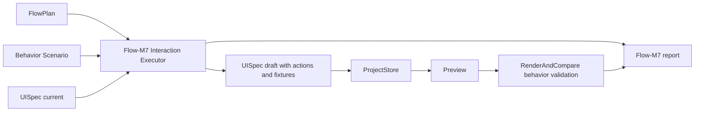

---worktrail
{
  "schema": "worktrail.knowledge.v1",
  "id": "figma-to-ui-agent-flow-m7-interactive-behavior-design",
  "scope": "project",
  "type": "architecture",
  "title": "Figma-to-UI Agent Flow-M7 状态、表单与简单业务交互设计",
  "status": "active",
  "lifecycle": "current",
  "topic": "figma-to-ui-agent-flow-m7"
}
---

# Figma-to-UI Agent Flow-M7 状态、表单与简单业务交互设计

## 1. 背景和命名边界

本设计中的 M7 指 `Flow-M7`，不是已经存在的 `Product-M7`。`Product-M7` 关注端到端产品化主流程；`Flow-M7` 接在 `Flow-M6 route_execution_only` 之后，关注状态、表单、弹窗和简单业务交互的可信执行与验证。

Flow-M6 已完成本地验收：只转换可信 `navigate` interaction，非 navigate 被标记为 out-of-scope。Flow-M7 的目标是在不破坏 Flow-M6 边界的前提下，把现有 UISpec、Preview 和 RenderAndCompare 中已经具备的交互能力正式纳入 FlowPlan 执行层。

## 2. 修订说明

本版修订解决上一轮审核问题：
1. `passed` 不再允许 scenario-only 通过；必须至少有一个可信非 navigate FlowPlan interaction 被转换并通过行为验证。
2. 表单验证不再只要求执行 `fill` / `toggle`，而是要求后置断言 `expect_value` / `expect_checked`，或一个由填写/切换导致的 `expect_text` / `expect_visible`。
3. submit-like path 必须证明点击前后存在可观察变化；静态已可见元素不能作为 submit 成功证据。

## 3. 设计目标

1. 支持可信 `set_state`、`open_dialog` 和 submit-like click path 的转换与验证。
2. 支持表单行为 fixture：`fill`、`toggle`、点击提交按钮、验证页面/文本/可见状态、输入值或 checked 状态。
3. 保持真实 DOM 交互：input 可编辑、checkbox/switch 可切换、button/link 可点击、dialog 可见性可检查。
4. 只转换可信来源：`figma` 或 `user_confirmed`，且字段完整可验证。
5. `inferred` 和 `missing` 不得静默生成业务逻辑；必须进入确认问题、unresolved 或报告。
6. 不新增外部服务调用，不调用 OpenAI/Figma live，不新增依赖，不修改 PI 四工具边界。
7. 输出 Flow-M7 独立报告，不能把 M4/M6 低层 plumbing 或 scenario-only smoke 当作 M7 完成证据。

## 4. 非目标

1. 不实现任意业务规则引擎。
2. 不从视觉文本或组件名猜测复杂业务逻辑。
3. 不新增后端、数据库、登录、队列、云部署。
4. 不把 submit 建模为新的 UISpec action kind；Flow-M7 v1 将 submit-like 行为表达为可信 action click 加后置断言。
5. 不默认覆盖 select/radio 的复杂选项选择；select/radio 后置到 Flow-M7 v1.1，除非后续用户明确纳入本期。

## 5. 架构澄清和假设

已知：
- UISpec 已有 `state`、`set_state`、`open_dialog`、`input`、`checkbox`、`switch`、`select`、`textarea`、`dialog`、`behaviorFixtures`。
- Preview 已能 dispatch `navigate`、`set_state`、`open_dialog`，并通过 json-render state store 绑定输入类控件。
- RenderAndCompare 已支持 behavior steps：`click`、`fill`、`toggle`、`expect_visible`、`expect_text`、`expect_page`。
- `applyFlowPlanToUISpec` 当前已可转换 `set_state` 和 `open_dialog`；`applyFlowM6RouteExecutionToUISpec` 才是 M6 的 navigate-only 包装。

待确认假设：
- Flow-M7 v1 以本地验证为默认范围，live Figma/OpenAI 仍需独立 gate。
- 表单 submit 的最小可接受表达是“填写或切换控件 -> 点击带可信 action 的按钮 -> 验证 post-click 可观察变化”，不需要引入新的 submit action kind。
- radio/select 的完整选择语义后置；不作为 Flow-M7 v1 完成门槛。

## 6. 方案比较

### 方案 A：扩展 UISpec action，引入 submit/form action

优点：语义完整，后续可表达复杂表单提交。
缺点：需要修改公共 schema、Preview dispatch、验证器和较多测试；容易在没有业务后端的情况下伪造业务逻辑。
结论：暂不采用。

### 方案 B：复用现有 action，新增 Flow-M7 behavior scenario/report 层

优点：最大化复用现有 schema 和 Preview 能力；submit-like 行为可由 fixture 组合表达；不会破坏 M6 和四工具边界。
缺点：不能表达复杂业务规则，只能验证本地可观察结果。
结论：采用，但增加两个硬约束：scenario 不能单独让 Flow-M7 passed；submit-like 必须验证点击后的状态/页面/文本/可见性变化。

### 方案 C：只依赖现有 `applyFlowPlanToUISpec`，不新增 M7 runner/report

优点：代码改动最小。
缺点：无法证明 Flow-M7 完成，容易再次把低层 plumbing 当作里程碑验收。
结论：不采用。

## 7. 组件分解



### 7.1 Flow-M7 Interaction Executor

建议新增 `src/flow-plan/m7-interactions.ts`。

职责：
- 接收 UISpec、正式 FlowPlan 和可选 behavior scenario。
- 只转换 `source=figma | user_confirmed` 且 `confirmed=true` 的 interaction。
- 将 `navigate`、`set_state`、`open_dialog` 转换为 UISpec action 和 behavior fixture。
- 为表单场景生成 behavior fixture step；表单输入值来自 scenario，但 scenario 不拥有业务真相。
- 统计 trustedNonRouteConvertedCount、scenarioOnlyFixtureCount、submitLikeVerifiedCount、unresolvedCount。

### 7.2 Flow-M7 Report Contract

建议新增 `src/flow-plan/m7-report.ts`。

职责：
- 定义 `FlowM7InteractiveBehaviorReport`。
- 固定 scope：`interactive_behavior`。
- 记录 state/form/dialog/submit-like 覆盖情况、validation 摘要、unresolved interactions 和 residual risks。
- `passed` 必须满足：`trustedNonRouteConvertedCount >= 1`、`validation.passed=true`、且至少一个非 navigate fixture 成功。scenario-only fixture 只能支持验证，不得单独满足 passed。

### 7.3 Behavior Scenario Contract

建议新增 `src/flow-plan/m7-scenario.ts`。

职责：
- 定义本地验证输入和期望，不定义业务逻辑。
- 支持现有 step：click/fill/toggle/expect_visible/expect_text/expect_page。
- 增加验证 step：`expect_value` 和 `expect_checked`，用于证明 input/textarea 与 checkbox/switch 变化。
- 对 submit-like scenario 进行结构校验：必须包含 click，click 后必须至少有一个 postcondition expectation。

### 7.4 Local Runner

建议新增 `scripts/run-flow-m7.mjs`。

职责：
- 读取 ProjectStore 中的 DesignBundle、UISpec、FlowPlan。
- 可选读取 `--behavior-scenario`，提供 fill value、toggle target 和 submit expectation。
- 保存新 UISpec revision。
- 调用 RenderAndCompare 执行 behavior fixtures。
- 输出 `reports/flow-m7-interactions/<runId>/summary.json` 和 `summary.md`。

### 7.5 Preview 和 Validation

复用现有 Preview。RenderAndCompare 需要最小扩展：
- `expect_value`：定位 input/textarea 或含 input/textarea 的 data-ui-node-id 容器，断言当前 value。
- `expect_checked`：定位 checkbox/switch/radio 的实际 input 或 role switch，断言 checked/aria-checked。

不为 Flow-M7 v1 引入 select/radio 复杂选择 step；如后续纳入，必须单独补契约和验证。

## 8. 数据契约

### 8.1 Flow-M7 行为场景补充

```ts
type FlowM7BehaviorScenario = {
  schemaVersion: "1";
  projectId: string;
  sourceFlowPlanRevision: number;
  scenarios: Array<{
    id: string;
    initialPageId: string;
    viewportId?: string;
    source: "manual_fixture" | "test_fixture";
    steps: Array<
      | { kind: "fill"; nodeId: string; value: string }
      | { kind: "toggle"; nodeId: string }
      | { kind: "click"; nodeId: string }
      | { kind: "expect_visible"; nodeId: string }
      | { kind: "expect_text"; nodeId: string; text: string }
      | { kind: "expect_page"; pageId: string }
      | { kind: "expect_value"; nodeId: string; value: string }
      | { kind: "expect_checked"; nodeId: string; checked: boolean }
    >;
  }>;
};
```

### 8.2 Flow-M7 报告

```ts
type FlowM7InteractiveBehaviorReport = {
  schemaVersion: "1";
  milestone: "Flow-M7";
  scope: "interactive_behavior";
  status: "passed" | "partial" | "failed";
  projectId: string;
  runId: string;
  sourceDesignBundleRevision: number;
  sourceUISpecRevision?: number;
  sourceFlowPlanRevision?: number;
  savedUISpecRevision?: number;
  convertedActionIds: string[];
  behaviorFixtureIds: string[];
  counts: {
    navigate: number;
    setState: number;
    openDialog: number;
    formFill: number;
    toggle: number;
    submitLike: number;
    trustedNonRouteConverted: number;
    scenarioOnlyFixtures: number;
    unresolved: number;
  };
  scenarioSource?: "none" | "manual_fixture" | "test_fixture";
  unresolvedInteractions: FlowPlanInteraction[];
  validation?: {
    schemaVersion: "1";
    runId: string;
    passed: boolean;
    resultCount: number;
    failedCheckCount: number;
  };
  insufficientReason?: string;
  residualRisks: string[];
};
```

## 9. 信任和转换规则

1. `source=figma | user_confirmed` 且 `confirmed=true` 才能生成 UISpec action。
2. `set_state` 必须满足：stateKey 存在、value 类型匹配、targetNodeId 存在，且 fixture 能验证后置变化。
3. `open_dialog` 必须满足：dialogNodeId 存在且节点 kind 为 `dialog`，并引用 boolean state；验证必须检查 dialog 从关闭到可见。
4. input/textarea/checkbox/switch 的填写与切换只进入 behavior fixture，不创建业务 action。
5. scenario 可以提供 fill/toggle 值和 postcondition，但不能单独让 Flow-M7 `passed`。
6. submit-like path 必须点击一个带可信 converted action 的按钮或链接，并在 click 后通过 expect_page、expect_visible、expect_text、expect_value 或 expect_checked 证明变化。
7. 对 `inferred`、`missing`、字段不完整、目标悬空、类型不匹配的 interaction，写入 unresolved，不能静默转换。

## 10. 失败模式

- `flow_m7_no_trusted_non_route_interaction`：没有可信非 navigate interaction 被转换。
- `flow_m7_scenario_only_not_sufficient`：只有 scenario fixture 通过，未证明 FlowPlan 非路由交互转换。
- `flow_m7_form_assertion_missing`：fill/toggle 后缺少 value/checked 或其他后置断言。
- `flow_m7_state_action_not_verifiable`：stateKey/value/targetNode 不满足契约或缺少后置变化验证。
- `flow_m7_dialog_action_not_verifiable`：dialog 节点、open state 或可见性变化不满足契约。
- `flow_m7_submit_expectation_missing`：submit-like 点击后没有可观察 postcondition。
- `flow_m7_behavior_validation_failed`：Playwright 行为验证失败。

## 11. 非功能约束

- 安全：报告和日志不得包含 token、完整 Figma URL、secret 或原始外部 payload。
- 可恢复：runner 失败不得覆盖旧 UISpec current，保存需继续使用 ProjectStore CAS。
- 可审计：summary.json 和 summary.md 必须说明转换了哪些可信交互、哪些只是 scenario 辅助、哪些被跳过以及原因。
- 兼容性：不得修改 `EXACT_TOOL_NAMES`；不得新增依赖；不得默认触发网络。

## 12. 架构验收标准

1. Flow-M7 有独立 report contract，不复用 M6 报告冒充完成。
2. 至少一个可信非 navigate FlowPlan interaction 被转换并通过 behavior validation。
3. 至少一个本地 fixture 覆盖 input/textarea fill 或 checkbox/switch toggle，并通过 value/checked 或等效后置断言。
4. submit-like path 有 click 后可观察变化证据，不能只验证静态已存在元素。
5. `inferred/missing` 不产生业务逻辑。
6. Flow-M6 navigate-only runner 仍保持不转换非 navigate。
7. typecheck、FlowPlan unit、Flow-M7 integration、Preview/validation targeted checks 通过。
8. Worktrail validation candidate 记录本地验收结果，promote 另行确认。
