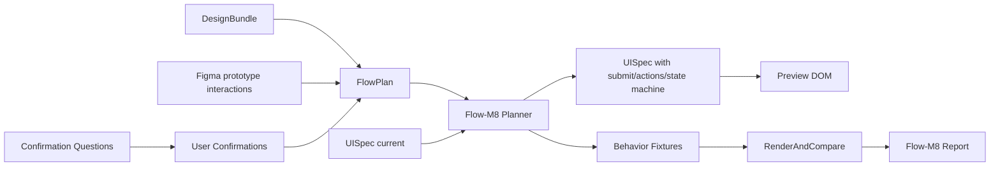

---worktrail
{
  "schema": "worktrail.knowledge.v1",
  "id": "figma-to-ui-agent-flow-m8-form-submit-state-machine-design",
  "scope": "project",
  "type": "architecture",
  "title": "Figma-to-UI Agent Flow-M8 表单提交与状态机设计",
  "status": "active",
  "lifecycle": "current",
  "topic": "figma-to-ui-agent-flow-m8"
}
---

# Figma-to-UI Agent Flow-M8 表单提交与状态机设计

## 1. 背景

Flow-M7 已完成可信 Figma `CHANGE_TO` / variant state 到 UISpec `set_state` 的 restricted-live 验证，并证明 Preview 中真实 DOM 点击、显隐断言、console 和基础行为验证可通过。当前 Flow-M7 的正式残留风险是：不覆盖 submit-like 表单提交、checkout / login 等业务动作；仍有无法安全表示的 Figma interaction 保留为 unresolved；restricted-live 样本主要覆盖 state switch，不代表完整业务 Flow。

当前代码事实：

- `FlowPlan` 已有 `trigger: "submit"`，但 `intent` 只有 `navigate`、`set_state`、`open_dialog`、`unknown`。
- `UISpec.actions` 只有 `navigate`、`set_state`、`open_dialog`。
- Preview dispatch 只执行 `navigate`、`set_state`、`open_dialog`。
- `behaviorFixtures` 已支持 `click`、`fill`、`toggle`、`expect_visible`、`expect_text`、`expect_value`、`expect_checked`、`expect_page`。
- RenderAndCompare 已能执行 `fill`、`toggle`、`expect_value`、`expect_checked`，但还缺 select/radio 专用选择语义和 submit 因果验证。

Flow-M8 的目标不是追求真实后端业务成功，而是在本地、可审计、可恢复的边界内，把表单提交、选择控件和多步 UI 状态机表达为明确契约，并保证所有业务语义来自 Figma 可信 interaction 或用户确认，而不是模型猜测。

## 2. 目标

1. 为 FlowPlan 和 UISpec 增加显式 `submit` 语义，使 submit-like 路径不再依赖 scenario 注释或普通 click 伪装。
2. 建立本地状态机模型，支持多步表单路径：输入、选择、提交、状态变更、弹窗、页面跳转。
3. 补齐 select/radio 的行为执行和断言，使表单控件覆盖从 checkbox/switch 扩展到常见选择控件。
4. 建立用户确认模型，把 `inferred` / `missing` / 不完整 Figma interaction 转为待确认问题；只有 `user_confirmed` 且字段完整的答案才能生成业务动作。
5. 保持结构化 DOM 交互和 Playwright 可验证性；禁止整页截图 fallback 或不可交互伪 UI。
6. 保持默认本地执行，不默认调用 OpenAI、Figma live 或第三方 MCP。

## 3. 非目标

1. 不实现真实后端、数据库、登录会话、支付、报价或订单系统。
2. 不让 submit 表示“真实业务已成功”；只能表示本地可观察 UI 效果，例如 state、dialog、route、message、field error。
3. 不根据按钮文案或组件名静默猜测业务结果。
4. 不改变 Pi 四工具边界。
5. 不新增依赖。
6. 不把 scenario/test fixture 当作业务真相来源。
7. 不覆盖所有 Figma prototype 类型；本期只覆盖能映射到本地 UISpec 与 Preview 的行为。

## 4. 核心设计

Flow-M8 引入双层行为模型：

1. **可信交互层**：来自 Figma REST prototype 或用户确认，负责生成 UISpec action、state machine transition 和行为 fixture。
2. **验证行为层**：通过 Playwright 执行真实 DOM 操作，验证页面、状态、字段值、checked/selected、文本、弹窗等后置条件。



## 5. 契约变更

### 5.1 FlowPlan

Flow-M8 扩展 FlowPlan interaction：

- `intent` 增加 `submit`。
- `submit` interaction 必须有 `uiNodeId`，且目标节点必须可触发。
- `submit` 必须携带可观察后置条件引用，不能只记录点击。
- `source=figma | user_confirmed` 且 `confirmed=true` 才能生成 submit action。
- `source=inferred | missing` 只能生成 confirmation question 或 unresolved 记录。

建议新增字段：

```ts
type FlowM8Postcondition =
  | { kind: "expect_page"; pageId: string }
  | { kind: "expect_visible"; nodeId: string }
  | { kind: "expect_text"; nodeId: string; text: string }
  | { kind: "expect_value"; nodeId: string; value: string }
  | { kind: "expect_checked"; nodeId: string; checked: boolean }
  | { kind: "expect_selected"; nodeId: string; value: string };
```

### 5.2 UISpec action

`UISpec.actions` 增加：

```ts
type UISubmitAction = {
  id: string;
  kind: "submit";
  effect:
    | { kind: "set_state"; stateKey: string; value: string | number | boolean }
    | { kind: "open_dialog"; dialogNodeId: string }
    | { kind: "navigate"; pageId: string }
    | { kind: "none" };
  postconditions: FlowM8Postcondition[];
};
```

约束：

- `effect.kind="none"` 只允许用于 native HTML validation 或 error message 已可观察的场景，仍必须有 postcondition。
- `postconditions` 至少 1 个。
- `submit` action 不得发起网络请求。
- `submit` action 不得写入未声明 state。
- `submit` action 的 effect 只能复用本地 Preview 已可执行的动作能力。

### 5.3 选择控件行为

Flow-M8 将 select/radio 从“节点可渲染”提升为“行为可验证”：

- 新增 behavior step：`select_option`。
- 新增 behavior step：`choose_radio`。
- 新增断言：`expect_selected`。
- `expect_checked` 继续覆盖 checkbox/switch/radio 的 checked 状态。

建议契约：

```ts
type FlowM8BehaviorStep =
  | { kind: "select_option"; nodeId: string; value: string }
  | { kind: "choose_radio"; nodeId: string; value?: string }
  | { kind: "expect_selected"; nodeId: string; value: string };
```

## 6. 用户确认模型

Flow-M8 不允许从低置信度推断直接生成 submit/state machine。确认流程如下：

1. 对 `inferred`、`missing`、`unknown`、字段不完整或 postcondition 不足的 interaction 生成 confirmation question。
2. 问题必须说明触发控件、所在页面、候选动作和需要补充的后置结果。
3. 用户答案通过 `applyConfirmations` 写回 FlowPlan，source 变为 `user_confirmed`，`confirmed=true`。
4. 写回前必须通过 schema 校验和引用闭合校验。
5. 无法匹配或缺少后置条件的答案保持 unresolved，不生成 UISpec action。

## 7. 本地状态机

Flow-M8 的状态机是本地 UI 状态机，不是业务后端状态机。

```ts
type FlowM8StateMachine = {
  id: string;
  initialState: string;
  states: Array<{ id: string; pageId?: string; visibleNodeIds?: string[] }>;
  transitions: Array<{
    id: string;
    from: string;
    to: string;
    triggerActionId: string;
    guards?: FlowM8Guard[];
    postconditions: FlowM8Postcondition[];
  }>;
};
```

约束：

- transition 必须由可信 action 触发。
- guard 只能引用 UISpec 已声明的 state 或控件值。
- 每个 transition 必须至少有一个 Playwright 可验证 postcondition。
- 状态机不能根据 scenario 自动创建业务状态；scenario 只提供测试输入值。

## 8. 组件分解

### 8.1 Flow-M8 Planner

落点建议：`src/flow-plan/m8-planner.ts`。

职责：

- 接收 FlowPlan、UISpec 和可选 behavior scenario。
- 转换 trusted `submit`、select/radio、状态机 transition。
- 生成 UISpec action、state entries、behavior fixtures。
- 保留 unresolved interactions 和 reject reason。

### 8.2 Confirmation Model

落点建议：复用并扩展 `src/flow-plan/confirmation-questions.ts` 与 `src/flow-plan/apply-confirmations.ts`。

职责：

- 为 submit/postcondition 缺失生成明确问题。
- 将用户确认答案转换为 `user_confirmed` interaction。
- 对引用、动作类型和 postcondition 做 fail-closed 校验。

### 8.3 Submit Executor

落点建议：`preview/src/preview-app.tsx`。

职责：

- 在 Preview dispatch 中处理 `kind="submit"`。
- 只执行本地 effect：set_state、open_dialog、navigate 或 none。
- 不发网络请求，不调用外部服务。

### 8.4 Behavior Validator

落点建议：`src/validation/render-and-compare.ts`。

职责：

- 执行 `select_option`、`choose_radio`、`expect_selected`。
- 对 submit action 记录 click 前后 postcondition，防止点击前已满足的静态 expect 冒充提交成功。
- 报告失败时给出 step id、node id、actual/expected 的脱敏摘要。

### 8.5 Flow-M8 Report

落点建议：`src/flow-plan/m8-report.ts`。

职责：

- 输出 `milestone="Flow-M8"`、`scope="form_submit_state_machine"`。
- 统计 submit converted、user confirmed converted、select/radio assertions、state machine transitions、unresolved/rejected。
- `passed` 必须证明：至少 1 个可信 submit 或状态机 transition 被转换并通过验证。

## 9. 信任与失败关闭规则

1. `inferred` 和 `missing` 不得生成 submit action 或 state machine transition。
2. `submit` 缺少 postcondition 时必须 rejected。
3. `submit` effect 引用悬空 page、dialog、state 或 node 时必须 rejected。
4. select/radio step 找不到真实 DOM 控件时必须失败，不可降级成普通 click。
5. scenario-only 只能用于 fixture 输入，不得满足 Flow-M8 passed。
6. validation 失败不得覆盖上一份有效 `current.json`。
7. 外部 Figma/OpenAI 调用必须单独 gate；本设计默认 local-only。

## 10. 验收标准

- AC1：FlowPlan schema 明确支持 `intent="submit"`，并保留旧 interaction 兼容。
- AC2：UISpec schema 明确支持 `action.kind="submit"`，submit 必须有本地 effect 或 postcondition。
- AC3：Preview dispatch 能执行 submit 的本地 effect，且不发网络请求。
- AC4：RenderAndCompare 能执行 `select_option`、`choose_radio`、`expect_selected`。
- AC5：用户确认答案可把缺失/推断 interaction 转为 `user_confirmed`，并通过引用闭合校验。
- AC6：多步状态机至少覆盖两次 transition，并产生 Playwright 可验证证据。
- AC7：scenario-only、postcondition 缺失、引用悬空、不可信来源都不能 passed。
- AC8：Flow-M6/Flow-M7 回归测试继续通过。
- AC9：默认验证不调用 OpenAI、Figma live、不新增依赖、不改变四工具边界。

## 11. 风险与缓解

- 风险：submit 被误解为真实业务成功。缓解：报告和 schema 明确只表示本地 UI effect 与 postcondition。
- 风险：模型从按钮文案猜测业务逻辑。缓解：submit/state machine 只接受 `figma` 或 `user_confirmed`。
- 风险：select/radio DOM 表达不一致。缓解：使用 Playwright 原生 select/check API，找不到真实控件即失败。
- 风险：公共 schema 变更影响旧 fixtures。缓解：新增 discriminated union 分支，不改变已有 action/step 语义，并补回归。
- 风险：状态机过度抽象。缓解：本期只实现本地线性/有限 transition，不引入规则引擎。

## 12. 结论

Flow-M8 应作为 Flow-M7 之后的显式契约扩展：补齐 submit、select/radio、用户确认和本地状态机。它不是产品化 CLI 里程碑，也不是视觉保真优化。完成后，coding agent 可以在无后端、无外部服务默认调用的前提下，对登录、注册、checkout 等常见 Figma 页面生成可交互、可验证、可审计的本地 UI Flow。
