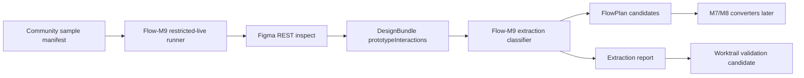

---worktrail
{
  "schema": "worktrail.knowledge.v1",
  "id": "figma-to-ui-agent-flow-m9-restricted-live-interaction-extraction-design",
  "scope": "project",
  "type": "architecture",
  "title": "Figma-to-UI Agent Flow-M9 restricted-live interaction 抽取设计",
  "status": "active",
  "lifecycle": "current",
  "topic": "figma-to-ui-agent-flow-m9"
}
---

# Figma-to-UI Agent Flow-M9 restricted-live interaction 抽取设计

## 1. 背景

Flow-M8 已完成本地 submit、postcondition、select/radio 和状态机能力，但它仍是本地 fixture 证明。Flow-M9 的目标是把 Flow 能力推向真实 Figma Community 文件：只读抽取真实 prototype/component interaction，形成可审计 FlowPlan 候选，并明确哪些可以自动信任，哪些必须进入用户确认。

当前已知事实：

- Flow-M7 restricted-live 已证明真实 Figma `CHANGE_TO` 可转换为 UISpec `set_state` 并通过本地行为验证。
- Flow-M8 本地已支持 `submit`、postcondition、state machine、select/radio behavior fixture。
- `DesignBundle.NormalizedNode.prototypeInteractions` 与 `buildFlowPlan` 已能处理有限 Figma REST interaction。
- `scripts/run-flow-m7-restricted-live.mjs` 已提供 Figma-only gate、Figma REST inspect、FlowPlan 生成、UISpec 转换和 Playwright 验证链路。
- Product 线后置；Flow-M9 不做产品包装。

## 2. 设计目标

1. 从真实 Figma REST 数据中抽取最小、脱敏、白名单化的 prototype interaction 事实。
2. 在 FlowPlan 中输出 `trusted`、`needs_confirmation`、`unsupported`、`missing_evidence` 四类结果。
3. 支持多样本 restricted-live extraction report，而不是单样本临时验证。
4. 对 `NAVIGATE`、`CHANGE_TO`、overlay/dialog-like、submit-like candidate 做明确映射或拒绝。
5. 保持 fail-closed：证据不足时只进入 confirmation/unresolved，不生成业务行为。
6. 保持无 OpenAI、无依赖变更、无四工具边界变更。

## 3. 非目标

- 不调用 OpenAI。
- 不默认跑 live/restricted-live；真实 Figma 网络必须显式 gate。
- 不新增依赖。
- 不改变 Pi 四工具边界。
- 不实现 Flow-M10 的用户确认写回扩展，只定义 M9 输出给 M10 的契约。
- 不证明完整业务 Flow passed；Flow-M9 只证明真实 interaction 可抽取和分类。
- 不把按钮文案、页面顺序或视觉猜测作为业务 truth。

## 4. 架构边界

组件责任：

- **Sample Manifest Reader**：读取受控样本清单，只使用 `sampleId`、类别、预期 viewport、manifest 中的 design locator；报告中不复制 raw design URL/file key。
- **Restricted-live Gate**：要求 `FLOW_M9_RESTRICTED_LIVE_AUTHORIZED=1` 与 `FIGMA_API_KEY`，且 `--allow-figma-network` 显式开启。
- **Figma Inspector Adapter**：复用现有 `FigmaInspector`、`FigmaRestClient`、`ProjectStore`，关闭 Variables 增强，保持 restricted-live 最小读取。
- **Interaction Extractor**：从 normalized `prototypeInteractions` 读取白名单字段，按 trigger/navigation/target 可表达性分类。
- **FlowPlan Candidate Builder**：复用 `buildFlowPlan`，但输出 M9 统计与分类，不把 `inferred/missing` 转为 action。
- **Extraction Report**：输出样本级和聚合级 summary，包含 counts、classification、blocked reasons、next action。

## 5. 数据与接口契约

### 5.1 输入

- `sampleManifestPath`：默认 `tests/fixtures/figma/community-sample-manifest.json`。
- `sampleIds`：3 到 5 个样本，必须存在于 manifest。
- `mode`：仅允许 `restricted-live`。
- `allowFigmaNetwork`：必须显式为 true。
- `projectIdPrefix` / `runId`：用于隔离 ProjectStore 和 reports。

### 5.2 输出报告

建议新增 `flowM9RestrictedLiveExtractionReportSchema`：

- `schemaVersion: "1"`
- `milestone: "Flow-M9"`
- `scope: "restricted_live_interaction_extraction"`
- `status: "passed" | "partial" | "failed"`
- `input`: runId、sampleManifestRef、sampleIds、networkBoundary
- `samples[]`: sampleId、category、expectedViewport、accessStatus、interactionSource、counts、classifications、blockedReasons、artifactRefs
- `aggregate`: totalSamples、readableSamples、trustedNavigate、trustedStateChange、submitLikeNeedsConfirmation、unsupported、missingEvidence
- `reasons[]`
- `residualRisks[]`

报告不得包含 token、raw REST payload、raw design URL、file key 或远端图片 URL。可引用本地 manifest 的 `sampleId` 与本地 artifact path。

## 6. 分类规则

- `trusted.navigate`：Figma interaction 是 supported trigger，navigation 为 NAVIGATE，destination 可映射到当前 DesignBundle/FlowPlan page。
- `trusted.set_state`：navigation 为 CHANGE_TO，target variant 可映射为现有 UISpec state/value/target node。
- `needs_confirmation.submit_like`：source node 或 normalized UI node 是 form/button-like，interaction 或文案暗示 submit/login/register/checkout/pay/save，但缺少可验证 postcondition。
- `unsupported`：trigger/navigation 类型存在但当前 UISpec 无法表达，例如 BACK、URL、SWAP_WITH、unknown overlay semantics。
- `missing_evidence`：样本可读但没有 prototype interaction，或者 selected node 下无可用 interaction。
- `not_accessible`：Figma REST 权限、404、429 或节点不可读。

## 7. 信任规则

- 只有 Figma REST prototype/reaction 白名单字段可进入 `source="figma"`。
- `source="inferred"`、`source="missing"`、submit-like heuristic 只能进入 `needs_confirmation` 或 unresolved。
- `scenario-only` 不参与 M9 passed 判定。
- M9 不产生最终 business action passed；它只证明真实抽取和分类。
- 所有 raw locator 使用本地 manifest，报告只保存 `sampleId` 和 artifact refs。

## 8. 验收标准

- AC1：可从 3 到 5 个 manifest 样本执行 restricted-live Figma-only extraction。
- AC2：至少 3 个样本完成只读抽取并产生样本级 report。
- AC3：至少 1 个样本有可验证 `trusted.navigate` 或明确 `prototype_target_page_missing` 分类。
- AC4：至少 1 个样本有可验证 `trusted.set_state` / `CHANGE_TO`，或明确 `change_to_target_not_representable` 分类。
- AC5：至少 1 个 login/checkout 样本产生 `needs_confirmation.submit_like`，不得自动生成 submit action。
- AC6：无 interaction 样本必须 classified 为 `missing_evidence` 或 partial，不得 passed 伪成功。
- AC7：报告脱敏检查通过：不含 token、raw design URL、file key、raw REST payload。
- AC8：默认本地测试通过；restricted-live 只在显式 gate 下执行。

## 9. 风险与缓解

- 风险：Community 文件权限或结构变化。缓解：样本状态允许 `not_accessible`，并要求至少 3 个 readable 样本。
- 风险：真实 Figma interaction 字段形态漂移。缓解：白名单解析，未知字段进入 unsupported。
- 风险：submit-like 被模型或文案误判为业务事实。缓解：只输出 `needs_confirmation`，留给 Flow-M10。
- 风险：报告泄露 raw URL/file key。缓解：report schema 与 redactionCheck 拦截。
- 风险：M9 与 M7/M8 runner 重复。缓解：M9 runner 只做 multi-sample extraction/report，转换验证仍复用 M7/M8 能力。

## 10. 待确认假设

- 现有 manifest 中至少 3 个 `rest_readable_node_selected` 样本在当前 token 下仍可读。
- Fitness 样本仍可提供 `CHANGE_TO` 类 interaction。
- Login/checkout 样本可能没有真实 prototype submit，但足以作为 submit-like confirmation 候选或 missing_evidence 负例。
