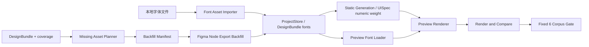

---worktrail
{
  "schema": "worktrail.knowledge.v1",
  "id": "architecture-figma-to-ui-agent-generator-fidelity-v1-1-closure-design",
  "scope": "project",
  "type": "architecture",
  "title": "Figma-to-UI Agent Generator Fidelity v1.1 收口设计",
  "status": "active",
  "lifecycle": "current",
  "topic": "figma-to-ui-agent"
}
---

# Figma-to-UI Agent Generator Fidelity v1.1 收口设计

## 1. 背景与基线

Generator Fidelity v1 已完成生成、预览、比较、区域归因和固定六样本回归能力，但最终视觉门禁只达到 `2/6 <5%`：

| 样本 | v1 最终 diff | v1.1 处置 |
| --- | ---: | --- |
| ecommerce | 2.0227% | 回归保护 |
| landing | 3.6523% | 回归保护 |
| mobile profile | 5.5260% | 第一优先级，目标 `<5%` |
| dashboard | 6.1018% | 第二优先级，目标 `<5%` |
| login | 9.2332% | 只观察，不作为主修样本 |
| design system | 15.6374% | 延后到复合语义 v2 |

基线证据：

- `reports/community-corpus/20260726gf-final-local-v1-generator-fidelity-v1-summary.json`
- `reports/community-corpus/20260726gf-final-local-v1-coverage-guard-summary.json`
- 待审验证：`validation/figma-to-ui-agent-generator-fidelity-v1-result.md`

已确认的根因：

- Mobile 的 24 个文本节点中，League Spartan 使用 20 个，Poppins 使用 4 个；当前环境没有这些原始字体。系统 fallback probe 均未达到门槛。
- Mobile 还缺少 back/status/edit 等局部 stroke icon。
- Dashboard 的 `0:461 Combined Shape` 已被报告为 `unsupported_missing_asset`；当前 DesignBundle 没有该复合父节点的局部截图，子 operand 不能复现父级组合 paint/effect。
- 当前 UISpec/preview style 将字重压缩为 `regular/medium/semibold/bold`。Mobile 实际包含 300、400、500、600、700；只增加字体文件仍会丢失 300 等精确字重。

## 2. 目标

1. Mobile `<5%`。
2. Dashboard `<5%`。
3. 固定六样本至少 `4/6 <5%`。
4. Ecommerce 和 Landing 均继续 `<5%`。
5. 保留真实 input、button、link、text DOM、键盘可用性和 console clean。
6. 保持 `unmapped = 0`、`fullPageScreenshotFallback = false`，coverage guard 不回退。
7. 不调用 OpenAI；只有单独确认的节点资产补采阶段可以访问 Figma REST。

## 3. 非目标

- 不在 v1.1 解决 Login 和 Design System 的全部差距。
- 不引入 variant/modal/overlay/boolean geometry 的完整 UISpec 表达。
- 不修改模型可见 `render_and_compare` tool contract。
- 不把结构化控件替换为图片。
- 不使用 root、page 或 full-artboard screenshot 作为 UISpec 视觉层。
- 不自动下载、猜测许可或持久化来源不明的字体。
- 不新增依赖；如证明必须新增，单独触发 `GATE-DEPENDENCY`。

## 4. 方案比较

### 方案 A：继续 CSS 和系统字体启发式调参

优点：改动小。

缺点：Helvetica Neue、Avenir Next、Futura 和现有 fallback probe 均未达标；不可重复且增加其他样本回归风险。

结论：拒绝。

### 方案 B：登记本地字体、保留数值字重并补采缺失节点资产

优点：直接补齐已证明缺失的视觉事实；只对 DesignBundle 和 UISpec style 做向后兼容的 additive 变更；可按内容哈希、来源和 revision 审计；复用现有 Figma REST 限流、图片下载和 renderer。

缺点：需要字体来源/许可确认、additive schema 授权，以及一次受控 Figma 节点导出。

结论：采用。

### 方案 C：保持四档字重，只登记字体文件

优点：UISpec 不变。

缺点：源字重 300 会被转换为 400，无法兑现精确字体映射；对距离门槛只有 0.526 个百分点的 Mobile 风险过高。

结论：拒绝。

### 方案 D：立即扩展完整 compound/variant/modal UISpec

优点：长期覆盖更完整。

缺点：影响范围远大于本轮 4/6 收口；Design System 仍受字体来源影响。

结论：延后到 Generator Fidelity v2。方案 B 完成后 Dashboard 仍不达标时，才重新设计 compound visual schema。

## 5. 决策锁

- `UISpec` 继续是唯一结构化中间产物。
- 字体二进制和局部节点图像是 UISpec 外部受管资产。
- UISpec `style.fontWeight` 从旧四档 enum additive 扩为 `旧 enum | 1..1000 数值`；旧 fixture 和旧 renderer 输入继续有效，新 static generation 对有源值的文本优先写数值。
- DesignBundle additive 增加字体资产登记，并兼容缺失 `fonts` 的旧 revision。
- 节点 backfill 只补齐非页面节点 PNG；不导出 page/root/full-artboard 作为视觉 fallback。
- Backfill 不重新执行完整 inspect，不访问 `/v1/me`、Variables 或 OpenAI。
- 选择规则基于节点类型、视觉元数据、祖先关系、通用名称或 coverage 原因；禁止写死 fileKey、projectId、nodeId 或样本文案。
- 字体导入和节点 backfill 各自生成新的 DesignBundle revision；旧 revision 不可变。
- 单次 backfill 采用原子提交：任一请求、下载或校验失败时不保存新 DesignBundle revision。

## 6. 组件与数据流



### 6.1 Font Asset Importer

- 输入用户提供或另行授权取得的本地字体文件，以及 family/weight/style/sourceKind。
- 只接受 WOFF2、WOFF、TTF、OTF；校验扩展名、magic、大小上限和 SHA-256。
- 保存为 `figma/fonts/<sha256>.<ext>`；不持久化原始本地路径或远端 URL。
- 同一 family/weight/style 出现不同哈希时 fail closed，不静默覆盖。
- 全部输入验证和文件写入成功后，才创建新的 DesignBundle revision。

### 6.2 DesignBundle Font Registry

```ts
type LocalFontRef = {
  path: `figma/fonts/${string}.${"woff2" | "woff" | "ttf" | "otf"}`;
  sha256: string;
  byteCount: number;
  mimeType:
    | "font/woff2"
    | "font/woff"
    | "font/ttf"
    | "font/otf";
  family: string;
  weight: number;
  style: "normal" | "italic";
  sourceKind: "user_provided" | "authorized_download";
};
```

契约：

- DesignBundle 增加 `fonts: LocalFontRef[]`，缺失时默认 `[]`。
- provenance `entityKind` 增加 `font`，font origin 只能是 `user_provided` 或 `authorized_download`；非 font entity 不得使用这两个 origin。
- `sourceIdHash` 不保存本地路径，只在存在允许持久化的脱敏来源标识时使用。
- 不改变现有 image/screenshot MIME、路径和引用约束。

### 6.3 UISpec 数值字重兼容

```ts
type UIFontWeight =
  | "regular"
  | "medium"
  | "semibold"
  | "bold"
  | number; // 1..1000
```

契约：

- 旧 enum 输入继续 parse，preview 保持原映射。
- 新生成文本存在 Figma `fontWeight` 时保留数值，不再先压缩为四档。
- catalog fixture、json-render adapter、controlled style 和 form/text renderer 接受 union，并把数值原样交给 CSS。
- 此变更不扩大 `render_and_compare` 输出，也不增加新的模型可见工具。

### 6.4 Preview Font Loader

- Project data plugin 只提供 DesignBundle 已登记的 font path。
- 使用 `FontFace` 或等价 `@font-face` 注册 exact family/weight/style。
- 页面截图前等待全部登记字体 load 完成，并暴露 readiness 标记。
- `render-and-compare` 同时等待 readiness 与 `document.fonts.ready`；超时返回 `font_asset_load_timeout`。
- 未登记 face 使用现有 fallback，同时输出 `font_asset_missing`，不得把 fallback 当作字体资产命中。

### 6.5 Missing Asset Planner

- 从当前 DesignBundle、visual asset priority 和 coverage/report 生成只读 manifest。
- 选择 `unsupported_missing_asset`、`visual_layer_no_asset`、缺失 stroke icon 和 compound visual。
- 排除 page id、root artboard、已登记 asset、隐藏节点、超限节点。
- compound parent 优先于 operands；parent asset 成功后，子节点归因为 `covered_by_parent_asset`。
- 对旧 bundle 使用通用 Figma 命名 `Combined Shape`、union/subtract/intersect/exclude、子节点关系和 effect 信号；未来可 additive 保留 source type，但不是 v1.1 前置条件。

```ts
type VisualAssetBackfillEntry = {
  sourcePageId: string;
  sourceNodeId: string;
  sourceNodeIdHash: string;
  reasonCode: string;
  priorityRank: number;
  bounds: { x: number; y: number; width: number; height: number };
};
```

Manifest/report 不得保存原始 fileKey 或 signed URL。

### 6.6 Figma Node Export Backfill

- 输入 `projectId`、Figma URL 和已审阅 manifest。
- 校验 URL 的 fileKey hash 与 DesignBundle `source.fileKeyHash` 相同。
- 只调用 image render endpoint：`format=png`、`scale=1`、每批至多 100 个 node id。
- 复用 `FigmaRestClient` 的客户端间隔、Retry-After、有限重试和脱敏 429 日志。
- 复用 `FigmaImageDownloader` 的 URL allowlist、大小限制、magic 校验和内容哈希保存。
- 所有节点成功后才追加 `screenshots` 与 node screenshot provenance 并保存新 revision；任何失败保持旧 revision。
- 该动作必须显式授权；计划、单元测试和本地 corpus 不得隐式调用。

## 7. 影响面

- DesignBundle / store：`src/design-bundle/schema.ts`、`src/project-store/path-safety.ts`、`src/project-store/store.ts`。
- UISpec/style：`src/ui-spec/schema.ts`、`src/static-generation/style-mapper.ts`、`src/static-generation/node-mapper.ts`。
- Preview：`src/preview/project-data-plugin.ts`、`src/preview/catalog.ts`、`src/preview/json-render-adapter.ts`、`preview/src/preview-app.tsx`、`preview/src/components/controlled-style.ts`、text/form components。
- Backfill：`src/static-generation/visual-asset-priority.ts`、新增 `src/figma/visual-asset-backfill.ts`、新增受控脚本。
- Compare/report：`src/validation/render-and-compare.ts`、`src/static-generation/report.ts`、`src/static-generation/report-markdown.ts`、corpus harness。
- 模型可见工具契约：不变。

## 8. 真相所有权

- Figma 节点结构、bounds、style、source id：DesignBundle inspect revision。
- 字体 family/weight/style 需求：DesignBundle 文本样式。
- 字体二进制：本地登记的补充渲染资产，不替代 Figma 文本语义。
- UISpec：唯一结构化中间产物。
- Preview DOM、截图、diff、report：派生证据。
- Backfill manifest：一次运行计划，不是长期设计真相。

## 9. 失败、回滚与安全

- 字体格式、metadata、哈希或 face 冲突失败：不创建新 revision。
- 字体加载失败：compare fail closed 并报告 face。
- fileKey hash 不匹配：禁止网络请求。
- 429：沿用现有等待/停止策略和脱敏日志。
- 单个节点无 URL、下载或校验失败：整批 backfill 不保存新 revision。
- 新 revision 造成回归：指定前一 DesignBundle revision 重跑；不覆盖历史。
- Dashboard 在字体和节点 backfill 后仍 `>=5%`：停止样本特化，转入 v2 compound visual 设计。
- 不在日志、报告、Worktrail 或 DesignBundle 中保存 token、原始 fileKey、signed URL 或字体源绝对路径。
- Font/node 文件服务只读取已登记内容哈希路径，并执行 containment/symlink 检查。
- 本地 corpus 继续清空 `FIGMA_API_KEY` 和 `OPENAI_API_KEY`。

## 10. Gate

### GATE-DESIGN-BUNDLE-SCHEMA

允许 additive `fonts`、font provenance 和 ProjectStore font path；旧 bundle 兼容。

### GATE-UISPEC-SCHEMA

允许 `style.fontWeight` 从旧 enum additive 扩为 `旧 enum | 1..1000`；旧 UISpec fixture、catalog 和 renderer 兼容。

### GATE-FONT-ASSET

确认字体来源和使用许可，并明确可读取/复制的本地文件或经核实的下载来源。未通过时只实施代码与 fixture，不执行真实字体导入。

### GATE-FIGMA-BACKFILL

允许对指定 project/file 运行节点级 image export；不包含 `/v1/me`、Variables、OpenAI、完整 re-inspect 或整页 fallback。

### GATE-DEPENDENCY

默认不新增依赖；确有必要时另行确认。

### GATE-GIT

计划接受不等于 commit、push、promote 或 discard 授权。

## 11. 验收标准

- AC1：没有 `fonts` 的旧 DesignBundle 继续 parse 为 `fonts=[]`；旧 UISpec 四档字重继续 parse/render。
- AC2：新 static generation 保留 1..1000 数值字重，preview 将其原样应用到 CSS。
- AC3：字体按内容哈希保存；preview 只加载登记 face，并在截图前确定性 ready。
- AC4：缺字体、加载失败和 fallback 都有可审计诊断。
- AC5：Missing Asset Planner 通用识别 compound parent 和缺失 stroke icon，且不输出 page/root/full-artboard。
- AC6：Backfill 只执行节点级 PNG export，校验 fileKey hash，复用限流/429 日志，原子形成新 DesignBundle revision。
- AC7：Mobile `<5%`。
- AC8：Dashboard `<5%`。
- AC9：固定六样本至少 `4/6 <5%`，Ecommerce 与 Landing 继续 `<5%`。
- AC10：functional、keyboard、console、typecheck、相关 unit/integration/e2e 全部通过。
- AC11：coverage guard 继续满足 `unmapped=0`、`fullPageScreenshotFallback=false`，核心覆盖指标不回退。
- AC12：严格 secret scan 无 token、原始 fileKey、signed URL、字体源绝对路径或 PAT。

## 12. Residual Assumptions

- assumption：Mobile 原始字体文件可由用户提供或通过单独授权来源取得。
  validation_method：GATE-FONT-ASSET 记录实际 family/weight/style 与来源许可；未获得资产时不得宣称 AC7 已验证。
- assumption：节点级 PNG 能表达 Dashboard `Combined Shape` 的组合 paint/effect。
  validation_method：GATE-FIGMA-BACKFILL 后先运行 Dashboard targeted compare；仍不达标则转入 v2 schema 设计。
- assumption：`format=png, scale=1` 与当前 CSS pixel mapping 一致。
  validation_method：对 fixture 和一个授权节点核对 intrinsic size、Figma bounds 与 rendered bounds；不一致时先设计 density metadata。
- assumption：Login 和 Design System 不要求在 v1.1 达标。
  validation_method：最终门禁明确要求 Mobile、Dashboard、Ecommerce、Landing 四个样本 `<5%`，另两个只记录结果。

## 13. ADR 索引

本增量不创建独立 ADR。若进入 compound visual、variant 或 modal UISpec schema，必须先创建独立设计或 ADR，再制定实施计划。
