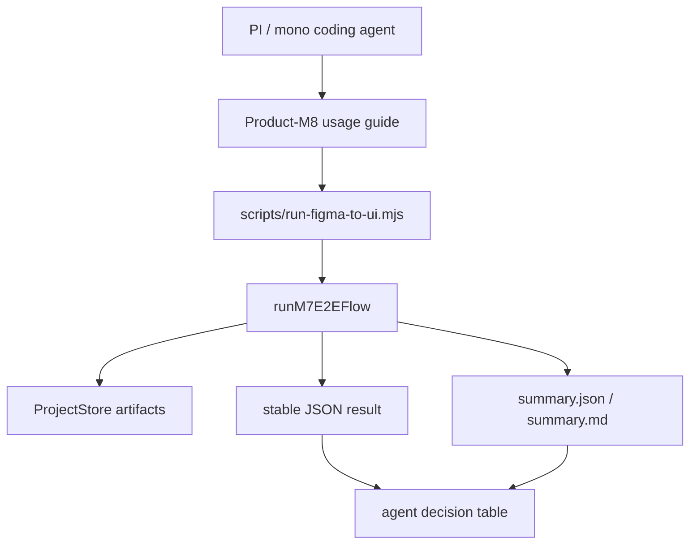

---worktrail
{
  "schema": "worktrail.knowledge.v1",
  "id": "figma-to-ui-agent-product-m8-agent-usage-loop-design",
  "scope": "project",
  "type": "architecture",
  "title": "Product-M8 PI Agent Usage Loop Design",
  "status": "active",
  "lifecycle": "current",
  "topic": "figma-to-ui-agent-product-m8-agent-usage-loop"
}
---

# Product-M8 PI Agent Usage Loop Design

## 1. 背景

Product-M7 已完成 CLI-first 端到端产品化主流程，并已验证：

- local mode 可使用显式 `designBundleRevision` 生成 UISpec 和 summary。
- restricted-live mode 在只授权 Figma gate、未授权 OpenAI gate 的情况下可读取真实 Figma 文件，生成 DesignBundle / UISpec，并输出稳定 JSON。
- `reports/m7-e2e/` 已作为本地运行报告目录处理，不作为 Git 长期知识入口。
- 里程碑命名规则已拆分为 `Product-M*` 与 `Flow-M*`。

Product-M8 的目标不是继续做视觉 diff 优化，也不是业务 Flow 能力，而是把 Product-M7 CLI 变成 PI / mono coding agent 可稳定消费的使用闭环。

## 2. 设计目标

Product-M8 完成后，PI / mono coding agent 应能在不阅读源码的情况下完成以下闭环：

1. 识别可用入口和模式。
2. 构造 local 或 restricted-live 命令。
3. 执行命令并读取 JSON result。
4. 根据 `ok`、`error.category`、`nextAction`、artifact refs 和 summary paths 判断下一步。
5. 在失败时知道是否应修正输入、补 gate、等待 Figma 限流、检查权限，或停止上报。
6. 在成功时知道可检查哪些产物，哪些验证被执行或跳过。

## 3. 非目标

Product-M8 不做：

- 不新增 PI tool，不修改现有四工具 tool boundary。
- 不引入新依赖或改变 `package-lock.json`。
- 不默认调用 Figma 或 OpenAI live path。
- 不实现复杂 Flow、路由、表单、状态或 submit 行为。
- 不追求新的视觉 diff 阈值突破。
- 不把 `reports/` 目录作为正式知识来源。
- 不把整页 screenshot fallback 作为 UI 生成策略。

## 4. 约束和授权边界

默认允许：

- 修改 CLI help、runtime contract 文档化输出、examples、manual test docs、tests。
- 运行 local typecheck/unit/integration。
- 使用本地 ProjectStore fixture 或已存在 local sample。
- 创建 Worktrail validation candidate。

默认禁止，需单独 gate：

- `GATE-PRODUCT-M8-LIVE-FIGMA`：真实 Figma REST 调用。
- `GATE-PRODUCT-M8-OPENAI`：任何 OpenAI 调用。
- `GATE-PRODUCT-M8-DEPS`：新增依赖或修改 lockfile。
- `GATE-PRODUCT-M8-PI-TOOL`：新增 PI tool 或修改 tool boundary。
- `GATE-PRODUCT-M8-GIT`：提交、推送。

## 5. 组件分解

Product-M8 是对 Product-M7 CLI 和 runtime result 的 agent-facing packaging，不建立第二套运行引擎。



### 5.1 Usage Guide

新增 Product-M8 使用说明，面向 agent 和人工操作者。

职责：

- 说明 local / restricted-live / live 的适用场景。
- 给出最小命令示例。
- 说明环境变量和 gate。
- 说明成功/失败 JSON 如何读取。
- 说明哪些报告应提交、哪些报告只作为本地证据。

### 5.2 CLI Examples

新增 JSON 示例或文档片段，覆盖成功和失败场景。

职责：

- local success example。
- restricted-live success example。
- invalid input example。
- missing auth gate example。
- Figma 429 example。
- permission/not found example。

示例不应包含真实 token 或 secret。

### 5.3 Agent Decision Table

新增 agent 决策表，把 `M7RunResult` 映射为下一步动作。

核心规则：

- `ok=true`：读取 artifact refs 和 summary paths，进入人工/自动检查。
- `input_invalid`：修正 CLI 参数，不重试相同命令。
- `auth_missing`：请求 gate 或 token，不盲目重试。
- `figma_rate_limited`：等待 Retry-After 或降低频率。
- `figma_permission_denied`：检查 token 权限或文件访问。
- `figma_not_found`：检查 URL/fileKey/nodeId。
- `static_generation_partial`：查看 warnings/unsupported，不把结果当完整成功。
- `render_compare_failed` / `validation_failed`：查看 validation artifact 和 diff。
- `internal_error`：上报实现缺陷。

### 5.4 Manual Test Flow

新增手动测试流程文档。

职责：

- local smoke 如何选择已有 local sample。
- restricted-live smoke 如何只授权 Figma gate。
- 如何确认没有调用 OpenAI。
- 如何读取 summary。
- 如何判断报告目录是否应保留或忽略。

### 5.5 Regression Test Layer

Product-M8 不改 pipeline 核心，但需要让 agent 使用闭环可回归。

覆盖：

- CLI help 输出包含 agent 需要的关键信息。
- JSON result examples 与 Zod schema 保持一致。
- failure examples 覆盖稳定 error categories。
- report path 与 `.gitignore` 策略一致。
- tool boundary 未变化。

## 6. 数据和接口契约

Product-M8 继续复用 `M7RunRequest`、`M7RunResult` 和 `M7RunError`，不创建新 runtime contract。

Product-M8 需要补充的是 agent-facing 解释层：

```ts
type ProductM8AgentDecision = {
  condition: string;
  agentAction: string;
  retryPolicy: "do_not_retry" | "retry_after_fix" | "retry_after_wait" | "manual_review";
  evidence: string[];
};
```

该类型不一定需要进入生产代码；可以先作为文档表格或测试 fixture 的语义结构存在。只有当实现需要机器校验 examples 时，再落入 test fixture。

## 7. 成功路径

### 7.1 Local Success

输入：

- `--mode local`
- `--project-id <existing-project>`
- `--designBundleRevision <revision>`
- `--json`

预期：

- exit code 0。
- `ok=true`。
- `designBundleRevisionSource=explicit`。
- 有 `summaryJson` 和 `summaryMarkdown`。
- 不调用 Figma / OpenAI。

### 7.2 Restricted-Live Figma-only Success

输入：

- Figma URL 或 `fileKey + nodeId`。
- `--mode restricted-live`。
- `--allow-figma-network`。
- 不传 `--allow-openai`。

预期：

- exit code 0。
- `ok=true`。
- `designBundleRevisionSource=generated`。
- 有 DesignBundle / UISpec artifact refs。
- `nextAction` 明确未调用 OpenAI。

## 8. 失败路径

Product-M8 必须把失败路径变成 agent 可执行建议。

| category | Agent 行为 | 重试策略 |
| --- | --- | --- |
| `input_invalid` | 修正参数、URL、projectId 或 revision | retry_after_fix |
| `auth_missing` | 请求 gate/token，不重复当前命令 | retry_after_fix |
| `figma_permission_denied` | 检查 token 权限和文件访问 | manual_review |
| `figma_rate_limited` | 等待 Retry-After 或降低请求频率 | retry_after_wait |
| `figma_not_found` | 检查 URL/fileKey/nodeId | retry_after_fix |
| `static_generation_partial` | 查看 warnings/unsupported | manual_review |
| `render_compare_failed` | 查看 diff 和 validation artifact | manual_review |
| `validation_failed` | 查看 validation artifact | manual_review |
| `internal_error` | 上报实现缺陷 | do_not_retry |

## 9. 安全和脱敏

- 文档和 examples 禁止包含真实 token、OpenAI key、Figma token。
- `.envrc` 只可说明变量名，不输出值。
- `summary.json` 和 `summary.md` 不应包含 secret。
- 失败 details 必须通过现有 redaction helper。
- restricted-live 和 live 必须保持 gate fail-closed。

## 10. 非功能要求

- 可重复：local smoke 必须使用显式 revision，避免 current drift。
- 可诊断：每个失败都要有 `category` 和 `nextAction`。
- 可审计：每次 Product-M8 验收应落 Worktrail validation candidate。
- 低耦合：不新增 PI tool，不改变四工具边界。
- 可维护：examples 与 schema 通过测试保持一致。

## 11. 待确认假设

- Product-M8 首版以文档、examples、tests 和 CLI polish 为主，不需要新增 runtime API。
- PI / mono coding agent 可以通过 shell 调用 CLI，而不需要新 tool。
- restricted-live smoke 可作为可选 gate 验证，不作为默认本地验证。
- `reports/m7-e2e/` 继续作为本地忽略目录。

## 12. 架构决策

| ID | 决策 | 状态 | 理由 |
| --- | --- | --- | --- |
| Product-M8-ADR-001 | CLI-first，不新增 PI tool | Proposed | 保持四工具边界稳定，降低集成风险。 |
| Product-M8-ADR-002 | 复用 M7RunResult，不新增 M8 runtime schema | Proposed | Product-M8 是 agent-facing packaging，不是新执行引擎。 |
| Product-M8-ADR-003 | Examples 通过测试校验 schema | Proposed | 防止文档示例和真实 JSON contract 漂移。 |

## 13. 验收标准

Product-M8 设计通过的标准：

1. 明确 Product-M8 与 Flow-M6/Flow-M7 的边界。
2. 明确 local、restricted-live、live gate。
3. 明确 agent 如何读取成功和失败 JSON。
4. 明确 examples、manual test、usage guide、regression tests 的交付。
5. 明确不新增依赖、不改 tool boundary、不默认 live/OpenAI。
6. 足以生成实施计划，不需要重新讨论组件边界。
