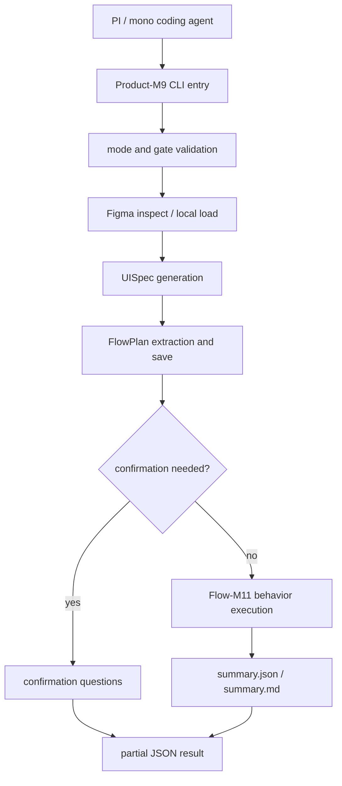

---worktrail
{
  "schema": "worktrail.knowledge.v1",
  "id": "figma-to-ui-agent-product-m9-real-flowplan-agent-entry-design",
  "scope": "project",
  "type": "architecture",
  "title": "Product-M9 Real FlowPlan Agent Entry Design",
  "status": "active",
  "lifecycle": "current",
  "topic": "figma-to-ui-agent-product-m9-real-flowplan-agent-entry"
}
---

# Product-M9 Real FlowPlan Agent Entry Design

## 1. 背景

Product-M8 已完成 PI / mono coding agent 使用闭环：agent 可以通过现有 CLI 读取稳定 JSON、summary 报告和错误建议。Flow-M9 到 Flow-M13 已完成真实 FlowPlan 能力闭环：真实 Figma restricted-live 样本可抽取 interaction、生成 FlowPlan artifact、执行多步骤验证，并通过 Flow-M13 三样本 restricted-live v2 收口。

Product-M9 的目标是把这两条线合并成一个产品化入口：让外部 coding agent 不必理解 Flow-M9/M10/M11/M12/M13 内部脚本组合，也能从一个 Figma URL 或本地 artifact 出发，得到可审计的真实 FlowPlan 产物、执行结果和下一步建议。

## 2. 设计目标

Product-M9 完成后，PI / mono coding agent 应能：

1. 用一个稳定入口运行 local 或 restricted-live FlowPlan 交付链路。
2. 从输入 Figma URL / project id / local artifact 生成或读取 DesignBundle、UISpec、FlowPlan 和 validation report。
3. 明确区分 `figma`、`user_confirmed`、`needs_confirmation`、`unsupported`、`missing_evidence`，不把推断当作可信业务行为。
4. 根据 JSON result 的 `ok`、`status`、`stage`、`error.category`、`nextAction`、`artifactRefs` 和 `summaryPaths` 决定下一步。
5. 在 restricted-live 下只调用 Figma REST，不调用 OpenAI。
6. 在缺少权限、429、prototype evidence 不足、需要用户确认、执行验证失败时给出稳定错误分类和恢复建议。

## 3. 非目标

Product-M9 不做：

- 不新增或改变 Pi 四工具边界。
- 不默认调用 OpenAI，也不引入第二 Agent Loop。
- 不新增依赖或修改 lockfile，除非后续单独 gate。
- 不追求新的视觉 diff 阈值，不回退整页 screenshot fallback。
- 不把缺少 Figma prototype 的 submit-like 行为自动编造成成功业务流。
- 不要求所有 Community 样本都通过；失败必须可解释、可分类、可恢复。
- 不把真实 token、raw Figma URL、file key、REST payload 写入报告或 Worktrail。

## 4. 输入模式

Product-M9 需要支持三类入口。

### 4.1 Local artifact mode

用于无外部服务的回归和 agent 本地验证。

输入：

- `--mode local`
- `--project-id <id>`
- 已存在的 DesignBundle / UISpec / FlowPlan revision 或 manifest fixture
- `--json`

预期：

- 不调用 Figma / OpenAI。
- 只读取本地 ProjectStore 或 fixture。
- 输出可执行 FlowPlan / behavior validation 结果或明确缺失 artifact。

### 4.2 Restricted-live Figma-only mode

用于真实 Figma 文件可行性和样本验证。

输入：

- `--mode restricted-live`
- `--figma-url <url>` 或受控 `fileKey + nodeId`
- `--project-id <id>` 或由调用方显式提供的 sample id 映射
- `--allow-figma-network`
- `--json`

预期：

- 只调用 Figma REST。
- 不调用 OpenAI。
- 生成 DesignBundle、UISpec、FlowPlan artifact 和 restricted-live summary。
- 若证据不足，输出 `needs_confirmation` 或 `missing_evidence`，不得静默生成业务逻辑。

### 4.3 Confirmed flow mode

用于用户已经补充业务语义的场景。

输入：

- `--mode local` 或 `restricted-live`
- `--answers <answers.json>` 或 `--confirmed-flow-plan <path>`
- 原始 FlowPlan artifact ref

预期：

- 只接受结构化用户确认。
- 生成 `user_confirmed` FlowPlan artifact。
- 执行 Flow-M11 behavior validation。

## 5. 输出契约

Product-M9 应输出稳定 JSON result。首版可以先由 Zod schema 和测试 fixture 固化，命名建议为 `ProductM9RunResult`。

核心字段：

```ts
type ProductM9RunResult = {
  ok: boolean;
  status: "passed" | "partial" | "failed";
  mode: "local" | "restricted-live";
  projectId: string;
  runId: string;
  stages: {
    inspect?: ProductM9StageResult;
    staticGeneration?: ProductM9StageResult;
    flowPlanExtraction?: ProductM9StageResult;
    confirmation?: ProductM9StageResult;
    execution?: ProductM9StageResult;
    report?: ProductM9StageResult;
  };
  artifactRefs: {
    designBundlePath?: string;
    uiSpecPath?: string;
    flowPlanPath?: string;
    confirmedFlowPlanPath?: string;
    validationPath?: string;
    summaryJson?: string;
    summaryMarkdown?: string;
  };
  metrics: {
    trustedNavigate?: number;
    trustedStateChange?: number;
    submitLikeNeedsConfirmation?: number;
    unsupported?: number;
    missingEvidence?: number;
    successfulFixtureIds?: string[];
    failedFixtureIds?: string[];
  };
  error?: {
    category: ProductM9ErrorCategory;
    message: string;
    recoverable: boolean;
  };
  nextAction: string;
};
```

错误分类必须稳定，至少覆盖：

| category | 含义 | nextAction |
| --- | --- | --- |
| `input_invalid` | 参数、URL、projectId、artifact ref 无效 | 修正输入后重试 |
| `auth_missing` | 缺少 Figma gate 或 token | 请求授权或配置后重试 |
| `figma_rate_limited` | Figma 429 | 等待 Retry-After 或降低频率 |
| `figma_permission_denied` | token 无文件访问权限 | 检查权限或更换文件 |
| `figma_not_found` | 文件或节点不存在 | 检查 URL / node id |
| `artifact_missing` | 本地 DesignBundle / UISpec / FlowPlan 缺失 | 先生成或指定正确 revision |
| `needs_confirmation` | submit-like 或业务语义需要用户确认 | 输出问题并等待答案 |
| `unsupported_figma_action` | Figma action 当前不能表达 | 记录 unsupported，不猜测 |
| `flow_execution_failed` | Playwright 行为验证失败 | 查看 validation artifact |
| `partial_evidence` | 有产物但证据不足以判 passed | 进入人工复核或补样本 |
| `internal_error` | 实现缺陷或未分类异常 | 上报实现问题 |

## 6. 组件分解



### 6.1 Product-M9 CLI Entry

建议新增独立脚本而不是继续扩大 Product-M8 静态入口：

- `scripts/run-product-m9-flow.mjs`

理由：Product-M8 入口聚焦静态 Figma-to-UI 使用闭环，Product-M9 入口聚焦 FlowPlan artifact 和 behavior validation。分离入口可以保持 help 文案、错误分类和测试边界清晰，同时复用底层服务。

### 6.2 Orchestrator Service

建议新增 runtime/service 层：

- `src/runtime/product-m9-flow-contracts.ts`
- `src/runtime/product-m9-flow-service.ts`
- `src/runtime/product-m9-flow-report.ts`

职责：

- 解析输入和 gate。
- 编排现有 inspect、static generation、Flow-M9 extraction、Flow-M10 confirmation、Flow-M11 execution、Flow-M12 corpus helper。
- 统一 stage result 和 error category。
- 输出 redacted JSON 和 summary。

### 6.3 Artifact Strategy

Product-M9 所有长期可消费产物必须有 artifact refs：

- DesignBundle：ProjectStore current/history。
- UISpec：ProjectStore current/history。
- FlowPlan：ProjectStore `flow/current.json`。
- confirmed FlowPlan：ProjectStore 或 run artifact，必须标记来源 `user_confirmed`。
- validation：run-local report 和 Playwright evidence。
- summary：`reports/product-m9/<runId>/summary.json` 和 `summary.md`。

### 6.4 Confirmation Boundary

Product-M9 不能自动补齐业务语义。规则：

- `figma` 来源且目标可验证：可以进入执行。
- `user_confirmed` 来源且 answer schema 合法：可以进入执行。
- submit-like 但缺 postcondition：返回 `needs_confirmation`。
- missing/unsupported/inferred：不能进入 passed 行为验证。
- scenario-only 不能作为通过依据。

## 7. 验收标准

Product-M9 设计通过的标准：

1. 提供单一 agent-facing FlowPlan 入口。
2. 输出稳定 JSON result 和 summary paths。
3. 复用现有 Flow-M9 到 Flow-M13 能力，不复制第二套 FlowPlan 引擎。
4. restricted-live 只调用 Figma REST，不调用 OpenAI。
5. 所有真实业务行为必须来自 `figma` 或 `user_confirmed`。
6. 失败分类稳定，agent 可以据此决定修输入、补授权、等待限流、请求确认或停止。
7. 不新增依赖、不改变 Pi 四工具边界。
8. 至少覆盖 local smoke、restricted-live Figma-only smoke、needs-confirmation partial、flow execution pass/fail 的测试或报告证据。

## 8. 待确认事项

- Product-M9 首版是否只新增 CLI wrapper + runtime service，不把入口接入 Pi extension 四工具。
- restricted-live 默认样本是否沿用 Flow-M13 三样本，还是建立 Product-M9 专用 smoke manifest。
- confirmed flow mode 首版是否只支持 answers file，不支持交互式问答。
