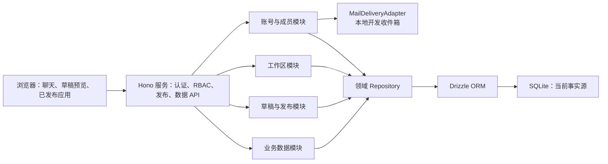

# 持久化、发布与账号平台方案

- 状态：已确认方案；GATE-00 已关闭（存储决策修订为 MySQL 8.4 + Docker Compose，见《GATE-00 决策补充》），实施中
- 范围：仓库根目录（`vite-multipage-agent`）
- 日期：2026-08-16

## 1. 目标与范围

将当前“浏览器和服务端内存中的多页面应用生成示例”升级为本地可持续使用的发布平台。用户刷新页面、关闭浏览器或重启本地 Hono 服务后，已保存的账号、应用、工作区、发布版本和业务数据必须恢复。

本期包含：邀请制账号、邮箱一次性验证码与魔法链接、角色授权、创建资格、草稿/发布/回滚、最近十个成功版本、工作数据恢复、受控业务数据 API、JSON 导出、乐观并发冲突、30 天回收站和本地开发邮件收件箱。

本期不包含：云部署选型与落地、匿名访问、公开链接、JSON 导入、实时协作、自定义角色、离线 PWA、自动重放中断生成。

## 2. 已确认架构决策

1. 保留 Hono、CopilotKit、Mastra、AG-UI 和 `@next-app-runtime/client`；不迁移到另一套 Agent 或 Web 框架。
2. 持久化数据库为 MySQL 8.4（本地开发经 Docker Compose 运行，精确锁定镜像 tag）；使用 Drizzle ORM 与 Drizzle Kit（稳定版精确锁定，见 GATE-00 决策补充）。
3. 服务端持久化边界使用领域 Repository 接口；上层业务模块不依赖特定数据库方言 SQL，引擎相关代码只允许存在于 Repository 实现与迁移执行器。
4. 平台表结构迁移由 Drizzle 管理；生成应用声明的业务数据 Schema 由平台版本对象管理，模型不能直接执行 DDL。
5. 破坏性业务 Schema 变更必须携带显式 `DataMigrationPlan`，并在副本校验全部既有记录成功后才可发布。
6. 账户仅能通过邀请启用；登录同时支持一次性验证码和魔法链接。
7. 邮件当前写入仅开发模式可访问的 SQLite 本地收件箱；未来只替换 `MailDeliveryAdapter` 实现，不改变邀请和认证契约。
8. 不在草稿阶段把新字段写入共享业务数据；发布并完成数据迁移后，新字段才成为可写字段。
9. 生成完成的候选 Spec 先进入 `GenerationRun.awaiting_preview`；只有浏览器 `runtime.applySource` 回传 `committed` 后才创建可发布的 `DraftVersion`。`failed`、`aborted` 和 `incomplete` 只保留有界诊断，不能发布。
10. 业务数据权限由平台以“应用成员 → 集合动作 → 记录范围 → 字段读写”四层强制执行；模型只能选择受控策略模板，不能生成鉴权代码、SQL 或自由策略表达式。
11. 业务 JSON 是事实源；查询与唯一性使用固定表结构的可重建投影，不按应用或字段动态创建数据库物理索引。
12. 平台固定应用成员角色是不可突破的能力上限：所有者可执行全部业务数据动作，编辑者最多 `read/create/update`，查看者最多 `read`；成员侧的 `delete/restore/export` 仅所有者可用。集合、记录和字段策略只能继续收紧，不能为角色扩权。管理员只能经独立平台治理端点删除/恢复，不能因此读取或导出业务数据。
13. 查询操作符按字段类型固定：字符串/枚举只允许 `eq`、`in`，数字/日期只允许 `eq`、`gt`、`gte`、`lt`、`lte`、`in`，布尔只允许 `eq`；首版不支持 `null` 查询或模糊匹配。
14. 唯一字符串以 Unicode NFC 规范化后进行大小写敏感精确比较；邮箱沿用账号邮箱规范化。规范化规则及其版本随业务 Schema 固定；唯一投影列使用 `utf8mb4_bin` collation 保证大小写敏感精确语义。

## 3. 总览与依赖方向



模块只能通过 Repository 与其他模块的公开服务交互；不能跨模块直接读写表。浏览器不持有数据库凭据，也不成为任何持久化事实源。

## 4. 事实所有权与实体

| 类别 | 实体 | 唯一事实 owner | 主要访问者 |
| --- | --- | --- | --- |
| 账号与访问 | `User`、`AuthChallenge`、`Session`、`CreatorGrant`、`Invitation`、`Membership` | 账号与成员模块 | 管理员或相关用户 |
| 应用与发布 | `App`、`DraftVersion`、`PublishedVersion`、`ReleasePointer`、`GenerationRun` | 草稿与发布模块 | 应用成员；发布仅所有者 |
| 工作数据 | `ChatThread`、`ChatMessage`、`QuestionSet`、`QuestionAnswer`、`AppPlan`、`GenerationLog` | 工作区模块 | 仅应用所有者 |
| 业务数据 | `AppDataSchemaVersion`、`DataAccessPolicyVersion`、`BusinessRecord`、`BusinessRecordRevision`、`BusinessIndexValue`、`BusinessUniqueValue`、`RecordPrincipal`、`DeletedItem` | 业务数据模块 | 由应用成员角色与已发布策略决定 |

### 4.1 账号与成员

- `User` 以规范化邮箱为唯一身份标识。
- `CreatorGrant` 是管理员授予的“可创建应用”资格；没有资格的已登录用户不能创建应用。
- `Invitation` 绑定应用、受邀邮箱、角色、创建者、到期时间、撤销时间和单次接受状态。
- 首次接受邀请或完成管理员预置邮箱的验证时建立 `User` 和 `Session`。
- 每次接受有效邀请都创建新的 `Membership` 身份；成员移除只停用该 Membership。以后重新加入会得到新的 Membership ID，不会自动恢复旧 Membership 绑定的记录关系。
- 初始管理员来自本地 `ADMIN_EMAILS` 环境变量；首次完成邮箱验证后取得管理员角色。不存在公开注册或自助申请管理员。
- `AuthChallenge` 只保存验证码或魔法链接令牌的安全摘要，必须单次消费；原始令牌不得进入普通日志、聊天记录或审计正文。

### 4.2 应用、草稿与发布

- 创建应用时，创建者自动成为唯一所有者；所有权转移完成前，管理员不得禁用该所有者。
- `GenerationRun` 在服务端 Catalog/Spec 校验后保存完整候选 Spec、候选业务 Schema 和有界生成诊断，状态转为 `awaiting_preview`；它不是可发布草稿。
- 浏览器对完整 Patch 调用 `runtime.applySource` 后，将 `committed`、`failed` 或 `aborted` 关联回 `GenerationRun`。只有匹配的 `committed` 才原子创建 `DraftVersion` 并把 run 转为 `succeeded`；`failed`/`aborted` 把 run 转为 `failed` 并保存有界诊断，不能成为草稿或发布版本。
- `DraftVersion` 保存一个已通过服务端校验和浏览器预览确认的完整候选 Spec、候选业务 Schema 及其来源 `GenerationRun`。
- `PublishedVersion` 是不可变成功版本，包含 Spec 与其关联的业务 Schema Version；`ReleasePointer` 指向当前已发布版本。
- 所有者显式“发布更新”才移动 `ReleasePointer`。生成成功、草稿预览成功都不自动发布。
- 每应用最多保留十个成功 `PublishedVersion`：当前发布版本始终保留，再保留最近九个其他成功版本；当前版本永不因剪枝被删除。
- 回滚到 Schema 与当前已发布 Schema 相同的版本时，只移动 `ReleasePointer`。Schema 不同时，只有已验证反向 `DataMigrationPlan` 的版本可回滚；回滚事务必须先在副本验证反向迁移，再原子更新数据与 `ReleasePointer`。没有反向迁移的版本显示为不可回滚。
- `GenerationRun` 记录 `running`、`awaiting_preview`、`succeeded`、`failed`、`incomplete`，并保存 `lastHeartbeatAt`。浏览器在生成及等待预览确认期间每 30 秒续约；最后心跳超过 90 秒、流连接中止、浏览器刷新，或服务启动时发现 `running`/`awaiting_preview` 状态，均原子改为 `incomplete`。迟到或重复的 apply 结果一律拒绝；中断 run 不能恢复或重放。

### 4.3 工作数据

- 聊天、问卷、答案、计划、草稿生成摘要和技术日志都按应用归属并持久化。
- 这些工作数据只对应用所有者可读；编辑者和查看者不能通过应用 API、预览 API 或数据库查询间接获得它们。
- 工作数据与业务记录使用不同 Repository、表和授权检查，禁止混存。

### 4.4 业务数据

- `AppDataSchemaVersion` 声明集合、字段、类型、必填性、枚举与校验规则；它是生成应用可使用的数据能力的唯一白名单。
- `DataAccessPolicyVersion` 与 `AppDataSchemaVersion` 一起随发布版本固定，声明集合动作、记录范围和字段读写策略。任何策略扩权在发布界面显示影响摘要，必须由所有者明确发布。
- `BusinessRecord` 使用应用 ID、集合名、记录 ID、`data`、`revision`、`createdByUserId`、`updatedByUserId`、`subjectMembershipId`、创建/更新时间关联；每次写入都由当前已发布 Schema 校验。`appId` 与审计主体只能由服务端赋值。用户 ID 用于审计，Membership ID 用于当前应用内的数据授权关系。
- `BusinessRecordRevision` 保存可审计的成功写入版本；它不是聊天或草稿的副本。
- `BusinessIndexValue` 是已声明可查询字段的可重建投影；`BusinessUniqueValue` 是已声明唯一字段的可重建投影。两者不是业务事实源。
- `RecordPrincipal` 保存被分配者等受控记录关系；首版不实现逐条 `RecordGrant`、组织层级或自由 ACL。
- 首版记录范围只允许 `shared`、`creator_only`、`subject_only`、`assignee`。编辑者和所有者可写、查看者只读只是 `shared` 集合的默认策略；其他范围必须同时满足记录权限。
- 固定应用成员角色能力上限先于版本化策略执行：所有者上限为全部动作，编辑者上限为 `read/create/update`，查看者上限为 `read`，成员侧的 `delete/restore/export` 仅所有者可用。策略只能从上限中移除能力，不能增加能力；管理员治理端点不进入该策略求值，也不授予业务数据读取或导出权。
- 所有请求必须按应用 ID、成员关系、集合动作、记录范围和字段权限隔离。无权访问记录返回不可见；无权写字段返回明确拒绝，不能静默丢弃。
- 发布前的草稿可以预览新 Schema，但不能以它写入共享记录。`DraftDataView` 只能在内存副本中应用已验证 `DataMigrationPlan` 后读取；它是只读视图，绝不写入 `BusinessRecord`。没有迁移计划或验证失败时，数据区域明确显示“数据待迁移，不能预览”，不伪造字段值。新字段在发布且迁移验证成功后才开放写入。
- 草稿策略不得扩大已发布数据的可见性；草稿预览的有效权限为“当前发布策略与候选策略的更严格交集”。

### 4.5 数据权限执行模型

每个数据请求先验证有效 `Session`、未删除 `App` 和有效 `Membership`，再按以下顺序执行：集合的 `read/create/update/delete/restore/export` 动作权限 → 记录范围 → 字段 read/write 权限。平台管理员不自动拥有任意应用的业务数据读取权。

| 记录范围 | 可读/可写主体（仍须通过集合动作与字段权限） |
| --- | --- |
| `shared` | 具备集合权限的应用成员 |
| `creator_only` | 创建者与所有者 |
| `subject_only` | `subjectMembershipId` 对应的当前有效成员与所有者 |
| `assignee` | 创建者、`RecordPrincipal` 中被分配者与所有者 |

字段策略使用固定应用角色集合，分别声明 `read` 和 `write` 角色。读取先做记录过滤，再剔除无权字段或按字段定义脱敏；写入逐字段拒绝无权字段。导出走与普通读取完全相同的集合、记录和字段授权链。

`createdByUserId`、`updatedByUserId` 永远由服务端写入。`subjectMembershipId` 和 `RecordPrincipal.principalMembershipId` 只能引用当前应用的有效 Membership：所有者可设置或变更任意有效成员；具备集合 create/update 权限且当前可访问该记录的编辑者也可设置有效成员；普通主体用户只能将 `subjectMembershipId` 绑定为自己的当前 Membership。每次关系变更都写审计事件。移除成员后旧关系保留为审计历史但立即失效；同一用户重新加入产生新的 Membership ID，旧关系不会自动重新激活，必须由所有者显式重新分配。

字段无 `read` 权限时默认完全省略。需要脱敏读取时，字段必须显式声明 `maskedRead` 的角色与平台固定模板；首版仅允许 `last4`、`email`、`phone`，不接受模型生成的自定义函数或正则。脱敏后的字段不能用于未授权角色的筛选、排序或导出原值。

## 5. 角色与访问矩阵

| 动作 | 管理员 | 所有者 | 编辑者 | 查看者 |
| --- | --- | --- | --- | --- |
| 授予创建资格 | 是 | 否 | 否 | 否 |
| 创建应用（须有资格） | 是 | 是 | 是 | 是 |
| 管理成员/邀请/撤销 | 否（除全局治理） | 是 | 否 | 否 |
| 转移所有权 | 否（除全局治理） | 是 | 否 | 否 |
| 查看/编辑工作数据 | 否（除审计治理） | 是 | 否 | 否 |
| 预览草稿 | 否 | 是 | 是 | 否 |
| 发布/回滚 | 否 | 是 | 否 | 否 |
| 读取已发布业务数据 | 否 | 是 | 是 | 是 |
| 写入业务数据 | 否 | 是 | 是 | 否 |
| 删除/恢复应用或业务记录 | 是 | 是 | 否 | 否 |

“管理员”是平台治理角色，不自动取得任意应用的工作区内容读取权；若未来需要平台审计读取，必须单独定义审计授权与可见性契约。

表中的业务数据动作是应用成员角色上限，不是默认授予。版本化集合、记录和字段策略可以收紧这些能力，但不得突破上限；尤其编辑者和查看者永远不能通过策略获得 `delete`、`restore` 或 `export`。管理员列中的删除/恢复仅指独立平台治理操作，不包含普通业务数据读取或导出。

## 6. 接口契约

### 6.1 认证与邀请

| 调用方 → 提供方 | 输入 | 成功输出 | 失败/安全语义 |
| --- | --- | --- | --- |
| 浏览器 → `POST /auth/start` | 邮箱、认证方式（`otp` 或 `magic_link`） | 始终返回通用接受结果 | 不泄漏邮箱是否存在、是否被邀请或是否有创建资格 |
| 浏览器 → `POST /auth/verify` | Challenge ID 与验证码，或魔法链接令牌 | 安全 Session | 过期、已消费、撤销或不匹配均失败关闭 |
| 所有者 → 邀请服务 | 应用、邮箱、固定角色、到期时间 | `Invitation` | 非所有者、已撤销或非法角色拒绝 |
| 管理员 → 创建资格服务 | 用户、授予/撤销动作 | `CreatorGrant` | 禁用所有者前无完成所有权转移则拒绝 |

`MailDeliveryAdapter` 输入是已渲染的事务邮件，不返回原始令牌。开发实现把邮件安全地写入本地收件箱；该实现只允许开发环境启动。

### 6.2 草稿与发布

| 调用方 → 提供方 | 输入 | 成功输出 | 失败语义 |
| --- | --- | --- | --- |
| `generate_spec` → 生成服务 | 已验证完整 Spec、候选 Schema、generation ID | `GenerationRun(awaiting_preview)` | Catalog/Schema 不合法时拒绝，保留上一个有效草稿/发布版本 |
| 浏览器 → 生成服务 | generation ID、`runtime.applySource` 结果 | committed 时创建 `DraftVersion` | generation 关联不匹配、rejected 或 cancelled 时记录失败且不可发布 |
| 所有者 → 发布服务 | Draft Version ID | Published Version ID、当前 release | 非所有者、验证失败、迁移未通过时拒绝 |
| 所有者 → 回滚服务 | 已保留 Published Version ID | 更新后的 release | 版本不属于应用、已超出保留范围，或 Schema 不同但没有已验证反向迁移时拒绝 |

浏览器在收到完整 Patch 后一次性调用 `runtime.applySource`；只有匹配的 committed 结果才产生草稿。半截 Patch、失败候选或迟到结果都不能成为持久化草稿或用户可见预览。

### 6.3 通用业务数据 API

```text
GET    /apps/:appId/data/:collection?cursor&limit
GET    /apps/:appId/data/:collection/:recordId
POST   /apps/:appId/data/:collection
PATCH  /apps/:appId/data/:collection/:recordId
DELETE /apps/:appId/data/:collection/:recordId
GET    /apps/:appId/data/:collection/export
POST   /apps/:appId/data/:collection/query
```

- `POST`/`PATCH` 先按当前已发布 `AppDataSchemaVersion` 校验数据。
- `PATCH`/`DELETE` 必须携带 `expectedRevision`。
- 版本不匹配返回 `409 conflict`，带当前 `record` 与 `revision`；前端必须提示用户刷新、放弃或基于最新版本重新提交，禁止静默覆盖。
- 保存失败时前端保留最后一次成功数据并显示明确失败状态。
- 导出只输出调用者有权读取的当前非删除记录；首期只支持 JSON 导出。
- 草稿、发布指针、成员关系、邀请、创建资格和所有权转移等一切可变聚合也必须携带 `expectedRevision`；冲突统一返回 `409 conflict` 与最新安全摘要。单次消费的认证挑战使用原子“未消费才消费”条件更新。

默认列表按 `createdAt desc, recordId asc` 稳定排序。复杂列表查询使用 `POST .../query` 的受控结构化输入，而非自由 SQL、JSONPath 或过滤 DSL：仅已发布 Schema 标记为 `queryable` 的字段可筛选，首版最多五个 `all`（AND）条件；同字段多值使用 `in`。字符串/枚举只允许 `eq`、`in`，数字/日期只允许 `eq`、`gt`、`gte`、`lt`、`lte`、`in`，布尔只允许 `eq`；首版不接受 `null` 条件、模糊匹配、自由 OR 或隐式类型转换。仅一个 `sortable` 字段或系统 `createdAt`/`updatedAt` 可排序，并始终以 `recordId` 作为稳定次级排序。请求使用包含应用、集合、排序与最后位置且带完整性校验的 opaque cursor，默认 20、最大 100 条，返回 `{ items, nextCursor }`，首版不返回 total。非法字段、操作符、类型、游标或越权字段返回 `400`；应用、记录和字段授权始终在查询前/后强制执行。

## 7. 业务 Schema 迁移与发布门禁

`DataMigrationPlan` 是受控结构化对象，至少包含来源 Schema Version、目标 Schema Version、字段映射/默认值/转换规则和验证结果。

| 变更 | 是否可直接发布 |
| --- | --- |
| 纯界面或布局变化 | 是 |
| 新增可选字段 | 是 |
| 扩展枚举 | 是 |
| 新增必填字段 | 否，需要迁移验证 |
| 字段重命名或类型变化 | 否，需要迁移验证 |
| 删除字段 | 否，需要迁移验证 |
| 收紧校验或缩减枚举 | 否，需要迁移验证 |

迁移必须先在副本上验证所有既有记录。任一转换失败则发布整体失败，当前发布版本和业务数据均保持不变。首次不允许绕过验证、部分发布或静默丢弃字段。

反向 `DataMigrationPlan` 不是正向迁移的自动推导结果。需要支持回滚的破坏性版本必须在发布前一并提交、验证并保存反向计划；否则该版本可以发布，但不能在 Schema 层面回滚。

## 8. 回收站与生命周期

- 应用删除、业务记录删除及其相关业务数据都进入 `DeletedItem` 回收站，保留 30 天。`App.deletedAt` 是所有应用路由、草稿、发布与业务 API 的授权前置条件：已删除应用一律返回不可访问，不能继续读取或写入。
- 仅所有者或管理员可删除、恢复或执行到期后的永久删除。
- 恢复通过平台级回收站端点完成，而不是已删除应用的路由；该端点在删除门禁之前，以 `DeletedItem` 中冻结的所有者关系或管理员身份授权，且只允许恢复操作。
- 删除应用时，应用、当前发布指针、草稿、成员关系与业务数据可见性一起冻结；恢复时在一个事务内恢复这些对象，恢复失败则整个恢复失败并维持删除状态。
- 归档只改变展示/使用状态；归档对象仍为正常持久数据，不进入回收站。
- 成功版本、聊天和技术日志不会因普通业务记录删除而被级联抹除。

## 9. MySQL 与 Drizzle 边界

```text
领域服务
  -> Repository 接口（Auth / App / Workspace / Release / BusinessData）
  -> Drizzle MySQL Repository（mysql2 驱动，稳定版）
  -> MySQL 8.4（本地开发经 Docker Compose，命名卷持久化）
```

- 使用稳定版 `mysql2` 驱动与 Drizzle ORM / Drizzle Kit（精确锁定版本，见 GATE-00 决策补充）；本地 MySQL 由 `docker-compose.yml` 提供，Docker 不可用时服务 fail-closed 拒绝启动，不降级为内存模式。
- 所有写入必须通过事务；带 revision 的更新使用条件写入（`WHERE revision = ?`，以 affectedRows 判定），确保多标签页不会静默覆盖。
- Drizzle Kit 管理平台表 SQL 迁移（mysql 方言，显式迁移文件，可审计）。业务 Schema 版本和数据迁移计划始终属于业务领域数据，不能由 Drizzle 自动推断或执行。
- 数据库文件与凭据不进入版本库；本地凭据为开发专用弱凭据并在 `.env.example` 明确标注；本期不做自动备份，备份与线上恢复属后续部署设计范围。
- `BusinessRecord` 具有固定平台索引：`(appId, collection, recordId)` 唯一、活动记录列表及 revision 条件更新。`BusinessIndexValue` 按文本、数值、日期、布尔值提供固定的 `(appId, collection, fieldKey, value, recordId)` 索引；`RecordPrincipal` 按 `(appId, principalMembershipId, recordId)` 索引。物理索引数量不随应用或字段数增长。
- 多字段 AND 查询通过单字段 `BusinessIndexValue` 命中的 `recordId` 求交集；不默认创建复合物理索引。高频复合查询投影、全文检索和任意嵌套 OR 不属于首版。
- `BusinessIndexValue` 可以由业务 JSON 重建；`BusinessUniqueValue` 虽然也是派生结构，但每次创建、修改、删除和恢复都必须与 `BusinessRecord` 在同一事务内更新，并由固定 `(appId, collection, fieldKey, normalizationVersion, normalizedValue)` 唯一约束阻止重复值。普通字符串执行 Unicode NFC 后进行大小写敏感精确比较；邮箱字段使用账号邮箱规范化；不提供通用大小写不敏感唯一性。规范化规则及版本随 Schema 保存；`normalizedValue` 列必须使用 `utf8mb4_bin` collation，确保唯一约束按大小写敏感精确语义执行（MySQL 默认 collation 大小写不敏感，禁止使用）。事务失败时主记录和投影都保持旧值。

## 10. 安全与运行约束

- 所有发布应用强制登录；API 在服务端验证 Session、应用成员关系和角色，不信任前端路由或 UI 隐藏。
- 邮箱令牌只存摘要并单次消费；日志、AG-UI 事件与错误消息不得包含原始令牌、验证码、完整 Spec 或完整业务记录。
- 草稿预览、已发布应用、工作区与通用业务数据 API 均使用独立授权中间件。
- 未登录返回 `401`；非成员或对无权记录的读取统一返回不可见；已知成员但无集合动作或字段写权限返回 `403`。分页、排序和导出不得绕过行级或字段级过滤。
- 审计创建、修改、删除、恢复、导出、成员/策略变更和所有权转移；仅记录 actor、动作、记录标识、字段键和结果，绝不记录敏感字段原文、完整业务记录或令牌。
- 本地开发邮件收件箱不得在非开发模式启动。
- 回收站永久清理由服务启动扫描和所有者/管理员显式清理端点触发；两者只处理已超过 30 天保留期的对象，使用有界批次和幂等事务。普通请求不能隐式永久删除数据。
- 资源上限已在 GATE-00 固定并经项目所有者确认（错误契约与测试方法见《GATE-00 决策补充》）：单条业务记录 ≤ 65,536 字节；每集合 ≤ 10,000 条；每 Schema queryable 字段 ≤ 16、unique 字段 ≤ 8；每记录 principal ≤ 8；JSON 导出 500 条/批、≤ 10,000 条；Schema 迁移 500 条/批验证、应用级全量 ≤ 50,000 条。超过上限一律在部分写入前失败关闭。
- 当前不定义云部署、区域、网络、对象存储、真实邮件服务、备份周期或线上恢复指标；这些均为后续部署设计范围。

## 11. 架构验收标准

1. 重启本地服务和刷新浏览器后，账号、会话、成员、应用、发布版本、工作数据和业务数据可恢复。
2. 未登录用户不能访问任何已发布应用、草稿或数据 API；成员角色满足第 5 节矩阵。
3. 草稿或成功生成不会自动改变 `ReleasePointer`；所有者发布后才更新已发布体验。
4. 每应用至多保留十个成功发布版本；当前发布版本永不因剪枝丢失，回滚后保留完整版本可渲染且不改变历史内容。
5. 破坏性 Schema 变更没有通过 `DataMigrationPlan` 全量验证时，发布失败且旧版本/旧数据不变。
6. 冲突写入返回 `409` 与当前 revision；任何成功写入不会无声覆盖其他标签页的版本。
7. 删除对象在 30 天内可由授权角色恢复；已删除应用的所有路由和 API 都不可访问，恢复时发布指针、草稿、成员关系与业务数据可见性原子恢复；归档不会触发删除语义。
8. 中断生成在连接中止、服务重启或 90 秒未续约后保存为 `incomplete`，不恢复、不重放，也不覆盖最后有效草稿或发布版本。
9. Schema 不兼容版本没有通过反向迁移验证时不可回滚；通过验证的回滚同时原子恢复数据与发布指针。
10. 本地邮件收件箱可测试邀请、OTP 和魔法链接的完整流程；非开发模式拒绝使用该投递实现。
11. 只有 `GenerationRun.awaiting_preview` 收到匹配的浏览器 `committed` 结果后才产生可发布草稿；浏览器拒绝或中止不覆盖最后有效草稿/发布版本。
12. 非成员不能通过 API、分页游标、导出或伪造 `appId` 获知应用数据；`shared`、`creator_only`、`subject_only`、`assignee` 均有服务端授权测试。
13. 无权字段不出现在读取或导出结果，无权写字段被拒绝；每应用新增字段不会新增数据库物理索引定义，多字段 AND 查询仍只使用固定查询投影。
14. `running` 或 `awaiting_preview` 在浏览器刷新、连接中止、服务重启或 90 秒无心跳后转为 `incomplete`；迟到 apply 结果不能创建草稿。
15. `subjectMembershipId`、assignee 和字段脱敏只能按受控规则修改；成员移除后重新加入不会自动恢复旧记录关系；唯一值投影与主记录事务一致；30 天到期清理只由启动扫描或显式清理端点执行。
16. GATE-00 固定的记录、索引字段、principal、导出和迁移资源上限均由服务端执行；超限请求在任何部分写入前按固定错误契约拒绝，并有边界测试。

## 12. 实施前的边界

本文档确定架构和可观察契约，不授权直接实施。实施前应拆分为认证与成员、持久化/迁移、草稿/发布、业务数据与回收站五个可独立验证的工作包，并为每个包定义迁移、测试和回滚边界。
