# vite-multipage-agent 完整设计系统与 Catalog 扩展方案

- 状态：已确认方案；基于 2026-08-17 当前代码的第四轮设计审核修订完成，独立增量，尚未制定实施计划
- 范围：`examples/vite-multipage-agent/` 及其使用的 `@next-app-runtime/client` Catalog/运行时边界
- 日期：2026-08-17
- 依赖方案：《持久化、发布与账号平台方案》
- 与既有实施关系：本文不修改、替代或阻塞正在实施的持久化与发布计划；应在既有计划完成或接口稳定后作为独立增量实施

## 1. 背景、目标与范围

当前示例的模型 Catalog 由 `@json-render/shadcn 0.19.0` 提供 36 个定义，移除运行时接管的 `Link` 后，模型可使用 35 个 shadcn 基础组件；`Slot` 与 `Link` 由 `@next-app-runtime/client` 内置。服务端模型 Catalog 与浏览器 Registry 各自装配自同一份 shadcn definitions/components，但目前 `actions` 为空。

这套能力足以生成演示页面、简单表单和静态门户，却不足以稳定生成具有应用骨架、数据列表、完整表单、状态反馈、业务数据读写和个性化视觉的完整应用。另一方面，只增加组件而没有设计 Token、应用 CSS、资源、隔离运行时和发布门禁，会让视觉生成不可控，也无法形成可版本化的设计系统。

本文目标是定义一个完整、受控、可版本化的应用 UI Bundle：

1. 用户只通过聊天描述、创建和修改应用视觉，不提供独立的主题设置编辑器。
2. AI 可以为每个应用生成独立 Token、布局、应用级 CSS 和受控资源，形成个性化视觉，而不是固定主题换色。
3. 以 json-render/shadcn 为基础组件层，扩展足以覆盖 CRUD 后台、客户门户和专业工作台的 P0 Catalog。
4. 通过受控 Action 把生成 UI 接入既有业务数据 API、导航、弹层、反馈和表单提交能力。
5. UI Bundle 经服务端校验后在隔离 iframe 中原子预览；流式生成过程不逐块改写用户可见预览。
6. 草稿、发布和回滚引用不可变 UI Bundle；生成成功不自动发布。

本方案规模为“子系统”。它包含设计系统模型、Catalog、Action Runtime、资源管线、验证 Gate、隔离 Preview 与发布集成，不重新设计账号、成员、业务数据事实表或发布工作流。

## 2. 已确认产品边界

### 2.1 本期包含

- 每应用独立的三层设计 Token、应用 CSS、布局和资源。
- 以聊天为唯一视觉编辑入口。
- 可选上传 PNG、JPEG、WebP、SVG、WOFF2、PDF 品牌指南和截图。
- P0 完整应用组件及现有组件升级。
- 受控业务 Actions。
- 服务器与浏览器共用的单一 CatalogContract。
- CSS、SVG、资源、可访问性和 iframe/CSP Gate。
- 完整 ApplicationCandidate 的原子生成与验证，以及 AppUiBundle + BusinessSchema（内嵌数据权限）/迁移聚合的草稿、预览、发布和回滚。
- 生成应用最终用户使用的业务附件；其实体、API、权限和生命周期与设计资源严格分离。

### 2.2 本期不包含

- Figma 导入或同步。
- 抓取参考网站，或在应用运行时访问任意外部 URL。
- 用户直接编辑 Token JSON、CSS 或组件 Schema。
- AI 生成或执行任意 React、JavaScript、SQL、鉴权代码及自由策略表达式。
- 插件式第三方组件、任意 npm 包和远程脚本。
- P1 专业组件的首期实现。
- 替换正在实施的持久化、账号、成员、业务数据与发布领域模型；只允许本文明确声明的 AppUiBundle/ValidationReport 加列与 BusinessAttachment/asset 字段增量。
- 在 Catalog 1.x 阶段同时运行多个 Renderer major；多版本 Renderer 仅在未来引入破坏性 Catalog 2.x 时实施。

## 3. 方案比较与选择

| 方案 | 优势 | 代价与风险 | 结论 |
| --- | --- | --- | --- |
| 固定主题 + 现有 35 组件 | 实现最少、校验简单 | 视觉高度同质化；无法稳定覆盖完整应用 | 不采用 |
| 允许 AI 生成任意 HTML/CSS/JS | 表达力最高 | 无法保证安全、权限、迁移和重现；破坏 Catalog 边界 | 不采用 |
| 受控组件/Action + 每应用 Token/CSS/资源 | 保留较强视觉自由度；组件与业务行为可校验；可原子发布 | 需要 CatalogContract、CSS/资源 Gate 和 iframe 隔离 | 采用 |

选择第三种方案。平台控制组件实现、安全、数据权限和运行时；应用控制自己 Bundle 内的 Token、CSS、布局、内容和资源。未来只有当真实生成任务持续被某项受控能力阻塞时，才扩展 Catalog 或 Gate，不开放任意代码逃逸口。

## 4. 架构总览

```mermaid
flowchart LR
  User["用户聊天与可选品牌资料"] --> Chat["Mastra 聊天 Agent"]
  Chat --> Generate["generate_spec 内部生成器"]
  Catalog["CatalogContract\n组件 + built-in/custom Action + Prompt"] --> Generate
  Generate --> Candidate["ApplicationCandidate\nAppUiBundle + BusinessSchema + Migration"]
  Candidate --> StaticValidator["服务端静态 Validator\nUI G0 + BusinessSchema/Migration"]
  StaticValidator --> ValidationRunner["独立 Worker 子进程\nPlaywright G1/G2；全局并发 1"]
  ValidationRunner --> Staging["用户浏览器隐藏 Staging iframe\nruntime apply + digest smoke"]
  Staging --> Commit["幂等 Preview Commit API\n创建不可变 DraftVersion"]
  Commit --> Selection["Membership PreviewSelection\n当前草稿/发布版本"]
  Selection --> Host["宿主 BundleApplyController\n确认持久化后交换可见 iframe"]
  Host --> Frame["可见的独立 Origin iframe\nNextAppRenderer"]
  Commit --> Draft["不可变 Draft Bundle\n含 publishBlocked/issues"]
  Frame --> BridgeAdapter["iframe Action Adapter"]
  BridgeAdapter --> Bridge["Typed postMessage Bridge"]
  Bridge --> ActionRuntime["受控 Action Runtime"]
  ActionRuntime --> DataAPI["既有 Hono 业务数据/资源 API"]
  Draft --> Release["既有发布/回滚服务"]
  Release --> Published["不可变 Published Bundle"]
```



依赖方向固定如下：

1. CatalogContract 是组件、children/compound 关系、Event、自定义 Action 参数、内置 Action 的模型约束与模型提示的唯一权威来源；运行时仍是内置 Action 的执行 owner。
2. 服务端模型 Catalog、运行时校验 Schema、浏览器 Catalog、Registry 的期望键集合和 Catalog 测试均由 CatalogContract 派生；React Renderer 实现由 browser-only RendererBindings 提供，并以精确键闭合门禁防止漂移。
3. AppUiBundle 引用 Catalog 版本；Catalog 不依赖单个应用 Bundle。
4. 组件只能触发声明式 Action；组件实现不能直接访问 Hono、数据库或宿主内部状态。
5. Action Runtime 通过既有认证与授权 API 访问业务数据；浏览器输入中的 `appId`、用户身份和权限不作为可信事实。
6. iframe 只渲染和发出意图；iframe 内 Action Adapter 把 json-render Action 转换为 Bridge 请求，宿主拥有会话、授权、版本切换和持久化职责。
7. 服务端静态 Validator 只负责无需浏览器即可确定的 B0/G0；计算样式、对比度和交互状态由独立 worker 子进程中的 Playwright Validation Runner 在真实浏览器中检查。用户浏览器 staging 只验证当前客户端能否加载和 apply，不是发布质量事实 owner。

## 5. AppUiBundle 与设计系统

### 5.1 Bundle 契约

不向严格的 `NextAppSpec 0.19.0` 顶层增加私有字段，而是在其外层建立版本化包装：

```ts
type AppUiBundle = {
  bundleVersion: 1;
  catalogVersion: `1.${number}.${number}`;
  specCompatibility: "0.19.0";
  spec: NextAppSpec;
  designSystem: AppDesignSystem;
  assets: AssetManifest;
};

type ApplicationCandidate = {
  uiBundle: AppUiBundle;
  businessSchema: BusinessSchema | null;
  migrationPlan?: DataMigrationPlan;
  reverseMigrationPlan?: DataMigrationPlan;
};

type CanonicalColor = `#${string}`; // Zod additionally enforces #RRGGBB or #RRGGBBAA
type TokenRef = { $token: string };
type PrimitiveToken =
  | { type: "color"; value: CanonicalColor }
  | { type: "length"; value: number; unit: "px" | "rem" | "em" | "%" | "vw" | "vh" }
  | { type: "number"; value: number }
  | { type: "fontFamily"; value: { system: "system-ui" | "sans-serif" | "serif" | "monospace" } | { assetId: string } }
  | { type: "fontWeight"; value: 400 | 500 | 600 | 700 }
  | { type: "shadow"; value: Array<{ x: number; y: number; blur: number; spread: number; color: CanonicalColor }> }
  | { type: "duration"; valueMs: number }
  | { type: "easing"; value: [number, number, number, number] };

type AppDesignSystem = {
  tokens: {
    primitive: Record<string, PrimitiveToken>;
    semantic: Record<string, TokenRef>;
    component: Record<string, Record<string, TokenRef | PrimitiveToken>>;
  };
  applicationCss: string;
};

type AssetManifest = {
  entries: Array<{
    assetId: string;
    kind: "image" | "svg" | "font";
    contentHash: `sha256:${string}`;
    mimeType: "image/png" | "image/jpeg" | "image/webp" | "image/svg+xml" | "font/woff2";
    byteLength: number;
    width?: number;
    height?: number;
    font?: { family: string; weight: 400 | 500 | 600 | 700 };
  }>;
};
```

`AppUiBundle` 是应用 UI 的唯一事实。`ApplicationCandidate` 只是 GenerationRun 拥有的协调包，不成为新的持久业务事实：提交 DraftVersion 时分别保存不可变 AppUiBundle，并按既有发布模型保存/引用 BusinessSchema 与迁移计划。第一阶段的数据权限继续内嵌在 BusinessSchema 的 collection `actions`、`recordScope` 和 field `read/write/maskedRead` 中；不新增独立 `DataAccessPolicyCandidate` 或第二份策略事实。现有 nullable `dataAccessPolicyVersionId` 仅保留为未来显式迁移的预留列，本增量不写入、不解释它。编译后的 CSS、Token 展平结果、预加载资源表和渲染快照都是可重建派生物，不是第二事实源。`AssetManifest` 只保存不可变资源描述与内容哈希，二进制 Blob 的事实 owner 是 Asset Pipeline。

运行时 Zod Schema 必须把 `catalogVersion` 校验为无前导零的 `1.<minor>.<patch>` 非负整数语义版本，并把 `contentHash` 校验为 `sha256:` 加 64 位小写十六进制；TypeScript 模板字符串类型只用于开发期提示，不作为安全校验。

既有发布领域继续拥有 `DraftVersion`、`PublishedVersion` 和 `ReleasePointer`。这些实体由原先保存/引用 Spec，扩展为保存/引用不可变 `AppUiBundle`；BusinessSchema 及其内嵌权限仍由既有发布聚合管理，不塞入 UI Bundle。

### 5.2 三层 Token

| 层 | 作用 | 示例 |
| --- | --- | --- |
| Primitive | 原始色彩、字号、间距、圆角、阴影、动效值 | `color.blue.600`、`space.4`、`radius.lg` |
| Semantic | 业务语义，不绑定具体组件 | `surface.default`、`text.muted`、`action.primary` |
| Component | 组件级覆盖，引用语义 Token 或受控值 | `button.primary.background`、`table.header.border` |

引用方向只能是 Component → Semantic → Primitive，禁止反向引用、循环引用和悬空引用。Token 名使用受控小写点分路径；颜色、长度、字体、阴影和动效均按判别类型校验并由 CSS serializer 编码，禁止把原始字符串直接拼入 CSS。平台提供满足 shadcn 基础样式和可访问性的默认 Token；AI 只覆盖需要个性化的部分，未覆盖项继承默认值。

### 5.3 应用 CSS

- `applicationCss` 可以定义应用内的全局排版、背景、组件组合布局、响应式规则和动画。
- CSS 只注入独立 iframe；其中的 `:root`、`html`、`body` 也只代表该 iframe 文档，不能影响宿主聊天页。
- CSS 可以引用当前 Bundle 的 Token CSS 变量，并以 `url("asset:<assetId>")` 引用 Manifest 中的资源；编译器只验证引用闭合，不把交付 URL 写回 Bundle。每次渲染由宿主在完成 Session/App/Bundle 授权后签发短时、当前 sessionNonce 与 Bundle 绑定的 Asset Capability Manifest，再把引用重写为预览 hostname 上的派生 URL。其他 `url()` 一律拒绝。
- 平台基础组件 CSS 与应用 CSS 分层加载；应用 CSS 可以通过稳定的公开类名、`data-component` 和 `data-variant` 定制，不依赖 Radix/shadcn 私有 DOM 层级。
- Catalog 组件必须声明允许定制的稳定选择器表面，组件升级不得无版本地破坏该表面。

### 5.4 品牌资料

品牌资料是可选生成输入，不是运行时依赖：

- 图片、字体和消毒后的 SVG 可以进入 AssetManifest。
- PDF 品牌指南和参考截图仅供生成器提取颜色、排版、语气与构图提示，不随发布 Bundle 下发。
- 原始上传物与发布资产分开保存；发布应用只读取经过验证和转换的内容哈希资产。
- 第一版不支持 Figma，也不抓取参考网站。

设计资源生命周期：Asset Pipeline 保存按内容哈希去重的 Blob；DraftVersion/PublishedVersion 通过 AssetManifest 引用。版本仍在保留或回收站期间，引用的 Blob 不得删除；只有不存在任何保留版本引用时，Blob 才能进入有界垃圾回收。引用计数/可达性索引是可重建投影，不是 Blob 或 Bundle 的第二事实源。

### 5.5 UI 初始状态与运行时数据

Bundle 中的 `spec.state` 只允许一个顶层 `ui` 命名空间，用于菜单折叠、Tab 默认值和对话框开关等非用户、非业务初始状态。它不得包含业务记录、成员数据、附件下载凭据、Session、查询结果、表单默认业务值或用户填入的表单内容。

iframe 渲染时创建组合状态：

```ts
type RenderState = {
  ui: Record<string, JsonValue>;       // 来源于 Bundle，可被当前会话修改但不回写 Bundle
  runtime: {
    forms: Record<string, JsonValue>;
    queries: Record<string, JsonValue>;
    actions: Record<string, JsonValue>;
  };                                  // 初始为空，只存在于当前授权会话
};
```

- `setState`、`pushState`、`removeState` 对普通组件只允许写 `/ui/**`；Form 及其字段只能通过组件作用域 binding 写 `/runtime/forms/<formId>/**`，不能把任意 statePath 作为 Props 透传。
- `queryRecords` 结果只能写 `/runtime/queries/**`；Action loading/error/result 只能写 `/runtime/actions/**`。所有目标路径由 Catalog Action Schema 按用途校验，不接受跨命名空间路径。
- Form 的静态 `defaultValues` 只能引用 Business Schema 已声明的字段默认值；无 Schema 默认值时按类型使用空字符串、null、false 或空数组。G0 校验它与 Schema 默认值完全一致，禁止模型写任意样例或个人数据。Renderer 在挂载时把它复制到 `/runtime/forms/<formId>/**`，此后不回写 Bundle。
- DraftVersion 必须使用服务端已验证的 ApplicationCandidate 创建；其中 UI 部分取 candidate.uiBundle，BusinessSchema（含内嵌权限）与迁移按既有发布聚合分别保存，不能序列化 iframe 当前 StateStore。
- 切换用户、应用、Bundle 或刷新 iframe 时清空 `/runtime`，并重新经授权 API 获取业务数据。

Catalog 1.x 的 legacy adapter 对既有纯 NextAppSpec 保留原始 state 路径和 built-in state 行为，确保旧 Spec 不经修改仍可运行；legacy Bundle 不得绑定新的业务 Action。第一次由 AI 编辑 legacy Spec 时，生成器必须在同一个 Candidate 中把其 state 与所有引用迁移到 `/ui/**`，迁移不闭合则 G0 拒绝并保留旧版本。

### 5.6 BusinessAttachment（与 DesignAsset 分离）

生成应用最终用户上传的文件属于业务数据域，不进入 AppUiBundle/AssetManifest。业务 Schema 在现有字段类型之外增加：

```ts
type BusinessAssetField = {
  key: string;
  type: "asset" | "assets";
  required?: boolean;
  allowedMimeTypes: Array<"application/pdf" | "image/png" | "image/jpeg" | "image/webp">;
  maxFiles: number; // asset 固定为 1；assets 不超过 10
};

type AttachmentRef = { attachmentId: string };
type BusinessAssetValue = AttachmentRef | null;
type BusinessAssetsValue = AttachmentRef[];
```

`BusinessAttachment` 至少拥有 appId、attachmentId、ownerMembershipId、recordId/fieldKey（绑定后）、原始文件名、MIME、字节数、内容哈希、状态与回收站时间。业务记录只保存 AttachmentRef，不保存公开 URL、文件正文或存储路径。

`asset` 字段值固定为 `AttachmentRef | null`，`assets` 固定为有序且 attachmentId 不重复的 `AttachmentRef[]`。`required: true` 时，`asset` 不得为 null，`assets` 至少一项；`maxFiles` 对 asset 必须为 1，对 assets 为 1–10。新增可选 asset/assets 字段可直接发布；新增必填字段、asset 与 assets 互转、删除字段或收紧 MIME/maxFiles 都属于破坏性 Schema 变更，必须提供并验证正向 DataMigrationPlan；需要回滚时还必须有独立反向计划。

- 单文件最大 20 MiB；单个记录所有附件合计最大 100 MiB；拒绝 SVG、HTML、脚本、压缩包和可执行文件。
- 上传只产生仅当前 Membership 可见的 pending attachment；`uploadAttachment` 不接受 recordId，也不直接修改记录。成功 `createRecord`/`updateRecord` 时，服务端在同一 MySQL 事务内校验 AttachmentRef、expectedRevision、字段权限与配额，再把 pending attachment 与记录/字段原子绑定。
- 表单显式取消时立即删除 pending；浏览器丢失产生的未绑定 pending 在 24 小时后由有界任务清理。
- 已绑定附件只能由能够读取对应记录与字段的成员下载；下载 URL 短时签发且不可写入业务记录。
- 创建 pending attachment 需要对目标集合/字段具有 create 或 update 与字段 write 权限；查看者不能上传。移除附件引用属于记录更新，仍需 expectedRevision；成员不能通过独立附件端点绕过记录权限删除 Blob。
- 记录进入 30 天回收站时附件随记录保持可恢复；记录永久删除且无其他引用后才删除 Blob。
- JSON 导出只包含有权字段中的 AttachmentRef 与脱敏元数据，不内嵌文件二进制，也不签发批量永久下载地址。
- `DesignAsset` 与 `BusinessAttachment` 使用不同实体、API、权限判断、配额和回收流程，即使底层 Blob 存储复用内容哈希设施也不能互相引用。

浏览器 `File`/二进制不得进入 NextAppSpec、JSON State、聊天消息或模型参数。`FileUpload` Renderer 把用户选择保存在 iframe 内的临时 `AttachmentTransferRegistry`，只将不可猜测、单次使用、绑定当前 sessionNonce 的 `uploadHandle` 写入 `/runtime/**`。`uploadAttachment` 消费该 handle，并通过 Bridge 的可转移二进制消息交给宿主；成功、失败、取消或 iframe 卸载后立即销毁 handle。

BusinessAttachment Blob 使用可替换的 `BlobStore` 接口，首个本地实现保存到受管内容哈希目录，不把文件正文写入 MySQL。状态机固定为 `uploading → pending → bound → trashed`：先写临时 Blob、做 MIME/魔数/大小/哈希校验并以幂等内容哈希提升，再事务性创建 pending 元数据；数据库失败留下的无引用 Blob 由有界 reconciliation 清理。只有 Blob 已存在时才能提交元数据，因此不得出现引用不存在 Blob 的成功行。进程启动扫描与周期任务对 uploading/pending/Blob 可达性做有界、幂等对账；任何不一致 fail closed，不能把损坏附件返回给应用。

## 6. CatalogContract

### 6.1 单一权威来源

新增仓库自有 CatalogContract 模块，统一声明：

- 组件名、说明、Props Zod Schema、children/compound 关系、Event 和示例。
- `builtInActions`：运行时保留的 `navigate`、`setState`、`pushState`、`removeState`，只声明可生成的参数约束、说明和 Prompt 元数据，不生成自定义 handler。
- `customActions`：平台新增业务 Action 的参数 Zod Schema、Bridge 结果 Schema、错误码和权限类别，并生成 Catalog action 与 handler 期望键。
- 稳定样式选择器与 Token 映射。
- Catalog 版本和兼容性信息。

```ts
type ComponentContract = {
  props: ZodType;
  children: "none" | "any" | {
    allowed: string[];
    required?: string[];
    unique?: string[];
  };
  events: string[];
  publicStyleParts: string[];
  tokenBindings: Record<string, string>;
  description: string;
  example?: JsonValue;
};

type ActionContract = {
  params: ZodType;
  bridgeResult: ZodType;
  permissionClass: "ui" | "record-read" | "record-write" | "attachment" | "export";
  description: string;
};

type CatalogContract = {
  components: Record<string, ComponentContract>;
  builtInActions: Record<"navigate" | "setState" | "pushState" | "removeState", BuiltInActionPromptContract>;
  customActions: Record<string, ActionContract>;
};

type RendererBindings<C extends CatalogContract> = {
  [K in keyof C["components"]]: ComponentRenderer<K>;
};
```

json-render 原生 Catalog 使用 `slots` 表示“接受 children”，但 NextAppSpec 不携带 named-slot 映射。派生器把 `children !== "none"` 映射为原生 `slots:["default"]`，并把 allowed/required/unique compound 规则交给独立结构 Gate；不得把 Catalog 元数据误当成运行时 named slots。

从该契约确定性派生：

1. 服务端 `modelCatalog`、Spec 组件/Action prompt fragment 和 Bundle Prompt；`builtInActions` 只进入 Prompt/静态约束，`customActions` 才进入 `catalog.data.actions`。
2. 浏览器 json-render Catalog、React Registry 的期望键类型与运行时键集合。
3. catalog-aware NextAppSpec Zod/JSON Schema。
4. 组件夹具、Catalog 展示页和契约测试。
5. Prompt 中面向模型的精简用法说明。

React Renderer 函数本身不是纯数据，不能由 Zod 元数据生成，也不能进入服务端 CatalogContract。browser-only `RendererBindings` 显式提供实现；`defineRegistry` 只能接收该绑定。TypeScript `satisfies` 与运行时门禁必须同时断言 bindings、Catalog components 和最终 registry 的键完全相等，缺失、多余或版本不匹配均拒绝构建/启动。自定义 Action 同样必须断言 `customActions`、Catalog actions 与 handler 键完全相等；四个 `builtInActions` 禁止注册到 handler map，否则运行时按保留键冲突拒绝。这样保持 CatalogContract 是能力契约唯一事实，同时承认 Renderer 与内置 Action 执行有独立代码 owner。

完整 catalog-aware JSON Schema 仍只用于程序校验，不进入模型上下文。原生 `catalog.prompt()` 仍以 NextAppSpec 为根，并包含“在 state 中加入 realistic sample data”等旧规则，不能直接作为 AppUiBundle 生成器的完整 Prompt。CatalogContract 应复用其组件/Action格式化能力生成受测试的 prompt fragment；新的 Bundle Prompt 负责 AppUiBundle 根路径、typed Token、AssetManifest、`/ui` 初始状态和结构化 Patch 规则，并明确禁止把业务样例记录写入 Bundle state。不得继续通过无版本字符串 replace 拼接相互矛盾的 Prompt。

### 6.2 当前基线

当前精确基线：

- `@json-render/core`、`@json-render/react`、`@json-render/shadcn`：`0.19.0`。
- shadcn 导出 36 个组件，其中 `Link` 由运行时接管，模型 Catalog 为 35 个组件。
- 运行时额外内置 `Link` 和 `Slot`。
- Catalog 自定义 Actions 当前为空；运行时已有 `navigate`、`setState`、`pushState`、`removeState` 四个内置 Action。

P0 扩展只能在该基线上增量加入，不重命名或删除既有组件和内置 Action。第一阶段固定 Catalog major `1.x`：

- 只允许新增组件、Action、可选 Props，或继续接受旧输入并在 Prompt 中推荐新输入。
- 不允许删除、重命名或改变已有组件、Event、Action 和公开样式表面的既有语义。
- DraftVersion/PublishedVersion 保存精确 `catalogVersion`，当前 v1 Renderer 必须通过全部已发布 v1 契约与视觉兼容夹具。
- 第一阶段不保存历史 Renderer 二进制，因此 `catalogVersion` 固定的是契约而非逐像素实现；在 v1 内升级必须保证行为和可访问性兼容。
- 未来出现破坏性 `2.x` 时才同时保留 v1/v2 Renderer，并由 PublishedVersion 的 major 选择 Renderer；不得让 v2 静默渲染 v1 Bundle。

## 7. P0 组件范围

### 7.1 应用骨架与导航

| 组件 | 责任 | 关键契约 |
| --- | --- | --- |
| `AppShell` | 应用整体骨架 | 单一 children；Catalog 结构 Gate 校验其 compound children |
| `Sidebar` | AppShell 桌面侧栏与移动抽屉 | 只能作为 AppShell 子组件；collapsed 状态；不内置业务链接数据源 |
| `AppHeader` | AppShell 顶栏 | 只能作为 AppShell 子组件；children 承载导航、账户和操作 |
| `AppMain` | AppShell 主内容 | AppShell 中恰好一个；布局中承载运行时内置 `Slot` |
| `NavMenu` | 分组导航 | typed items、active route、icon、badge、disabled；触发 `navigate` |
| `Breadcrumb` | 路径导航 | typed items；当前项不可点击 |
| `PageHeader` / `PageHeaderActions` | 页面标题与操作区 | Actions 只能作为 PageHeader 子组件；其他 children 是标题说明内容 |
| `Section` / `SectionHeader` / `SectionContent` / `SectionActions` | 页面语义分区 | compound parent/child 关系由结构 Gate 校验 |
| `Toolbar` / `ToolbarStart` / `ToolbarEnd` | 筛选、搜索、批量动作容器 | compound children；移动端换行 |

这些是布局和交互原语，不包含保险、Todo、CRM 等业务语义组件。当前 NextAppSpec 元素只有一个 `children`，因此本方案明确采用 compound components，不引入 named-slot 字段，也不改变 NextAppSpec 0.19.0。结构 Gate 必须拒绝孤立的 compound child、重复的唯一角色和缺少 `AppMain` 的 AppShell。

### 7.2 图标与操作

| 组件 | 责任 | 关键契约 |
| --- | --- | --- |
| `Icon` | 受控图标渲染 | 只能从平台图标白名单选择 `name`；支持 size、color、label/装饰性标记 |
| `IconButton` | 图标操作按钮 | 必须提供可访问名称；支持 variant、size、loading、disabled、事件 |

不允许模型传入任意 SVG 字符串作为图标。自定义品牌 SVG 必须作为消毒后的 Asset 使用。

### 7.3 数据展示

| 组件 | 责任 | 关键契约 |
| --- | --- | --- |
| `DataTable` | 完整数据表格 | typed columns/cells、排序、筛选、选择、行操作、loading、empty、cursor 分页、服务端查询事件 |
| `Collection` / `CollectionItem` | 卡片/行式集合 | Item 通过 repeat/state binding 渲染；loading、empty、分页、选择 |
| `DescriptionList` | 详情键值展示 | typed items、分组、受控格式化、空值显示 |

`DataTable` 只渲染 state 中的查询结果并发出排序、筛选、分页和行操作意图；它不直接请求网络，也不把字段名拼成 URL。

### 7.4 状态反馈

| 组件 | 责任 | 关键契约 |
| --- | --- | --- |
| `EmptyState` / `EmptyStateActions` | 无数据/首次使用 | Actions 是受结构 Gate 约束的 compound child |
| `ErrorState` | 可恢复错误 | code、title、description、retry action；不直接显示服务端内部堆栈 |
| `AlertDialog` / `AlertDialogTrigger` / `AlertDialogContent` / `AlertDialogActions` | 高风险确认 | compound children；确认与取消事件 |
| `Sheet` / `SheetTrigger` / `SheetContent` / `SheetFooter` | 侧边编辑/详情面板 | compound children；受控开关状态 |

`ToastViewport` 是 iframe Renderer 内部设施，不进入模型 Catalog。模型只能调用 `showToast`；Toast 不接受 HTML，也不占用元素树节点。

### 7.5 完整表单

| 组件 | 责任 | 关键契约 |
| --- | --- | --- |
| `Form` | 表单状态与提交边界 | formId、schemaRef、受 Schema 约束的 defaultValues、submit/reset/error 事件；值固定写 `/runtime/forms/<formId>` |
| `FormSection` / `FormSectionContent` | 表单语义分组 | compound children，不依赖 named slot |
| `DatePicker` | 单日期输入 | ISO date 值、min/max、disabled dates、locale |
| `DateRangePicker` | 日期范围输入 | `{from,to}`，范围校验、min/max |
| `Combobox` | 可搜索单选 | typed options、受控本地过滤、loading/empty |
| `MultiSelect` | 多选 | typed options、最大选择数、chips、loading/empty |
| `FileUpload` | 业务附件上传入口 | 绑定业务 Schema 的 asset/assets 字段；大小提示、progress、success/error；实际上传走 `uploadAttachment` |

表单字段与业务 Schema 的映射由受控 `schemaRef`/字段键完成。模型不能在表单组件中定义可执行验证代码。

## 8. 现有组件升级

升级按 5 类能力统计，实际涉及 7 个现有组件：Table、Select、Accordion、Popover、Carousel、Button、Image。

### 8.1 `Table`

保留现有简单模式以兼容旧 Spec，并增加 typed 模式：

- typed column 定义：字段键、label、cell type、alignment、width、sortable、filter。
- typed cell：text、number、date、badge、avatar、link、boolean、actions。
- 行选择、行/批量操作、loading、empty、错误状态。
- 服务端 cursor 分页、排序和最多五个 AND 查询条件；行为必须映射到既有业务数据查询契约。
- 新的复杂业务页面优先使用 `DataTable`；旧 `Table` 简单模式不删除。

### 8.2 `Select`

选项从字符串升级为：

```ts
type SelectOption = {
  label: string;
  value: string;
  description?: string;
  disabled?: boolean;
};
```

旧字符串选项只作为兼容输入保留一个 Catalog 大版本，模型 Prompt 只展示 typed 形态。

### 8.3 `Accordion`、`Popover`、`Carousel`

- 内容从字符串升级为单一 children + compound components，不增加 named-slot 数据结构。
- 新增 `AccordionItem`、`AccordionTrigger`、`AccordionContent`、`PopoverTrigger`、`PopoverContent`、`CarouselItem`、`CarouselControls`；父子关系由结构 Gate 校验，不接受 HTML 字符串。
- 保留受控 open/index 状态与事件，禁止组件内部形成第二状态事实。

### 8.4 `Button`

增加 `size`、`icon`、`iconPosition`、`loading`、`type`、`fullWidth`；loading 时必须阻止重复触发并保留可访问名称。图标引用 Icon 白名单，不接受 SVG 字符串。

### 8.5 `Image`

增加 `objectFit`、`objectPosition`、`aspectRatio`、`radius`、`loading`、`alt` 和受控 `assetRef`。生产 Bundle 不允许任意远程 URL；内容图必须有 `alt`，装饰图显式声明 decorative。

## 9. 受控 Action 体系

### 9.1 精确动作清单

用户可生成的受控业务能力按 6 组共 11 个：其中 `navigate` 复用运行时内置 Action，另外 10 个是 CatalogContract 的 `customActions`。为区分设计资源，原 `uploadAsset` 明确命名为 `uploadAttachment`；设计资料上传由宿主聊天/资源入口处理，不是生成应用 Action。

所有异步 Action 共享以下受控状态目标：

```ts
type ActionStateTargets = {
  loadingStatePath: `/runtime/${string}`;
  resultStatePath?: `/runtime/${string}`;
  errorStatePath: `/runtime/${string}`;
};
```

| 分组 | Action | 必要 Params | 成功结果 |
| --- | --- | --- | --- |
| 记录 | `queryRecords` | collectionKey、where≤5、orderBy、limit≤100、cursor、targets | `{items,nextCursor}` 写 resultStatePath |
| 记录 | `createRecord` | collectionKey、dataStatePath、可选 subject/principals statePath、targets | 已授权 RecordView |
| 记录 | `updateRecord` | collectionKey、recordIdStatePath、expectedRevisionStatePath、patchStatePath、targets | 新 RecordView/revision |
| 记录 | `deleteRecord` | collectionKey、recordIdStatePath、expectedRevisionStatePath、targets | `{deleted:true}` |
| 文件 | `uploadAttachment` | collectionKey、fieldKey、uploadHandle、targets | pending AttachmentRef；绑定只由 create/update 完成 |
| 文件 | `downloadExport` | collectionKey、受控 query、targets | 宿主触发下载；iframe 只收到完成摘要 |
| 导航 | `navigate` | href | 复用运行时内置 Action，只改变 Preview Route |
| 弹层 | `openDialog` | targetElementId | 写目标组件声明的 `/ui/**` openPath |
| 弹层 | `closeDialog` | targetElementId | 关闭同一受控 openPath |
| 通知 | `showToast` | variant、title、可选 description | 写内部 Toast 队列，不接受 HTML |
| 表单 | `submitForm` | formStatePath、schemaRef、mutation（仅 createRecord/updateRecord）、targets | 校验成功后执行受控 mutation |

现有 `setState`、`pushState`、`removeState` 继续用于纯客户端交互，不计入上述 11 项业务能力。`navigate` 与这三个动作一起由 runtime 内置执行；10 个新增自定义 Action 才通过 iframe Action Adapter/Bridge。任何派生器都不得把四个内置动作放入 `catalog.data.actions` 或自定义 handler map。

### 9.2 json-render Action Adapter

json-render Catalog Action handler 的实际签名是 `Promise<void>` 并通过 `setState` 更新状态，因此 `ActionResult<T>` 是 Bridge 协议结果，不是直接返回给组件的值：

```text
Component emit(event)
  -> json-render ActionFn(params, setState, state)
  -> iframe Action Adapter 校验 Params、设置 loading
  -> postMessage(ActionRequest)
  -> 宿主补充 app/session/revision 并调用 Hono
  -> postMessage(ActionResponse)
  -> Adapter 将 data/error 写入声明的 /runtime/** 路径
  -> ActionFn resolve 或 throw，触发受控 onSuccess/onError
```

Spec 只声明 Action 名、数据绑定和状态目标，不能声明 URL、HTTP method、SQL、鉴权规则或任意回调代码。Action binding 图必须静态无环，单次 Event 的链式深度最多 8；超限或成环属于 G0。

Action Runtime 根据当前 App、Session、Membership、Published/Draft 上下文组装服务端请求。`appId`、`userId`、Membership、角色、记录范围和字段权限均由服务端重新解析。409 冲突写入 errorStatePath，并把有权读取的 currentRevision/current RecordView 写入 resultStatePath；原表单输入保留，不静默覆盖。

执行上下文必须由宿主根据当前不可变版本解析，Spec 不能选择或伪造：

| 上下文 | `queryRecords` | create/update/delete/upload/export | 权限策略 |
| --- | --- | --- | --- |
| `published` | 读取当前 PublishedVersion 对应 BusinessSchema | 按固定角色上限、Schema 内嵌权限、记录范围、字段权限与 expectedRevision 执行 | 当前 PublishedVersion 的 BusinessSchema 版本 |
| `draft` | 只读 `DraftDataView`；候选策略与已发布策略取更严格交集 | 一律拒绝，返回稳定 `draft_write_forbidden`；FileUpload 和写入型 submitForm 必须 disabled | 不允许草稿扩大可见性或写共享数据 |

`navigate`、open/closeDialog、showToast 和纯 `/ui` 状态动作在两种上下文都可用。DraftDataView 无已验证迁移或无法构造时，查询返回稳定 `draft_data_unavailable`，界面显示数据待迁移，不能伪造空成功结果。

### 9.3 Bridge Action 结果

```ts
type ActionResult<T> =
  | { status: "success"; requestId: string; data: T }
  | {
      status: "error";
      requestId: string;
      error: { code: string; message: string; details?: Record<string, JsonValue> };
    };
```

错误对象有界且脱敏；不包含 SQL、堆栈、完整业务数据集合或内部授权策略。宿主只向请求来源 iframe 返回与其 appId、bundleRevision、sessionNonce 匹配的结果。组件只依赖稳定错误码，不依赖服务端实现文本。

## 10. 生成、流式传输与原子预览

外部应用修改入口仍只有 `generate_spec`，但其内部编辑目标从 NextAppSpec 升级为完整 ApplicationCandidate。聊天 Agent 不携带完整 Candidate；服务端根据已认证 Membership 的 `PreviewSelection`、opaque baseRef 与 baseDigest 解析当前不可变 Draft/Published UI Bundle、BusinessSchema 与适用迁移上下文，并把它们作为生成器私有上下文：

```ts
type GenerateApplicationRequest = {
  request: string;
  source: { kind: "approved_plan"; questionSetId: string } | { kind: "direct_edit" };
  target:
    | { base: "empty" }
    | {
        base: "current";
        baseRef:
          | { kind: "draft"; versionId: string; revision: number }
          | { kind: "published"; versionId: string };
        baseDigest: `sha256:${string}`;
      };
};

type PreviewSelection =
  | { kind: "empty" }
  | { kind: "published"; versionId: string }
  | { kind: "draft"; versionId: string; revision: number };
```

`PreviewSelection` 是按 `(appId, membershipId)` 持久化的服务端 workspace 偏好，不是浏览器事实。所有者和编辑者可选择自己有权访问的 DraftVersion 或当前 PublishedVersion；查看者始终由服务端解析为当前 ReleasePointer，不能持久化或恢复草稿选择。`get_current_spec` 在 Catalog 1.x 中保留为兼容的只读事实工具，用于普通问答和结构摘要，并把服务端解析后的当前预览对应 opaque `baseRef/baseDigest` 一并返回；编辑不再信任聊天模型或浏览器回传的 `currentSpec/currentBundle/businessSchema`。生成服务按 baseRef 加载同应用的不可变版本聚合，并核对 draft revision（如适用）、Membership 与 digest，避免多草稿歧义，也避免把完整 Candidate 暴露给聊天模型或由浏览器参数替换。浏览器 runtime snapshot 只是渲染副本，不是 baseRef 的事实来源。

宿主通过 `GET /apps/:appId/preview-selection` 加载服务端解析后的选择与 Bundle bootstrap；所有者/编辑者可用 `PUT /apps/:appId/preview-selection` 提交 `{ kind, versionId, revision? }`，服务端重新验证 Membership、版本归属和 draft revision 后 upsert。查看者调用 PUT 返回 403，GET 忽略任何客户端草稿参数并返回 ReleasePointer。所有响应同时返回 opaque baseRef、digestVersion 和 baseDigest，宿主不从 iframe URL 或 runtime snapshot 推导它们。

内部 RFC 6902 operation 的根对象是 ApplicationCandidate，允许路径为 `/uiBundle/spec/**`、`/uiBundle/designSystem/**`、`/uiBundle/assets/**`、`/businessSchema`、`/businessSchema/**`、`/migrationPlan/**` 与 `/reverseMigrationPlan/**`；不存在独立 `/dataAccessPolicy/**` 根。创建基线必须包含完整默认 AppUiBundle、`businessSchema: null` 和缺省迁移计划。现有 BusinessSchema Schema 要求非空 collections，因此 `null` 才表示“尚未声明业务集合”；第一次声明时用完整、可通过现有 validator 的 BusinessSchema 替换 null，不以 `{ collections: [] }` 伪造空 Schema。UI 路径由 CatalogContract/Bundle Gate 校验，业务路径复用既有 BusinessSchema 内嵌权限、权限收紧和迁移 Schema 校验，不能用一个宽泛 JSON Schema 代替。结构化 operation 工具继续每批有界提交，但 CUSTOM 事件升级为版本化的 `app.candidate.patch.start/delta/finish/error`。部署切换时中止所有未完成旧 run，再同时切换服务器和浏览器协议；旧 `spec.patch.*` 不与新协议双栈运行，也不恢复或重放。

所有 Candidate 与 ValidationReport 摘要使用同一共享纯模块：`digestVersion: 1`，输入先验证为 I-JSON，再按 RFC 8785 JSON Canonicalization Scheme 编码为 UTF-8，计算 SHA-256，输出 `sha256:` 加 64 位小写十六进制。重复键、非有限数字、非 Unicode 字符串或任何不能被 JCS 唯一表达的值在计算前拒绝。事件、GenerationRun、DraftVersion、PreviewResult 与报告均保存/核对 digestVersion；Node 与浏览器必须共享固定夹具，证明同一值跨运行时摘要一致。`candidateDigest` 覆盖完整 ApplicationCandidate，包括 BusinessSchema 内嵌权限和正/反迁移计划；`reportDigest` 覆盖完整有界 ValidationReport。

模型和服务器内部工具仍可以流式生成 Patch，但用户可见预览不逐条应用：

```text
生成器 LLM
  -> emit_patch_operations 流
  -> 服务端缓存并增量做结构检查
  -> 得到完整 ApplicationCandidate
  -> 服务端 Gate：UI G0 + BusinessSchema 内嵌权限/迁移校验
  -> 服务端 Playwright Validation Runner 执行权威 G1/G2
  -> GenerationRun 保存 ValidationReport + reportDigest
  -> finish 携带 operationCount + candidateDigest + reportDigest
  -> 浏览器重建完整 Candidate 并校验 digest
  -> 隐藏 staging iframe 一次加载完整 Bundle
  -> runtime.applySource(bundle.spec) + CSS/Asset/CSP 客户端 smoke
  -> 浏览器 POST 幂等 PreviewResult(staged/failed)
  -> 服务端校验 GenerationRun + digest，staged 时事务性创建 DraftVersion
  -> 服务端返回 draft_committed
  -> 宿主才把 staging iframe 与可见 iframe 交换并短暂淡入
```

浏览器确认不再通过 `await_apply_result` Agent interrupt/resume。生成 Agent 在服务端完成 Candidate/G0 并发出 finish 后即可结束；聊天卡通过 GenerationRun 状态订阅展示后续 staging/commit 结果。浏览器使用独立、可重试、幂等的应用 API：

```ts
type PreviewResultRequest =
  | {
      result: "staged";
      digestVersion: 1;
      candidateDigest: `sha256:${string}`;
      reportDigest: `sha256:${string}`;
    }
  | {
      result: "failed";
      digestVersion: 1;
      candidateDigest: `sha256:${string}`;
      error: { code: string; message: string };
    };

type PreviewCommitResponse =
  | {
      status: "draft_committed";
      draftId: string;
      digestVersion: 1;
      candidateDigest: string;
      publishBlocked: boolean;
    }
  | { status: "run_failed"; digestVersion: 1; candidateDigest: string };

POST /apps/:appId/generations/:generationId/preview-result
```

URL path 中的 appId 仍是不可信输入。服务端从 Session 解析 Membership，并要求 path appId、GenerationRun.appId、Membership.appId 完全一致，同时要求 `GenerationRun.awaiting_preview`、精确 digestVersion/candidateDigest 与服务端已保存的 reportDigest。幂等键为 `(generationId, candidateDigest)`；复用现有 DraftVersion 非空 `generationRunId` 及其唯一索引，不新增 `sourceGenerationId`。相同请求重复到达返回第一次的稳定结果，不重复建草稿；错应用、错 Membership、错 digest/reportDigest、迟到、已标记 incomplete 或不同第二结果一律拒绝。`staged` 在单个 MySQL 事务内使用 GenerationRun 中的权威 ValidationReport 创建 DraftVersion、把 run 转为 succeeded，并把发起生成的 Membership 的 PreviewSelection upsert 为该 DraftVersion/revision；浏览器不能提交或覆盖 report、issues、publishBlocked。`failed` 把 run 转为 failed，只保存有界诊断。

规则：

1. `app.candidate.patch.*` 只作为内部传输和生成进度来源，不能直接驱动可见预览。
2. 聊天只显示语义化阶段：页面结构、数据交互、视觉设计、资源处理、验证、提交。
3. 浏览器只有在收到完整 finish、operationCount/candidateDigest/reportDigest 一致且服务端 B0/G0/G1/G2 已形成权威报告后才创建 staging iframe。
4. staging iframe 使用候选 Token/CSS/Assets，并把 `bundle.spec` 交给 `runtime.applySource`；任何一步失败都销毁 staging、保留当前可见 iframe，并提交一次 failed PreviewResult。
5. G1 失败但 B0/G0 与客户端 runtime staging 成功时，浏览器仍可报告 `staged`；Preview Commit 使用服务端报告创建 `publishBlocked: true` 的 DraftVersion，发布服务拒绝它。
6. 宿主只有收到匹配 digest 的 `draft_committed` 后才交换可见 iframe。提交请求失败或超时时继续显示旧预览，并允许对同一幂等请求显式重试；不得显示“已保存”。
7. Draft 已持久化但本地 iframe 交换失败时，DraftVersion、PreviewSelection 与 run 保持 succeeded，当前标签页显示“草稿已保存，预览需刷新”并继续显示旧预览；刷新后从服务端 PreviewSelection 重建，不反向删除成功草稿。切换应用或 Membership 时重新解析选择，不复用前一上下文的浏览器快照。
8. 成功交换后复用现有实现中尊重 `prefers-reduced-motion` 的 180ms opacity 淡入；减少动态偏好下不播放动画。
9. 既有 GenerationRun 的 `candidateSpec/candidateBusinessSchema` 扩展为 `candidateBundle/candidateBusinessSchema/candidateMigrationPlan/candidateReverseMigrationPlan`；它们共同计算 candidateDigest。浏览器只提交 StagingResult，服务端 Preview Commit Response 才代表整个 DraftVersion 聚合持久化完成。
10. 刷新或服务重启后不恢复、不重放未完成生成；按既有方案标记 incomplete。若 DraftVersion 已由幂等事务创建，则 run 已是 succeeded，不得在启动扫描中降级。

## 11. 固定 Gate

### 11.1 Gate 分级

| Gate | 行为 | 例子 |
| --- | --- | --- |
| B0 业务契约 | 拒绝整个 ApplicationCandidate；不进入 staging | BusinessSchema（含内嵌权限）、权限收紧、迁移/反向迁移或资源上限失败 |
| G0 UI 安全/结构 | 拒绝整个 ApplicationCandidate；不创建新草稿；保留旧预览 | NextAppSpec、Token、CSS、SVG、资源、引用或 Catalog 失败 |
| G1 发布质量 | 允许草稿预览；禁止发布 | 文字、控件或焦点对比度不足 |
| G2 建议 | 允许预览与发布；显示建议 | 非关键响应式或装饰性说明问题 |

B0/G0 在进入 Validation Runner 前验证；G1/G2 由服务端控制的 Runner 完整执行并形成权威 ValidationReport，之后才允许用户浏览器 staging。G1 不阻止草稿，但在移动 ReleasePointer 前再次强制检查服务端报告；任何失败不产生部分写入。

### 11.2 CSS 限制

- `applicationCss` 最大 128 KiB UTF-8。
- 最多 1,000 条 Rule、2,000 个 Selector、每 Rule 64 个声明。
- Selector 最大 256 字符、4 个组合符、8 个简单选择器。
- 最多 512 个 CSS 自定义变量。
- 最多 32 个 `@keyframes`，合计不超过 200 个关键帧。
- 允许 `@media`、`@supports`、`@container`、`@keyframes` 及平台生成的 `@font-face`。
- 拒绝 `@import`、`@namespace`、`@page`、未知 At-rule、外部 `url()`、`javascript:`、`behavior` 和 `-moz-binding`。
- 应用 CSS 可全局作用于 iframe 文档，但不能跨越 iframe 影响宿主。
- `className` 与 inline `style` 同属 CSS 安全面：新 Bundle 的自定义类名只允许 `app-` 前缀及受控字符，且必须在 applicationCss 中存在；inline style 只允许属性白名单和 typed value，任何外部 URL、脚本协议或未知属性按 G0 拒绝。
- 既有 shadcn/Link Props 中较宽松的 className/style 只为 legacy Spec 保留；新生成 Prompt 不展示自由 inline style，语义 Gate 对新 Bundle 执行上述收紧规则。

### 11.3 资源限制

| 对象 | 限制 |
| --- | --- |
| 单 Bundle 图片/SVG 引用 | 最多 100 个 |
| 单 Bundle 发布资源总量 | 50 MiB |
| 每应用保留版本的去重资源总量 | 250 MiB |
| PNG/JPEG/WebP | 单文件 8 MiB；单边 ≤ 4096px；解码后 ≤ 2000 万像素 |
| SVG | 单文件 1 MiB；必须消毒 |
| WOFF2 | 单文件 2 MiB；最多 2 个家族 × 4 个字重 |
| PDF 品牌指南 | 20 MiB、100 页；不进入发布 Bundle |

资源按消毒/转换后的内容哈希存储与去重。发布应用只能访问内容哈希 AssetRef，不访问原始上传路径。
本表只约束 DesignAsset/AppUiBundle；BusinessAttachment 使用 §5.6 的独立 20 MiB/文件、10 文件/字段、100 MiB/记录 Gate，不能占用或借用设计资源配额。

### 11.4 SVG Gate

- 拒绝 `DOCTYPE`、XML Entity、畸形 XML。
- 拒绝 `script`、`foreignObject`、`iframe`、`object`、`embed`、`audio`、`video`、`canvas`。
- 删除全部 `on*` 事件属性。
- 拒绝外部 `href/src/url()`、`javascript:`、`data:`、外部样式、字体和 `@import`。
- 仅保留受控图形、文本、渐变、裁剪、遮罩和有限过滤器，并限制元素、路径命令和过滤器复杂度。
- 消毒后重新解析并计算哈希；原始 SVG 永不直接提供给应用。

### 11.5 可访问性 Gate

- 普通文本对比度至少 4.5:1。
- 大文本至少 3:1。
- 控件边界、焦点状态和有意义图形至少 3:1。
- Logo/品牌文字可豁免。
- G1 只观测和报告；服务端 Validation Runner 不得修改 Token、CSS、Spec 或资产。用户要求自动修复时，生成器必须创建新的 ApplicationCandidate、新 digest，并重新执行业务校验、UI G0、完整 G1/G2 与 Preview Commit。
- 首版不提供绕过 G1 的“仍然发布”入口。

服务端控制的 Playwright Validation Runner 使用版本化 `ValidationProfile` 执行确定性有界矩阵：

1. 路由：验证全部静态路由；每个动态路由必须在 NextRouteSpec.staticParams 中至少提供一个通过 Schema 的代表参数，否则 G0 拒绝新 Bundle。
2. 视口：每个路由至少执行桌面 `1440×900` 与移动 `390×844`；viewport、DPR、locale 和 reduced-motion 设置随 ValidationProfile 固定并写入 ValidationReport。
3. 状态：默认态、键盘 focus-visible，以及 CatalogContract 为该页面实际使用组件声明的 open/expanded、loading、empty、error 关键夹具。
4. 结果：只有矩阵完整执行后发现的 G1 质量问题才产生 `publishBlocked: true` 并允许创建草稿。任一路由无法加载、矩阵未完整执行、Runner/浏览器崩溃、审计超时或报告与 candidateDigest/Profile 版本不匹配，均是 `validation_failed`；不发 finish、不进入用户浏览器 staging、不创建 DraftVersion。

ValidationReport 至少保存 profileVersion、candidateDigest、已检查/计划 case 数、route、viewport、stateFixture、issue 与完成状态，并计算 canonical reportDigest；报告由 GenerationRun 持久化，用户浏览器只能引用 digest，不能提交或修改报告正文。不保存业务记录正文或截图正文。静态参数和状态夹具只用于验证，不进入运行时业务数据事实。

Validation Runner 使用独立、受控的 validation mode 页面：Action Adapter 使用 CatalogContract 派生的确定性 fixtures，禁止调用真实 Hono 业务 Action、上传、导出或修改共享数据；它验证组件状态、绑定和可访问性，不冒充业务权限端到端测试。真实 published/draft 权限链由独立 Action 集成测试与 AC7/AC8c 覆盖。Runner 使用服务端内部验证主体取得仅限 candidateDigest/assetId 的 DesignAsset 能力，不使用用户 Session Cookie。

Validation Runner 不与 Hono 主进程共享 Playwright Browser、页面对象或可变内存。Hono 中的 Validation Scheduler 启动并监管独立 worker 子进程，首期全局最多 1 个 active job；最多 4 个 job 在有界内存 FIFO 中等待，服务重启后不恢复队列，相关 GenerationRun 按既有规则标记 incomplete。超过队列容量返回稳定的可重试 `validation_capacity_exceeded`，不启动部分校验。每个版本化 ValidationProfile 必须声明 `maxCases`，首个 profile 固定为 512；在启动浏览器前计算完整 case 清单，超过上限以 `validation_case_limit_exceeded` 拒绝。当前最多 100 条路由与桌面/移动两视口占用至多 200 个基础 case，其余预算用于声明的关键状态。worker 使用有界超时、内存与输出，异常退出只回传有界错误；父进程不能把不完整输出组装成 ValidationReport。

每次运行由 Validation Service 签发不可猜测、单次使用的 ValidationSession capability，绑定 generationId、candidateDigest、profileVersion 和 validation mode。Runner 通过专用 Authorization header 携带它；Preview Origin 的只读 bootstrap 端点只凭该 capability 交付对应 Candidate 派生页面。端点不接受 appId/body 替换，不设置 Cookie，不提供业务 Action，并在消费、过期或 run 结束后拒绝再次使用。能力原值不得进入 URL、普通日志或 ValidationReport。

### 11.6 Candidate 校验错误

```ts
type CandidateValidationResult =
  | {
      status: "accepted";
      candidateDigest: `sha256:${string}`;
      publishBlocked: boolean;
      issues: ValidationIssue[];
      truncated: boolean;
    }
  | {
      status: "rejected";
      code:
        | "business_validation_failed"
        | "bundle_validation_failed"
        | "validation_failed"
        | "validation_capacity_exceeded"
        | "validation_case_limit_exceeded";
      candidateDigest?: `sha256:${string}`;
      issues: ValidationIssue[];
      truncated: boolean;
    };

type PreviewStagingResult =
  | { status: "staged"; candidateDigest: `sha256:${string}` }
  | {
      status: "failed";
      code: "preview_load_failed" | "preview_apply_failed" | "preview_digest_mismatch" | "preview_smoke_failed";
      candidateDigest: `sha256:${string}`;
    };

type ValidationIssue = {
  code: string;
  severity: "error" | "warning";
  gate: "B0" | "G0" | "G1" | "G2";
  path: string; // JSON Pointer
  message: string;
  route?: string;
  componentId?: string;
  ruleIndex?: number;
};
```

- 最多返回 20 个 Issue；单条 message 最多 200 字符；结果最大 8 KiB。
- Issue 使用稳定 `code`、`severity`、`gate`、JSON Pointer `path`，可选 route/component/ruleIndex。
- 不返回完整 CSS、Spec、二进制资产、模型原文或服务端堆栈。
- CandidateValidationResult 只描述服务端 B0/G0/G1/G2 与 Runner；浏览器 staging/apply 失败使用独立 PreviewStagingResult，不把 `staging_apply_failed` 混入 Candidate 校验。
- `400` 表示请求结构错误，`403` 表示无权操作，`409` 表示 Revision 冲突，`413` 表示字节超限，`422` 表示 Candidate 的 B0/G0 或完整 G1 质量问题。Runner 基础设施/矩阵失败使用稳定 `validation_*` 代码；发布请求命中已保存的 G1 `publishBlocked` 时由 Release API 返回独立的 `publish_validation_failed`，不伪装成 Preview Commit 拒绝。

## 12. iframe 隔离与通信

### 12.1 Origin 与 Sandbox

本地开发使用不同 hostname，而不只是不同端口：宿主 `http://app.localhost:3100`、Hono `http://app.localhost:3101`、预览 `http://preview.localhost:3102`。平台 Session Cookie 是 `app.localhost` 的 HostOnly Cookie且不设置 Domain，因此浏览器向 `preview.localhost` 请求时不会携带 `vma_session`。未来部署同样必须使用独立 hostname，例如 `app.example.com` 与 `preview.example.com`，禁止把预览仅放在宿主的另一个端口。

```html
<iframe sandbox="allow-scripts allow-same-origin">
```

不开放 forms、popups、top-navigation、downloads、modals、presentation 或 storage-access。`allow-scripts` 与 `allow-same-origin` 的组合只允许在宿主与预览不同 hostname 时使用；配置为同 hostname 时服务拒绝启动。`Form` 必须阻止原生提交并走 Action；`downloadExport` 由宿主收到授权结果后创建下载，iframe 只发出意图且不取得文件永久 URL。

### 12.2 CSP

预览响应以 HTTP Header 下发至少以下策略：

```text
default-src 'none';
script-src 'self';
script-src-attr 'none';
style-src 'self' 'nonce-<per-document-nonce>';
style-src-attr 'unsafe-inline';
img-src 'self' blob:;
font-src 'self';
media-src 'self' blob:;
connect-src 'none';
object-src 'none';
frame-src 'none';
worker-src 'none';
manifest-src 'none';
base-uri 'none';
form-action 'none';
frame-ancestors <host-origin>;
```

动态应用 CSS 只能进入带每文档 nonce 的 `<style>`。脚本不使用 inline/eval；资产只由预览 Origin 提供。预览响应同时固定 `Referrer-Policy: no-referrer`，不得设置 Cookie，也不提供登录、业务数据或 mutation 端点；唯一额外入口是使用单次 ValidationSession capability 的只读 validation bootstrap。

### 12.3 DesignAsset Capability

宿主先用自己的 Session 调用 Hono，并由 `AssetCapabilityIssuer` 对当前 appId、bundleVersion、candidateDigest、sessionNonce 与允许的 assetId 集合签发有界能力清单；服务端 Validation Runner 使用独立内部验证主体签发同样受 candidateDigest/assetId 限制的能力，不复用用户 Session。iframe 只获得每个 AssetRef 对应的派生 GET URL；能力 URL 不进入 AppUiBundle、聊天、日志或数据库事实。

- URL 只能在 `preview.localhost`/部署预览 hostname 使用，只允许 GET/HEAD，且响应的 MIME、字节数与 hash 必须匹配 AssetManifest。
- 能力必须不可猜测、有过期边界，并绑定单个应用、Bundle、预览会话和资源用途；宿主在 iframe 重建或能力过期时重新授权签发，iframe 不能自行续签。
- 请求缺失、过期、错 Bundle、错 assetId 或已撤销时返回不可区分资源是否存在的失败；Renderer 显示受控资源错误，不回退到公开 hash URL。
- 预览服务日志只能记录 capability requestId、assetId/hash 摘要和结果码，不记录完整能力值。

### 12.4 Bridge

iframe 与宿主的 `postMessage` 契约必须版本化，并校验：

- 精确 `targetOrigin`、`event.origin` 和 `event.source`。
- `protocolVersion`、`sessionNonce`、`appId`、`bundleRevision`、`requestId`。
- Zod 消息 Schema 与有界 payload。
- 请求/响应关联、重复响应和过期 Bundle 拒绝。
- 二进制上传使用“经 Zod 校验的有界 metadata envelope + transfer list 中唯一 ArrayBuffer”；ArrayBuffer 不进入 JSON payload。宿主先比较声明长度与实际 byteLength 并执行文件 Gate，再消费单次 uploadHandle。

iframe 不持有宿主 Session Cookie、数据库凭据或通用 API Token。平台 Session Cookie 必须是宿主 hostname 的 HostOnly Cookie，不设置可覆盖预览子域的 `Domain`；预览 Origin 不提供登录或认证端点。所有业务 Action 经宿主 Bridge 和 Hono 授权服务执行。

### 12.5 本地进程与构建拓扑

独立 Origin 不是给现有 Vite 页面换一个 URL，而是新增独立 Preview SPA 构建与受限 Hono routing surface：

| 地址 | Owner | 暴露能力 |
| --- | --- | --- |
| `app.localhost:3100` | 现有 Vite Host SPA | 聊天、成员、发布管理、BrowserShell；不渲染候选应用正文 |
| `app.localhost:3101` | 现有 Hono Platform API | 登录、Generation、Preview Commit、Action、发布与资源授权 |
| `preview.localhost:3102` | Preview Hono listener + Preview SPA | 静态 Renderer 资产、只读 bootstrap、ValidationSession bootstrap、受能力约束的 DesignAsset GET/HEAD |

首期 `preview.localhost:3102` 可与主 Hono 由同一 Node 部署单元启动，但必须是独立 listener、独立 route tree 和独立安全中间件，不能 mount 主 `/api`、登录、业务查询或 mutation 路由。Preview SPA 是单独 Vite entry/build，`NextAppRenderer` 仍是应用内容 renderer；宿主 BrowserShell 只拥有 iframe 与预览地址栏 UI。Playwright Validation Runner 只访问 Preview Origin，不能绕过它直接 import 浏览器 Registry。

hostname 迁移必须同时配置：Host SPA/Hono/Preview 的 public base URL、Vite dev allowHosts/HMR、CSRF Origin allowlist、CORS、HostOnly Cookie、魔法链接/验证码回跳 URL、Playwright baseURL 与浏览器测试。禁止继续硬编码 `127.0.0.1:3100/login/verify`；旧 `127.0.0.1`/`localhost` 入口在切换后仅显示迁移说明，不设置会话 Cookie。启动自检必须验证 host/preview hostname 不相同且 Preview route tree 不包含主 API。

## 13. 版本与兼容性

1. `bundleVersion` 管 Bundle 外层结构；`catalogVersion` 使用精确 `1.minor.patch` 管组件、Action 与公开样式表面；`specCompatibility` 继续固定 NextAppSpec 兼容版本。
2. 旧的纯 NextAppSpec 在读取时包装为使用平台默认 DesignSystem、空 AssetManifest 的 Bundle，不改写原始版本。
3. P0 新增组件与 Action 是向后兼容增加；旧 Spec 必须继续通过并保持行为。
4. 现有组件升级先保留旧输入形态，模型 Prompt 只生成新形态；删除旧形态必须经过 Catalog 大版本和显式迁移。
5. DraftVersion/PublishedVersion 固定记录精确 Catalog 版本；Catalog 1.x 由当前 v1 Renderer 统一渲染，并以历史夹具证明兼容，不实现多版本 Renderer。
6. v1 组件实现升级若改变既有可见行为、公开样式选择器或 Action 语义即视为不兼容，不能作为 1.x 发布；必须进入未来 2.x。
7. Catalog 2.x 上线前必须同时保留 v1/v2 Renderer，并验证发布、回滚和资源加载按 major 路由；在该基础设施存在前不得发布 2.x Bundle。
8. 本地 hostname 切换是本增量的显式部署迁移：Hono 的 CSRF Origin allowlist 从旧 `127.0.0.1/localhost` 增加并切换到 `app.localhost:3100/3101`；切换前先通过 Cookie 隔离探针，切换后旧 hostname 只显示迁移说明，不同时承载已登录主应用与预览。

### 13.1 迁移计划与发布输入所有权

正向 `migrationPlan` 与 `reverseMigrationPlan` 是 ApplicationCandidate/DraftVersion 的不可变内容，并参与 candidateDigest。新 Bundle 的发布 API 只接受 `{ draftId, confirmation }`，不得由 ReleasePanel 在发布时提交、覆盖或临时编辑迁移 JSON；任何迁移变更都必须产生新的 GenerationRun、Candidate、digest、ValidationReport 和 DraftVersion。Release Service 只读取该 DraftVersion 已验证的计划并执行显式发布。

兼容期仅对没有 `bundle`/candidateDigest 的 legacy Draft 继续接受现有发布请求中的 migrationPlan/reversePlan；新 Bundle Draft 携带这些字段时返回 `migration_override_forbidden`。回填与新协议切换完成后移除 ReleasePanel 的迁移 JSON 编辑器。回滚只使用目标 PublishedVersion 已保存并验证的反向计划，不从浏览器接收替代值。

### 13.2 与正在实施的持久化表共存

当前 GenerationRun、DraftVersion、PublishedVersion 使用 `candidateSpec/spec`。本增量采用可回滚的加列迁移，不在一个部署中删除旧列：

1. GenerationRun 增加 nullable `candidateBundle/catalogVersion/validationReport/publishBlocked/candidateDigest/digestVersion/candidateMigrationPlan/candidateReverseMigrationPlan`，保留既有 `candidateBusinessSchema`；DraftVersion 增加 nullable `bundle/catalogVersion/validationReport/publishBlocked/candidateDigest/digestVersion/migrationPlan/reversePlan`；PublishedVersion 在现有 `migrationPlan/reversePlan` 基础上增加 nullable `bundle/catalogVersion/candidateDigest/digestVersion`。不增加 `candidateDataAccessPolicy`，现有预留 `dataAccessPolicyVersionId` 不写入。
2. 复用 DraftVersion 已有的非空 `generationRunId` 与唯一索引 `draft_versions_run`，使 PreviewResult 幂等重放不能创建第二个草稿；不新增 `sourceGenerationId`。
3. 新增 `preview_selections`，以 `(appId, membershipId)` 唯一，保存 `kind/versionId/revision`。外键和 Repository 必须验证 Membership 属于同一 app；删除 Draft 时引用该 Draft 的选择回退到当前 PublishedVersion 或 empty，查看者不写草稿选择。
4. 读路径优先读取 Bundle；旧行缺少 Bundle 时通过 legacy adapter 动态包装默认 DesignSystem 与空 AssetManifest，不修改原始 spec。
5. 后台按确定性规则回填旧行，逐行使用当前 Catalog 1.x 校验并记录有界结果；任一失败停止切换，不删除旧列。
6. 完成回填校验后，新 GenerationRun/Draft/Published 写入以 Bundle 为事实，同时把 `bundle.spec` 写入旧 spec 列作为只读兼容投影。兼容投影不得独立更新；Repository 接口只接受 Bundle，并在同一事务派生 spec。检测到两者不一致时 fail closed。
7. 至少完成一次服务回滚演练和全部已发布版本读取验证后，才可在未来独立迁移中考虑删除旧列；本文不授权删除。

数据库回滚只回滚应用服务与读写路径，不反向删除已经安全增加的 nullable 列或 Bundle 数据。这样不会把新 Bundle 降级丢失为只有 Spec 的版本。

协议切换时先部署能够读取旧列和新 Bundle、维持 spec 兼容投影、但尚不发出 `app.candidate.patch.*` 的 compatibility release，再完成回填与 hostname/CSRF 探针，最后中止旧未完成 run 并原子切换服务器事件协议和浏览器客户端。新协议发生写入后，受支持的服务回滚目标只能是这份已理解 Bundle 且能维护双写投影的 compatibility release；当前 spec-only binary 不再是可写回滚目标。若必须降至 spec-only binary，只允许只读导出/恢复模式，Generation、Draft、Publish 和 Rollback mutation 全部关闭。已创建的新 Bundle/Draft 不删除，重新升级后仍可恢复读取。

## 14. P1 延后能力

以下能力不进入第一阶段：

- `StatCard` / KPI、Chart、MetricTrend。
- Timeline / ActivityFeed、Stepper、Calendar。
- Kanban、Tree、CommandPalette、NotificationCenter。
- Markdown / RichText、TagInput、Rating、SearchInput。

进入 P1 的条件是：P0 端到端稳定，并且真实用例证明基础组件组合不能清晰、可访问地表达相应场景。P1 仍必须走 CatalogContract、Action、Gate 和版本流程，不能成为任意代码入口。

## 15. 组件与数据流责任

| 组件 | Owner | 公开接口 | 不拥有 |
| --- | --- | --- | --- |
| CatalogContract | UI Runtime | 组件/Action/Token/样式契约与派生器 | 应用内容、业务数据 |
| RendererBindings | Browser UI | Catalog 期望键 → React Renderer 实现 | 服务端 Schema、业务授权 |
| Application Generator | Agent Server | GenerateApplicationRequest → ApplicationCandidate 流 | 发布事实、浏览器提交结果 |
| Static Bundle Validator | Agent Server | Candidate → G0 accepted/rejected + bounded issues | 计算样式、UI 展示、业务授权 |
| Validation Scheduler + Worker | Hono parent + 独立子进程 | Candidate + ValidationProfile → 权威 ValidationReport/reportDigest；全局 active=1 | 发布决定、业务数据、Hono Session |
| Browser Staging Runtime | Preview Origin | 完整 Bundle → apply/smoke staged/failed | ValidationReport、发布决定 |
| Design Asset Pipeline | Platform Server | upload/inspect/sanitize/hash/resolve | 业务附件、应用布局、发布指针 |
| Asset Capability Issuer | Hono Platform | 已授权 Bundle/Session → 派生 Asset GET 能力 | Asset Blob、Session 事实 |
| Business Attachment Service | 业务数据模块 | pending/bind/read/delete/recover | 设计资源、组件布局 |
| Business BlobStore | Platform Storage | temp/put/open/delete/reconcile immutable Blob | Attachment 元数据、记录权限 |
| Preview Commit API | Generation/Release Server | 幂等 PreviewResult → DraftVersion/run 状态 | iframe DOM、Catalog 实现 |
| PreviewSelection Repository | Workspace/Preview Server | `(appId,membershipId)` → empty/published/draft | Bundle 内容、发布指针、浏览器快照 |
| Preview Host / BundleApplyController | Browser Host | stage/report/swap/fail、Bridge 调度 | DraftVersion、业务事实 |
| iframe Renderer | Preview Origin | Bundle → UI；intent → Bridge message | Session、数据库、发布 |
| iframe Action Adapter | Preview Origin | json-render ActionFn ↔ Bridge ↔ StateStore | Session、服务端授权事实 |
| Action Runtime | Browser Host + Hono | ActionRequest → ActionResult | 权限策略事实、组件布局 |
| Release Service | 既有发布模块 | Draft/Publish/Rollback | Catalog 实现、生成编排 |

每个事实只有一个 owner：Bundle 内容由不可变版本拥有；Catalog 能力定义由 CatalogContract 拥有，RendererBindings 只是与其键闭合的代码实现；设计 Blob 由 Design Asset Pipeline 拥有；Asset Capability 是可撤销派生凭据，不是资源事实；BusinessAttachment 元数据与业务记录由既有业务数据模块拥有，BlobStore 只拥有不可变文件正文；当前发布指针由既有发布模块拥有；当前成员正在预览哪个版本由 PreviewSelection Repository 拥有。DraftVersion 需扩展保存 AppUiBundle、ValidationReport、publishBlocked、迁移计划与 catalogVersion；PublishedVersion 保存发布时相同的 Bundle、BusinessSchema、迁移结果与 catalogVersion。

## 16. 可观测性与失败语义

- 每次操作使用独立 `requestId`/`traceId`；生成使用 `generationId`，草稿和发布分别使用 `draftId`/`publishedVersionId`。后续实体保存前序 ID 的因果引用用于关联，不跨小时复用同一个 request ID。日志不保存完整 Spec、CSS、资源或业务数据。
- 记录 Catalog/Bundle 版本、Gate 阶段、issue code、耗时、资源计数和最终状态。
- CSS/Token/资源/Schema 在 iframe 前失败：不发送 staging apply，不创建 DraftVersion。
- iframe 加载、CSP 或 Bridge 失败：通过幂等 PreviewResult API 回传 failed，保留旧预览，不创建草稿。
- 服务端 Validation Runner 失败或报告不完整：不发 finish、不进入用户浏览器 staging、不创建草稿；保留旧预览。
- G1 失败但报告完整：客户端 staging 成功后仍可创建 publishBlocked 草稿，权威 ValidationReport 随草稿保存，发布端显示阻止原因；ReleasePointer 不变。
- Preview Commit 请求未确认：保留旧预览并显示未保存；重试同一 generationId/digest 不重复建草稿。服务端已提交但本地交换失败时保留成功草稿，当前标签页提示刷新预览。
- G1/G2 不得修改 Candidate；任何自动修复都产生新 generationId/candidateDigest 并重新走完整 Gate。
- Draft Action 写入一律以 `draft_write_forbidden` 拒绝；DraftDataView 不可用时不返回伪造空数据。
- Action 失败：Adapter 清除 loading、保留原表单与最后成功业务记录、写入 errorStatePath，不执行 onSuccess；可执行受控 onError。服务端写操作保持既有事务边界，不产生部分业务写入。
- 任何失败不得降级为任意 HTML/JS、绕过 Catalog、跳过服务端授权或自动发布。

## 17. 分阶段实施边界

本文不是实施计划，但后续计划必须按以下依赖顺序拆分：

1. **CatalogContract 与设计系统基座**：单一权威契约、RendererBindings 精确键闭合、Catalog 1.x、typed Token、公开样式表面、CSS/AssetRef 编译契约，以及派生服务端 Catalog/浏览器 Catalog/Schema/Prompt 测试。
2. **应用骨架与导航**：compound AppShell 系列、Sidebar、NavMenu、Breadcrumb、PageHeader 系列、Section 系列、Toolbar 系列、Icon/IconButton 与结构 Gate。
3. **数据与表单**：DataTable、Collection、DescriptionList、Form 系列和现有组件升级。
4. **状态反馈**：EmptyState、ErrorState、AlertDialog、Sheet compound 系列，以及 Renderer 内部 ToastViewport + `showToast`。
5. **资源与数据基础**：BusinessAttachment 字段、BlobStore/reconciliation、Design Asset Pipeline、applicationCss、AssetManifest 与 CSS/SVG/资源 Gate。
6. **隔离与验证基座**：独立 hostname 可见/staging iframe、服务端 Playwright Validation Runner、ValidationProfile/reportDigest、CSP、typed Bridge、Asset Capability 和 Cookie 隔离探针。
7. **业务 Actions 与附件**：1 个复用内置导航能力 + 10 个 custom Action、iframe Adapter、published/draft 执行矩阵，接入既有 Hono API、权限和乐观并发。
8. **生成、提交、发布与迁移**：ApplicationCandidate Patch 协议、GenerationRun candidateBundle/BusinessSchema/Migration、PreviewSelection、幂等 Preview Commit、Draft/Published 聚合与 ValidationReport、完整 Bundle 原子交换/淡入、Catalog 1.x 兼容和发布/回滚 Gate。
9. **端到端验收**：真实生成、CRUD、权限、视觉、导航、冲突、失败保留和历史版本。

任何阶段都不得通过临时双事实、第二份手写 Catalog、旁路 fetch 或任意代码执行来提前“跑通”。

## 18. 架构验收标准

### 18.1 Catalog 与兼容

- AC1：服务端 Prompt Catalog、浏览器 Catalog、Registry 期望键、Zod/JSON Schema 和组件测试由同一 CatalogContract 派生；browser-only RendererBindings 缺失、多余或版本不匹配时类型检查或启动门禁失败。
- AC2：现有 35 个 shadcn 组件及内置 Link/Slot 的旧 Spec 不经修改仍可渲染。
- AC3：P0 所有组件均有 Props、children/compound 关系、Event、样式表面、适用的 loading/empty/error 状态和可访问性夹具。
- AC4：完整 catalog-aware JSON Schema 不进入聊天或生成模型消息。
- AC4a：NextAppSpec 仍只有单一 children；所有 compound child 的合法父级、唯一性和必需项由结构 Gate 验证。
- AC4b：Application Prompt 不包含原生 NextAppSpec 的旧 sample-data/root-output 指令；Prompt 契约测试断言 Patch 根为 ApplicationCandidate、UI 持久 state 只允许 `/ui`，BusinessSchema（含内嵌权限）和迁移只写各自受控根路径；`businessSchema:null` 是唯一空业务模型表示。
- AC4c：candidateDigest 使用 digestVersion 1、RFC 8785/JCS 与 UTF-8 SHA-256 由完整 ApplicationCandidate 计算；UI Bundle、BusinessSchema 内嵌权限或任一迁移计划变化都会改变 digest，Node/浏览器固定夹具结果相同，PreviewResult 不能只确认 UI 子集。
- AC4d：四个 runtime built-in Action 不进入 `catalog.data.actions` 或 handler map；10 个 customActions 与 Catalog/handler 键精确相等，碰撞、缺失或多余均使构建/启动失败。

### 18.2 完整应用

- AC5：Agent 能生成至少一个含 AppShell、内部导航、DataTable、创建/编辑表单、详情、空态、错误态和 Toast 的多页面 CRUD 应用。
- AC6：DataTable 的查询、排序、筛选、分页和行操作通过受控 Action 工作，不直接访问网络。
- AC7：所有 Action 经过既有 Session、Membership、集合、记录与字段权限链；篡改 appId/role/record 不会扩权。
- AC8：更新/删除未携带正确 expectedRevision 时出现明确冲突，最后成功数据不被覆盖。
- AC8a：业务附件只能通过 `uploadAttachment` 进入 asset/assets 字段；无权读取对应记录或字段的成员不能下载、枚举或复用附件。
- AC8b：DesignAsset 不能写入业务记录，BusinessAttachment 不能进入 AppUiBundle；跨域引用在 G0 被拒绝。
- AC8c：Draft 上下文只能读取按策略交集构建的 DraftDataView；create/update/delete/upload/export 均稳定返回 `draft_write_forbidden`，且共享业务记录不变化。
- AC8d：`uploadAttachment` 只产生 pending AttachmentRef；绑定现有记录必须通过携带正确 expectedRevision 的 updateRecord，同一事务同时更新记录与附件绑定，陈旧 revision 返回 409 且二者都不变化。
- AC8e：在 Blob 提升、pending 元数据创建和记录绑定的每个崩溃点重启后，对账任务不会返回损坏附件，也不会产生有成功元数据但缺失 Blob 的状态。

### 18.3 设计系统与资源

- AC9：两个使用相同页面结构但不同 Token/CSS/资源的应用呈现可观察的独立视觉，且互不污染。
- AC10：用户通过聊天修改颜色、排版、间距、组件外观和布局后，产生新的不可变 Bundle；旧发布版本不变化。
- AC11：所有 CSS/资源限制均有 `limit` 成功、`limit+1` 失败且无部分写入的边界测试。
- AC12：恶意 SVG、外链 CSS/字体/图片、脚本和未知 At-rule 被 G0 拒绝；旧预览保留。
- AC13：普通/大文本及控件对比度未达门槛时草稿可预览但发布失败，ReleasePointer 不变。
- AC13a：恶意 Token 字符串、悬空/循环 Token、未知 `asset:<id>` 和 Manifest/hash 不一致均被 G0 拒绝。
- AC13b：Bundle 的持久 state 只含 `/ui` 初始值；运行时业务记录和用户表单数据只存在 `/runtime`，不会进入 DraftVersion/PublishedVersion。
- AC13c：G1 运行前后 ApplicationCandidate digest 完全一致；任何自动修复产生新 generationId/digest 并重新通过 BusinessSchema/Migration Gate 与 UI G0/G1/G2。
- AC13d：独立 worker 子进程生成的 ValidationReport 覆盖全部静态路由、每个动态路由至少一个 staticParams、桌面/移动视口和声明的关键状态；任一 case 缺失、Runner 失败或报告错 candidateDigest/profile 时不进入 Preview Commit，完整执行但发现 G1 问题时 publishBlocked。
- AC13e：Validation Scheduler 全局最多 1 个 active、4 个 waiting；第 5 个 waiting 稳定失败且不启动浏览器。profile case 数超过 512 在启动 Runner 前拒绝；worker 崩溃、超时或服务重启不产生部分报告或草稿。

### 18.4 隔离、原子性与发布

- AC14：生成器以 ApplicationCandidate 为 Patch 根对象流式产生内部 Patch，但可见 iframe 在完整 Candidate digest、服务端权威 ValidationReport/reportDigest、客户端 staging apply 和服务端 `draft_committed` 前不显示半成品；确认后从旧 Bundle 原子切换到新 Bundle。
- AC15：提交成功后执行现有 180ms opacity 淡入；启用 `prefers-reduced-motion` 时不播放该动画。
- AC16：预览内部导航只改变 Preview Route，不修改宿主聊天页面 URL。
- AC17：宿主使用 `app.localhost`、预览使用 `preview.localhost`；浏览器网络探针证明预览文档、脚本和资产请求均不携带 `vma_session`，iframe 也不能读取宿主 DOM、Storage 或数据库凭据，不能弹窗、顶层导航、任意下载或联网。
- AC17a：Preview SPA 独立构建并由 `preview.localhost:3102` 的独立 Hono listener/route tree 提供；路由清单测试证明其不存在主 `/api`、登录或业务 mutation，Host SPA/Hono/Preview base URL、CSRF、Cookie、魔法链接与 Playwright 配置不含旧硬编码回跳地址。
- AC18：CSP、Bridge Schema、Origin、Nonce 或 Revision 任一不匹配时 fail closed，页面与最后有效版本仍可继续使用。
- AC18a：DesignAsset 只能使用当前授权 Session 签发、绑定 app/Bundle/sessionNonce/assetId 的短时 capability URL 加载；过期、错资源或泄漏的其他 Bundle capability 均不能读取资源，Bundle 中不出现派生 URL。
- AC19：只有 Preview Commit API 对 matching generationId/digest 返回 `draft_committed` 后才能交换可见 iframe；只有所有者显式发布才能移动 ReleasePointer；回滚恢复对应 Bundle、Catalog 版本和资源。
- AC19a：G1 失败的 committed 草稿保存 publishBlocked/ValidationReport 并可预览；发布 API 稳定返回 422，且不能绕过。
- AC19b：全部 Catalog 1.x 历史夹具使用当前 v1 Renderer 通过；Catalog 2.x 在多版本 Renderer 存在前不能发布。
- AC19c：相同 `(generationId,candidateDigest)` PreviewResult 重放只产生一个 DraftVersion 并返回同一结果；浏览器伪造 ValidationReport/publishBlocked、错 candidateDigest/reportDigest、迟到、incomplete 或冲突的第二结果均被拒绝，且不依赖 Agent interrupt/resume。
- AC19d：Preview Commit 在同一事务创建 DraftVersion、完成 GenerationRun 并把发起者 PreviewSelection 指向该草稿；刷新或本地 swap 失败后按服务端选择恢复。查看者始终看到 ReleasePointer，不能通过伪造选择访问草稿。
- AC19e：新 Bundle 的发布 API 不接受迁移覆盖；修改迁移计划必须生成新 Draft/digest。新协议产生写入后，spec-only binary 只能用于只读恢复，不能执行 Generation/Draft/Publish/Rollback mutation。

### 18.5 错误与可观测性

- AC20：所有 Bundle 错误最多 20 项、每项 200 字、总计 8 KiB，不包含完整 Spec/CSS、二进制、凭据、业务数据或堆栈。
- AC21：日志以 trace/request/generation/draft/published ID 的因果引用关联生成、校验、apply、Action 和发布阶段，但不跨请求复用 ID，也不记录受保护正文。
- AC22：失败后可以发起下一次普通问答或生成，不存在 pending interrupt、隐式自动重试或渲染无限循环；用户触发的同幂等 Preview Commit 重试可安全恢复。

## 19. ADR 候选索引

本文记录已经确认的方案，但不在本次文档落盘中创建或推进正式 ADR 生命周期。后续如项目要求 ADR，应分别创建 Proposed 候选：

| ID | 标题 | 状态 | Artifact/Path |
| --- | --- | --- | --- |
| ADR-DS-001 | AppUiBundle 作为 UI 版本事实边界 | Proposed | 待单独创建 |
| ADR-DS-002 | CatalogContract 单一权威与派生契约 | Proposed | 待单独创建 |
| ADR-DS-003 | 每应用三层 Token、CSS 与受控资源 | Proposed | 待单独创建 |
| ADR-DS-004 | 独立 Origin iframe 与 typed Bridge | Proposed | 待单独创建 |
| ADR-DS-005 | 内部流式生成、完整 Bundle 原子预览 | Proposed | 待单独创建 |
| ADR-DS-006 | 个性化视觉生成固定 G0/G1/G2 Gate | Proposed | 待单独创建 |
| ADR-DS-007 | Compound Components 保持 NextAppSpec 0.19.0 | Proposed | 待单独创建 |
| ADR-DS-008 | DesignAsset 与 BusinessAttachment 分域 | Proposed | 待单独创建 |
| ADR-DS-009 | Catalog 1.x 单 Renderer 兼容策略 | Proposed | 待单独创建 |
| ADR-DS-010 | 独立 hostname、Asset Capability 与无 Cookie Preview | Proposed | 待单独创建 |
| ADR-DS-011 | 幂等 Preview Commit 与持久化后可见交换 | Proposed | 待单独创建 |
| ADR-DS-012 | DraftDataView 只读与发布上下文写入边界 | Proposed | 待单独创建 |

## 20. 风险与约束

- **Catalog 过大影响生成质量**：模型 Prompt 只提供精简、分组的组件/Action说明与高质量示例；完整 Schema 留在程序校验路径。
- **组件和 Prompt 漂移**：所有纯数据派生物带 Catalog 版本和确定性一致性测试；browser-only RendererBindings 以类型与运行时精确键闭合，禁止服务器/浏览器各写一份能力定义。
- **单一 children 难以表达区域**：使用明确 compound components 和父子结构 Gate，不依赖 children 顺序或虚构 named slots。
- **自由 CSS 依赖私有 DOM**：组件提供稳定 `data-component`/`data-variant` 表面；私有选择器不进入 Prompt。
- **复杂组件隐藏业务逻辑**：组件只渲染和发意图，所有数据、权限和并发语义留在 Action Runtime/Hono。
- **历史版本被新版 Registry 改变**：发布版本固定 Catalog 版本；不兼容升级必须迁移或保留兼容 Renderer。
- **业务附件扩大数据面**：附件按记录与字段重新授权，使用独立实体/API/配额/回收站，不复用 DesignAsset 权限。
- **Blob 与 MySQL 不是同一事务介质**：Blob 先校验并幂等提升，MySQL 再创建元数据；有界 reconciliation 只清理无引用 Blob 或标记损坏状态，不伪造成功附件。
- **资源导致存储膨胀**：内容哈希去重、单 Bundle/应用总量 Gate 与版本引用回收共同控制。
- **端口不隔离 Cookie**：宿主和预览强制不同 hostname，HostOnly Cookie 不设置 Domain，并以真实浏览器网络探针作为启动/发布门禁。
- **浏览器成功与持久化成功分裂**：可见交换必须等待幂等 Preview Commit 的 `draft_committed`；未确认时旧预览保持可用。
- **刷新后草稿选择漂移**：PreviewSelection 由服务端按 Membership 持久化和授权；runtime snapshot 仅是渲染副本，查看者永远回到 ReleasePointer。
- **验证拖垮 Hono 主进程**：Playwright 在独立 worker 子进程运行，父进程全局并发 1、等待 4、case≤512；容量、超时、崩溃均 fail closed，不拼装部分报告。
- **新 Bundle 写入后旧 binary 破坏双写投影**：切换后只支持回滚到已理解 Bundle 的 compatibility release；spec-only binary 只能只读恢复，所有写 mutation 关闭。
- **iframe 隔离影响调试**：通过有界 Bridge 诊断、CSP violation code 和版本关联提供可观测性，不放宽 Sandbox。
- **P0 范围较大**：按第 17 节顺序独立交付；P1 不提前混入。

## 21. 下一步

1. 先对当前 Catalog、Registry、生成协议、Preview、发布版本与 Business API 做文件级影响分析。
2. 基于第 17 节依赖顺序制定一份独立实施计划；不得把步骤追加到正在执行的持久化发布计划尾部。
3. 实施计划必须为每阶段定义输入契约、迁移边界、窄门禁、浏览器验收与回退点，并明确与既有持久化发布计划的接口稳定条件。
