# vite-multipage-agent 完整设计系统与 Catalog 扩展方案

- 状态：已确认方案；基于 2026-08-18 根应用与已完成持久化平台的第十三轮设计审核修订完成，独立增量，尚未制定实施计划
- 范围：仓库根目录（`vite-multipage-agent`）及其使用的 `@next-app-runtime/client` Catalog/运行时边界
- 日期：2026-08-18
- 依赖方案：《持久化、发布与账号平台方案》
- 当前实施基线：持久化、账号、成员、业务数据、Schema 迁移、草稿/发布/回滚和回收站已经在根应用实现；本文只在这些现有接口之上增加 Bundle、Catalog、资源、验证和兼容迁移能力，不重复实施既有平台

## 1. 背景、目标与范围

当前示例的模型 Catalog 由 `@json-render/shadcn 0.19.0` 提供 36 个定义，移除运行时接管的 `Link` 后，模型可使用 35 个 shadcn 基础组件；`Slot` 与 `Link` 由 `@next-app-runtime/client` 内置。服务端模型 Catalog 与浏览器 Registry 各自装配自同一份 shadcn definitions/components，但目前 `actions` 为空。

这套能力足以生成演示页面、简单表单和静态门户，却不足以稳定生成具有应用骨架、数据列表、完整表单、状态反馈、业务数据读写和个性化视觉的完整应用。另一方面，只增加组件而没有设计 Token、应用 CSS、资源、隔离运行时和发布门禁，会让视觉生成不可控，也无法形成可版本化的设计系统。

本文目标是定义一个完整、受控、可版本化的应用 UI Bundle：

1. 用户只通过聊天描述、创建和修改应用视觉，不提供独立的主题设置编辑器。
2. AI 可以为每个应用生成独立 Token、布局、应用级 CSS 和受控资源，形成个性化视觉，而不是固定主题换色。
3. 以 json-render/shadcn 为基础组件层，扩展足以覆盖 CRUD 后台、客户门户和专业工作台的 P0 Catalog。
4. 通过受控 Action 把生成 UI 接入既有业务数据 API、导航、弹层、反馈和表单提交能力。
5. UI Bundle 经服务端校验后，由宿主级 `BundlePreviewController` 完整暂存；该控制器只把 Bundle 内的 `spec` 交给现有 `runtime.applySource`，并把 Token/CSS/Assets 与成功的 Runtime revision 作为同一个 Bundle 提交单元切换。流式生成过程不逐块改写用户可见预览。
6. 草稿、发布和回滚引用不可变 UI Bundle；生成成功不自动发布。

本方案规模为“子系统”。它包含设计系统模型、Catalog、Action Runtime、资源管线、验证 Gate、现有 Preview/发布集成及后续隔离扩展，不重新设计账号、成员、业务数据事实表或发布工作流。

## 2. 已确认产品边界

### 2.1 本期包含

- 每应用独立的三层设计 Token、应用 CSS、布局和资源。
- 以聊天为唯一视觉编辑入口。
- 可选上传 PNG、JPEG、WebP、SVG、WOFF2、PDF 品牌指南和截图。
- P0 完整应用组件及现有组件升级。
- 受控业务 Actions。
- 服务器与浏览器共用的单一 CatalogContract。
- CSS、SVG、资源和基础可访问性 Gate；最小 Visual Integrity Runner 在 Preview Commit 前检查致命布局问题；独立 Origin iframe/CSP 强化作为后续安全扩展。
- 完整 ApplicationCandidate 的原子生成与验证，以及 AppUiBundle + BusinessSchema（内嵌数据权限）/迁移聚合的草稿、预览、发布和回滚。
- 功能优先的受控业务 Actions；业务附件的数据安全、Blob 对账与独立资源权限作为后续扩展。

### 2.2 本期不包含

- Figma 导入或同步。
- 抓取参考网站，或在应用运行时访问任意外部 URL。
- 用户直接编辑 Token JSON、CSS 或组件 Schema。
- AI 生成或执行任意 React、JavaScript、SQL、鉴权代码及自由策略表达式。
- 插件式第三方组件、任意 npm 包和远程脚本。
- P1 专业组件的首期实现。
- 替换已经实施的持久化、账号、成员、业务数据与发布领域模型；第一阶段只允许本文明确声明的 AppUiBundle、DesignAsset 元数据、validationIssues、fatalVisualIssues、PreviewSelection、Action 幂等账本、迁移边绑定与兼容投影增量。完整质量矩阵、BusinessAttachment/asset 字段留给后续独立扩展。
- 在 Catalog 1.x 阶段同时运行多个 Renderer major；多版本 Renderer 仅在未来引入破坏性 Catalog 2.x 时实施。
- 首期为预览另建 SSE/WebSocket/轮询订阅、第二个 Apply Controller、第二套 Action 执行框架或双 iframe 交换状态机。

## 3. 方案比较与选择

| 方案 | 优势 | 代价与风险 | 结论 |
| --- | --- | --- | --- |
| 固定主题 + 现有 35 组件 | 实现最少、校验简单 | 视觉高度同质化；无法稳定覆盖完整应用 | 不采用 |
| 允许 AI 生成任意 HTML/CSS/JS | 表达力最高 | 无法保证安全、权限、迁移和重现；破坏 Catalog 边界 | 不采用 |
| 受控组件/Action + 每应用 Token/CSS/资源 | 保留较强视觉自由度；组件与业务行为可校验；可原子发布 | 需要 CatalogContract、CSS/资源 Gate；隔离强化可分期完成 | 采用 |

选择第三种方案。平台控制组件实现、数据访问边界和运行时；应用控制自己 Bundle 内的 Token、CSS、布局、内容和资源。第一阶段优先打通完整应用功能，并复用当前 CopilotKit/AG-UI SSE、BrowserShell 与内存导航；`@next-app-runtime/client` 新增版本化 `RuntimeActionAdapter` 上下文，以弥补现有不可变 `runtime.handlers` 只能接收参数、不能受控写入运行时状态的缺口。现有 `RuntimeApplyController` 演进为唯一的宿主级 `BundlePreviewController`，但公开 `applySource` 合同仍只接收 NextAppSpec。最小 Visual Integrity Runner 因真实生成已出现“静态 Gate 通过但布局不可用”的证据而进入 P0；完整状态矩阵、独立 Preview Origin、Capability 与业务附件安全强化仍按后续增量实施。任何阶段都不开放任意代码逃逸口。

## 4. 架构总览

```mermaid
flowchart LR
  User["用户聊天与可选品牌资料"] --> Runtime["受控 Mastra Runtime\nlogger: false"]
  Runtime --> Chat["Mastra Chat Agent\ngpt-5.6-terra / medium"]
  Chat -->|"普通问答直接流式回复"| User
  Chat -->|"仅通过 generate_spec"| Generate["动态注册的 Mastra Spec Agent\ngpt-5.6-sol / high"]
  Chat --> ModelAccess["Mastra OpenAICompatibleConfig"]
  Generate --> ModelAccess
  ModelAccess --> LiteLLM["LiteLLM Gateway\n统一 OpenAI-compatible API"]
  LiteLLM --> Vendors["OpenAI / Anthropic / 其他上游"]
  Catalog["CatalogContract\n组件 + built-in/custom Action + Prompt"] --> Generate
  Generate --> Candidate["服务端组装完整 ApplicationCandidate\nAppUiBundle + BusinessSchema + Migration"]
  Generate --> Stream["现有 AG-UI SSE CUSTOM\nPatch 流 + 浏览器只缓冲"]
  Candidate --> StaticValidator["服务端静态 Validator\nUI G0 + BusinessSchema/Migration"]
  StaticValidator --> Visual["最小 Visual Integrity Runner\n致命布局 Gate"]
  Visual -->|"通过后才允许发 finish"| Stream
  Stream -->|"匹配 finish 后"| Apply["BundlePreviewController\n完整暂存 + Bundle 事务"]
  Apply --> RuntimeApply["NextAppRuntime.applySource\n只提交 bundle.spec"]
  RuntimeApply --> Frame["现有 NextAppRenderer\nBundle revision 原子显示 + 180ms 淡入"]
  Apply --> Commit["幂等 PreviewResult API\n创建不可变 DraftVersion"]
  Commit --> Selection["Membership PreviewSelection\n当前草稿/发布版本"]
  Selection --> Host["现有 BrowserShell + PreviewNavigation\n刷新后恢复选择"]
  Host --> Apply
  Commit --> Draft["不可变 Draft Bundle\n含 publishBlocked/issues"]
  Frame --> Adapter["RuntimeActionDispatcher + Adapter\n单终态 + 阶段门禁 + 状态 batch"]
  Adapter --> DataAPI["Hono Runtime Action endpoint\nTransactionalBusinessActionExecutor"]
  Draft --> Release["既有发布/回滚服务"]
  Release --> Published["不可变 Published Bundle"]
```



依赖方向固定如下：

1. `@json-render/shadcn` 的 `shadcnComponentDefinitions` 与 `@next-app-runtime/client/schema` 已有内置 Action 元数据继续是现有能力的事实来源；仓库自有 CatalogContract 只组合这些定义并补充 P0 组件及缺失的 compound、Event、样式和 Token 元数据，不复制既有 Props/说明/示例。
2. 服务端模型 Catalog、运行时校验 Schema、浏览器 Catalog、Registry 的期望键集合和 Catalog 测试均由这个组合契约派生；React Renderer 实现由 browser-only RendererBindings 提供，并以精确键闭合门禁防止漂移。
3. AppUiBundle 引用 Catalog 版本；Catalog 不依赖单个应用 Bundle。
4. 组件只能触发声明式 Action；组件实现不能直接访问 Hono、数据库或宿主内部状态。
5. Action Runtime 通过既有认证与授权 API 访问业务数据；浏览器输入中的 `appId`、用户身份和权限不作为可信事实。
6. 第一阶段在 `@next-app-runtime/client` 内新增唯一 `RuntimeActionDispatcher` 与版本化 `RuntimeActionAdapter`；十个自定义 Action 仍以精确键闭合映射注册，由 Dispatcher 消费单一 ActionResult 终态并拥有受控状态/静态 callback 提交，Adapter 提供上下文、阶段门禁和 Hono 调用。现有四个内置 Action 的执行保持不变，不进入 Adapter map。未来切换独立 Preview Origin 时，只允许在同一合同之外增加传输适配层。
7. 服务端静态 Validator 负责第一阶段 B0/G0；最小 Visual Integrity Runner 负责 Preview Commit 前的 fatal visual Gate；浏览器运行时只在 v2 finish 收到权威 AppUiBundle、核对 uiBundleDigest 且 fatal Gate 通过后一次提交 Bundle。P0 保存有界 ValidationReport；完整 G1/G2 状态矩阵、可访问性浏览器审计与长期截图证据属于后续质量扩展。

### 4.1 Agent、模型与 LiteLLM 接入契约

模型编排由 Mastra 负责，LiteLLM 只负责把不同上游模型厂商统一为 OpenAI-compatible API。Hono、CopilotKit、AG-UI、工具协调器和生成协议均不得直接调用 LiteLLM，也不得在项目代码中自行实现模型 Provider 或 Gateway。

模型职责固定分离：

| Agent | 职责 | 服务端固定模型 | 推理强度 |
| --- | --- | --- | --- |
| Chat Agent | 普通问答、需求理解、`ask_question`、决定是否调用一次 `generate_spec` | `gpt-5.6-terra` | `medium` |
| Spec Agent | 只在 `generate_spec` 内生成 ApplicationCandidate/Patch，不承担普通聊天 | `gpt-5.6-sol` | `high` |

两个 Agent 都使用 `@mastra/core` 已有的 `OpenAICompatibleConfig` 指向同一个 LiteLLM endpoint；模型 ID、推理强度和 endpoint 由服务端配置拥有，浏览器请求、用户消息和前端工具参数均不能覆盖。LiteLLM 再按服务端运维配置把模型别名路由到 OpenAI、Anthropic 或其他上游。这里选择的是 Mastra 原生兼容配置，不新增 `MastraModelGateway` 子类，不维护第二份 provider registry。

目标配置的语义形态如下；具体环境变量名继续由服务端配置模块统一解析，密钥不得进入日志、AG-UI 事件或浏览器。`maxRetries` 是 `Agent` 构造器的顶层配置，不属于 `defaultOptions`；`reasoningEffort` 才放在执行 options 的 `providerOptions` 中：

```ts
import { Agent } from "@mastra/core/agent";
import type { OpenAICompatibleConfig } from "@mastra/core/llm";
import { Mastra } from "@mastra/core/mastra";

const chatModel = {
  providerId: "litellm",
  modelId: "gpt-5.6-terra",
  url: serverConfig.liteLlmBaseUrl,
  apiKey: serverConfig.liteLlmApiKey,
} satisfies OpenAICompatibleConfig;

const specModel = {
  providerId: "litellm",
  modelId: "gpt-5.6-sol",
  url: serverConfig.liteLlmBaseUrl,
  apiKey: serverConfig.liteLlmApiKey,
} satisfies OpenAICompatibleConfig;

const chatExecutionOptions = {
  providerOptions: {
    litellm: { reasoningEffort: "medium" },
  },
} as const;

const specExecutionOptions = {
  providerOptions: {
    litellm: { reasoningEffort: "high" },
  },
} as const;

const chatAgent = new Agent({
  id: "chat",
  model: chatModel,
  maxRetries: 1,
  defaultOptions: {
    ...chatExecutionOptions,
    maxSteps: CHAT_MAX_STEPS,
  },
  // instructions 与 tools 省略
});

const mastraRuntime = new Mastra({
  agents: { chat: chatAgent },
  logger: false,
});
```

`providerOptions` 的键必须与 `providerId: "litellm"` 一致；Mastra 的 OpenAI-compatible adapter 把 `reasoningEffort` 映射为 LiteLLM 请求中的 `reasoning_effort`。Chat Agent 使用 `chatExecutionOptions`，Spec Agent 使用 `specExecutionOptions`；两个 Agent 都在构造器顶层设置 `maxRetries: 1`，Chat Agent 另在 `defaultOptions` 中保留自己的 `maxSteps` 上限。客户端和单次调用 options 都不能覆盖模型、推理强度或重试边界。现有真实交互已经观察到 Chat `high` 在完整 resume 历史上可能长时间无事件，因此没有新的基准证据前不得把 Chat 从 `medium` 提升为 `high`。

所有生产和 benchmark Agent 必须由同一 Runtime 工厂/策略创建的受控 `Mastra` Runtime 注册后取用，Runtime 固定 `logger: false`，禁止直接调用未注册的裸 `new Agent(...)`。生产服务进程共享一个 Runtime；独立 benchmark CLI 进程创建自己的受控 Runtime，不能跨进程共享实例，但必须复用相同的 logger 与注册生命周期策略。这是日志安全边界：Mastra 默认 ConsoleLogger 在上游错误对象中可能包含请求正文，项目现有日志脱敏器不能拦截框架内部输出。Chat Agent 使用静态注册；每次 `generate_spec` 创建带唯一 `generationId` 的 Spec Agent 后，使用公开 `mastraRuntime.addAgent(agent, registryKey)` 注册并经 `getAgent(registryKey)` 执行，在服务端完整消费其流、完成终态处理后于 `finally` 调用 `removeAgent(registryKey)`。不得把尚未消费的惰性流返回到 `finally` 之外，也不得复用并发 generation 的 registry key。Benchmark 动态 Agent 使用同一注册/移除规则。服务进程崩溃时注册表随内存丢失，符合既定的“中断生成不恢复、不重放”语义。

关闭 Mastra 内部 logger 后，应用只通过现有有界生命周期日志记录 allowlist 字段：`requestId`、`generationId`、Agent ID、模型别名、attempt、阶段、稳定错误码和耗时。捕获 Mastra/LiteLLM 异常时必须先归一化为项目错误，禁止记录或返回原始 error 对象、`stack`、`cause`、请求/响应 headers、请求正文或上游响应正文。

项目生产与基准测试代码不得直接导入 `@ai-sdk/openai`、`@ai-sdk/anthropic`、`createOpenAI` 或 `createAnthropic`；迁移完成且不存在其他直接使用者后，移除这些项目直接依赖。Mastra 内部如何实现 OpenAI-compatible 适配属于框架实现细节，不在本项目中复制或替换。

调用与流式边界固定如下：

1. 普通问答只运行 Chat Agent，并通过现有 AG-UI 流式输出文本；不得为了统一流程调用 Spec Agent。
2. 只有 Chat Agent 发出的 `generate_spec` 工具调用可以创建一次独立 Spec Agent；该 Agent 以当前 `generationId` 派生的唯一 key 临时注册到受控 Mastra Runtime，终态后必须移除，且不出现在用户可选工具或模型列表中。
3. Spec Agent 可以在工具内部流式产生 Patch operation；服务端继续校验、缓存并通过现有 `spec.patch.*` CUSTOM 事件转发，但用户可见预览只在完整 Candidate 校验成功后原子 apply。
4. Chat Agent 的 `reasoningEffort` 固定为 `medium`，Spec Agent 固定为 `high`；此前生产运行时的单一模型默认值不再是本方案的一部分。`xhigh/max` 只允许由服务端恢复策略在用户作出明确恢复决定后使用。
5. LiteLLM 必须分别保持 Chat `reasoning_effort=medium` 与 Spec `reasoning_effort=high` 的工具调用、流式增量、结束原因和错误语义；兼容性由真实 transport probe 验证，不由调用方针对具体上游编写分支。
6. 每次模型请求只允许 Mastra 对同一模型最多重试 1 次，禁止跨模型或跨 provider 自动降级。该重试只覆盖尚未接受任何响应增量或工具副作用的请求失败；一旦 Chat 文本流、工具调用或 Spec Patch operation 开始，后续失败直接终止本次 run，不重放已接收内容。

模型 benchmark 是管理员/开发者使用的离线评测入口，不是产品用户的模型选择能力。它统一改用 Mastra `OpenAICompatibleConfig` + LiteLLM，默认评测 `gpt-5.6-sol`/`high`，同时保留受控 CLI 的候选模型和推理强度选择，用于比较模型质量；CLI 输入不得进入 Hono、CopilotKit、AG-UI 或生产 Agent 配置。Benchmark 输出必须记录请求模型别名、推理强度、LiteLLM 返回的实际模型标识与协议结果。Anthropic 等模型同样经过 LiteLLM 的 OpenAI-compatible 通道，不再保留项目侧 Anthropic 原生 Provider 路径。

## 5. AppUiBundle 与设计系统

### 5.1 Bundle 契约

不向严格的 `NextAppSpec 0.19.0` 顶层增加私有字段，而是在其外层建立版本化包装：

```ts
type AppUiBundle = {
  bundleVersion: 1;
  catalogVersion: `1.${number}.${number}`;
  specCompatibility: "0.19.0";
  spec: NextAppSpec;
  designSystem: AppDesignSystem;
  assets: AssetManifest;
};

type ApplicationCandidate = {
  uiBundle: AppUiBundle;
  businessSchema: BusinessSchema | null;
  migrationEdge: {
    fromPublishedVersionId: string | null;
    fromSchemaDigest: `sha256:${string}`;
    toSchemaDigest: `sha256:${string}`;
  };
  migrationPlan?: DataMigrationPlan;
  reverseMigrationPlan?: DataMigrationPlan;
};

type CanonicalColor = `#${string}`; // Zod additionally enforces #RRGGBB or #RRGGBBAA
type TokenRef = { $token: string };
type PrimitiveToken =
  | { type: "color"; value: CanonicalColor }
  | { type: "length"; value: number; unit: "px" | "rem" | "em" | "%" | "vw" | "vh" }
  | { type: "number"; value: number }
  | { type: "fontFamily"; value: { system: "system-ui" | "sans-serif" | "serif" | "monospace" } | { assetId: string } }
  | { type: "fontWeight"; value: 400 | 500 | 600 | 700 }
  | { type: "shadow"; value: Array<{ x: number; y: number; blur: number; spread: number; color: CanonicalColor }> }
  | { type: "duration"; valueMs: number }
  | { type: "easing"; value: [number, number, number, number] };

type AppDesignSystem = {
  tokens: {
    primitive: Record<string, PrimitiveToken>;
    semantic: Record<string, TokenRef>;
    component: Record<string, Record<string, TokenRef | PrimitiveToken>>;
  };
  applicationCss: string;
};

type AssetManifest = {
  entries: Array<{
    assetId: string;
    kind: "image" | "svg" | "font";
    contentHash: `sha256:${string}`;
    mimeType: "image/png" | "image/jpeg" | "image/webp" | "image/svg+xml" | "font/woff2";
    byteLength: number;
    width?: number;
    height?: number;
    font?: { family: string; weight: 400 | 500 | 600 | 700 };
  }>;
};
```

`AppUiBundle` 是应用 UI 的唯一事实。`ApplicationCandidate` 只是 GenerationRun 拥有的协调包，不成为新的持久业务事实：提交 DraftVersion 时分别保存不可变 AppUiBundle，并按既有发布模型保存/引用 BusinessSchema 与迁移计划。第一阶段的数据权限继续内嵌在 BusinessSchema 的 collection `actions`、`recordScope` 和 field `read/write/maskedRead` 中；不新增独立 `DataAccessPolicyCandidate` 或第二份策略事实。现有 nullable `dataAccessPolicyVersionId` 仅保留为未来显式迁移的预留列，本增量不写入、不解释它。编译后的 CSS、Token 展平结果、预加载资源表和渲染快照都是可重建派生物，不是第二事实源。`AssetManifest` 只保存不可变资源描述与内容哈希，二进制 Blob 的事实 owner 是 Asset Pipeline。

运行时 Zod Schema 必须把 `catalogVersion` 校验为无前导零的 `1.<minor>.<patch>` 非负整数语义版本，并把 `contentHash` 校验为 `sha256:` 加 64 位小写十六进制；TypeScript 模板字符串类型只用于开发期提示，不作为安全校验。

既有发布领域继续拥有 `DraftVersion`、`PublishedVersion` 和 `ReleasePointer`。这些实体由原先保存/引用 Spec，扩展为保存/引用不可变 `AppUiBundle`；BusinessSchema 及其内嵌权限仍由既有发布聚合管理，不塞入 UI Bundle。

#### 5.1.1 Bundle Preview 事务边界

`@next-app-runtime/client` 的公开事实仍是 `runtime.getSnapshot().current: NextAppSpec | null`，其 `applySource` 只接收 `NextAppSpecSource`。本方案不把 `AppUiBundle` 塞入 NextAppSpec，也不在 Runtime 包中建立 CSS、Blob 或发布事实。宿主新增唯一的 `BundlePreviewController`，拥有：

```ts
type BundlePreviewSnapshot = {
  status: "empty" | "staging" | "ready" | "failed";
  active?: {
    bundle: AppUiBundle;
    candidateDigest: `sha256:${string}`;
    uiBundleDigest: `sha256:${string}`;
    bundleRevision: number;
    runtimeRevision: number;
    execution:
      | { phase: "unsaved"; generationId: string }
      | { phase: "draft"; generationId?: string; draftId: string }
      | { phase: "published"; publishedVersionId: string };
  };
};

type BundlePreviewResult =
  | {
      status: "committed";
      candidateDigest: `sha256:${string}`;
      uiBundleDigest: `sha256:${string}`;
      reportDigest: `sha256:${string}`;
      bundleRevision: number;
      runtimeRevision: number;
    }
  | {
      status: "failed" | "cancelled";
      candidateDigest: `sha256:${string}`;
      uiBundleDigest: `sha256:${string}`;
      reportDigest: `sha256:${string}`;
      code: string;
    };
```

Controller 的事务顺序固定为：

1. 校验完整 Bundle、candidateDigest/uiBundleDigest 对、Catalog 版本和全部 AssetRef；编译 Token/CSS，并创建未激活的样式与资源表。
2. 创建候选 Runtime 实例，以同一 Catalog/Registry/`RuntimeActionAdapter` 合同对 `bundle.spec` 调用一次 `applySource`。Adapter map 在 Runtime 创建时冻结，但其 Controller-owned phase gate 初始为 `staging`：所有自定义业务 Action 稳定拒绝，内置 UI/导航 Action 可执行；候选实例不替换当前 Preview，也不写 PreviewSelection。
3. 在隐藏的 Preview root 完成最小渲染 smoke；任一步失败即销毁候选 Runtime、样式和资源句柄，当前 active Bundle/Runtime 保持不变。
4. 只有全部 staging 成功后，Controller 才在一次宿主提交中切换 active Runtime provider、带 `bundleRevision` 的 Preview root、样式表和资源表，并把新 Adapter phase 单调推进为 `unsaved`，然后对新 root 执行 180ms 淡入；旧 Adapter 先撤销，旧 Runtime 在切换完成后 dispose。
5. 切换 Bundle 时 `/runtime` 会话状态清空；`/ui` 从新 Bundle 初始化。若新 Bundle 仍包含当前 pathname 则保留 Preview pathname，否则回到该 Bundle 的确定性默认路由。
6. Controller 的 committed 只表示浏览器 Bundle 已完整激活；此时 `unsaved` 上下文只允许 UI/导航动作，所有 Hono 业务读取、写入和导出稳定返回 `preview_not_saved`。只有服务端幂等 Preview Commit 返回 `draft_committed` 后，Controller 核对 appId、candidateDigest、bundleRevision、draftId，先为同一 Bundle 从 draft-bound 路由重新获取、校验、解码整套 ResolvedAssetHandle 并物化 CSS/资源表，完成 staging 后原子替换 generation-bound 句柄，再把 phase 单调推进为 `draft`，才表示当前标签页已保存。资源重绑定失败时服务端草稿事实不回滚，当前标签页保留完整 generation-bound 预览和 `unsaved` gate，明确提示“草稿已保存，预览需刷新”；刷新从 DraftVersion 重建。提交失败或超时时 phase 同样保持 `unsaved`。

宿主始终只维护一个 active Runtime 和一个可交互 Preview；候选 Runtime 是有界 staging 资源，不是第二套长期 Renderer。每个 Adapter gate 绑定 `appId/candidateDigest/bundleRevision`，进入 draft 后再绑定 `draftId`；只允许 Controller 对同一生成实例执行 `staging → unsaved → draft` 单调推进，切换、恢复或 dispose 时立即撤销，旧闭包即使仍被异步回调持有也必须稳定拒绝。发布或回滚成功后不把 draft Adapter 原地改成 published；宿主重新获取 ReleasePointer 对应的不可变 PublishedVersion，以 `published` gate 和 published-bound 资源创建新的 staging Runtime，并经同一原子切换替换旧实例。任何实现若需要先修改 active Runtime、再尝试补装 CSS/Assets，均违反该事务边界。

### 5.2 三层 Token

| 层 | 作用 | 示例 |
| --- | --- | --- |
| Primitive | 原始色彩、字号、间距、圆角、阴影、动效值 | `color.blue.600`、`space.4`、`radius.lg` |
| Semantic | 业务语义，不绑定具体组件 | `surface.default`、`text.muted`、`action.primary` |
| Component | 组件级覆盖，引用语义 Token 或受控值 | `button.primary.background`、`table.header.border` |

引用方向只能是 Component → Semantic → Primitive，禁止反向引用、循环引用和悬空引用。Token 名使用受控小写点分路径；颜色、长度、字体、阴影和动效均按判别类型校验并由 CSS serializer 编码，禁止把原始字符串直接拼入 CSS。平台提供满足 shadcn 基础样式和可访问性的默认 Token；AI 只覆盖需要个性化的部分，未覆盖项继承默认值。

### 5.3 应用 CSS

```ts
type ResolvedAssetHandle = {
  assetId: string;
  contentHash: `sha256:${string}`;
  mimeType: string;
  byteLength: number;
  objectUrl: `blob:${string}`;
  fontFace?: FontFace;
  dispose(): void;
};
```

- `applicationCss` 可以定义应用内的全局排版、背景、组件组合布局、响应式规则和动画。
- 第一阶段 CSS 只注入现有 Preview Surface，并由编译器把全部应用选择器作用域限定在带 Bundle revision 的 `[data-vma-preview-root][data-bundle-revision="<revision>"]` 下；禁止生成能够命中宿主聊天区的 `html`、`body`、`:root` 或未限定全局选择器。Preview root 固定 `contain: layout paint style`、`isolation:isolate`、`position:relative` 和受控滚动边界。独立 iframe 后续落地时可去掉此前缀编译适配，但不能改变 Bundle CSS 事实。
- CSS 可以引用当前 Bundle 的 Token CSS 变量，并以 `url("asset:<assetId>")` 引用 Manifest 中的资源；编译器验证引用闭合并生成带 assetId 的结构化中间表示，不把 generation/draft/published 网络 URL 或 `blob:` URL 固化为 Bundle 或可跨阶段复用的 CSS 文本。`BundlePreviewController` 的 `AssetUrlResolver` 按当前 execution binding 生成 Controller-owned `ResolvedAssetHandle`：经受权 `private,no-store` 路由完整获取字节，核对 Manifest 的 contentHash/MIME/byteLength 后创建仅当前 Controller 生命周期有效的 `blob:` URL。图片必须完成 `Image.decode()`，字体必须以带 candidateDigest 命名空间的 `FontFace.load()` 完成并登记到 Controller-owned FontFace 集合，CSS 的结构化 asset IR 与组件资源 Props 才能替换为这些本地句柄。commit、发布、回滚或刷新时必须为目标 binding 重新获取、校验并暂存整套句柄，与 Runtime/root/CSS/资源表原子切换；成功切换且旧 Runtime dispose 后才撤销旧 `blob:` URL/FontFace，失败则只撤销候选句柄并保留完整 active 集合。其他 `url()` 一律拒绝。短时 Asset Capability Manifest 属于后续独立 Origin 安全扩展，不阻塞第一阶段受管资源加载。
- 平台基础组件 CSS 与应用 CSS 分层加载；应用 CSS 可以通过稳定的公开类名、`data-component` 和 `data-variant` 定制，不依赖 Radix/shadcn 私有 DOM 层级。
- Catalog 组件必须声明允许定制的稳定选择器表面，组件升级不得无版本地破坏该表面。
- 编译器按 candidateDigest 为 `@keyframes` 名和平台生成的 `@font-face` family 加命名空间，并重写所有引用；Bundle 原文中的全局名称不得直接进入文档级 CSS namespace。
- 应用 CSS 使用属性/值白名单。第一阶段拒绝 `position:fixed`、负 z-index、超过平台上限的 z-index、`view-transition-name`、未知自定义属性和能够创建宿主级顶层交互表面的声明；允许的布局、排版、颜色、边框、阴影、受控 transform/animation 等属性必须有长度、数量和复杂度上限。
- Dialog、Popover、Select、Sheet 等使用 Portal 的 Renderer 必须把 Portal 挂到当前 Preview root 内的平台 portal container，不能挂到 `document.body`；焦点锁、滚动锁和 aria-hidden 只能作用于 Preview subtree，不能改变聊天宿主。

### 5.4 品牌资料

品牌资料是可选生成输入，不是运行时依赖：

- 图片、字体和消毒后的 SVG 可以进入 AssetManifest。
- PDF 品牌指南和参考截图仅供生成器提取颜色、排版、语气与构图提示，不随发布 Bundle 下发。
- 原始上传物与发布资产分开保存；发布应用只读取经过验证和转换的内容哈希资产。
- 第一版不支持 Figma，也不抓取参考网站。

设计资源生命周期：Asset Pipeline 保存按内容哈希去重的 Blob；DesignAssetSource、不可变 DesignAssetExtraction、活动提取任务、GenerationRun、DraftVersion 与 PublishedVersion 通过内容哈希、提取快照或 AssetManifest 引用。版本仍在保留或回收站期间、源资料仍有效或处于恢复窗口、提取任务未终态，以及生成/恢复仍在保护窗口内时，引用的 Blob 与 Extraction 不得删除；只有不存在任何源资料、任务、版本、生成或恢复记录引用时，Blob/Extraction 才能进入有界垃圾回收。引用计数/可达性索引是可重建投影，不是 Blob、源资料、提取结果或 Bundle 的第二事实源。

第一阶段 DesignAsset 的存储方案固定为“本地内容寻址文件存储 + MySQL 元数据”：

- 服务端环境 `VMA_ASSET_ROOT` 指向专用受管目录；浏览器、Bundle 和数据库均不保存绝对路径。Blob 的相对路径只由服务端根据小写 SHA-256 派生为 `sha256/<前两位>/<完整哈希>`，不能使用上传文件名或用户输入路径。
- 上传先写入 `<asset-root>/tmp/<server-id>`，完成字节数、MIME/魔数、图片尺寸、字体/SVG/PDF 专项校验和哈希后，以同文件系统原子 rename 提升到内容地址。目标已存在时校验大小/哈希一致后复用。
- MySQL `design_asset_blobs` 保存 contentHash、mimeType、byteLength、kind、状态和创建时间；`design_asset_sources` 至少保存 `sourceId/appId/createdByMembershipId/blobContentHash/purpose/displayName/status/readyExtractionId/createdAt/retentionUntil/deletedAt`。`purpose` 仅允许 `brand_guide_pdf/reference_screenshot/publishable_source`，`status` 仅允许 `uploaded/extracting/ready/failed/deleted`；source 通过 `blobContentHash` 明确引用 Blob，通过 `readyExtractionId` 指向唯一已就绪提取快照，不复制原始二进制。只有 Blob 已存在且通过校验后才能提交 source；只有提取完整且摘要通过大小、结构与敏感信息 Gate 后才能进入 `ready`。
- `design_asset_extractions` 是提取结果的唯一事实，ready 行不可变，至少保存 `extractionId/sourceId/sourceContentHash/extractorProfileVersion/schemaVersion/structuredSummary/summaryDigest/byteLength/status/createdAt`。首版只接受下面的 strict `DesignAssetStructuredSummaryV1`；全部数组字段必填、允许为空，拒绝未知字段、重复枚举项、指令、URL、原始 OCR、长自由文本、HTML 和可执行内容：

```ts
type DesignAssetStructuredSummaryV1 = {
  palette: Array<{
    role:
      | "primary"
      | "secondary"
      | "accent"
      | "background"
      | "surface"
      | "text"
      | "muted"
      | "border"
      | "success"
      | "warning"
      | "danger"
      | "other";
    color: string; // lowercase sRGB：^#[0-9a-f]{6}$
    label?: string;
  }>;
  typography: Array<{
    role: "display" | "heading" | "body" | "label" | "caption" | "other";
    familyName?: string;
    genericFamily: "sans-serif" | "serif" | "monospace" | "system-ui";
    weight?: 100 | 200 | 300 | 400 | 500 | 600 | 700 | 800 | 900;
    style?: "normal" | "italic";
  }>;
  voiceTraits: Array<
    | "clear"
    | "concise"
    | "formal"
    | "friendly"
    | "playful"
    | "authoritative"
    | "calm"
    | "bold"
    | "technical"
    | "premium"
    | "inclusive"
    | "energetic"
  >;
  layoutHints: Array<
    | "spacious"
    | "dense"
    | "editorial"
    | "card-grid"
    | "split-layout"
    | "single-column"
    | "strong-hierarchy"
    | "rounded"
    | "sharp"
    | "asymmetric"
    | "centered"
  >;
  imageStyleTags: Array<
    | "photographic"
    | "illustrative"
    | "geometric"
    | "abstract"
    | "monochrome"
    | "duotone"
    | "high-contrast"
    | "soft-light"
    | "natural"
    | "product-focused"
    | "people-focused"
    | "iconographic"
  >;
};
```

V1 数量上限固定为 palette≤16、typography≤8、voiceTraits≤5、layoutHints≤8、imageStyleTags≤8；palette/typography 的 role 各自唯一，三个枚举数组内部不得重复。`label` 与 `familyName` 分别≤40/80 Unicode code points；两个自由字符串先做 NFKC，再删除 ECMAScript Unicode WhiteSpace 定义的首尾空白，内部字符顺序与空白保持不变，并拒绝控制字符、双向文本控制符、CR/LF、`://`、`www.`、`<`、`>`。完整 canonical JSON 必须≤64 KiB。`schemaVersion=1` 与该 Schema 一一对应，`summaryDigest` 使用 §10.3 canonical helper 对消毒后的结构计算；重新提取必须新建 extractionId，再以 source 的 CAS 切换 `readyExtractionId`，不得覆盖历史 ready 行。
- ApplicationCandidate/DraftVersion 只能引用 `ready` 且与当前 app 授权上下文相符的资产；Manifest 与元数据的 MIME、大小、哈希不一致时 G0 拒绝。原始 PDF/截图输入与可发布 DesignAsset 使用不同 source 记录，前者不能进入 AssetManifest。
- 数据库提交失败留下的无引用 Blob、进程崩溃留下的 tmp 文件和元数据指向缺失 Blob 的情况由启动扫描与显式有界 reconciliation 处理。缺失 Blob 的引用一律 fail closed，不返回空文件或占位成功结果。
- 有效 source 在用户显式删除前持续保留；显式删除只把 source 标记为 `deleted`，进入 7 天可恢复窗口，且不得删除仍被 AssetManifest、提取任务或 GenerationRun source snapshot 引用的 Blob/Extraction。GC 以有效/恢复窗口内的 source、非终态提取任务、当前保留的 DraftVersion、PublishedVersion、回收站版本，以及 GenerationRun 的 AssetManifest 与 brand source snapshot 可达性为权威。所有非终态 run、`recovery_pending`、以及 `recovery_consumed` 且后继 run 尚未终态的资产必须保留；后继终态后再保留 24 小时。成功、失败和被恢复的终态 GenerationRun 候选及输入快照至少保留 7 天供审计，之后只有在上述全部 owner 均不引用时才可回收。每批有界、幂等，在同一数据库快照中标记候选，并在删除 Blob/Extraction 前以新的数据库快照二次确认不可达；引用计数只作可重建加速索引。
- 服务启动时 Asset root 不可创建、不可写或与 MySQL 元数据不一致到无法安全服务时拒绝启动。备份/恢复必须同时覆盖 MySQL 与 Asset root；本方案不把“仅备份 MySQL”宣称为完整恢复。

第一阶段由 Hono 提供受版本约束的 DesignAsset 读取面，不开放静态文件目录，也不接受客户端任意路径：

```text
GET|HEAD /apps/:appId/generations/:generationId/design-assets/:assetId/content?candidateDigest=<digest>
GET|HEAD /apps/:appId/drafts/:draftId/design-assets/:assetId/content
GET|HEAD /apps/:appId/published-versions/:publishedVersionId/design-assets/:assetId/content
```

- Session/Membership、path appId、版本或 GenerationRun 归属、标识输出 Candidate 的 candidateDigest 及对应 AssetManifest 的 assetId/contentHash 必须全部匹配；服务端再核对 `ready` 元数据与 Blob 实际 hash。candidateDigest 不作为 brand 输入身份，后者只由服务端 GenerationRun 的 generationContextDigest/source snapshot 审计。查看者只能读取 ReleasePointer 指向的 PublishedVersion；所有者/编辑者可读取同应用仍保留的 DraftVersion、PublishedVersion，以及仍在保留期内且 digest 精确匹配的 staging/unsaved GenerationRun 候选。run 进入终态不会立刻破坏已经完整显示的 unsaved 资源，但超出保留期后必须拒绝。
- `BundlePreviewController` 根据当前 `staging/unsaved/draft/published` execution binding 通过 `AssetUrlResolver` 创建 `ResolvedAssetHandle`。其受权网络请求绑定 generationId/candidateDigest、draftId 或 publishedVersionId；返回的 `blob:` URL/FontFace 只保存在 Controller 私有 handle table，不写入 Bundle、Runtime state、数据库、日志或模型上下文。Preview Commit、发布与回滚按 §5.1.1 重新 fetch/校验/解码目标版本全部资源并原子切换，不能复用 `no-store` 响应、旧网络 URL 或只修改内存 base URL。Validation Runner 使用 §11.5 的独立 ValidationSession asset route 和独立 handle 生命周期，不复用用户 Session。
- 响应只允许 GET/HEAD，返回 Manifest 声明并经魔数确认的精确 MIME、`X-Content-Type-Options: nosniff` 和内容哈希 ETag。第一阶段三类 Session/Membership 资源路由统一使用 `Cache-Control: private, no-store`，浏览器每次加载都重新经过授权；不得因为 URL 含不可变版本/contentHash 就设置 immutable。只有后续无 Cookie、短时且绑定 sessionNonce 的 Asset Capability URL 才可使用 `private, immutable`。首期不支持 Range。字体与图片同源加载，不开放通用 CORS。
- 缺失、未授权、Manifest 不含该 assetId、hash/MIME/长度不一致或 Blob 损坏均 fail closed，并返回不可区分资产是否存在的受控错误；不得回退为公开 hash URL 或直接暴露 `VMA_ASSET_ROOT`。

### 5.5 UI 初始状态与运行时数据

Bundle 中的 `spec.state` 只允许一个顶层 `ui` 命名空间，用于菜单折叠、Tab 默认值和对话框开关等非用户、非业务初始状态。它不得包含业务记录、成员数据、附件下载凭据、Session、查询结果、表单默认业务值或用户填入的表单内容。

现有 Preview Runtime 渲染时创建组合状态：

```ts
type RenderState = {
  ui: Record<string, JsonValue>;       // 来源于 Bundle，可被当前会话修改但不回写 Bundle
  runtime: {
    forms: Record<string, JsonValue>;
    queries: Record<string, JsonValue>;
    actions: Record<string, JsonValue>;
  };                                  // 初始为空，只存在于当前授权会话
};

type RuntimeFormState = {
  mode: "create" | "edit";
  hydration: {
    epoch: number;
    status: "empty" | "loading" | "ready" | "error";
    recordKey?: string;
  };
  dirty: boolean;
  values: Record<string, JsonValue>;
  recordId?: string;
  expectedRevision?: number;
};
```

- `setState`、`pushState`、`removeState` 对普通组件只允许写 `/ui/**`；Form 及其字段只能通过组件作用域 binding 写 `/runtime/forms/<formId>/values/**`，记录 id/revision 只能由 Adapter 写入同一 `RuntimeFormState`，不能把任意 statePath 作为 Props 透传。
- `queryRecords` 结果只能写 `/runtime/queries/**`；Action loading/error/result 只能写 `/runtime/actions/**`。所有目标路径由 Catalog Action Schema 按用途校验，不接受跨命名空间路径。
- 当前 BusinessSchema 没有 `defaultValue` 合同，因此 P0 Form 不接受模型提供的静态 `defaultValues`。Renderer 为 create 模式创建 `RuntimeFormState`，以 `hydration={epoch:0,status:"ready"}`、`dirty:false` 开始，并根据字段类型在 `values` 中写确定性空值：string 为 `""`、boolean 为 `false`，number/date/enum 为 `null`；required 只影响提交校验，不允许模型用样例数据填充。
- edit 模式选择或切换记录时，Renderer 在一个 batch 中递增 hydration epoch、写入受控 `recordKey`、置为 `loading`、`dirty:false`，清除旧 recordId/revision/values，并在 ready 前禁用字段和 submit。Adapter 把当次 epoch 作为 host-owned `expectedHydrationEpoch` 附加到 `loadRecordForm` dispatch；结果只有在 target lease、recordKey、epoch 仍匹配且 `dirty:false` 时，才能以同一 CAS batch 写入已授权 values、recordId、revision 和 `status:"ready"`。迟到、abort、旧记录或用户已编辑后的结果全部丢弃，且不能清除新请求 loading。
- 任一用户字段输入在写 values 的同一 batch 把 `dirty` 置为 true；后台 load 不得覆盖 dirty 表单。切换记录或离开当前编辑上下文时若 dirty，必须先由宿主 AlertDialog 明确确认丢弃，取消则保留原 state；成功 submit、用户显式 reset 或确认切换后才可重置 dirty。hydration/error/recordId/revision 不得进入 Bundle。未来若要支持业务默认值，必须先独立扩展 BusinessSchema、迁移和类型判别校验，再向 Catalog 暴露。
- DraftVersion 必须使用服务端已验证的 ApplicationCandidate 创建；其中 UI 部分取 candidate.uiBundle，BusinessSchema（含内嵌权限）与迁移按既有发布聚合分别保存，不能序列化 Preview Runtime 当前 StateStore。
- 切换用户、应用、Bundle 或刷新 Preview Runtime 时清空 `/runtime`，并重新经授权 API 获取业务数据。

Catalog 1.x 的 legacy adapter 对既有纯 NextAppSpec 保留原始 state 路径和 built-in state 行为，确保旧 Spec 不经修改仍可运行；legacy Bundle 不得绑定新的业务 Action。第一次由 AI 编辑 legacy Spec 时，生成器必须在同一个 Candidate 中把其 state 与所有引用迁移到 `/ui/**`，迁移不闭合则 G0 拒绝并保留旧版本。

### 5.6 BusinessAttachment（后续数据安全扩展）

本节保留业务附件最终目标契约，但不属于第一阶段完整应用功能的前置实现。P0 Catalog、RendererBindings、Prompt 和 Schema 均不暴露 `FileUpload`；只有 BusinessAttachment Service、BlobStore、权限、配额和受控 Action 同时落地后，才在一个独立增量中加入上传组件。不得用 unavailable 占位能力或临时内存上传冒充已持久化业务附件。

生成应用最终用户上传的文件属于业务数据域，不进入 AppUiBundle/AssetManifest。业务 Schema 在现有字段类型之外增加：

```ts
type BusinessAssetField = {
  key: string;
  type: "asset" | "assets";
  required?: boolean;
  allowedMimeTypes: Array<"application/pdf" | "image/png" | "image/jpeg" | "image/webp">;
  maxFiles: number; // asset 固定为 1；assets 不超过 10
};

type AttachmentRef = { attachmentId: string };
type BusinessAssetValue = AttachmentRef | null;
type BusinessAssetsValue = AttachmentRef[];
```

`BusinessAttachment` 至少拥有 appId、attachmentId、ownerMembershipId、recordId/fieldKey（绑定后）、原始文件名、MIME、字节数、内容哈希、状态与回收站时间。业务记录只保存 AttachmentRef，不保存公开 URL、文件正文或存储路径。

`asset` 字段值固定为 `AttachmentRef | null`，`assets` 固定为有序且 attachmentId 不重复的 `AttachmentRef[]`。`required: true` 时，`asset` 不得为 null，`assets` 至少一项；`maxFiles` 对 asset 必须为 1，对 assets 为 1–10。新增可选 asset/assets 字段可直接发布；新增必填字段、asset 与 assets 互转、删除字段或收紧 MIME/maxFiles 都属于破坏性 Schema 变更，必须提供并验证正向 DataMigrationPlan；需要回滚时还必须有独立反向计划。

- 单文件最大 20 MiB；单个记录所有附件合计最大 100 MiB；拒绝 SVG、HTML、脚本、压缩包和可执行文件。
- 上传只产生仅当前 Membership 可见的 pending attachment；`uploadAttachment` 不接受 recordId，也不直接修改记录。成功 `createRecord`/`updateRecord` 时，服务端在同一 MySQL 事务内校验 AttachmentRef、expectedRevision、字段权限与配额，再把 pending attachment 与记录/字段原子绑定。
- 表单显式取消时立即删除 pending；浏览器丢失产生的未绑定 pending 在 24 小时后由有界任务清理。
- 已绑定附件只能由能够读取对应记录与字段的成员下载；下载 URL 短时签发且不可写入业务记录。
- 创建 pending attachment 需要对目标集合/字段具有 create 或 update 与字段 write 权限；查看者不能上传。移除附件引用属于记录更新，仍需 expectedRevision；成员不能通过独立附件端点绕过记录权限删除 Blob。
- 记录进入 30 天回收站时附件随记录保持可恢复；记录永久删除且无其他引用后才删除 Blob。
- JSON 导出只包含有权字段中的 AttachmentRef 与脱敏元数据，不内嵌文件二进制，也不签发批量永久下载地址。
- `DesignAsset` 与 `BusinessAttachment` 使用不同实体、API、权限判断、配额和回收流程，即使底层 Blob 存储复用内容哈希设施也不能互相引用。

浏览器 `File`/二进制不得进入 NextAppSpec、JSON State、聊天消息或模型参数。后续附件扩展中，`FileUpload` Renderer 把用户选择保存在 Preview Runtime 的临时 `AttachmentTransferRegistry`，只将单次使用的 `uploadHandle` 写入 `/runtime/**`；成功、失败、取消或 Preview Runtime 卸载后立即销毁 handle。切换独立 Preview Origin 后，才由同一接口增加可转移二进制 Bridge 适配。

BusinessAttachment Blob 使用可替换的 `BlobStore` 接口，首个本地实现保存到受管内容哈希目录，不把文件正文写入 MySQL。状态机固定为 `uploading → pending → bound → trashed`：先写临时 Blob、做 MIME/魔数/大小/哈希校验并以幂等内容哈希提升，再事务性创建 pending 元数据；数据库失败留下的无引用 Blob 由有界 reconciliation 清理。只有 Blob 已存在时才能提交元数据，因此不得出现引用不存在 Blob 的成功行。进程启动扫描与周期任务对 uploading/pending/Blob 可达性做有界、幂等对账；任何不一致 fail closed，不能把损坏附件返回给应用。

## 6. CatalogContract

### 6.1 单一权威来源

新增仓库自有 CatalogContract 组合模块。它不得复制 `shadcnComponentDefinitions` 或 `schema.builtInActions`；现有组件的 Props、说明、示例和四个内置 Action 直接从当前依赖导入。组合模块只统一声明：

- P0 新组件的组件名、说明、Props Zod Schema、children/compound 关系、Event 和示例；现有 shadcn 组件只保存不能从上游定义派生的 overlay 元数据。
- `builtInActions`：直接读取运行时 Schema 已声明的 `navigate`、`setState`、`pushState`、`removeState`，组合层不得手写第二份说明或参数约束，也不生成自定义 handler。
- `customActions`：平台新增业务 Action 的参数 Zod Schema、Action 结果 Schema、错误码和权限类别，并生成 Catalog action 与 handler 期望键；后续 Bridge 只能适配这个结果 Schema。
- 稳定样式选择器与 Token 映射。
- Catalog 版本和兼容性信息。

```ts
type ComponentContract = {
  props: ZodType;
  children: "none" | "any" | {
    allowed: string[];
    required?: string[];
    unique?: string[];
  };
  events: string[];
  publicStyleParts: string[];
  tokenBindings: Record<string, string>;
  description: string;
  example?: JsonValue;
};

type ActionContract = {
  params: ZodType;
  result: ZodType;
  permissionClass: "ui" | "record-read" | "record-write" | "attachment" | "export";
  description: string;
};

type ExistingComponentOverlay = {
  props?: {
    additions?: Record<string, ZodType>; // 只能新增解析 undefined 后仍为 undefined 的纯 optional Prop
    widenings?: Record<
      string,
      {
        preferredSchema: ZodType;        // 与 base Prop Schema 机械 union
        legacyFixture: JsonValue;
        preferredFixture: JsonValue;
      }
    >;
  };
  childrenExtension?: {
    preserveBase: true;
    additions: string[];
    requiredWhenPresent?: Record<string, string[]>;
    uniqueAdditions?: string[];
  };
  eventAdditions?: string[];
  publicStylePartAdditions?: string[];
  tokenBindingAdditions?: Record<string, string>;
};

// catalog-contract.ts：server-safe，不导入 React bindings
const { Link: _runtimeOwnedLinkDefinition, ...baseComponentDefinitions } =
  shadcnComponentDefinitions;

type CatalogContract = {
  components: {
    base: typeof baseComponentDefinitions;
    overlays: Partial<Record<keyof typeof baseComponentDefinitions, ExistingComponentOverlay>>;
    additions: Record<string, ComponentContract>;
  };
  builtInActions: typeof schema.builtInActions;
  customActions: Record<string, ActionContract>;
};

// catalog-bindings.tsx：browser-only
const { Link: _runtimeOwnedLinkBinding, ...baseComponentBindings } =
  shadcnComponents;

type RendererBindings<C extends CatalogContract> = {
  [K in keyof C["components"]["base"] | keyof C["components"]["additions"]]: ComponentRenderer<K>;
};
```

json-render 原生 Catalog 使用 `slots` 表示“接受 children”，但 NextAppSpec 不携带 named-slot 映射。派生器把 `children !== "none"` 映射为原生 `slots:["default"]`，并把 allowed/required/unique compound 规则交给独立结构 Gate；不得把 Catalog 元数据误当成运行时 named slots。

组合顺序固定为：上游 shadcn definitions 单次移除 runtime-owned `Link`，得到 35 项 `baseComponentDefinitions` → 现有组件 overlay → P0 新组件 → 当前 runtime built-in Actions → 新 custom Actions。browser-only 组合模块对 `shadcnComponents` 做相同的单次 `Link` 移除，得到 `baseComponentBindings`；服务端与浏览器的其他模块不得再次各自过滤。键碰撞、overlay 指向不存在组件、P0 组件覆盖上游定义或 built-in Action 被重新声明均在构建时拒绝。

Overlay 的所有字段只表达单调 1.x 扩展，不能替换 base 合同：

- Props additions 必须是可确定性导出 JSON Schema 的纯 Schema，禁止 default/catch/coerce/preprocess/transform/refine 及其他 effect；`safeParse(undefined)` 必须成功且结果严格等于 `undefined`，从而既不新增 required Prop，也不在旧输入缺省时静默产生新值。已有 Prop 只可固定以 `z.union([basePropSchema, preferredSchema])`、base 分支优先机械扩宽；preferredSchema 同样禁止 effect。`legacyFixture` 必须继续命中 base 分支且 Renderer 行为由兼容夹具锁定，`preferredFixture` 才进入新 Prompt。
- `childrenExtension.preserveBase` 固定为 true；合并结果是 base children 合同与 additions 的结构 union，不得删除旧 children 模式、使旧可选 child 成为 required、改变旧 primitive/children 语义或重排旧内容。Accordion 等新增 compound 结构只有在出现新 compound child key 时才执行 `requiredWhenPresent`，未出现新 key 的旧输入必须沿 legacy 分支原样通过。
- Event 与 publicStylePart 只做集合并集；旧名称不能删除、重命名或改变语义。Token binding 只允许新增此前不存在的 key；对旧 key 重绑定即构建失败。additions 内部重复、与 base 冲突或任何非单调结果均由构建 Gate 拒绝。

overlay 不包含 normalize 函数或 Renderer 代码，浏览器 binding 显式兼容 legacy/preferred 结构。由合并后的 CatalogContract 确定性派生：

1. 服务端 `modelCatalog`、Spec 组件/Action prompt fragment 和 Bundle Prompt；`builtInActions` 只进入 Prompt/静态约束，`customActions` 才进入 `catalog.data.actions`。
2. 浏览器 json-render Catalog、React Registry 的期望键类型与运行时键集合。
3. catalog-aware NextAppSpec Zod/JSON Schema。
4. 组件夹具、Catalog 展示页和契约测试。
5. Prompt 中面向模型的精简用法说明。

React Renderer 函数本身不是纯数据，不能由 Zod 元数据生成，也不能进入服务端 CatalogContract。browser-only `RendererBindings` 由 `baseComponentBindings` 与 additions 实现显式组成；overlay 只改变对应 base binding 的受控 Props 适配，不新增第二个同名 binding。`defineRegistry` 只能接收该绑定。TypeScript `satisfies` 与运行时门禁必须同时断言 merged definitions、bindings、Catalog components 和最终 registry 的键完全相等，缺失、多余或版本不匹配均拒绝构建/启动。runtime-owned `Link`/`Slot` 由 NextAppRuntime 单独装配，不属于 RendererBindings 或 additions。自定义 Action 同样必须断言 `customActions`、Catalog actions 与 `RuntimeActionAdapter` handler 键完全相等；四个 `builtInActions` 禁止注册到 Adapter map，否则运行时按保留键冲突拒绝。这样保持 CatalogContract 是能力契约唯一事实，同时承认 Renderer 与内置 Action 执行有独立代码 owner。

完整 catalog-aware JSON Schema 仍只用于程序校验，不进入模型上下文。原生 `catalog.prompt()` 仍以 NextAppSpec 为根，并包含“在 state 中加入 realistic sample data”等旧规则，不能直接作为 AppUiBundle 生成器的完整 Prompt。CatalogContract 应复用其组件/Action格式化能力生成受测试的 prompt fragment；新的 Bundle Prompt 负责 AppUiBundle 根路径、typed Token、AssetManifest、`/ui` 初始状态和结构化 Patch 规则，并明确禁止把业务样例记录写入 Bundle state。不得继续通过无版本字符串 replace 拼接相互矛盾的 Prompt。

### 6.2 当前基线

当前精确基线：

- `@json-render/core`、`@json-render/react`、`@json-render/shadcn`：`0.19.0`。
- shadcn 导出 36 个组件，其中 `Link` 由运行时接管，模型 Catalog 为 35 个组件。
- 运行时额外内置 `Link` 和 `Slot`。
- Catalog 自定义 Actions 当前为空；运行时已有 `navigate`、`setState`、`pushState`、`removeState` 四个内置 Action。

P0 扩展只能在该基线上增量加入，不重命名或删除既有组件和内置 Action。第一阶段固定 Catalog major `1.x`：

- 只允许新增组件、Action、可选 Props，或继续接受旧输入并在 Prompt 中推荐新输入。
- 不允许删除、重命名或改变已有组件、Event、Action 和公开样式表面的既有语义。
- DraftVersion/PublishedVersion 保存精确 `catalogVersion`，当前 v1 Renderer 必须通过全部已发布 v1 契约与视觉兼容夹具。
- 第一阶段不保存历史 Renderer 二进制，因此 `catalogVersion` 固定的是契约而非逐像素实现；在 v1 内升级必须保证行为和可访问性兼容。
- 未来出现破坏性 `2.x` 时才同时保留 v1/v2 Renderer，并由 PublishedVersion 的 major 选择 Renderer；不得让 v2 静默渲染 v1 Bundle。

### 6.3 派生物与性能预算

当前 35 组件 Catalog 的完整 JSON Schema 已约 31.5 MiB。P0 扩展不能只验证“能生成”，还必须把派生物成本作为版本门禁：

- 完整 JSON Schema 只在构建、启动校验和测试进程中按需生成，不进入 Chat/Spec Prompt、不写普通日志、不通过 HTTP/AG-UI 下发。
- 实施计划在 DS-GATE-00 记录当前 Prompt 字节/Token、完整 Schema 字节、生成耗时、峰值 RSS、Catalog validate 耗时和 Vite 构建耗时；每个增量与该基线比较。
- 任一指标相对已确认基线增长超过 25%，或完整 Schema 超过 64 MiB，必须先解释并获得新的预算确认，不能通过提高 Node heap 或跳过校验静默放行。
- Prompt fragment 按组件族和 Action 语义精简，但模型可用能力与程序校验能力必须一致；不得为了缩短 Prompt 隐藏生成器实际需要的必选参数、错误语义或 compound 规则。
- Catalog/Registry/Prompt/Schema 派生必须可缓存且以 CatalogContract digest 失效；缓存只是派生物，不成为第二事实源。

## 7. P0 组件范围

### 7.1 应用骨架与导航

| 组件 | 责任 | 关键契约 |
| --- | --- | --- |
| `AppShell` | 应用整体骨架 | 单一 children；Catalog 结构 Gate 校验其 compound children |
| `Sidebar` | AppShell 桌面侧栏与移动抽屉 | 只能作为 AppShell 子组件；collapsed 状态；不内置业务链接数据源 |
| `AppHeader` | AppShell 顶栏 | 只能作为 AppShell 子组件；children 承载导航、账户和操作 |
| `AppMain` | AppShell 主内容 | AppShell 中恰好一个；布局中承载运行时内置 `Slot` |
| `NavMenu` | 分组导航 | typed items、active route、icon、badge、disabled；触发 `navigate` |
| `Breadcrumb` | 路径导航 | typed items；当前项不可点击 |
| `PageHeader` / `PageHeaderActions` | 页面标题与操作区 | Actions 只能作为 PageHeader 子组件；其他 children 是标题说明内容 |
| `Section` / `SectionHeader` / `SectionContent` / `SectionActions` | 页面语义分区 | compound parent/child 关系由结构 Gate 校验 |
| `Toolbar` / `ToolbarStart` / `ToolbarEnd` | 筛选、搜索、批量动作容器 | compound children；移动端换行 |

这些是布局和交互原语，不包含保险、Todo、CRM 等业务语义组件。当前 NextAppSpec 元素只有一个 `children`，因此本方案明确采用 compound components，不引入 named-slot 字段，也不改变 NextAppSpec 0.19.0。结构 Gate 必须拒绝孤立的 compound child、重复的唯一角色和缺少 `AppMain` 的 AppShell。

### 7.2 图标与操作

| 组件 | 责任 | 关键契约 |
| --- | --- | --- |
| `Icon` | 受控图标渲染 | 只能从平台图标白名单选择 `name`；支持 size、color、label/装饰性标记 |
| `IconButton` | 图标操作按钮 | 必须提供可访问名称；支持 variant、size、loading、disabled、事件 |

不允许模型传入任意 SVG 字符串作为图标。自定义品牌 SVG 必须作为消毒后的 Asset 使用。

### 7.3 数据展示

| 组件 | 责任 | 关键契约 |
| --- | --- | --- |
| `DataTable` | 完整数据表格 | typed columns/cells、排序、筛选、选择、行操作、loading、empty、cursor 分页、受控 `requestData` 查询事件 |
| `Collection` / `CollectionItem` | 卡片/行式集合 | Item 通过 repeat/state binding 渲染；loading、empty、分页、选择 |
| `DescriptionList` | 详情键值展示 | typed items、分组、受控格式化、空值显示 |

`DataTable` 只渲染 state 中的查询结果并发出排序、筛选、分页和行操作意图；它不直接请求网络，也不把字段名拼成 URL。Renderer 的受控 LifecycleDispatcher 在可见 DataTable 首次进入允许读取的 `validation/draft/published` phase，或排序、筛选、cursor 改变时发出 `requestData`；identity 固定为 `(bundleRevision, elementKey, queryKey, executionVersion)`。同一 identity 只发一次，unmount、路由离开、binding 变化或 Runtime 撤销会 abort；`staging/unsaved` 不发 Hono 请求，phase 进入 draft 后产生新的 executionVersion 并触发首次真实查询。Collection 如需服务端加载，复用相同的声明式 queryBinding/LifecycleDispatcher，不建立组件私有 fetch。

### 7.4 状态反馈

| 组件 | 责任 | 关键契约 |
| --- | --- | --- |
| `EmptyState` / `EmptyStateActions` | 无数据/首次使用 | Actions 是受结构 Gate 约束的 compound child |
| `ErrorState` | 可恢复错误 | code、title、description、retry action；不直接显示服务端内部堆栈 |
| `AlertDialog` / `AlertDialogTrigger` / `AlertDialogContent` / `AlertDialogActions` | 高风险确认 | compound children；确认与取消事件 |
| `Sheet` / `SheetTrigger` / `SheetContent` / `SheetFooter` | 侧边编辑/详情面板 | compound children；受控开关状态 |

`ToastViewport` 是 NextAppRenderer 内部设施，不进入模型 Catalog。模型只能调用 `showToast`；Toast 不接受 HTML，也不占用元素树节点。

### 7.5 完整表单

| 组件 | 责任 | 关键契约 |
| --- | --- | --- |
| `Form` | 表单状态与提交边界 | formId、schemaRef、submit/reset/error 事件；P0 不接受模型 defaultValues；值固定写 `/runtime/forms/<formId>` |
| `FormSection` / `FormSectionContent` | 表单语义分组 | compound children，不依赖 named slot |
| `DatePicker` | 单日期输入 | ISO date 值、min/max、disabled dates、locale |
| `DateRangePicker` | 日期范围输入 | `{from,to}`，范围校验、min/max |
| `Combobox` | 可搜索单选 | typed options、受控本地过滤、loading/empty |
| `MultiSelect` | 多选 | typed options、最大选择数、chips、loading/empty |

表单字段与业务 Schema 的映射由受控 `schemaRef`/字段键完成。模型不能在表单组件中定义可执行验证代码。

`FileUpload` 不属于 P0 Catalog，也不出现在 P0 RendererBindings、Prompt、Schema 或 unavailable 占位能力中。BusinessAttachment 的实体、BlobStore、权限、配额和 `uploadAttachment` Action 全部落地后，再作为同一后续增量加入。

## 8. 现有组件升级

升级按 5 类能力统计，实际涉及 7 个现有组件：Table、Select、Accordion、Popover、Carousel、Button、Image。

### 8.1 `Table`

保留现有简单模式以兼容旧 Spec，并增加 typed 模式：

- typed column 定义：字段键、label、cell type、alignment、width、sortable、filter。
- typed cell：text、number、date、badge、avatar、link、boolean、actions。
- 行选择、行/批量操作、loading、empty、错误状态。
- 服务端 cursor 分页、排序和最多五个 AND 查询条件；行为必须映射到既有业务数据查询契约。
- 新的复杂业务页面优先使用 `DataTable`；旧 `Table` 简单模式不删除。

### 8.2 `Select`

选项从字符串升级为：

```ts
type SelectOption = {
  label: string;
  value: string;
  description?: string;
  disabled?: boolean;
};
```

旧字符串选项只作为兼容输入保留一个 Catalog 大版本，模型 Prompt 只展示 typed 形态。

### 8.3 `Accordion`、`Popover`、`Carousel`

- 内容从字符串升级为单一 children + compound components，不增加 named-slot 数据结构。
- 新增 `AccordionItem`、`AccordionTrigger`、`AccordionContent`、`PopoverTrigger`、`PopoverContent`、`CarouselItem`、`CarouselControls`；父子关系由结构 Gate 校验，不接受 HTML 字符串。
- 保留受控 open/index 状态与事件，禁止组件内部形成第二状态事实。

### 8.4 `Button`

增加 `size`、`icon`、`iconPosition`、`loading`、`type`、`fullWidth`；loading 时必须阻止重复触发并保留可访问名称。图标引用 Icon 白名单，不接受 SVG 字符串。

### 8.5 `Image`

增加 `objectFit`、`objectPosition`、`aspectRatio`、`radius`、`loading`、`alt` 和受控 `assetRef`。生产 Bundle 不允许任意远程 URL；内容图必须有 `alt`，装饰图显式声明 decorative。

## 9. 受控 Action 体系

### 9.1 精确动作清单

第一阶段用户可生成的受控业务能力按 6 组共 11 个：其中 `navigate` 复用运行时内置 Action，另外 10 个是 CatalogContract 的 `customActions`。`uploadAttachment` 是后续 BusinessAttachment 扩展的第 11 个 custom Action；在附件服务可用前不进入模型 Prompt 和浏览器 Catalog。设计资料上传由宿主聊天/资源入口处理，不是生成应用 Action。

所有异步 Action 共享以下受控状态目标：

```ts
type ActionStateTargets = {
  loadingStatePath: `/runtime/actions/${string}/loading`;
  resultStatePath?:
    | `/runtime/queries/${string}`
    | `/runtime/forms/${string}`
    | `/runtime/actions/${string}/result`;
  errorStatePath: `/runtime/actions/${string}/error`;
};
```

| 分组 | Action | 必要 Params | 成功结果 |
| --- | --- | --- | --- |
| 记录 | `queryRecords` | collectionKey、where≤5、orderBy、limit≤100、cursor、targets | `{items,nextCursor}` 写 resultStatePath |
| 记录 | `loadRecordForm` | collectionKey、recordIdStatePath、schemaRef、formStatePath、targets（result 必须为同一 form path；epoch 由宿主附加） | 匹配 hydration epoch 且未 dirty 时，已授权字段、recordId、revision 原子写入 `RuntimeFormState` |
| 记录 | `createRecord` | collectionKey、dataStatePath、可选 subject/principals statePath、targets | 已授权 RecordView |
| 记录 | `updateRecord` | collectionKey、recordIdStatePath、expectedRevisionStatePath、patchStatePath、targets | 新 RecordView/revision |
| 记录 | `deleteRecord` | collectionKey、recordIdStatePath、expectedRevisionStatePath、targets | `{deleted:true}` |
| 文件（后续） | `uploadAttachment` | collectionKey、fieldKey、uploadHandle、targets | pending AttachmentRef；仅 BusinessAttachment 扩展启用 |
| 文件 | `downloadExport` | collectionKey、受控 query、targets | Browser Host 以同步用户手势创建 DownloadIntent，异步完成有界 CSV；生成应用只收到完成摘要 |
| 导航 | `navigate` | href | 复用运行时内置 Action，只改变 Preview Route |
| 弹层 | `openDialog` | targetElementId | 写目标组件声明的 `/ui/**` openPath |
| 弹层 | `closeDialog` | targetElementId | 关闭同一受控 openPath |
| 通知 | `showToast` | variant、title、可选 description | 写内部 Toast 队列，不接受 HTML |
| 表单 | `submitForm` | formStatePath、schemaRef、mutation（仅 createRecord/updateRecord）、targets | 校验成功后执行受控 mutation |

现有 `setState`、`pushState`、`removeState` 继续用于纯客户端交互，不计入上述业务能力。`navigate` 与这三个动作一起由 runtime 内置执行；第一阶段 10 个 custom Action 进入 `catalog.data.actions` 与 `RuntimeActionAdapter.handlers`，二者由 catalog gate 做精确键闭合。任何派生器都不得把四个内置动作放入 `catalog.data.actions` 或 Adapter handler map。

### 9.2 版本化 RuntimeActionAdapter

现有 `RuntimeOptions.handlers` 的 handler 只接收 params，且在 Runtime 创建时冻结；当前 json-render `executeAction` 也不消费 handler 返回值来写入业务结果。因此第一阶段不能声称“原样复用 handler 即可写 StateStore”，而是在 `@next-app-runtime/client` 增加版本化 Adapter 合同：

```ts
type PreviewExecutionPhase = "validation" | "staging" | "unsaved" | "draft" | "published";

type PreviewExecutionContext = {
  phase: PreviewExecutionPhase;
  appId: string;
  candidateDigest?: `sha256:${string}`;
  bundleRevision: number;
  generationId?: string;
  draftId?: string;
  publishedVersionId?: string;
};

type RuntimeActionContext = {
  getState(path: string): unknown;
  setState(updates: Record<`/runtime/${string}`, JsonValue>): void;
  execution: PreviewExecutionContext;
  signal: AbortSignal;
  expectedHydrationEpoch?: number; // 仅 loadRecordForm，由 dispatcher 从当前 form state 捕获
  downloadIntent?: DownloadIntentHandle; // 仅 downloadExport，宿主同步创建的 opaque handle
};

type DownloadReadyEffect = {
  kind: "download-ready";
  dispatchId: string;
  fileName: string;
  mimeType: "text/csv; charset=utf-8";
  bytes: Blob;
};

declare const downloadIntentBrand: unique symbol;
type DownloadIntentHandle = { readonly [downloadIntentBrand]: true };

type StaticUiActionCall = {
  action:
    | "navigate"
    | "setState"
    | "pushState"
    | "removeState"
    | "openDialog"
    | "closeDialog"
    | "showToast";
  params: JsonValue;
};

type ValidatedCustomActionInvocation = {
  dispatchId: string; // host-owned
  actionName: string;
  params: unknown;
  targets: ActionStateTargets;
  trigger: "trusted-click" | "trusted-submit" | "lifecycle"; // host-derived
  callbacks?: { onSuccess?: StaticUiActionCall[]; onError?: StaticUiActionCall[] };
};

type RuntimeHostEffects = {
  beginDownloadIntent(dispatchId: string): DownloadIntentHandle | null; // 可信 click/submit 栈内同步调用
  completeDownload(intent: DownloadIntentHandle, effect: DownloadReadyEffect): Promise<void>;
  cancelDownload(intent: DownloadIntentHandle): void;
};

type RuntimeActionHandler = (
  params: unknown,
  context: RuntimeActionContext,
) => Promise<ActionResult<unknown>>;

type RuntimeActionAdapter = {
  protocolVersion: 1;
  handlers: Record<string, RuntimeActionHandler>;
  hostEffects: RuntimeHostEffects;
};

type RuntimeActionDispatcher = {
  dispatchCustomAction(invocation: ValidatedCustomActionInvocation): Promise<void>;
};
```

Adapter 是 NextAppRuntime 与 Browser Host 的窄接口，不向 Spec 暴露可调用对象。`@next-app-runtime/client` 必须增加唯一的 `RuntimeActionDispatcher` 执行边界：四个 built-in Action 继续委托上游 json-render 当前执行路径；Catalog 的 custom Action 则在进入上游“handler 返回即 onSuccess”的路径前被分流，只有 Dispatcher 可以调用 `RuntimeActionHandler`、消费 `ActionResult`、批量提交 host state 并决定静态回调。不得同时把同一 custom Action 注册给上游通用 handler path，也不得让 `ActionResult.status="error"` 作为普通成功返回而误触发 onSuccess。

每次 custom dispatch 先按对应 `ActionContract` 校验 params、精确的 loading/result/error 目标路径和 execution binding，再由 Dispatcher 原子/批量写 loading；handler 终态后，Dispatcher 只在仍拥有 target lease 时以一个 batch 清除 loading 并写 data 或有界 error。成功终态随后最多执行一次静态 `onSuccess`，错误终态随后最多执行一次静态 `onError`；两者只允许引用 Catalog 中的纯 UI/导航 Action，必须重新经过 phase/path Gate，不能携带 handler data、写 `/runtime/**`、递归触发业务 Action 或执行代码。aborted、迟到、revoked 或 lease 已丢失的结果不提交状态，也不执行任何回调。`queryRecords` 只能写 `/runtime/queries/**`；`loadRecordForm` 还须通过 §5.5 的 epoch/dirty CAS 后才可替换已声明 form；表单与 mutation 结果只能写各自声明的 `/runtime/forms/**` 或 `/runtime/actions/**`。`openDialog`、`closeDialog` 与 `showToast` 由 Adapter 内部的平台 UI dispatcher 处理，不通过通用 `setState` 越权写 `/ui`。

每次 dispatch 由宿主生成不可复用的 `dispatchId`，并按精确 result/loading/error targets 建立 target lease。读操作采用 latest-wins：同一 target 新 dispatch 会 abort 旧请求，迟到结果既不能写状态也不能清除新请求的 loading；不同 target 可并发。loading 由 lease owner 清除，不使用易被乱序请求破坏的单一布尔写入。写操作在 pending 时禁止同一触发器重复提交，Adapter 不自动重试；用户对网络结果不确定的写入执行显式重试时必须复用第一次由宿主生成的 `idempotencyKey`。Spec 不能提供或覆盖 dispatchId/idempotencyKey。

所有 published 业务 custom Action 进入唯一的 `POST /apps/:appId/runtime-actions/dispatch` 与 `TransactionalBusinessActionExecutor`；既有 `/data/**` 路由只保留给已实现平台/legacy 客户端，新的生成应用 Adapter 不得绕过 Dispatcher 直接调用。`BusinessActionCommand` envelope 由宿主构造并用 strict Schema 校验，只包含 `protocolVersion/publishedVersionId/actionName/idempotencyKey?/canonicalParams`，并要求 publishedVersionId 与宿主 header 相同；它不得包含 appId、userId、membershipId、角色或权限。可信 appId 只来自 URL path，Hono 必须按既有平台契约重新执行 `Session → App → Membership` 全链路授权，并把服务端解析出的 appId/Membership/角色用于后续 execution snapshot、requestHash 与 ledger key；body/query/header/cookie 中出现任何 appId 替代值都不能参与业务决策。读命令不建立幂等账本，但在同一数据库 execution snapshot 中核对 ReleasePointer、解析该 PublishedVersion 的 BusinessSchema/权限并执行查询。写命令固定使用一个 `BusinessActionUnitOfWork`，锁顺序为 ReleasePointer → `(appId,membershipId,canonicalActionName,idempotencyKey)` ledger key → 目标业务记录/附件投影；随后在**同一个 MySQL 事务**中完成当前指针/Schema 解析、授权复核、requestHash claim、expectedRevision 校验、mutation、结果引用/摘要与 ledger 终态。既有 BusinessData Repository 写方法必须接收共享 transaction/UoW，禁止在 executor 内再自行开启事务。

requestHash 使用 §10.3 canonical helper，覆盖 protocolVersion、appId、membershipId、publishedVersionId、canonicalActionName、collectionKey、规范 params/expectedRevision；相同 key/hash 的并发调用只有锁的持有者执行 mutation。事务提交前进程崩溃会同时回滚 ledger 与业务写入，不留下孤立 pending；提交后响应丢失则在重新验证当前 Membership/权限和 execution version 后，从 resultRef 指向的业务事实生成当次授权投影，不重放 mutation。不同 hash 返回 `idempotency_key_conflict`；权限或版本已变化时拒绝且不泄露旧结果。终态 ledger 保留 24 小时后有界清理。

`submitForm` 只是 Dispatcher 内的校验 façade：它读取同一 `RuntimeFormState`，完成客户端类型/required 检查后解析为唯一的 createRecord 或 updateRecord opcode，并把原 dispatchId、idempotencyKey、execution binding 和 canonical params 传给同一个 `TransactionalBusinessActionExecutor`。它不得递归 dispatch 公共 Action、分配第二个 idempotencyKey、重复取得 target lease 或开启第二个事务；因此一次 submit 最多产生一个 ledger claim 和一个业务 mutation。

Spec 只声明 Action 名、数据绑定和状态目标，不能声明 URL、HTTP method、SQL、鉴权规则或任意回调代码。Action binding 图必须静态无环，单次 Event 的链式深度最多 8；超限或成环属于 G0。Adapter 内部 Runtime state 不导出给宿主任意读取，`getState` 只能读取当前 ActionContract 明确声明的输入路径，`setState` 只接受校验后的目标集合。

RuntimeActionAdapter 根据当前 App、Session、Membership 与 execution context 组装服务端请求。`appId`、`userId`、Membership、角色、记录范围和字段权限均由服务端重新解析。published phase 的每个业务请求必须携带宿主附加、Spec 不可控制的 `X-VMA-Published-Version`；Hono 在执行业务 Schema/权限解析与 mutation 的同一事务边界核对它仍等于 ReleasePointer，错配返回 409/`published_version_changed` 且不执行读写。draft 请求由 draftId 路由到只读 DraftDataView。409 记录冲突写入 errorStatePath，并把有权读取的 currentRevision/current RecordView 写入 resultStatePath；原表单输入保留，不静默覆盖。Adapter 不接受 Spec 自定义 URL、method、版本 header、idempotencyKey 或鉴权参数。

执行上下文必须由宿主根据当前不可变版本解析，Spec 不能选择或伪造。Adapter map 虽在 Runtime 创建时冻结，但 phase gate 由 Controller 独占并按既定状态机单调推进；不是通过替换 handlers 改变权限：

| 上下文 | `queryRecords` | create/update/delete/upload/export | 权限策略 |
| --- | --- | --- | --- |
| `validation` | `queryRecords/loadRecordForm` 只读确定性 fixtures | 全部 fixture 化或拒绝；绝不调用真实 Hono | 单个短时 validation job；与用户业务数据隔离 |
| `staging` | 拒绝，返回 `preview_staging` | 拒绝，返回 `preview_staging` | hidden smoke 只验证 UI/绑定，不发真实业务请求 |
| `unsaved` | 拒绝，返回 `preview_not_saved` | 拒绝，返回 `preview_not_saved` | Bundle 已显示但 Draft 尚未持久化；禁止全部 Hono 业务读写/导出 |
| `draft` | `queryRecords/loadRecordForm` 只读 `DraftDataView`；候选策略与已发布策略取更严格交集 | 一律拒绝，返回 `draft_write_forbidden`；写入型 submitForm 必须 disabled | 不允许草稿扩大可见性或写共享数据 |
| `published` | `queryRecords/loadRecordForm` 读取 header 绑定的 PublishedVersion | 按固定角色上限、Schema 内嵌权限、记录范围、字段权限与 expectedRevision 执行 | header 必须与事务内 ReleasePointer 相同 |

`navigate`、open/closeDialog、showToast 和纯 `/ui` 状态动作在五种上下文都可用。`validation` 只能由 Validation Service 创建；预览 Controller 对生成实例只允许 `staging → unsaved → draft`，已发布 bootstrap 直接创建 `published` 上下文，发布/回滚通过新 Runtime 原子替换而非 phase 就地跃迁。phase gate 同时绑定 appId、candidateDigest、bundleRevision 及适用的 generationId/draftId/publishedVersionId；任何标识不匹配、逆向推进、旧 Adapter 调用或 abort 后调用都 fail closed。DraftDataView 无已验证迁移或无法构造时，查询返回稳定 `draft_data_unavailable`，界面显示数据待迁移，不能伪造空成功结果。

DraftDataView 增加 `POST /apps/:appId/drafts/:draftId/data-view/:collection/query` 和 `GET /apps/:appId/drafts/:draftId/data-view/:collection/:recordId`。query body/result 与已发布 `queryRecords` 的 where≤5、orderBy、limit≤100、opaque cursor 合同同形；服务端先形成当前/候选 Schema 的动作、记录范围、字段读权限和脱敏交集，再在该交集约束下编译 filter/order，cursor 必须绑定 appId、draftId、collection、query digest 与策略版本。单记录端点使用相同交集并只返回 `RuntimeFormState` 所需的授权字段、recordId 和 revision；缺失或不可见均返回不可区分的 404。

`downloadExport` 不把浏览器 transient activation 伪装成可跨 `await` 传递的 token。可信 click/submit 到达 Dispatcher 时，Browser Host 必须在同一同步事件栈调用 `beginDownloadIntent`，打开一个同源、空白且不可交互的下载 target，并返回只存在于 Host 内存中的单次 opaque handle；Spec、Runtime state、普通生命周期事件和 handler params 都不能创建或持有它。随后 handler 才异步请求受权导出。Hono 使用当前 PublishedVersion 与字段权限生成 RFC 4180 CSV，并在 CSV quote/escape 之前对每个文本单元执行唯一的公式注入中和规则：若原值以 HT/CR/LF 开头，或跳过任意 Unicode whitespace/control 前缀后的首个可见 code point 是 `= + - @`，就在**未删改的原值最前面**增加一个 ASCII apostrophe (`'`)；否则保持原值。中和不得 trim、删除或重排用户数据，随后再按 RFC 4180 对双引号、逗号和 CR/LF 编码；因此类似 `-123` 的文本也按安全规则导出为文本。测试夹具必须覆盖直接前缀、空格/Tab/CR/LF 前缀、已有 apostrophe、普通文本、逗号、双引号和多行值。最多 10,000 条记录；10 MiB 上限按中和并完成 RFC 4180 编码后的完整 UTF-8 正文计算，任一上限命中即在发送正文前返回 413/`export_too_large`，不返回部分文件。成功响应固定 `Content-Type: text/csv; charset=utf-8`、安全规范化的 `Content-Disposition` 文件名与精确 `Content-Length`。

Host 收到完整正文后才创建 `DownloadReadyEffect` 与 object URL；它在预先打开且仍受控的同源 target 中创建唯一 `<a download="<safe-file-name>">`，指向该 object URL 并触发一次 click，排入下载后关闭 target，最迟 60 秒撤销 URL。失败、abort、页面卸载、重复消费或 phase 撤销会关闭 target、撤销已有 URL 并返回稳定错误。Blob、字节、handle 和 URL 永不写入 Runtime state、Bundle、日志或 ActionResult。DS-GATE-00 必须在支持的 Chromium 上验证同步 target + 异步正文 + 受控 anchor 流程确实产生指定文件名下载；若浏览器策略不允许该行为，downloadExport 不得上线，而不能回退为跨异步保存伪 user-activation token。后续独立 Origin 中，iframe 的首次点击只传有界导出意图；Host 必须显示宿主级确认按钮，并在用户第二次真实点击该按钮时才以相同 `beginDownloadIntent` 合同发起导出，不能假设 postMessage 传递了 activation，也不向 iframe 传 Blob 或永久 URL。

### 9.3 Action 结果

```ts
type ActionResult<T> =
  | { status: "success"; dispatchId: string; serverRequestId: string; data: T }
  | {
      status: "error";
      dispatchId: string;
      serverRequestId?: string;
      error: { code: string; message: string; details?: Record<string, JsonValue> };
    };
```

错误对象有界且脱敏；不包含 SQL、堆栈、完整业务数据集合或内部授权策略。handler 只接受当前 Preview Runtime 与 appId、Bundle revision 匹配的请求。组件只依赖稳定错误码，不依赖服务端实现文本。后续独立 Origin 扩展可以把相同 `ActionResult` 包装为 Bridge 响应，但不能复制 Action 业务实现。

`ActionResult` 是 custom handler 与 Dispatcher 的内部判别协议，不是 json-render 上游 handler 的可忽略返回值。Dispatcher 对每个 dispatch 只接受一次匹配 dispatchId 的终态；重复终态、错 id、throw、非法 result 或 handler resolve 后再次写入都归一化为一次有界 error，并遵守同一 lease/callback 规则。

## 10. 生成、流式传输与原子预览

外部应用修改入口仍只有 `generate_spec`，但其内部编辑目标从 NextAppSpec 升级为完整 ApplicationCandidate。聊天 Agent 不携带完整 Candidate；服务端根据已认证 Membership 的 `PreviewSelection`、opaque baseRef 与 baseDigest 解析当前不可变 Draft/Published UI Bundle、BusinessSchema 与适用迁移上下文，并把它们作为生成器私有上下文：

```ts
type GenerateApplicationRequest = {
  request: string;
  source: { kind: "approved_plan"; questionSetId: string } | { kind: "direct_edit" };
  brandSourceRefs?: Array<{
    sourceId: string;
    expectedContentHash: `sha256:${string}`;
  }>; // 最多 8 项；仅引用 ready source
  target:
    | { base: "empty" }
    | {
        base: "current";
        baseRef:
          | { kind: "draft"; versionId: string; revision: number }
          | { kind: "published"; versionId: string };
        baseDigest: `sha256:${string}`;
      };
};

type PreviewSelection =
  | { kind: "empty" }
  | { kind: "published" }
  | { kind: "draft"; versionId: string; revision: number };
```

`PreviewSelection` 是按 `(appId, membershipId)` 持久化的服务端 workspace 偏好，不是浏览器事实。`published` 是“跟随当前 ReleasePointer”的哨兵，不持久化历史 PublishedVersion id；GET bootstrap 另外返回当次解析出的 `resolvedPublishedVersionId`。所有者和编辑者可选择自己有权访问的 DraftVersion 或当前发布版本；查看者始终由服务端解析为当前 ReleasePointer，不能持久化或恢复草稿选择。ReleasePointer 移动后，所有 `published` 选择在下次读取时自然解析到新版本，因此 PublishedVersion 剪枝不需要保护或重写成员选择，也不会留下悬空选择。`get_current_spec` 在 Catalog 1.x 中保留为兼容的只读事实工具，用于普通问答和结构摘要，并把服务端解析后的当前预览对应 opaque `baseRef/baseDigest` 一并返回；编辑不再信任聊天模型或浏览器回传的 `currentSpec/currentBundle/businessSchema`。生成服务按 baseRef 加载同应用的不可变版本聚合，并核对 draft revision（如适用）、Membership 与 digest，避免多草稿歧义，也避免把完整 Candidate 暴露给聊天模型或由浏览器参数替换。浏览器 runtime snapshot 只是渲染副本，不是 baseRef 的事实来源。

宿主通过 `GET /apps/:appId/preview-selection` 加载服务端解析后的选择与 Bundle bootstrap；所有者/编辑者可用 `PUT /apps/:appId/preview-selection` 提交 `{kind:"empty"}`、`{kind:"published"}` 或 `{kind:"draft",versionId,revision}`，服务端重新验证 Membership、版本归属和 draft revision 后 upsert。查看者调用 PUT 返回 403，GET 忽略任何客户端草稿参数并返回 ReleasePointer。所有响应同时返回 opaque baseRef、digestVersion、baseDigest 和适用的 resolvedPublishedVersionId，宿主不从预览地址栏或 runtime snapshot 推导它们。

`brandSourceRefs` 不是模型或浏览器可替换的内容载荷。Generation Service 在创建 GenerationRun 的事务中，根据 Session/Membership、appId、sourceId、expectedContentHash 和 source=`ready` 重新授权，并锁定每一项的不可变输入快照：`{sourceId,sourceContentHash,extractionId,extractionDigest,extractorProfileVersion}`。它重新核对 `readyExtractionId`、Extraction status、sourceContentHash、summaryDigest/byteLength 后，把快照列表写入 GenerationRun 的 `brandSourceSnapshot`，再以 §10.3 canonical helper 计算覆盖规范化 request/source 选择摘要、baseRef/baseDigest、migration anchor、Catalog/Prompt/extractor/validation profile 版本和该列表的 `generationContextDigest`；创建后两者都不可修改。`candidateDigest` 继续只标识输出 Candidate，不能代替输入身份。

Spec Agent 只获得快照指向的版本化 `structuredSummary`，以明确的“untrusted brand data”数据块和 strict JSON Schema 与 system/tool 指令隔离；字段只能作为颜色、排版、语气和构图参考，不得被解释为指令、工具参数或权限。原始 PDF/截图字节、绝对路径、未经处理的提取文本、URL 和 source 元数据不进入 Chat、Spec system prompt、Patch、AG-UI 事件或日志。任一 source 不属于当前 app、状态非 ready、hash/extraction/digest 改变或摘要超限时在 GenerationRun 创建前拒绝，不允许静默忽略；run 创建后 source 即使重提取或删除，执行与审计仍只读取已固定 snapshot，且 GC 在 run 保留期内保护其 Blob/Extraction。

内部 RFC 6902 operation 的根对象是 ApplicationCandidate，允许路径为 `/uiBundle/spec/**`、`/uiBundle/designSystem/**`、`/uiBundle/assets/**`、`/businessSchema`、`/businessSchema/**`、`/migrationPlan/**` 与 `/reverseMigrationPlan/**`；不存在独立 `/dataAccessPolicy/**` 根，服务端拥有的 `/migrationEdge` 也不在模型可写路径中。创建基线必须包含完整默认 AppUiBundle、`businessSchema: null`、服务端根据 GenerationRun 创建时 current ReleasePointer 计算的 migrationEdge 和缺省迁移计划。现有 BusinessSchema Schema 要求非空 collections，因此 `null` 才表示“尚未声明业务集合”；第一次声明时用完整、可通过现有 validator 的 BusinessSchema 替换 null，不以 `{ collections: [] }` 伪造空 Schema。UI 路径由 CatalogContract/Bundle Gate 校验，业务路径复用既有 BusinessSchema 内嵌权限、权限收紧和迁移 Schema 校验，不能用一个宽泛 JSON Schema 代替。

结构化 operation 工具继续每批有界提交，并继续通过现有 CopilotKit/AG-UI SSE CUSTOM 通道传输。浏览器不持有服务端私有 ApplicationCandidate 基线，也不从 delta 重建权威 Candidate；delta 只提供有界进度/诊断，服务端负责组装和校验完整 Candidate。协议 v2 的事件 payload 固定为：

```ts
type PatchStartV2 = {
  protocolVersion: 2;
  target: "application_candidate";
  generationId: string;
  base: { kind: "empty" } | {
    kind: "current";
    baseRef:
      | { kind: "draft"; versionId: string; revision: number }
      | { kind: "published"; versionId: string };
    baseDigest: `sha256:${string}`;
  };
  operationLimit: number;
};

type PatchDeltaV2 = {
  protocolVersion: 2;
  target: "application_candidate";
  generationId: string;
  sequence: number;
  text: string; // 有界 JSONL/阶段诊断；非权威 Candidate 内容
  cumulativeOperationCount: number;
};

type PatchFinishV2 = {
  protocolVersion: 2;
  target: "application_candidate";
  generationId: string;
  operationCount: number;
  digestVersion: 1;
  candidateDigest: `sha256:${string}`;
  uiBundleDigest: `sha256:${string}`;
  reportDigest: `sha256:${string}`;
  uiBundle: AppUiBundle;
};

type PatchErrorV2 = {
  protocolVersion: 2;
  target: "application_candidate";
  generationId: string;
  code: string;
  message: string; // 有界、脱敏
};

type PatchRecoveryRequiredV2 = {
  protocolVersion: 2;
  target: "application_candidate";
  generationId: string;
  digestVersion: 1;
  candidateDigest: `sha256:${string}`;
  uiBundleDigest: `sha256:${string}`;
  reportDigest: `sha256:${string}`;
  issues: ValidationIssue[]; // 已按 20 项/8 KiB 总预算截断
  choices: Array<"repair_candidate" | "regenerate_quality" | "keep_current">;
};
```

`spec.patch.start` 不发送完整 base Candidate；`spec.patch.delta` 的 sequence 必须从 1 连续递增，浏览器只缓冲到当前 run 的有界诊断区。服务端在完成 B0/G0/Visual Integrity 后，`spec.patch.finish` 一次性携带已验证且将被预览的权威 `uiBundle`；该 payload 最大 2 MiB UTF-8，超限以稳定 413/`preview_bundle_transport_limit_exceeded` 结束，不能截断。浏览器重算 `uiBundleDigest`，校验 generationId、sequence、operationCount 与三个摘要的格式后才能 staging，但不重算完整 ApplicationCandidate 的 `candidateDigest`；reportDigest 的权威匹配由服务端 PreviewResult 再核对。`error`、`recovery_required`、流断开或任一计数/摘要不匹配都清空当前 run 缓冲与 Bundle，绝不能留给后续 run。这里是现有事件族的单次协议升级，不新增第二条 SSE、WebSocket、状态订阅或轮询链路。部署切换时中止所有未完成旧 run，再同时切换服务器和浏览器 payload；不恢复或重放旧 run。

服务端在完整 Candidate 通过 Schema 后计算 `candidateDigest`，作为不可变 Candidate 标识；同时只对 AppUiBundle 计算 `uiBundleDigest`，让浏览器核对 finish 中实际收到的 UI 工件。第一阶段从现有 `release/service.ts` 的 `canonicalBusinessSchema` 提取通用 canonical JSON helper：数组保持顺序，对象键按现有字典序递归排序，再 `JSON.stringify` 为 UTF-8 并计算 SHA-256，输出 `sha256:` 加 64 位小写十六进制。服务端与浏览器共享 `uiBundleDigest` 的 serializer/夹具；完整 Candidate serializer 仍是 server-only，浏览器不把 UI 摘要当成 Candidate 身份。事件、GenerationRun、DraftVersion 与 PreviewResult 保存/核对服务端签发的 `candidateDigest/uiBundleDigest` 对；未来需要离线、跨语言独立重建校验时，再通过新的 `digestVersion` 引入 RFC 8785/JCS，不追溯改变 v1 摘要语义。P0 最小 Visual Integrity Runner 的有界 `ValidationReport` 使用同一 canonical helper 计算独立 `reportDigest`；它不参与 Candidate 身份，也不能替代前两个摘要。

模型和服务器内部工具仍可以流式生成 Patch，但用户可见预览不逐条应用：

```text
生成器 LLM
  -> emit_patch_operations 流
  -> 服务端缓存并增量做结构检查
  -> 得到完整 ApplicationCandidate
  -> 服务端 Gate：UI G0 + BusinessSchema 内嵌权限/迁移校验
  -> 最小 Visual Integrity Runner：桌面/移动默认态 fatal Gate
  -> fatal：保存 recovery_pending，发 recovery_required 并清空浏览器缓冲，不发 finish
  -> 非 fatal：GenerationRun 保存完整 Candidate + candidateDigest + uiBundleDigest + reportDigest + 有界 issues
  -> 现有 AG-UI SSE finish 携带 operationCount + 三个 digest + 权威 uiBundle
  -> 浏览器核对 uiBundleDigest；BundlePreviewController 完整暂存 AppUiBundle
  -> 候选 Runtime 一次调用 runtime.applySource(bundle.spec)
  -> staging smoke 通过后原子切换 active Runtime + scoped Token/CSS/Assets
  -> Bundle committed 后进入 unsaved，新 revision 显示并执行 180ms 淡入，业务 Action 禁用
  -> 浏览器 POST 幂等 PreviewResult(applied/failed)
  -> 服务端校验 GenerationRun + digest 三元组，applied 时事务性创建 DraftVersion
  -> 服务端返回 draft_committed + digest 三元组
  -> Controller 推进 Adapter 到 draft；聊天卡与 BrowserShell 标记“已保存”
```

浏览器确认不再通过 `await_apply_result` Agent interrupt/resume。生成 Agent 在服务端完成 Candidate/G0 并通过现有 AG-UI SSE 发出 finish 后即可结束；活动 run 的聊天卡继续订阅同一个 AG-UI Agent/本地 apply store，在 PreviewResult POST 返回后直接落定。页面刷新或重新进入应用时，才通过普通 GenerationRun GET 恢复最终状态；不得为此新增第二条 SSE、WebSocket 或轮询订阅。浏览器使用独立、可重试、幂等的应用 API：

```ts
type PreviewResultRequest =
  | {
      result: "applied";
      digestVersion: 1;
      candidateDigest: `sha256:${string}`;
      uiBundleDigest: `sha256:${string}`;
      reportDigest: `sha256:${string}`;
    }
  | {
      result: "failed";
      digestVersion: 1;
      candidateDigest: `sha256:${string}`;
      uiBundleDigest: `sha256:${string}`;
      reportDigest: `sha256:${string}`;
      error: { code: string; message: string };
    };

type PreviewCommitResponse =
  | {
      status: "draft_committed";
      draftId: string;
      digestVersion: 1;
      candidateDigest: `sha256:${string}`;
      uiBundleDigest: `sha256:${string}`;
      reportDigest: `sha256:${string}`;
      publishBlocked: boolean;
    }
  | {
      status: "run_failed";
      digestVersion: 1;
      candidateDigest: `sha256:${string}`;
      uiBundleDigest: `sha256:${string}`;
      reportDigest: `sha256:${string}`;
    };

POST /apps/:appId/generations/:generationId/preview-result
```

URL path 中的 appId 仍是不可信输入。服务端从 Session 解析 Membership，并要求 path appId、GenerationRun.appId、Membership.appId 完全一致，同时要求 `GenerationRun.awaiting_preview` 和精确的 candidateDigest/uiBundleDigest/reportDigest 三元组。幂等键为 `(generationId, candidateDigest)`；复用现有 DraftVersion 非空 `generationRunId` 及其唯一索引，不新增 `sourceGenerationId`。相同请求重复到达返回第一次的稳定结果，不重复建草稿；错应用、错 Membership、任一 digest 错误、迟到、已标记 incomplete 或不同第二结果一律拒绝。`applied` 在单个 MySQL 事务内使用 GenerationRun 中服务端保存的 Candidate 与有界 issues 创建 DraftVersion、把 run 转为 succeeded，并把发起生成的 Membership 的 PreviewSelection upsert 为该 DraftVersion/revision；浏览器不能提交或覆盖 Bundle、issues/publishBlocked。`failed` 把 run 转为 failed，只保存有界诊断。

规则：

1. 带 `protocolVersion:2/target:application_candidate` 的 `spec.patch.start/delta` 只作为生成进度来源；浏览器不重建 Candidate。只有携带完整权威 uiBundle 且摘要/计数匹配的 `finish` 允许进入 Bundle staging，`error/recovery_required` 必须清空当前 run 的浏览器缓冲。
2. 聊天只显示语义化阶段：页面结构、数据交互、视觉设计、资源处理、验证、提交。
3. 服务端只有在 B0/G0 与 P0 fatal visual Gate 均通过后才发 finish；浏览器收到完整 finish、sequence/operationCount 连续且重算的 uiBundleDigest 匹配后，才把 AppUiBundle 交给 `BundlePreviewController`。candidateDigest 由服务端在 PreviewResult 时再次核对。
4. `BundlePreviewController` 按 §5.1.1 创建候选 Runtime、预装 Token/CSS/Assets 并完成隐藏 smoke，全部成功后才切换 active Bundle。任何一步失败都销毁 staging 资源、保留当前 active Bundle，并提交一次 failed PreviewResult。
5. `G1-fatal` 不进入用户浏览器 apply，也不创建 DraftVersion；普通 G1 发布质量问题仍可创建 `publishBlocked:true` 草稿，由发布服务拒绝。完整质量矩阵可以增加普通 G1/G2 issues，但不能把 fatal 降级为可预览草稿。
6. 宿主只有收到匹配 candidateDigest/uiBundleDigest/reportDigest 三元组的 `draft_committed` 后才把 Adapter 从 `unsaved` 推进为 `draft` 并把新 revision 标记为已保存。提交请求失败或超时时可以继续显示已完整 apply 的新 revision，但业务 Actions 必须继续返回 `preview_not_saved`；界面明确标记“未保存”，提供同一幂等请求的显式重试和“恢复已保存版本”，刷新默认从 PreviewSelection 恢复最后已保存版本。
7. Draft 已持久化但本地渲染失败时，DraftVersion、PreviewSelection 与 run 保持 succeeded，当前标签页显示“草稿已保存，预览需刷新”并继续显示旧预览；刷新后从服务端 PreviewSelection 重建，不反向删除成功草稿。切换应用或 Membership 时重新解析选择，不复用前一上下文的浏览器快照。
8. BundlePreviewController 完成 active Bundle 切换后，复用现有实现中尊重 `prefers-reduced-motion` 的 180ms opacity 淡入；减少动态偏好下不播放动画。候选 Runtime 的 `applySource committed` 本身不能触发用户可见成功状态；服务端 Preview Commit 只改变“未保存/已保存”状态，不重复播放动画。
9. 既有 GenerationRun 的 `candidateSpec/candidateBusinessSchema` 扩展为 `candidateBundle/candidateBusinessSchema/candidateMigrationPlan/candidateReverseMigrationPlan`；它们共同计算服务端 candidateDigest。浏览器只提交 ApplyResult，服务端 Preview Commit Response 才代表整个 DraftVersion 聚合持久化完成。
10. 刷新或服务重启后不恢复、不重放 `running/validation_running/awaiting_preview` 的短时未完成生成；按 §13.2.1 条件标记 incomplete。`recovery_pending` 由持久化 RecoveryRecord 与数据库时间恢复，不受该扫描影响。若 DraftVersion 已由幂等事务创建，则 run 已是 succeeded，不得在启动扫描中降级。
11. fatal Candidate 保持不可变并进入 `recovery_pending`。有草稿编辑权限的成员只能选择一次：`repair_candidate`（最多一次 `xhigh` 定向修复）、`regenerate_quality`（`max` 完整重生成）或 `keep_current`；决定以 `(appId,generationId,candidateDigest)` 幂等持久化，不使用 Agent interrupt，也不由 REST 请求启动不可观察的后台模型任务。
12. 定向修复再次命中 fatal 后只提供 `regenerate_quality` 或 `keep_current`，不能递归修复。没有旧 Draft/Published 的创建请求选择 `keep_current` 时保持 empty Preview。后继 run 取消或连接断开后原恢复决定仍是 consumed；用户若要继续，必须发起新的显式普通生成请求，不能重放旧决定。

恢复输入与稳定结果固定为：

```ts
type RecoveryRunCommand = {
  kind: "generation_recovery";
  failedGenerationId: string;
  failedCandidateDigest: `sha256:${string}`;
  choice: "repair_candidate" | "regenerate_quality" | "keep_current";
};

type ServerVmaRunContext = {
  version: 1;
  appId: string;
  membershipId: string;
  control?: RecoveryRunCommand;
};

type RecoveryRunResult =
  | {
      status: "successor_attached";
      successorGenerationId: string;
      strategy: "repair_candidate" | "regenerate_quality";
    }
  | { status: "kept_current" }
  | {
      status: "rejected";
      code:
        | "recovery_not_found"
        | "recovery_forbidden"
        | "recovery_candidate_mismatch"
        | "recovery_decision_already_consumed"
        | "recovery_stale";
    };
```

用户点击恢复选项后，Browser Host 通过现有 CopilotKit/AG-UI 入口发起一条**新的 AG-UI run**。客户端只在 `forwardedProps.__vmaRecoveryCommand` 放置严格的 `RecoveryRunCommand`，不得携带 appId、membershipId、模型或 endpoint；Hono AG-UI 路由在 1 KiB 上限内用 strict Zod 解析后删除客户端的整个 `forwardedProps.__vma*` 命名空间，从 Session 解析 appId/Membership，并重新构造唯一的服务端 `forwardedProps.__vma: ServerVmaRunContext`。自由消息、tool params、其他 forwardedProps 或重复 control 均不能触发恢复。

`CoordinatedMastraAgent` 在 `prepareResumeInput` 和 Chat Agent 之前读取 server-owned `__vma`。存在 `control` 时不调用 Chat Agent，直接由 Recovery Coordinator 校验失败 GenerationRun、digest、权限、未过期状态并在数据库事务中消费 `generation_recovery_records`；普通 run 只使用其中的认证上下文。两条路径在调用任何 inner Agent 前都构造新的 inner input，并从 `forwardedProps` 完全删除 `__vma` 与 `__vmaRecoveryCommand`，保证认证身份和恢复命令不进入模型上下文、工具定义或日志。`repair_candidate`/`regenerate_quality` 在这条新 run 中创建并绑定 successorGenerationId，随后通过该 run 发出标准 v2 `start/delta/finish/error/recovery_required` 事件；客户端天然观察后继进度，无需新 SSE、轮询或后台订阅。`keep_current` 不调用模型，在同一 run 返回稳定 `kept_current` 终态。

恢复 UI 是 `GenerationRecoveryRecord` 的可恢复投影；原 run 的 `spec.patch.recovery_required` 显示选择卡，刷新后可从普通 GenerationRun GET 重建选择卡与已消费结果，但 GET 不能启动或重放恢复。每个 app 最多存在 5 个仍有效的 `recovery_pending`，从记录创建起 30 天内可决策；创建第 6 个有效 pending 的事务不创建 RecoveryRecord，把本次 run 从 `validation_running` 推进为 `failed` 并保存 `diagnostics.code="recovery_capacity_exceeded"`。所有判断以数据库时间为准；`decisionExpiresAt <= dbNow` 的记录即使物理 status 尚为 pending，也必须在 pending-cap 计数、GET 投影、决策校验和 GC 可达性中按 expired 处理，并以 CAS `pending → expired` 原子物化，返回 `recovery_stale`。

`RecoveryExpiryMaintenance` 是该转换的唯一后台 owner：服务启动完成数据库自检后立即运行，以后每 15 分钟运行，每轮按 `(status,decisionExpiresAt)` 索引、数据库时间和 `FOR UPDATE SKIP LOCKED` 最多处理 100 条，可重复且多实例并发安全；一轮满 100 条时立即继续下一有界批次，但不得阻塞请求线程。请求路径在 GET、创建 pending、提交决定与 GC 标记前也调用同一 repository primitive 做按 app/record 的惰性到期，因此后台延迟不改变业务语义。到期事务同时保存 RecoveryRecord 的 `expiredAt=dbNow` 并把原 GenerationRun 从 `recovery_pending` 条件推进为 `recovery_consumed`；资产保护随后按终态 GenerationRun 的 7 天审计窗口计算，不依赖陈旧 status。`keep_current` 是显式放弃并消费 pending 的方式；过期或消费后不自动调用模型。如果恢复决定已提交而新 AG-UI 连接随后断开，记录仍保持 consumed，successor 按自己的终态处理；用户只能显式发起新的普通生成。错应用、错 digest、无权限、迟到、伪造自由消息或不同决定竞争全部 fail closed。

## 11. 固定 Gate

### 11.1 Gate 分级

| Gate | 行为 | 例子 |
| --- | --- | --- |
| B0 业务契约 | 拒绝整个 ApplicationCandidate；不进入浏览器 apply | BusinessSchema（含内嵌权限）、权限收紧、迁移/反向迁移或资源上限失败 |
| G0 UI 安全/结构 | 拒绝整个 ApplicationCandidate；不创建新草稿；保留旧预览 | NextAppSpec、Token、CSS、SVG、资源、引用或 Catalog 失败 |
| G1-fatal 视觉完整性 | 不发 finish、不进入用户浏览器 apply；进入恢复决策 | 主内容异常收缩、普通文字逐字纵排、关键重叠/裁切、不可接受横向溢出、导航与正文断裂 |
| G1 发布质量 | 允许草稿预览；禁止发布 | 文字、控件或焦点对比度不足，以及不影响基本可用性的视觉问题 |
| G2 建议 | 允许预览与发布；显示建议 | 非关键响应式或装饰性说明问题 |

B0/G0 在服务端完成并保存结果后才进入 P0 Visual Integrity Runner；只有 fatal profile 完整通过才允许向用户浏览器发 finish。普通 G1/G2 使用确定性静态规则、Catalog 夹具和 Runner 的非 fatal 结果形成有界 issues；普通 G1 不阻止草稿，但在移动 ReleasePointer 前检查 `publishBlocked`。fatal 问题的像素/比例阈值不得由实现者临时决定：实施计划的 DS-GATE-00 必须使用至少一组人工确认的正常/异常桌面与移动夹具校准，保存 profileVersion 和预期 issue code 后才允许写生产判定器。

### 11.2 CSS 限制

- `applicationCss` 最大 128 KiB UTF-8。
- 最多 1,000 条 Rule、2,000 个 Selector、每 Rule 64 个声明。
- Selector 最大 256 字符、4 个组合符、8 个简单选择器。
- 最多 512 个 CSS 自定义变量。
- 最多 32 个 `@keyframes`，合计不超过 200 个关键帧。
- 允许 `@media`、`@supports`、`@container`、`@keyframes` 及平台生成的 `@font-face`。
- 拒绝 `@import`、`@namespace`、`@page`、未知 At-rule、外部 `url()`、`javascript:`、`behavior` 和 `-moz-binding`。
- 编译后的应用 CSS 必须限定在当前 `[data-vma-preview-root][data-bundle-revision]`，不得命中宿主聊天页；独立 iframe 落地后才允许作用于整个预览文档。
- `@keyframes` 名称和平台生成的 font family 必须按 candidateDigest 加命名空间，并重写 animation/font-family 引用；禁止 Bundle 自定义 `@font-face` 原文。
- 属性和值采用显式 allowlist；拒绝 `position:fixed`、负 z-index、超过平台上限的 z-index、`view-transition-name`、未知自定义属性和能逃逸 Preview containment 的声明。Preview root 必须启用 layout/paint/style containment 与独立 stacking context。
- 使用 Portal 的组件必须挂到当前 Preview root 内的 portal container；禁止向 `document.body` 建立应用拥有的 Portal、滚动锁或 aria-hidden。
- `className` 与 inline `style` 同属 CSS 安全面：新 Bundle 的自定义类名只允许 `app-` 前缀及受控字符，且必须在 applicationCss 中存在；inline style 只允许属性白名单和 typed value，任何外部 URL、脚本协议或未知属性按 G0 拒绝。
- 既有 shadcn/Link Props 中较宽松的 className/style 只为 legacy Spec 保留；新生成 Prompt 不展示自由 inline style，语义 Gate 对新 Bundle 执行上述收紧规则。

### 11.3 资源限制

| 对象 | 限制 |
| --- | --- |
| 单 Bundle 图片/SVG 引用 | 最多 100 个 |
| 单 Bundle 发布资源总量 | 50 MiB |
| 每应用保留版本的去重资源总量 | 250 MiB |
| 每应用有效/恢复窗口 DesignAssetSource | 最多 20 项，按该应用引用的去重 Blob 合计 100 MiB |
| 单次生成品牌资料 | 最多 8 个 ready source；每份提取摘要 64 KiB、合计 256 KiB UTF-8 |
| PNG/JPEG/WebP | 单文件 8 MiB；单边 ≤ 4096px；解码后 ≤ 2000 万像素 |
| SVG | 单文件 1 MiB；必须消毒 |
| WOFF2 | 单文件 2 MiB；最多 2 个家族 × 4 个字重 |
| PDF 品牌指南 | 20 MiB、100 页；不进入发布 Bundle |

资源按消毒/转换后的内容哈希存储与去重。发布应用只能访问内容哈希 AssetRef，不访问原始上传路径。
本表只约束 DesignAsset/AppUiBundle；BusinessAttachment 使用 §5.6 的独立 20 MiB/文件、10 文件/字段、100 MiB/记录 Gate，不能占用或借用设计资源配额。

### 11.4 SVG Gate

- 拒绝 `DOCTYPE`、XML Entity、畸形 XML。
- 拒绝 `script`、`foreignObject`、`iframe`、`object`、`embed`、`audio`、`video`、`canvas`。
- 删除全部 `on*` 事件属性。
- 拒绝外部 `href/src/url()`、`javascript:`、`data:`、外部样式、字体和 `@import`。
- 仅保留受控图形、文本、渐变、裁剪、遮罩和有限过滤器，并限制元素、路径命令和过滤器复杂度。
- 消毒后重新解析并计算哈希；原始 SVG 永不直接提供给应用。

### 11.5 可访问性 Gate

- 普通文本对比度至少 4.5:1。
- 大文本至少 3:1。
- 控件边界、焦点状态和有意义图形至少 3:1。
- Logo/品牌文字可豁免。
- G1-fatal/G1/G2 只观测和报告；任何校验器不得修改 Token、CSS、Spec 或资产。用户选择修复时，生成器必须创建新的 ApplicationCandidate、新 digest，并重新执行业务校验、UI G0、Visual Integrity、G1/G2 与 Preview Commit。
- 首版不提供绕过 G1 的“仍然发布”入口。

第一阶段通过服务端可确定的 Token/CSS 颜色组合、组件变体规则和 Catalog 可访问性夹具产生普通 G1/G2 issues；每个 Candidate 还必须运行 P0 最小 Visual Integrity Runner 检查 fatal 几何问题。完整可访问性浏览器审计和多状态质量矩阵仍属于后续扩展。

#### 11.5.1 P0 最小 Visual Integrity Runner 与后续完整质量矩阵

真实生成已经证明静态 Gate 会放过严重布局故障，因此服务端控制的 Playwright Validation Runner 是 P0 Preview Commit 前门禁。Runner 使用版本化 `ValidationProfile` 执行确定性有界矩阵，不改变现有 AG-UI SSE 或 PreviewResult；它在 `BundlePreviewController` 之前运行：

1. 路由：验证全部静态路由；每个动态路由必须在 NextRouteSpec.staticParams 中至少提供一个通过 Schema 的代表参数，否则 G0 拒绝新 Bundle。
2. 视口：每个路由至少执行桌面 `1440×900` 与移动 `390×844`；viewport、DPR、locale 和 reduced-motion 设置随 ValidationProfile 固定并写入 ValidationReport。
3. P0 profile 只覆盖每个路由的 default 状态并检测 `content_width_too_narrow`、`vertical_text_collapse`、`critical_overlap`、`viewport_overflow`、`content_clipped`、`navigation_content_detached` 和经校准的 `excessive_blank_region`。后续完整 profile 再增加键盘 focus-visible，以及 CatalogContract 为实际使用组件声明的 open/expanded、loading、empty、error 关键夹具。
4. 结果：fatal issue 产生 `recovery_required`，不发 finish、不进入用户浏览器 apply、不创建 DraftVersion；普通 G1 issue 产生 `publishBlocked:true` 并允许创建草稿。任一路由无法加载、矩阵未完整执行、Runner/浏览器崩溃、审计超时或报告与 candidateDigest/Profile 版本不匹配，均使 GenerationRun 进入 `failed`，并保存稳定 `diagnostics.code="validation_failed"`，同样不进入 Preview Commit。

P0 ValidationReport 至少保存 profileVersion、candidateDigest、已检查/计划 case 数、route、viewport、issue 与完成状态，并计算 canonical reportDigest；报告由 GenerationRun 持久化，用户浏览器只能引用 digest，不能提交或修改报告正文。不保存业务记录正文或截图正文。后续完整 profile 才增加 stateFixture 维度；静态参数和状态夹具只用于验证，不进入运行时业务数据事实。

Validation Runner 使用独立、受控的 validation mode 页面：P0 在当前 Host SPA 提供不挂载 BrowserShell/聊天的专用 `__validation` entry/route，并从 Hono 的只读 validation bootstrap 取得 Candidate；未来独立 Preview Origin 启用后，只替换该页面的部署地址，不改变 Runner、Profile 或报告契约。Action Adapter 使用 CatalogContract 派生的确定性 fixtures，禁止调用真实 Hono 业务 Action、上传、导出或修改共享数据；它验证组件状态、绑定和可访问性，不冒充业务权限端到端测试。真实 published/draft 权限链由独立 Action 集成测试与 AC7/AC8c 覆盖。Runner 使用 ValidationSession 内含的 assetId allowlist 访问 DesignAsset，不使用用户 Session Cookie，也不依赖后续用户 Preview Capability。

Validation Runner 不与 Hono 主进程共享 Playwright Browser、页面对象或可变内存。Hono 中的 Validation Scheduler 启动并监管独立 worker 子进程，首期全局最多 1 个 active job；最多 4 个 job 在有界内存 FIFO 中等待，服务重启后不恢复队列，相关 GenerationRun 按 §13.2.1 标记 incomplete。超过队列容量返回稳定的可重试 `validation_capacity_exceeded`，不启动部分校验。每个版本化 ValidationProfile 必须声明 `maxCases`，首个 profile 固定为 512；在启动浏览器前计算完整 case 清单，超过上限以 `validation_case_limit_exceeded` 拒绝。当前最多 100 条路由与桌面/移动两视口占用至多 200 个基础 case，其余预算用于声明的关键状态。worker 的超时、内存、临时工件、stdout/stderr 与 IPC 报告预算由下面的版本化资源 envelope 固定；异常退出只回传有界错误，父进程不能把不完整输出组装成 ValidationReport。

每次运行由 Validation Service 签发不可猜测、单 job、短时且请求预算受限的 ValidationSession capability，绑定 generationId、candidateDigest、profileVersion、validation mode、assetId allowlist、过期时间和最大请求数。Runner 通过专用 Authorization header 携带它；P0 Hono 的只读 validation bootstrap/asset 端点只凭该 capability 交付对应 Candidate 和允许的 DesignAsset。端点不接受 appId/body 替换，不设置 Cookie，不提供业务 Action；capability 只在该 job 的有界 bootstrap/GET/HEAD 请求中有效，并在 job 结束、超出请求预算或过期后拒绝。能力原值不得进入 URL、普通日志或 ValidationReport；未来 Preview Origin 只能适配相同接口，不能建立第二种验证身份。

```ts
type ValidationResourceEnvelopeV1 = {
  jobTimeoutMs: number;
  workerTerminationGraceMs: number;
  workerMaxRssBytes: number;
  workerStdoutStderrBytes: number;
  workerTemporaryArtifactBytes: number;
  ipcReportBytes: number;
  validationSessionTtlSeconds: number;
  validationSessionMaxRequests: number;
};
```

这些数值不是实现者默认值。实施计划的 Phase 0 `DS-GATE-00` 必须用人工确认的正常/异常桌面与移动夹具、最大允许 P0 case 清单和接近传输上限的真实 Bundle 校准，并由项目所有者批准一份带 `envelopeVersion/profileVersion/测量环境/批准日期` 的完整记录。批准条件同时包括：正常矩阵在每项预算内完整产生报告；timeout、RSS、stdout/stderr、临时工件、IPC 报告、Session TTL 和请求数分别在 limit 成功、limit+1 fail closed；失败只返回 `validation_timeout`、`validation_memory_limit_exceeded`、`validation_output_limit_exceeded`、`validation_session_expired` 或 `validation_session_request_limit_exceeded` 等稳定 code，不产生部分 ValidationReport、finish 或 DraftVersion。批准前可以实现禁用态接口和确定性测试夹具，但不得启用真实 P0 Runner、ValidationSession 生产路由或受其结果驱动的 Preview Commit；修改任一数值都必须提升 envelopeVersion、重跑边界探针并重新批准。

### 11.6 Candidate 校验错误

```ts
type CandidateValidationResult =
  | {
      status: "accepted";
      candidateDigest: `sha256:${string}`;
      uiBundleDigest: `sha256:${string}`;
      reportDigest: `sha256:${string}`;
      publishBlocked: boolean;
      issues: ValidationIssue[];
      truncated: boolean;
    }
  | {
      status: "rejected";
      code:
        | "business_validation_failed"
        | "bundle_validation_failed"
        | "validation_failed";
      candidateDigest?: `sha256:${string}`;
      uiBundleDigest?: `sha256:${string}`;
      reportDigest?: `sha256:${string}`;
      issues: ValidationIssue[];
      truncated: boolean;
    }
  | {
      status: "recovery_required";
      code: "fatal_visual_integrity_failed";
      candidateDigest: `sha256:${string}`;
      uiBundleDigest: `sha256:${string}`;
      reportDigest: `sha256:${string}`;
      issues: ValidationIssue[];
      truncated: boolean;
    };

type PreviewApplyResult =
  | {
      status: "applied";
      candidateDigest: `sha256:${string}`;
      uiBundleDigest: `sha256:${string}`;
      reportDigest: `sha256:${string}`;
    }
  | {
      status: "failed";
      code: "preview_load_failed" | "preview_apply_failed" | "preview_candidate_mismatch" | "preview_smoke_failed";
      candidateDigest: `sha256:${string}`;
      uiBundleDigest: `sha256:${string}`;
      reportDigest: `sha256:${string}`;
    };

type ValidationIssue = {
  code: string;
  severity: "fatal" | "error" | "warning";
  gate: "B0" | "G0" | "G1-fatal" | "G1" | "G2";
  path: string; // JSON Pointer
  message: string;
  route?: string;
  componentId?: string;
  ruleIndex?: number;
};
```

- 最多返回 20 个 Issue；单条 message 最多 200 字符；结果最大 8 KiB。
- Issue 使用稳定 `code`、`severity`、`gate`、JSON Pointer `path`，可选 route/component/ruleIndex。
- 不返回完整 CSS、Spec、二进制资产、模型原文或服务端堆栈。
- CandidateValidationResult 只描述服务端 B0/G0/G1-fatal/G1/G2；浏览器 apply 失败使用独立 PreviewApplyResult，不把 `preview_apply_failed` 混入 Candidate 校验。后续完整质量 profile 可以增加状态维度和普通 G1/G2 code，但不得修改 fatal 与 PreviewResult 的基础语义。
- `400` 表示请求结构错误，`403` 表示无权操作，`409` 表示 Revision/恢复决定冲突，`413` 表示字节超限。Generation/validation API 以 `422` 表示 Candidate 的 B0/G0 或 fatal visual；普通 G1 Candidate 仍可进入 Preview Commit。发布请求命中已保存的普通 G1 `publishBlocked` 时，由 Release API 以 `422 publish_validation_failed` 拒绝，不伪装成 Preview Commit 失败。

## 12. 后续安全扩展：独立 iframe 隔离与通信

本章是数据与运行时安全强化目标，不属于第一阶段功能实现的前置条件。第一阶段继续使用当前 Vite Host SPA 内的 BrowserShell、PreviewNavigation、NextAppRenderer、BundlePreviewController 和经过 containment/命名空间/属性白名单约束的应用 CSS。进入本章前必须先有真实风险或部署需求证明同页隔离仍不足；实施时通过适配既有 RuntimeActionAdapter/Bundle transaction 接口迁移，不建立长期双栈。

### 12.1 Origin 与 Sandbox

本地开发使用不同 hostname，而不只是不同端口：宿主 `http://app.localhost:3100`、Hono `http://app.localhost:3101`、预览 `http://preview.localhost:3102`。平台 Session Cookie 是 `app.localhost` 的 HostOnly Cookie且不设置 Domain，因此浏览器向 `preview.localhost` 请求时不会携带 `vma_session`。未来部署同样必须使用独立 hostname，例如 `app.example.com` 与 `preview.example.com`，禁止把预览仅放在宿主的另一个端口。

```html
<iframe sandbox="allow-scripts allow-same-origin">
```

不开放 forms、popups、top-navigation、downloads、modals、presentation 或 storage-access。`allow-scripts` 与 `allow-same-origin` 的组合只允许在宿主与预览不同 hostname 时使用；配置为同 hostname 时服务拒绝启动。`Form` 必须阻止原生提交并走 Action；`downloadExport` 的 iframe 点击只发出意图，宿主显示自己的二次确认按钮，并在该真实宿主点击中创建 DownloadIntent；iframe 不取得 Blob、activation token 或文件永久 URL。

### 12.2 CSP

预览响应以 HTTP Header 下发至少以下策略：

```text
default-src 'none';
script-src 'self';
script-src-attr 'none';
style-src 'self' 'nonce-<per-document-nonce>';
style-src-attr 'unsafe-inline';
img-src 'self' blob:;
font-src 'self';
media-src 'self' blob:;
connect-src 'none';
object-src 'none';
frame-src 'none';
worker-src 'none';
manifest-src 'none';
base-uri 'none';
form-action 'none';
frame-ancestors <host-origin>;
```

动态应用 CSS 只能进入带每文档 nonce 的 `<style>`。脚本不使用 inline/eval；资产只由预览 Origin 提供。预览响应同时固定 `Referrer-Policy: no-referrer`，不得设置 Cookie，也不提供登录、业务数据或 mutation 端点；唯一额外入口是使用单 job、短时、请求预算受限的 ValidationSession capability 的只读 validation bootstrap。

### 12.3 DesignAsset Capability

宿主先用自己的 Session 调用 Hono，并由 `AssetCapabilityIssuer` 对当前 appId、bundleVersion、candidateDigest、sessionNonce 与允许的 assetId 集合签发有界能力清单；服务端 Validation Runner 使用独立内部验证主体签发同样受 candidateDigest/assetId 限制的能力，不复用用户 Session。iframe 只获得每个 AssetRef 对应的派生 GET URL；能力 URL 不进入 AppUiBundle、聊天、日志或数据库事实。

- URL 只能在 `preview.localhost`/部署预览 hostname 使用，只允许 GET/HEAD，且响应的 MIME、字节数与 hash 必须匹配 AssetManifest。
- 能力必须不可猜测、有过期边界，并绑定单个应用、Bundle、预览会话和资源用途；宿主在 iframe 重建或能力过期时重新授权签发，iframe 不能自行续签。
- 请求缺失、过期、错 Bundle、错 assetId 或已撤销时返回不可区分资源是否存在的失败；Renderer 显示受控资源错误，不回退到公开 hash URL。
- 预览服务日志只能记录 capability requestId、assetId/hash 摘要和结果码，不记录完整能力值。

### 12.4 Bridge

iframe 与宿主的 `postMessage` 契约必须版本化，并校验：

- 精确 `targetOrigin`、`event.origin` 和 `event.source`。
- `protocolVersion`、`sessionNonce`、`appId`、`bundleRevision`、`requestId`。
- Zod 消息 Schema 与有界 payload。
- 请求/响应关联、重复响应和过期 Bundle 拒绝。
- 二进制上传使用“经 Zod 校验的有界 metadata envelope + transfer list 中唯一 ArrayBuffer”；ArrayBuffer 不进入 JSON payload。宿主先比较声明长度与实际 byteLength 并执行文件 Gate，再消费单次 uploadHandle。

iframe 不持有宿主 Session Cookie、数据库凭据或通用 API Token。平台 Session Cookie 必须是宿主 hostname 的 HostOnly Cookie，不设置可覆盖预览子域的 `Domain`；预览 Origin 不提供登录或认证端点。所有业务 Action 经宿主 Bridge 和 Hono 授权服务执行。

### 12.5 本地进程与构建拓扑

独立 Origin 不是给现有 Vite 页面换一个 URL，而是新增独立 Preview SPA 构建与受限 Hono routing surface：

| 地址 | Owner | 暴露能力 |
| --- | --- | --- |
| `app.localhost:3100` | 现有 Vite Host SPA | 聊天、成员、发布管理、BrowserShell；不渲染候选应用正文 |
| `app.localhost:3101` | 现有 Hono Platform API | 登录、Generation、Preview Commit、Action、发布与资源授权 |
| `preview.localhost:3102` | Preview Hono listener + Preview SPA | 静态 Renderer 资产、只读 bootstrap、ValidationSession bootstrap、受能力约束的 DesignAsset GET/HEAD |

该安全扩展首期的 `preview.localhost:3102` 可与主 Hono 由同一 Node 部署单元启动，但必须是独立 listener、独立 route tree 和独立安全中间件，不能 mount 主 `/api`、登录、业务查询或 mutation 路由。Preview SPA 是单独 Vite entry/build，`NextAppRenderer` 仍是应用内容 renderer；宿主 BrowserShell 只拥有 iframe 与预览地址栏 UI。该扩展启用后，Playwright Validation Runner 把 P0 `__validation` 页面迁到 Preview Origin，不能绕过页面直接 import 浏览器 Registry；ValidationSession/Profile/报告语义保持不变。

hostname 迁移必须同时配置：Host SPA/Hono/Preview 的 public base URL、Vite dev allowHosts/HMR、CSRF Origin allowlist、CORS、HostOnly Cookie、魔法链接/验证码回跳 URL、Playwright baseURL 与浏览器测试。禁止继续硬编码 `127.0.0.1:3100/login/verify`；旧 `127.0.0.1`/`localhost` 入口在切换后仅显示迁移说明，不设置会话 Cookie。启动自检必须验证 host/preview hostname 不相同且 Preview route tree 不包含主 API。

## 13. 版本与兼容性

1. `bundleVersion` 管 Bundle 外层结构；`catalogVersion` 使用精确 `1.minor.patch` 管组件、Action 与公开样式表面；`specCompatibility` 继续固定 NextAppSpec 兼容版本。
2. 旧的纯 NextAppSpec 在读取时包装为使用平台默认 DesignSystem、空 AssetManifest 的 Bundle，不改写原始版本。
3. P0 新增组件与 Action 是向后兼容增加；旧 Spec 必须继续通过并保持行为。
4. 现有组件升级先保留旧输入形态，模型 Prompt 只生成新形态；删除旧形态必须经过 Catalog 大版本和显式迁移。
5. DraftVersion/PublishedVersion 固定记录精确 Catalog 版本；Catalog 1.x 由当前 v1 Renderer 统一渲染，并以历史夹具证明兼容，不实现多版本 Renderer。
6. v1 组件实现升级若改变既有可见行为、公开样式选择器或 Action 语义即视为不兼容，不能作为 1.x 发布；必须进入未来 2.x。
7. Catalog 2.x 上线前必须同时保留 v1/v2 Renderer，并验证发布、回滚和资源加载按 major 路由；在该基础设施存在前不得发布 2.x Bundle。
8. 第一阶段不切换本地 hostname，继续使用当前 `127.0.0.1:3100/3101` 开发拓扑。`app.localhost`/`preview.localhost` 迁移只属于 §12 后续独立 Origin 扩展，并要求届时单独制定部署与回退计划。

### 13.1 迁移计划与发布输入所有权

正向 `migrationPlan`、`reverseMigrationPlan` 与 `migrationEdge` 是 ApplicationCandidate/DraftVersion 的不可变内容，并参与 candidateDigest。`migrationEdge` 的起点由 Generation Service 在创建 GenerationRun 时锁定为**当时 ReleasePointer**，独立于用户正在预览 empty/draft/published 哪种 UI base：有 current 时使用其 PublishedVersion id 与 BusinessSchema digest，无 current 时才使用 `fromPublishedVersionId:null` 和规范空 BusinessSchema digest；`toSchemaDigest` 来自候选 BusinessSchema。模型、Patch 和浏览器都不能修改这条边。若从旧 Draft 编辑，Generator 私有上下文同时包含该 Draft 聚合与当前 migration anchor，必须重新产生/验证 current→candidate 计划；无法安全 rebase 时以 `generation_rebase_required` 结束，不允许沿用旧 Draft 的过期计划。新 Bundle 的发布 API 只接受 `{ draftId, confirmation }`，不得由 ReleasePanel 在发布时提交、覆盖或临时编辑迁移 JSON；任何迁移或 anchor 变化都必须产生新的 GenerationRun、Candidate、digest、静态 issues 和 DraftVersion。Release Service 只读取该 DraftVersion 已验证的边与计划并执行显式发布。

发布事务先锁定 ReleasePointer，并要求它仍等于 `migrationEdge.fromPublishedVersionId`、当前 Schema digest 仍等于 `fromSchemaDigest`、草稿 BusinessSchema digest 等于 `toSchemaDigest`；任一不匹配返回 `migration_base_stale`，不执行 DDL/数据迁移、不移动指针，用户必须基于新 current 重新生成。兼容期仅对没有 `bundle`/candidateDigest 的 legacy Draft 继续接受现有发布请求中的 migrationPlan/reversePlan；新 Bundle Draft 携带这些字段时返回 `migration_override_forbidden`。回填与新协议切换完成后移除 ReleasePanel 的迁移 JSON 编辑器。

新 Bundle 的跨 Schema 回滚第一阶段只允许回到当前 PublishedVersion 的直接迁移前驱：目标 id 必须等于当前版本保存的 `migrationFromPublishedVersionId`，并且 from/to digest 与当前版本保存的迁移边反向精确匹配；执行的是**当前 PublishedVersion** 保存且已验证的 `reversePlan`，不从目标版本或浏览器读取替代值。跨越多个 Schema 版本必须由所有者逐跳显式确认并逐次调用，每跳重新锁指针、校验边和备份状态；任一步失败停止在最后成功版本，不自动继续。相同 Schema 的 retained 历史 UI 回滚可以直接移动指针，但仍需校验 Catalog/Bundle/资源完整性并经新 published Runtime bootstrap。不存在完整直接边或 reversePlan 时稳定返回 `rollback_not_supported`。

### 13.2 与已实现持久化表共存

当前根应用的 GenerationRun、DraftVersion、PublishedVersion 已使用 `candidateSpec/spec`，数据库迁移基线为现有 `0004`。本增量从其后只做 forward-only additive DDL；应用版本和读写路径可以回退到已理解 Bundle 的 compatibility release，但 DDL 不自动反向删除。不重复创建平台表，也不在一个部署中删除旧列：

1. GenerationRun 增加 nullable `candidateBundle/catalogVersion/validationIssues/fatalVisualIssues/publishBlocked/candidateDigest/uiBundleDigest/digestVersion/validationProfileVersion/validationReport/reportDigest/candidateMigrationPlan/candidateReverseMigrationPlan/migrationFromPublishedVersionId/migrationFromSchemaDigest/migrationToSchemaDigest/brandSourceSnapshot/generationContextDigest`，保留既有 `candidateBusinessSchema`，并把合法状态扩展为 §13.2.1 的闭合集合；不增加 `validation_failed` 状态，验证基础设施失败使用终态 `failed` 与稳定 diagnostics code。`brandSourceSnapshot/generationContextDigest` 在 run 创建时同事务固定，后续只读。DraftVersion 增加 nullable `bundle/catalogVersion/validationIssues/publishBlocked/candidateDigest/uiBundleDigest/digestVersion/migrationPlan/reversePlan/migrationFromPublishedVersionId/migrationFromSchemaDigest/migrationToSchemaDigest`；PublishedVersion 在现有 `migrationPlan/reversePlan` 基础上增加 nullable `bundle/catalogVersion/candidateDigest/uiBundleDigest/digestVersion/migrationFromPublishedVersionId/migrationFromSchemaDigest/businessSchemaDigest`。不增加 `candidateDataAccessPolicy`，现有预留 `dataAccessPolicyVersionId` 不写入。
2. 复用 DraftVersion 已有的非空 `generationRunId` 与唯一索引 `draft_versions_run`，使 PreviewResult 幂等重放不能创建第二个草稿；不新增 `sourceGenerationId`。
3. 新增 `preview_selections`，以 `(appId, membershipId)` 唯一，保存 `kind/versionId/revision`；check constraint 要求 published/empty 的 versionId、revision 均为 null，只有 draft 保存版本与 revision。外键和 Repository 必须验证 Membership 属于同一 app；删除 Draft 时引用该 Draft 的选择回退到 `{kind:"published"}` 或 empty，查看者不写草稿选择。Published 选择不引用具体 PublishedVersion，剪枝不读取该表。
4. 新增 `generation_recovery_records`，以 `(appId,failedGenerationId,failedCandidateDigest)` 唯一，保存 status/decision/decidedBy/decidedAt/decisionExpiresAt/expiredAt/successorGenerationId 和稳定结果，并建立 `(status,decisionExpiresAt)` 与 `(appId,status,decisionExpiresAt)` 索引；pending 上限与过期转换按 §10.4 使用数据库时间和 CAS 执行。相同决定重放返回第一次结果，不同决定竞争返回 `recovery_decision_already_consumed`。
5. 新增 §5.4 的 `design_asset_blobs/design_asset_sources/design_asset_extractions` 元数据表以及 source→blob、extraction→source/blob hash、source→ready extraction 外键/索引；ready Extraction 行不可变，GenerationRun snapshot 对 extractionId/digest 建立可达性索引。Blob 正文只存在 `VMA_ASSET_ROOT`。迁移只创建元数据结构，不扫描或复制用户目录。
6. 新增 `business_action_idempotency`，以 `(appId,membershipId,canonicalActionName,idempotencyKey)` 唯一，保存 `protocolVersion/publishedVersionId/requestHash/status/resultRef/resultDigest/stableResultCode/createdAt/completedAt/expiresAt`，status 只允许 `pending/completed/failed`；不保存完整 RecordView、导出正文或表单输入。claim、业务 mutation 与终态必须由同一个 `BusinessActionUnitOfWork` 事务写入，所以数据库外不可观察到孤立 pending；事务回滚会一并移除 claim。终态记录保存 24 小时后有界清理。重放前仍重新鉴权、核对 execution version 并从业务事实生成可见投影；该表只防止 Adapter 业务 mutation 重放，不成为业务记录事实。
7. 读路径优先读取 Bundle；旧行缺少 Bundle 时通过 legacy adapter 动态包装默认 DesignSystem 与空 AssetManifest，不修改原始 spec。
8. 后台按确定性规则回填旧行，逐行使用当前 Catalog 1.x 校验并记录有界结果；任一失败停止切换，不删除旧列。Legacy PublishedVersion 的 migration edge 保持 null，只能沿原兼容发布/回滚路径处理，不能伪造新 Bundle 的直接前驱证明。
9. 完成回填校验后，新 GenerationRun/Draft/Published 写入以 Bundle 为事实，同时把 `bundle.spec` 写入旧 spec 列作为只读兼容投影。兼容投影不得独立更新；Repository 接口只接受 Bundle，并在同一事务派生 spec。检测到两者不一致时 fail closed。
10. 每个 DDL step 使用迁移账本和 `information_schema` 前置检查识别完整、未执行与部分执行状态；只能幂等续跑已知 additive step，遇到未知列型、索引或约束差异立即停止。上线前做 MySQL + Asset root 联合备份和恢复演练；至少完成一次 compatibility release 回退、部分 DDL 故障续跑、Asset root/元数据一致性演练和全部已发布版本读取验证后，才可在未来独立迁移中考虑删除旧列；本文不授权删除。

#### 13.2.1 GenerationRun 状态机

GenerationRun 的合法状态闭合为 `running | validation_running | awaiting_preview | recovery_pending | recovery_consumed | succeeded | failed | incomplete`。所有推进都必须使用当前状态条件更新；终态不得原地恢复、重放或回退，任何后续生成/修复都创建新的 generationId。

| 当前状态 | 分类 | 唯一合法后继 | 推进 owner 与条件 |
| --- | --- | --- | --- |
| `running` | 短时开放 | `validation_running`、`failed`、`incomplete` | Generation Coordinator 在完整 Candidate 通过 B0/G0、保存 Candidate 与摘要后进入 validation；生成/静态 Gate 失败进入 failed；流中断、心跳超时或服务启动扫描进入 incomplete |
| `validation_running` | 短时开放 | `awaiting_preview`、`recovery_pending`、`failed`、`incomplete` | Validation Scheduler 只在完整报告无 fatal 时进入 awaiting_preview；完整报告含 fatal 且同事务创建 pending RecoveryRecord 时进入 recovery_pending；Runner/报告/资源预算失败进入 failed；父服务重启或失联扫描进入 incomplete |
| `awaiting_preview` | 短时开放 | `succeeded`、`failed`、`incomplete` | Preview Commit 在同一事务创建 DraftVersion 后进入 succeeded；匹配的 failed PreviewResult 进入 failed；浏览器心跳超时、刷新或启动扫描进入 incomplete |
| `recovery_pending` | 长期开放 | `recovery_consumed` | Recovery Coordinator 在消费 repair/regenerate/keep_current 决定时推进；RecoveryExpiryMaintenance 在同一事务把 RecoveryRecord 物化为 expired 时推进。repair/regenerate 必须绑定新的 successorGenerationId，keep_current/expired 不创建 successor |
| `recovery_consumed` | 关联终态 | 无 | 原 run 不再接受决定；有 successor 时，其资产保护跟随 successor 到终态并再保留 24 小时，无 successor 时只保留原 run 的终态审计窗口 |
| `succeeded`、`failed`、`incomplete` | 终态 | 无 | succeeded 已事务性创建唯一 DraftVersion；failed 保存有界稳定 diagnostics；incomplete 表示未恢复的中断 |

短时开放集合固定为 `running/validation_running/awaiting_preview`：Generation Coordinator、Validation Scheduler、Browser Host 分别拥有相应阶段的 heartbeat；90 秒陈旧扫描和服务启动扫描只把这三个状态条件更新为 incomplete。`recovery_pending` 不受短心跳扫描影响，只由数据库时间、30 天 decisionExpiresAt 和 RecoveryExpiryMaintenance 管理。第 6 个有效 fatal 候选不能创建 RecoveryRecord，必须从 `validation_running` 进入 `failed` 并记录 `diagnostics.code="recovery_capacity_exceeded"`。`validation_failed`、`preview_apply_failed`、`recovery_capacity_exceeded` 等都是 failed 的稳定 diagnostics code，不是可被查询或迁移逻辑误认成状态的额外枚举值。

RecoveryRecord 的 `pending → consumed|expired` 与原 GenerationRun 的 `recovery_pending → recovery_consumed` 必须在同一 MySQL 事务内完成；repair/regenerate 还须在该事务中写入唯一 successorGenerationId 或以可证明幂等的创建绑定流程完成。并发决定、到期任务和重复请求只能有一个 CAS 获胜。GC 以状态分类、RecoveryRecord 数据库时间语义和 successor 终态共同判断可达性，不能仅凭陈旧的 GenerationRun status 延长或提前解除保护。

所谓回退只回退应用服务与读写路径，不反向删除已经安全增加的 nullable 列或 Bundle 数据；若 additive DDL 本身损坏，只能停止服务并从联合备份恢复，不能运行未经验证的 down migration。这样不会把新 Bundle 降级丢失为只有 Spec 的版本。

协议切换时先部署能够读取旧列和新 Bundle、维持 spec 兼容投影、但尚不发出 `protocolVersion:2` Candidate payload 的 compatibility release，再完成回填，最后中止旧未完成 run 并原子切换服务器事件 payload 和浏览器客户端。传输仍是现有 AG-UI SSE。新协议发生写入后，受支持的服务回滚目标只能是这份已理解 Bundle 且能维护双写投影的 compatibility release；当前 spec-only binary 不再是可写回滚目标。若必须降至 spec-only binary，只允许只读导出/恢复模式，Generation、Draft、Publish 和 Rollback mutation 全部关闭。已创建的新 Bundle/Draft 不删除，重新升级后仍可恢复读取。

## 14. P1 延后能力

以下能力不进入第一阶段：

- `StatCard` / KPI、Chart、MetricTrend。
- Timeline / ActivityFeed、Stepper、Calendar。
- Kanban、Tree、CommandPalette、NotificationCenter。
- Markdown / RichText、TagInput、Rating、SearchInput。
- BusinessAttachment Service、BlobStore/reconciliation 和 `uploadAttachment` custom Action。
- 独立 Preview Origin/SPA/hostname、Sandbox/CSP、Asset Capability 与 typed Bridge。
- P0 fatal profile 之外的完整 Playwright 状态/可访问性质量矩阵与长期截图证据。

专业组件进入 P1 的条件是：P0 端到端稳定，并且真实用例证明基础组件组合不能清晰、可访问地表达相应场景。BusinessAttachment、独立 Origin 与完整质量矩阵分别由真实附件需求、安全风险或更深动态质量证据触发，单独设计和验收，不与专业组件绑成一次大交付。所有 P1 扩展仍必须走 CatalogContract、Action、Gate 和版本流程，不能成为任意代码入口。

## 15. 组件与数据流责任

| 组件 | Owner | 公开接口 | 不拥有 |
| --- | --- | --- | --- |
| CatalogContract | UI Runtime | 组件/Action/Token/样式契约与派生器 | 应用内容、业务数据 |
| RendererBindings | Browser UI | Catalog 期望键 → React Renderer 实现 | 服务端 Schema、业务授权 |
| 受控 Mastra Runtime | Agent Server | 静态 Chat Agent 注册；动态 Spec/benchmark Agent add/get/remove；`logger:false` | 工具协调事实、生成终态、原始模型正文日志 |
| Application Generator | Agent Server | GenerateApplicationRequest → ApplicationCandidate 流 | 发布事实、浏览器提交结果 |
| Static Bundle Validator | Agent Server | Candidate → B0/G0/静态 G1/G2 issues + candidateDigest | 浏览器渲染、发布决定 |
| Visual Integrity Scheduler + Worker（P0） | Hono parent + 独立子进程 | Candidate + fatal profile → ValidationReport/reportDigest/recovery_required | 发布决定、业务数据、Hono Session |
| BundlePreviewController（现有控制器演进） | Browser Host | 完整 Bundle staging → 候选 runtime apply → active Bundle committed/failed | DraftVersion、发布决定 |
| Design Asset Pipeline + BlobStore | Platform Server + `VMA_ASSET_ROOT` | upload/inspect/sanitize/hash/resolve/reconcile | 业务附件、应用布局、发布指针 |
| DesignAssetSource + Extraction Repository | Platform Server | source→Blob、不可变结构化 Extraction、ready pointer、删除恢复窗口 | Bundle AssetManifest、模型指令、业务附件 |
| DesignAsset Read Resolver | Hono Platform | 已授权 generation/draft/published manifest → GET/HEAD 内容响应 | Blob 路径、Bundle 内容、业务附件 |
| Asset Capability Issuer（后续） | Hono Platform | 已授权 Bundle/Session → 派生 Asset GET 能力 | Asset Blob、Session 事实 |
| Business Attachment Service（后续） | 业务数据模块 | pending/bind/read/delete/recover | 设计资源、组件布局 |
| Business BlobStore（后续） | Platform Storage | temp/put/open/delete/reconcile immutable Blob | Attachment 元数据、记录权限 |
| Preview Commit API | Generation/Release Server | 幂等 PreviewResult → DraftVersion/run 状态 | Preview DOM、Catalog 实现 |
| Recovery Coordinator | CoordinatedMastraAgent + Generation Server | 新 AG-UI RecoveryRunCommand + fatal Candidate → 后继 GenerationRun/kept_current | 自由模型决策、Preview DOM、发布指针 |
| RecoveryExpiryMaintenance | Generation Server + Recovery Repository | DB-time pending→expired CAS、启动/周期/请求惰性 sweep | 恢复决定、模型调用、GC 删除 |
| PreviewSelection Repository | Workspace/Preview Server | `(appId,membershipId)` → empty/published/draft | Bundle 内容、发布指针、浏览器快照 |
| BrowserShell + PreviewNavigation（现有） | Browser Host | Preview Route、刷新、后退/前进、revision 淡入 | DraftVersion、业务事实 |
| NextAppRenderer（现有） | Browser Host | Bundle Spec → UI | Session、数据库、发布 |
| RuntimeActionDispatcher + Adapter（新增 v1 合同） | NextAppRuntime + Browser Host | custom Action 唯一执行边界；params/context → ActionResult → 单次 StateStore/callback 终态 | 权限策略事实、组件布局、任意 state 访问 |
| TransactionalBusinessActionExecutor | Hono Business Data | version/auth/ledger/mutation/resultRef 的单一 MySQL UnitOfWork | 浏览器状态、Catalog 回调、导出正文持久化 |
| Business Action Idempotency Repository | Hono Business Data | 事务内 mutation key/hash claim → 结果引用/稳定结果码 | 业务记录事实、授权缓存、完整 RecordView |
| iframe/Bridge Adapter（后续） | Preview/Browser Host | 适配既有 RuntimeActionAdapter，不拥有 Action 实现 | Session、服务端授权事实 |
| Release Service | 既有发布模块 | Draft/Publish/Rollback | Catalog 实现、生成编排 |

每个事实只有一个 owner：Bundle 内容由不可变版本拥有；现有 shadcn definitions 先在组合边界移除 runtime-owned Link，再与仓库 overlay/P0 定义组合成 CatalogContract，RendererBindings 只是与其键闭合的代码实现；浏览器 active Bundle、Controller-private ResolvedAssetHandle table 和 Action phase gate 由 BundlePreviewController 拥有，NextAppRuntime 仍只拥有其中的 Spec 渲染事实与受控运行时状态，custom Action 的唯一终态 owner 是 RuntimeActionDispatcher；设计 Blob 由 Design Asset Pipeline/本地 BlobStore 拥有，source/不可变提取生命周期由 DesignAssetSource + Extraction Repository 拥有，版本化读取授权由 DesignAsset Read Resolver 拥有；GenerationRun 拥有不可变 brandSourceSnapshot/generationContextDigest；当前发布指针由既有发布模块拥有；当前成员预览偏好由 PreviewSelection Repository 拥有，其中 published 只表示跟随指针；恢复决定由 Recovery Coordinator 拥有，到期物化由 RecoveryExpiryMaintenance 拥有；TransactionalBusinessActionExecutor 拥有一次写命令的事务边界，幂等账本只拥有 mutation 重放结果引用，不拥有业务数据。DraftVersion 第一阶段扩展保存 AppUiBundle、validationIssues、publishBlocked、迁移边/计划与 catalogVersion；PublishedVersion 保存发布时相同的 Bundle、BusinessSchema、迁移边/结果与 catalogVersion。P0 ValidationReport 由 GenerationRun 拥有；Asset Capability 和 BusinessAttachment 的 owner 只在对应后续扩展启用时生效。

## 16. 可观测性与失败语义

- 每次操作使用独立 `requestId`/`traceId`；生成使用 `generationId`，草稿和发布分别使用 `draftId`/`publishedVersionId`。后续实体保存前序 ID 的因果引用用于关联，不跨小时复用同一个 request ID。日志不保存完整 Spec、CSS、资源或业务数据。
- 记录 Catalog/Bundle 版本、Gate 阶段、issue code、耗时、资源计数和最终状态。
- Mastra Runtime 固定 `logger:false`；所有 Chat、Spec 和 benchmark Agent 必须注册后取用。动态 Agent 的 add/get/完整流消费/remove 形成一个 `try/finally` 生命周期，remove 失败只记录有界稳定错误码并触发注册表容量门禁，不得输出 Agent 配置或原始异常。Agent 注册表大小必须有监控和并发上限，终态后不得残留动态项。
- 应用日志只能写 allowlist 字段；Mastra/LiteLLM 异常先归一化，禁止序列化原始 error、stack/cause、`requestBodyValues`、请求/响应 headers、请求正文或上游响应正文。面向浏览器的错误同样只返回稳定 code 与有界安全 message。
- LiteLLM 连接失败、超时、429、5xx、模型别名不存在或上游拒绝时不得切换模型/provider。Mastra 仅可在尚未接受任何响应增量或工具副作用时对同一模型最多重试 1 次；日志记录有界错误码、attempt 和模型别名，不记录密钥、请求正文或上游原文。
- Chat Agent 在重试仍失败时以有界 `agent_run_failed` 结束本轮，保留既有会话和预览，用户可以显式重新发送；不得由 CopilotKit、Hono 或浏览器启动隐式重试循环。
- Spec Agent 在重试仍失败、流中断或模型别名不可用时发出一次 `spec.patch.error` 并把 GenerationRun 标记为 failed；不发送 finish、不调用 `runtime.applySource`、不创建 DraftVersion，也不重放已经接收的 Patch operation。之后的新生成必须使用新的 generationId。
- CSS/Token/资源/Schema 在浏览器 apply 前失败：不发送 finish，不调用 `runtime.applySource`，不创建 DraftVersion。
- P0 Visual Integrity Runner 未完整执行、崩溃、超时或报告错 digest/profile：GenerationRun 从 `validation_running` 条件推进为 `failed` 并保存 `diagnostics.code="validation_failed"`，不发送 finish、不进入恢复选择、不创建草稿；只有完整报告中的 fatal issue 才进入 recovery_pending。
- fatal visual：保留旧 active Bundle，不发 finish；用户选择修复/重生成时通过新的现有 AG-UI run 创建并观察新 generationId，选择 keep_current 不调用模型。恢复决定已消费后不得因后继 run 失败、取消或连接断开而自动重放。
- `BundlePreviewController` staging、候选 runtime apply、隐藏 smoke 或 active 切换失败：销毁候选资源，通过幂等 PreviewResult API 回传 failed，保留旧 active Bundle，不创建草稿。
- 普通 G1 检查失败：Bundle apply 成功后仍可创建 publishBlocked 草稿，validationIssues 随草稿保存，发布端显示阻止原因；ReleasePointer 不变。
- 后续独立 Preview Origin、Bridge 或完整 Validation Profile 失败时仍沿用同一 PreviewResult/GenerationRun 失败边界，不得建立旁路恢复或第二套提交协议。
- Preview Commit 请求未确认：已完整 apply 的新 revision 可以继续预览，但保持 `unsaved` 且所有 Hono 业务 Action 返回 `preview_not_saved`；重试同一 generationId/digest 不重复建草稿，刷新或显式恢复回到 PreviewSelection 的最后已保存版本。服务端已提交但本地 phase 推进失败时保留成功草稿，当前标签页提示刷新预览。
- Preview Commit 已落库但 draft-bound CSS/资源重绑定失败：不撤销 DraftVersion，不混用 generation/draft 网络响应或 handle，不推进当前 Adapter；当前 generation-bound blob/FontFace 集合在正常审计窗口内继续支撑完整画面，刷新从 DraftVersion 原子重建。
- G1-fatal/G1/G2 不得修改 Candidate；任何经用户授权的修复都产生新 generationId/candidateDigest 并重新走完整 Gate。
- Draft Action 写入一律以 `draft_write_forbidden` 拒绝；DraftDataView 不可用时不返回伪造空数据。
- Action 失败：RuntimeActionDispatcher 只有 target lease owner 能消费一次 `ActionResult`，在同一批状态提交中清除 loading、保留原表单与最后成功业务记录并写入 errorStatePath，再最多执行一次受 Gate 的静态 onError；迟到/aborted/revoked dispatch 无状态或回调权限。服务端写操作由 `TransactionalBusinessActionExecutor` 在 ReleasePointer→ledger→record 固定锁序的单一 UnitOfWork 内完成，claim、mutation 与终态一起提交/回滚；submitForm 不产生嵌套 dispatch、第二 ledger 或第二事务。Spec 的任意结果回调不能改写 host 数据。
- PublishedVersion header 与 ReleasePointer 不匹配：事务在解析 Schema 或执行 Action 前返回 `published_version_changed`；Browser Host 重新 bootstrap current published Bundle，不用旧 UI 自动重试 mutation。
- Recovery pending 达到每 app 5 个或超过 30 天：新 fatal run/过期决定以稳定错误终止，不调用恢复模型；keep_current 或过期解除长期资产保护，但保留既定审计窗口。
- 任何失败不得降级为任意 HTML/JS、绕过 Catalog、跳过服务端授权或自动发布。

## 17. 分阶段实施边界

本文不是实施计划，但后续计划必须按以下依赖顺序拆分：

这里的 `DS-GATE-00` 是新的 Design System/Catalog 实施门禁，与已经关闭的会话安全/应用上下文/数据库平台 `GATE-00` 是两个不同标识。`DS-GATE-00` 是待制定实施计划的 Phase 0，不是“制定计划之前先执行”的前置任务；可以先完成并审阅实施计划，但任何受本方案影响的生产实现、协议切换或组件批量落地都必须在该 Phase 0 通过后开始。

1. **DS-GATE-00 与模型接入前置**：以仓库 commit、本文 SHA-256、迁移基线、锁定依赖版本和测量环境冻结当前根应用、持久化迁移和协议基线；用人工确认的正常/异常桌面与移动夹具校准 fatal visual 阈值及 `ValidationResourceEnvelopeV1`；分别完成 Chat `medium`、Spec `high` 的 LiteLLM transport/retry/leak probe，并记录 Catalog Schema、Prompt、生成耗时、峰值 RSS、校验和构建基线。任一前置未通过都不开始受影响的生产实现或切换。
2. **CatalogContract 与设计系统基座**：在共享组合边界对 definitions/components 单次移除 runtime-owned Link，复用 runtime `schema.builtInActions`，只新增单调 overlay 与 P0 定义；建立 optional-undefined identity、base-first widening、children legacy/compound 双分支、Event/style union、Token key-only addition 的新旧兼容夹具，以及 RendererBindings 精确键闭合、Catalog 1.x、typed Token、公开样式表面、派生 Schema/Prompt 测试和体积预算门禁。
3. **RuntimeActionDispatcher 与 Bundle Preview 事务骨架**：先扩展 `@next-app-runtime/client` 的 custom/built-in 唯一分流、版本化 Action context、`ActionResult` 消费、单次 callback、target lease/abort、原子 StateStore batch、hostEffects 和不可变 handler map，再实现宿主级 `BundlePreviewController`、phase gate、candidate runtime、隐藏 smoke、Controller-private ResolvedAssetHandle table、active root/style/asset 原子切换和失败回收；保持 `NextAppRuntime.applySource` 只接收 NextAppSpec，并用故障注入证明用户永远看不到半提交 Bundle、双回调、迟到 Action 状态或未保存业务请求。
4. **应用骨架与导航**：compound AppShell 系列、Sidebar、NavMenu、Breadcrumb、PageHeader 系列、Section 系列、Toolbar 系列、Icon/IconButton 与结构 Gate。
5. **数据、表单与状态反馈**：DataTable/Collection 的 LifecycleDispatcher、DescriptionList、Form/RuntimeFormState hydration epoch/dirty CAS、`loadRecordForm`、DraftDataView query/single-record 和现有组件升级；EmptyState、ErrorState、AlertDialog、Sheet compound 系列，以及 Renderer 内部 ToastViewport + `showToast`。P0 表单只创建确定性空值，不引入模型 `defaultValues`。
6. **DesignAsset、Extraction 与应用 CSS**：完成内容寻址 BlobStore、DesignAssetSource、不可变结构化 Extraction、MySQL 元数据、GenerationRun brandSourceSnapshot、reconciliation/GC/备份契约、版本化 GET/HEAD 读取路由、AssetManifest、AssetUrlResolver/ResolvedAssetHandle 与 CSS/SVG/资源 Gate；应用 CSS 在当前 Preview Surface 按 Bundle revision 做 root containment、标识符命名空间、属性值 allowlist 和 portal containment，并验证 generation/draft/published 重新 fetch、解码、原子重绑定及句柄回收。
7. **业务 Actions**：1 个复用内置导航能力 + 10 个 custom Action 注册到 `RuntimeActionAdapter.handlers`，按 validation/staging/unsaved/draft/published 执行矩阵接入唯一 `RuntimeActionDispatcher` 和 `TransactionalBusinessActionExecutor`；改造既有 Repository 接收共享 transaction，验证 ReleasePointer→ledger→record 锁序、submitForm 单 dispatch、权限/版本绑定、target lease、幂等重放和乐观并发，并完成同步 DownloadIntent + 10 MiB CSV 浏览器 probe。
8. **P0 Visual Integrity 与恢复协调**：实现独立 Playwright worker、Validation Scheduler、全部路由的桌面/移动默认态、fatal profile、ValidationReport、Recovery Coordinator 与 RecoveryExpiryMaintenance；fatal 不发 finish、不创建草稿，只有经 strict new-run control envelope 的显式 `repair`、`regenerate` 或 `keep_current` 决定才能继续，并落实数据库时间、5 个 pending、30 天和启动/周期/惰性到期边界。
9. **生成、提交、发布与迁移切换**：复用现有 AG-UI SSE CUSTOM，升级为浏览器不重建 Candidate、finish 携带权威 AppUiBundle 的 v2 payload；恢复决定通过新的现有 AG-UI run 执行。接入 GenerationRun candidateBundle/BusinessSchema/migrationEdge/brandSourceSnapshot/generationContextDigest/validation/recovery、published-current PreviewSelection、幂等 Preview Commit、Draft/Published 聚合、Catalog 1.x 兼容、发布 stale-base Gate 和直接前驱回滚。
10. **P0 端到端验收**：真实生成、CRUD、视觉个性化、导航、冲突、fatal recovery、失败保留、刷新恢复、资源恢复和历史版本。
11. **后续安全与完整质量扩展**：BusinessAttachment/FileUpload、独立 Preview Origin/iframe/CSP/Bridge/Asset Capability，以及 focus/open/loading/empty/error 等完整状态矩阵；每项独立立项，不反向改造基础 SSE、RuntimeActionAdapter、BundlePreviewResult 或 PreviewResult 契约。

任何阶段都不得通过临时双事实、第二份手写 Catalog、旁路 fetch 或任意代码执行来提前“跑通”。

## 18. 架构验收标准

### 18.1 Catalog 与兼容

- AC1：共享组合模块从 `shadcnComponentDefinitions` 单次移除 runtime-owned `Link` 得到精确 35 项 `baseComponentDefinitions`，browser-only 模块从 `shadcnComponents` 做相同单次移除得到 `baseComponentBindings`；其他服务端/浏览器模块不存在第二次过滤或第二份手写基线。CatalogContract 复用 runtime `schema.builtInActions`；Prompt Catalog、浏览器 Catalog、Registry 期望键、Zod/JSON Schema 和组件测试由组合结果派生，definitions/bindings/RendererBindings 任一缺失、多余或版本不匹配时类型检查或启动门禁失败。
- AC2：现有 35 个 shadcn 基础组件由 RendererBindings 渲染；runtime-owned `Link`/`Slot` 只由 NextAppRuntime 单独装配，不进入 base、additions 或 RendererBindings。包含 Link/Slot 的旧 Spec 不经修改仍可渲染，且不存在重复注册。
- AC3：P0 所有组件均有 Props、children/compound 关系、Event、样式表面、适用的 loading/empty/error 状态和可访问性夹具。
- AC4：完整 catalog-aware JSON Schema 不进入聊天或生成模型消息。
- AC4a：NextAppSpec 仍只有单一 children；所有 compound child 的合法父级、唯一性和必需项由结构 Gate 验证。
- AC4b：Application Prompt 不包含原生 NextAppSpec 的旧 sample-data/root-output 指令；Prompt 契约测试断言 Patch 根为 ApplicationCandidate、UI 持久 state 只允许 `/ui`，BusinessSchema（含内嵌权限）和迁移只写各自受控根路径；`businessSchema:null` 是唯一空业务模型表示。
- AC4c：candidateDigest 由服务端稳定 serializer + UTF-8 SHA-256 对完整 ApplicationCandidate 计算；UI Bundle、BusinessSchema 内嵌权限或任一迁移计划变化都会改变 digest。uiBundleDigest 只覆盖 AppUiBundle，服务端与浏览器共享 serializer/夹具并能检出 finish 工件篡改；浏览器只把 candidateDigest 作为服务端签发值回传，不能用 uiBundleDigest 代替 Candidate 身份。
- AC4d：四个 runtime built-in Action 不进入 `catalog.data.actions` 或 Adapter handler map；第一阶段 10 个 customActions、Catalog actions 与 `RuntimeActionAdapter.handlers` 键精确相等，碰撞、缺失或多余均使构建/启动失败。
- AC4k：已有组件 overlay 的 Prop addition 必须是无 default/catch/coerce/effect、可确定性导出 JSON Schema，且 `safeParse(undefined)` 返回严格 `undefined`；已有 Prop 只可以 `z.union([base,preferred])` 且 base 优先机械扩宽。children 只能 `preserveBase:true` 后扩展，新 compound 必需关系仅在出现新 child key 时生效；Event/publicStylePart 只做并集，Token binding 只加新 key。Table/Select/Accordion/Popover/Carousel/Button/Image 的 legacy/preferred 夹具都通过同一 merged Catalog Schema、Prompt/JSON Schema 派生和当前 v1 Renderer。新增 required、默认值、effect、旧 children/事件/样式失效、旧 Token 重绑、同名 addition 或双 binding 均使构建失败。
- AC4e：普通问答的真实 transport 只调用固定的 `gpt-5.6-terra`/`medium`；`generate_spec` 内部真实 transport 只调用固定的 `gpt-5.6-sol`/`high`。两个 Agent 的 `providerOptions.litellm.reasoningEffort` 分别固定为 `medium` 和 `high`；客户端提交模型、provider、endpoint、推理强度或重试字段时不会改变服务端选择。
- AC4f：生产和模型基准测试路径都通过 Mastra `OpenAICompatibleConfig` 接入 LiteLLM；仓库源码和直接依赖中不存在 `@ai-sdk/openai`、`@ai-sdk/anthropic`、`createOpenAI`、`createAnthropic`，也不存在项目自定义 `MastraModelGateway`。
- AC4g：LiteLLM 真实 transport probe 分别证明 Chat Agent 文本流和 Spec Agent 工具/Patch 流可用，并观察到服务端固定的模型别名与各自的 `reasoning_effort=medium/high`；故障 probe 证明 Agent 构造器顶层 `maxRetries:1` 在响应开始前产生至多 2 次同模型请求，而把 `maxRetries` 放入 `defaultOptions` 的错误形态不得出现在源码；响应或 Patch 开始后不重放，任何故障都不跨模型降级。上游厂商切换不改变 Hono、Mastra Agent、工具或 AG-UI 契约。
- AC4h：管理员 benchmark 默认使用 `gpt-5.6-sol`/`high`，可通过受控 CLI 选择候选模型与推理强度，但全部请求仍经过 Mastra + LiteLLM；CLI 配置不能改变生产 Chat/Spec Agent，结果保存请求别名、推理强度、实际模型标识和协议结果。
- AC4i：Chat、Spec 和 benchmark Agent 都通过同一 Runtime 工厂/策略创建且 `logger:false` 的受控 Mastra Runtime 注册后取用；并发 Spec/benchmark run 使用唯一 registry key，完整流消费和终态处理后各进程的注册表恢复到仅含其静态 Agent。故障测试向 system/user/tool 参数、headers 和上游错误正文分别注入 sentinel，捕获 stdout/stderr、应用日志和 HTTP/AG-UI 错误，断言不存在 sentinel、`requestBodyValues`、原始 headers/正文/stack，只存在有界 allowlist 字段与稳定错误码。
- AC4j：每次 CatalogContract 变更都记录完整 JSON Schema 字节数、实际 Prompt 字节/token、派生耗时、峰值 RSS、校验耗时和构建耗时；相对批准基线增长超过 25% 或单一 JSON 派生物超过 64 MiB 时门禁失败并要求重新确认，不能仅凭构建成功放行。

### 18.2 完整应用

- AC5：Agent 能生成至少一个含 AppShell、内部导航、DataTable、创建/编辑表单、详情、空态、错误态和 Toast 的多页面 CRUD 应用。
- AC6：DataTable 的首次可读 phase、排序、筛选和分页变化通过受控 LifecycleDispatcher 发出 `requestData`；同一 identity 不重复，旧查询被 abort 且迟到结果不能覆盖新 target 或清除其 loading。组件和 Spec 不直接访问网络。
- AC7：所有 Action 经过既有 Session、Membership、集合、记录与字段权限链；篡改 appId/role/record 不会扩权。
- AC8：更新/删除未携带正确 expectedRevision 时出现明确冲突，最后成功数据不被覆盖。
- AC8a（后续）：BusinessAttachment 扩展启用后，业务附件只能通过 `uploadAttachment` 进入 asset/assets 字段；扩展未启用时该 Action 不进入 Prompt/Catalog，生成器不得生成依赖附件的主流程。
- AC8b（后续）：DesignAsset 不能写入业务记录，BusinessAttachment 不能进入 AppUiBundle；跨域引用在 G0 被拒绝。
- AC8c：Draft 上下文只能读取按策略交集构建的 DraftDataView；create/update/delete/upload/export 均稳定返回 `draft_write_forbidden`，且共享业务记录不变化。
- AC8d（后续）：`uploadAttachment` 只产生 pending AttachmentRef；绑定现有记录必须通过携带正确 expectedRevision 的 updateRecord，同一事务同时更新记录与附件绑定，陈旧 revision 返回 409 且二者都不变化。
- AC8e（后续）：在 Blob 提升、pending 元数据创建和记录绑定的每个崩溃点重启后，对账任务不会返回损坏附件，也不会产生有成功元数据但缺失 Blob 的状态。
- AC8f：P0 Form 不接受模型 `defaultValues`；新建表单按字段类型产生确定性空值。编辑记录选择以 batch 递增 hydration epoch、清旧值并在 ready 前禁用；`loadRecordForm` 仅在 lease/recordKey/epoch 匹配且 dirty=false 时 CAS 写入 values/recordId/revision。用户输入原子置 dirty，迟到加载不能覆盖；dirty 状态切换记录必须经 AlertDialog 确认，成功 submit/显式 reset 才清 dirty。刷新、路由切换、无权记录和故障注入均不会显示前一记录或覆盖用户输入。
- AC8g：`RuntimeActionDispatcher` 是 custom Action 唯一执行边界；built-in 仍走上游路径，custom 不注册到上游“resolve 即成功”handler path。单次 dispatch 校验 params/targets/execution、消费一次匹配 `ActionResult`，并按 target lease 原子写 loading/result/error；success/error 分别至多执行一次重新过 Gate 的静态 UI callback，aborted/迟到/revoked/重复终态无状态和回调权限。validation 只用 fixtures，staging/unsaved 不发 Hono 业务请求，draft 只读 DraftDataView，published 在执行快照内核对版本；生成实例 phase 只按 `staging → unsaved → draft` 单调推进，发布/回滚通过新 published Runtime 替换。
- AC8h：create/update/delete/submitForm 不自动重试；显式重试复用 Dispatcher 生成、Spec 不可覆盖的 idempotencyKey。`TransactionalBusinessActionExecutor` 按 ReleasePointer→ledger→record 固定锁序，在同一 MySQL transaction 中完成版本/Schema/授权、requestHash claim、mutation、resultRef 与 ledger 终态；每个 Repository 使用传入 UoW，不开启嵌套事务。相同 key/hash 的并发、提交后丢响应与重放只产生一次业务效果；提交前崩溃同时回滚 claim/业务写入，错 hash 返回冲突，权限/版本变化不泄露旧结果。submitForm 只解析为同一 executor 的一个 opcode，不递归 Action、不产生第二 key/lease/ledger/事务。
- AC8i：DraftDataView 的 query/single-record 端点支持与 published 查询同形的 bounded filter/order/limit/cursor，并在编译查询前应用当前/候选 Schema 的最严策略交集；cursor 跨 draft、query 或策略版本重放失败。draft 的 `loadRecordForm` 只能返回交集授权字段。
- AC8j：downloadExport 只在真实 click/submit 同步栈内创建一次 Host-owned DownloadIntent 和空白同源 target，不保存或伪造跨异步 user-activation token；Hono 生成经过字段授权、RFC 4180 编码与公式注入中和的 CSV。每个文本单元在 quote/escape 前按 §9.2 的唯一规则处理：HT/CR/LF 开头，或跳过 Unicode whitespace/control 后首个可见字符为 `= + - @` 时，只在原值最前增加 apostrophe，不 trim 或重排；直接前缀、空白/控制前缀、已有 apostrophe、普通文本、逗号、双引号和多行夹具均通过。记录≤10,000 且完整 UTF-8≤10 MiB，超限在正文前以 413 失败。Host 收齐正文后才在预开 target 中创建一次带安全文件名的受控 download anchor 并点击，关闭 target，最迟 60 秒撤销 object URL；Blob/handle/URL 不进入 Runtime state、Bundle、ActionResult、模型或日志。Chromium probe 覆盖指定文件名成功、popup/策略阻止、abort、重复消费、phase 撤销、页面卸载和超限；不通过则该 Action 不上线。

### 18.3 设计系统与资源

- AC9：两个使用相同页面结构但不同 Token/CSS/资源的应用呈现可观察的独立视觉，且互不污染。
- AC10：用户通过聊天修改颜色、排版、间距、组件外观和布局后，产生新的不可变 Bundle；旧发布版本不变化。
- AC11：所有 CSS/资源限制均有 `limit` 成功、`limit+1` 失败且无部分写入的边界测试。
- AC11a：DesignAsset Blob 只按 SHA-256 内容地址写入 `VMA_ASSET_ROOT`，临时文件完成校验并原子 rename 后才能创建 ready 元数据；缺失 Blob、hash 不符或根目录不可写时 fail closed。
- AC11b：备份与恢复同时覆盖 MySQL 和 `VMA_ASSET_ROOT`；reconciliation/GC 只清理无 source、任务、GenerationRun 或版本引用的 Blob，或标记损坏引用，不能伪造 ready 资产，历史 Draft/PublishedVersion 和有效 source 引用的 Blob 不被回收。
- AC11c：generation/draft/published 三类 DesignAsset GET/HEAD 路由都验证 Session/Membership、应用与版本归属、Manifest assetId/contentHash、ready 元数据和实际 Blob hash；查看者只能读当前发布版本，生成/草稿仅所有者或编辑者可读。派生 URL 不持久化，错误不泄露存在性，响应使用精确 MIME、nosniff、ETag 和 `private,no-store`；Session 路由禁止 immutable，不存在公开 `VMA_ASSET_ROOT`/hash 文件路由。
- AC11d：GC 在并发 source 提取与恢复场景保留有效/恢复窗口 source、非终态提取任务、GenerationRun brand source snapshot、所有非终态 run、仍有效 recovery_pending 和 successor 未终态的 recovery_consumed 候选；successor 终态后保留 24 小时，终态 GenerationRun 至少保留 7 天。到期判断使用数据库时间而非陈旧 recovery status；标记与删除 Blob/Extraction 前二次快照检查可达性，故障注入证明源资料、固定提取输入和恢复资产不会被误删。
- AC11e：DesignAssetSource 明确引用 Blob 与 immutable ready Extraction；`schemaVersion=1` 的 Extraction 只接受 strict `DesignAssetStructuredSummaryV1`，palette≤16、typography≤8、voiceTraits≤5、layoutHints≤8、imageStyleTags≤8，两个自由字符串分别≤40/80 code points 且通过 NFKC/控制符/URL/HTML Gate；未知字段、未知或重复枚举、原始 OCR 和超限摘要全部拒绝。每 app 有效/恢复窗口 source 不超过 20 项或 100 MiB 去重 Blob。单次生成最多 8 个 ready brandSourceRef，在 run 创建事务中经 app/Membership/source hash/extraction digest 重验后固定 `brandSourceSnapshot/generationContextDigest`，只把单份≤64 KiB、合计≤256 KiB 的 untrusted structuredSummary 数据块送入 Spec Agent；source 后续重提取/删除不改变运行中输入，原始字节、路径和未消毒文本不进入模型、Patch、AG-UI 或日志。
- AC11f：CSS/组件中的每个 `asset:<assetId>` 在 generation→draft commit、draft→published、回滚和刷新时都从目标 `private,no-store` route 重新 fetch，核对 hash/MIME/length 后创建 Controller-private blob/FontFace handle，并完成图片 decode/字体 load。全部候选 handle、CSS、Runtime/root ready 后才原子替换；旧 handle 只在成功切换和旧 Runtime dispose 后撤销，失败只回收候选。故障注入证明不会依赖 no-store cache、泄露 blob URL 或出现半套资源，已提交草稿保持可刷新恢复。
- AC12：恶意 SVG、外链 CSS/字体/图片、脚本和未知 At-rule 被 G0 拒绝；旧预览保留。
- AC13：普通/大文本及控件对比度未达门槛时草稿可预览但发布失败，ReleasePointer 不变。
- AC13a：恶意 Token 字符串、悬空/循环 Token、未知 `asset:<id>` 和 Manifest/hash 不一致均被 G0 拒绝。
- AC13b：Bundle 的持久 state 只含 `/ui` 初始值；运行时业务记录和用户表单数据只存在 `/runtime`，不会进入 DraftVersion/PublishedVersion。
- AC13c：G1-fatal/G1/G2 检查前后 ApplicationCandidate digest 完全一致；任何经用户授权的修复产生新 generationId/digest 并重新通过 BusinessSchema/Migration Gate 与 UI G0/Visual Integrity/G1/G2。
- AC13d：独立 worker 子进程生成的 P0 ValidationReport 覆盖全部静态路由、每个动态路由至少一个 staticParams，以及桌面/移动视口的默认态；任一 case 缺失、fatal issue、Runner 失败或报告错 candidateDigest/profile 时不向用户浏览器发 finish，也不进入 Preview Commit。
- AC13e：Validation Scheduler 全局最多 1 个 active、4 个 waiting；第 5 个 waiting 稳定失败且不启动浏览器。profile case 数超过 512 在启动 Runner 前拒绝。DS-GATE-00 用版本化 `ValidationResourceEnvelopeV1` 批准 job timeout、termination grace、RSS、stdout/stderr、临时工件、IPC 报告、ValidationSession TTL 与最大请求数；每项 limit 成功、limit+1 fail closed，并验证稳定错误码、worker 终止、capability 失效以及无部分报告/finish/草稿。批准前真实 Runner、ValidationSession 生产路由和受其驱动的 Preview Commit 保持禁用；worker 崩溃、超时或服务重启不产生部分报告或草稿。
- AC13f（后续）：完整质量 profile 覆盖 focus/open/loading/empty/error 和声明的关键业务状态，并复用既有 candidateDigest、ValidationReport 和 Gate 语义，不建立第二套 Runner 或提交协议。

### 18.4 原子性、复用与发布

- AC14：生成器在服务端以 ApplicationCandidate 为 Patch 根对象；现有 AG-UI SSE v2 `start` 声明 opaque base、`delta` 只传连续有界进度，浏览器不重建 Candidate。服务端 Gate 后的 `finish` 一次携带 operationCount、candidateDigest、uiBundleDigest、reportDigest 与不超过 2 MiB 的权威 AppUiBundle；浏览器重算 uiBundleDigest 并核对 run/sequence/count 后才交给 `BundlePreviewController`。Controller 在离屏 candidate runtime 上只调用一次 `runtime.applySource(uiBundle.spec)`，hidden smoke 不调用真实 Hono；通过后原子切换 active runtime/root/style/assets 并进入 unsaved。`error/recovery_required` 或任一摘要、staging、apply、smoke、swap 失败都清空/销毁候选并保留旧 revision。
- AC14a：DS-GATE-00 使用接近 2 MiB 的真实 Bundle 经当前 CopilotKit/AG-UI、Vite/Hono 代理和浏览器完成 SSE finish、UTF-8 计数、digest 校验与 apply，记录峰值 RSS、浏览器 heap、首事件/finish/apply 延迟和断流行为；超过上限稳定 413 且不产生截断 JSON、部分 Preview 或草稿。未通过前 2 MiB 只是待校准上限，不能进入生产切换。
- AC15：Bundle 原子切换 committed 后的新 active root 执行现有 180ms opacity 淡入；启用 `prefers-reduced-motion` 时不播放该动画。Preview Commit 响应不重复触发动画；`NextAppRuntime.applySource` 的公开输入仍只允许 NextAppSpec。
- AC16：预览内部导航只改变 Preview Route，不修改宿主聊天页面 URL。
- AC17：第一阶段应用 CSS 编译结果只命中当前带 revision 的 Preview root；root containment、keyframes/font-family 命名空间、属性值 allowlist 和 portal containment 的恶意夹具均通过，固定定位、宿主级 overlay、全局标识符或脱离 Preview root 的 portal 被拒绝。两个不同 Bundle 的 CSS 不互相污染，也不改变宿主聊天页；当前 `127.0.0.1:3100/3101` 拓扑不因本增量改变。
- AC17a（后续）：独立 Preview Origin 扩展启用后，Preview SPA/hostname/CSP/Bridge/Capability 的隔离探针全部通过，且不改变基础 SSE、RuntimeActionAdapter 或 PreviewResult 契约。
- AC18：Bundle revision、Action 上下文、candidateDigest/uiBundleDigest/reportDigest 三元组或 PreviewResult 任一不匹配时 fail closed，页面与最后有效版本仍可继续使用；后续 CSP/Bridge 校验沿用相同失败语义。
- AC18a（后续）：DesignAsset Capability 扩展启用后，资源 URL 绑定 app/Bundle/sessionNonce/assetId，Bundle 中不出现派生 URL。
- AC19：只有 Preview Commit API 对 matching generationId 与 digest 三元组返回 `draft_committed`，且 Controller 成功原子换成 draft-bound CSS/资源后，当前标签页才能把 revision 标记为 draft；重绑定失败时草稿仍已保存但标签页保持 unsaved 并提示刷新。只有所有者显式发布才能移动 ReleasePointer；发布/回滚都重新 bootstrap 对应 Published Bundle、Catalog、Schema 和资源，不原地提升旧 Adapter。
- AC19a：普通 G1 失败的 committed 草稿保存 publishBlocked/validationIssues 并可预览；发布 API 稳定返回 422，且不能绕过。G1-fatal 不创建草稿，也不能以 publishBlocked 方式降级为可预览版本。
- AC19b：全部 Catalog 1.x 历史夹具使用当前 v1 Renderer 通过；Catalog 2.x 在多版本 Renderer 存在前不能发布。
- AC19c：相同 `(generationId,candidateDigest)` 且 uiBundleDigest/reportDigest 匹配的 PreviewResult 重放只产生一个 DraftVersion 并返回同一结果；浏览器伪造 Bundle/validationIssues/publishBlocked、任一 digest 错误、迟到、incomplete 或冲突的第二结果均被拒绝，且不依赖 Agent interrupt/resume。
- AC19d：Preview Commit 在同一事务创建 DraftVersion、完成 GenerationRun 并把发起者 PreviewSelection 指向该草稿；`published` 选择不保存版本 id，ReleasePointer 移动后解析到新 current，PublishedVersion 剪枝不会留下悬空选择。刷新或本地渲染失败后按服务端选择恢复；查看者始终看到 ReleasePointer，不能通过伪造选择访问草稿。
- AC19e：新 Bundle 的发布 API 不接受迁移覆盖；migrationEdge 由 GenerationRun 创建时的 current ReleasePointer 产生并进入 candidateDigest，独立于 PreviewSelection。旧 Draft 编辑必须针对 current anchor 重新验证计划，不能安全 rebase 时失败。发布事务锁指针并核对 from version/from schema/to schema，stale base 无 DDL、数据写入或指针移动。跨 Schema 回滚只允许直接前驱并使用当前版本 reversePlan，多跳必须逐跳显式确认。新协议产生写入后，spec-only binary 只能用于只读恢复，不能执行 Generation/Draft/Publish/Rollback mutation。
- AC19f：G1-fatal 后 GenerationRun 持久化 `recovery_pending` 和有界 issue codes，并通过原 AG-UI 流发出唯一 `spec.patch.recovery_required` 终态；相同 run 只接受一次显式 `repair_candidate`、`regenerate_quality` 或 `keep_current`。客户端命令只经 strict `forwardedProps.__vmaRecoveryCommand` 输入，Hono 删除客户端 `__vma*`、重建 server-owned context，Coordinator 在 inner Agent 前消费并完全剥离；伪造身份/自由消息/模型可见 sentinel 测试全部失败。repair 使用 `gpt-5.6-sol`/`xhigh` 且最多一次，successor 的标准 v2 事件在该新 run 可观察。连接断开、失败或取消不会重放已消费决定，GET 只恢复状态而不启动模型。
- AC19g：Bundle additive DDL 能识别未执行、完整执行和已知部分执行并幂等续跑；未知列型/索引/约束差异 fail closed。应用回退到 compatibility release 不删除新列或 Bundle 数据，联合备份恢复演练覆盖 MySQL 与 Asset root，spec-only binary 在新写入后只能只读。
- AC19h：每 app 最多 5 个**数据库时间下仍有效**的 recovery_pending，决策期 30 天；`RecoveryExpiryMaintenance` 在启动、每 15 分钟（每批≤100）以及 GET/创建/决定/GC 前复用同一 CAS primitive，把 `decisionExpiresAt<=dbNow` 的 pending 幂等转为 expired 并保存 expiredAt。第 6 个有效候选、过期、重复和竞争决定都有稳定终态且不启动模型；后台延迟、多实例竞争或陈旧 status 不改变 pending-cap 与 GC 语义。keep_current/expired 解除长期保护后，候选资产只再保留 GenerationRun 审计窗口再进入普通 GC。

### 18.5 错误与可观测性

- AC20：所有 Bundle 错误最多 20 项、每项 200 字、总计 8 KiB，不包含完整 Spec/CSS、二进制、凭据、业务数据或堆栈。
- AC21：日志以 trace/request/generation/draft/published ID 的因果引用关联生成、校验、apply、Action 和发布阶段，但不跨请求复用 ID，也不记录受保护正文。
- AC22：失败后可以发起下一次普通问答或生成，不存在 pending interrupt、隐式自动重试、已消费 recovery 决定重放或渲染无限循环；用户触发的同幂等 Preview Commit 重试可安全恢复。

## 19. ADR 候选索引

本文记录已经确认的方案，但不在本次文档落盘中创建或推进正式 ADR 生命周期。后续如项目要求 ADR，应分别创建 Proposed 候选：

| ID | 标题 | 状态 | Artifact/Path |
| --- | --- | --- | --- |
| ADR-DS-001 | AppUiBundle 作为 UI 版本事实边界 | Proposed | 待单独创建 |
| ADR-DS-002 | CatalogContract 单一权威与派生契约 | Proposed | 待单独创建 |
| ADR-DS-003 | 每应用三层 Token、CSS 与受控资源 | Proposed | 待单独创建 |
| ADR-DS-004 | 独立 Origin iframe 与 typed Bridge | Proposed | 待单独创建 |
| ADR-DS-005 | 内部流式生成与 BundlePreviewController 原子切换 | Proposed | 待单独创建 |
| ADR-DS-006 | 个性化视觉生成固定 G0/G1-fatal/G1/G2 Gate | Proposed | 待单独创建 |
| ADR-DS-007 | Compound Components 保持 NextAppSpec 0.19.0 | Proposed | 待单独创建 |
| ADR-DS-008 | DesignAsset 与 BusinessAttachment 分域 | Proposed | 待单独创建 |
| ADR-DS-009 | Catalog 1.x 单 Renderer 兼容策略 | Proposed | 待单独创建 |
| ADR-DS-010 | 独立 hostname、Asset Capability 与无 Cookie Preview | Proposed | 待单独创建 |
| ADR-DS-011 | 幂等 Preview Commit 与持久化后标记已保存 | Proposed | 待单独创建 |
| ADR-DS-012 | DraftDataView 只读与发布上下文写入边界 | Proposed | 待单独创建 |
| ADR-DS-013 | 受控 Mastra Runtime、原生 LiteLLM 接入与 Chat/Spec 双模型职责分离 | Proposed | 待单独创建 |
| ADR-DS-014 | DesignAsset 内容寻址本地 BlobStore 与 MySQL 元数据 | Proposed | 待单独创建 |
| ADR-DS-015 | fatal visual 显式恢复决策与单次升级预算 | Proposed | 待单独创建 |
| ADR-DS-016 | RuntimeActionDispatcher 单终态、状态写入与阶段门禁 | Proposed | 待单独创建 |
| ADR-DS-017 | AG-UI Patch v2 权威 finish 与新 run 恢复传输 | Proposed | 待单独创建 |
| ADR-DS-018 | DesignAsset 版本化读取与恢复感知 GC | Proposed | 待单独创建 |
| ADR-DS-019 | ExistingComponentOverlay 的 1.x 单调扩展规则 | Proposed | 待单独创建 |
| ADR-DS-020 | Action target lease、版本绑定与单事务 mutation 幂等账本 | Proposed | 待单独创建 |
| ADR-DS-021 | migrationEdge、stale-base 发布与直接前驱回滚 | Proposed | 待单独创建 |
| ADR-DS-022 | PreviewSelection published-current 哨兵 | Proposed | 待单独创建 |
| ADR-DS-023 | DesignAssetExtraction 与 GenerationRun 输入快照 | Proposed | 待单独创建 |
| ADR-DS-024 | RecoveryExpiryMaintenance 的数据库时间语义 | Proposed | 待单独创建 |
| ADR-DS-025 | downloadExport 同步 DownloadIntent 与有界 CSV | Proposed | 待单独创建 |

## 20. 风险与约束

- **Catalog 过大影响生成质量或构建稳定性**：模型 Prompt 只提供精简、分组的组件/Action说明与高质量示例；完整 Schema 留在程序校验路径。每次变更记录 JSON Schema、Prompt、派生时间、峰值 RSS、校验和构建基线，超过第 6.3 节预算即停止扩展并重新确认。
- **组件和 Prompt 漂移**：所有纯数据派生物带 Catalog 版本和确定性一致性测试；browser-only RendererBindings 以类型与运行时精确键闭合，禁止服务器/浏览器各写一份能力定义。
- **单一 children 难以表达区域**：使用明确 compound components 和父子结构 Gate，不依赖 children 顺序或虚构 named slots。
- **自由 CSS 依赖私有 DOM**：组件提供稳定 `data-component`/`data-variant` 表面；私有选择器不进入 Prompt。
- **复杂组件隐藏业务逻辑**：组件只渲染和发意图，所有数据、权限和并发语义留在 Action Runtime/Hono。
- **Action phase、乱序、双回调或状态目标泄漏**：RuntimeActionDispatcher 是 custom Action 唯一执行边界，创建时冻结精确 handler map，每次 dispatch 重验 phase、版本绑定和 ActionContract 目标；单次消费 ActionResult、target lease/abort 与受 Gate 静态 callback 阻止错误结果触发 onSuccess 或迟到结果写入，Controller 在 swap/dispose 时撤销 gate，staging/unsaved 的故障注入必须证明没有真实 Hono 业务请求。
- **网络结果不确定导致重复或部分 mutation**：浏览器不自动重试写入，显式重试复用 Dispatcher 生成且 Spec 不可覆盖的 idempotencyKey；TransactionalBusinessActionExecutor 按固定锁序在一个 MySQL UoW 中提交 ReleasePointer/授权检查、ledger claim、业务 mutation 和终态，submitForm 不嵌套 dispatch/事务；崩溃点与丢响应测试证明无孤立 pending、双写或权限撤销后的结果泄漏。
- **旧 Published UI 按新 Schema 执行**：每个 published Action 带宿主版本 header，服务端在事务内与 ReleasePointer 核对；错配不执行业务请求并触发 current PublishedVersion 重新 bootstrap。
- **历史版本被新版 Registry 改变**：发布版本固定 Catalog 版本；不兼容升级必须迁移或保留兼容 Renderer。
- **业务附件扩大数据面**：附件按记录与字段重新授权，使用独立实体/API/配额/回收站，不复用 DesignAsset 权限。
- **Blob 与 MySQL 不是同一事务介质**：Blob 先校验并幂等提升，MySQL 再创建元数据；有界 reconciliation 只清理无引用 Blob 或标记损坏状态，不伪造成功附件。
- **资源导致存储膨胀**：内容哈希去重、单 Bundle/应用总量 Gate 与版本引用回收共同控制。
- **源资料未进入 Manifest、输入漂移或提示注入**：DesignAssetSource 明确引用 Blob/immutable Extraction，有效/恢复窗口 source、提取任务和 GenerationRun brandSourceSnapshot 进入 GC 可达性；生成事务固定 source/extraction digest，只把 allowlist 结构作为 untrusted data 送入 Spec Agent，不把原始文本或指令并入 Prompt 控制面。
- **Asset URL 在 generation/draft/published 间失效或 no-store 预加载失真**：CSS 保留结构化 asset 引用；AssetUrlResolver 为每个 execution binding 重新 fetch/验 hash 并创建 Controller-private blob/FontFace handles，待 decode/load 完成后与 Runtime/root 原子切换；旧句柄在旧 Runtime dispose 后撤销，不依赖 Session route cache。
- **恢复期间 GC 误删候选资源**：recovery_pending、已消费但后继未终态和终态审计窗口都进入可达性；删除前跨快照二次确认，恢复/GC 并发测试是上线门禁。
- **DesignAsset 数据库与 Blob 根目录恢复点不一致**：备份、恢复演练和健康检查必须把 MySQL 与 `VMA_ASSET_ROOT` 当作一个运维单元；缺失或 hash 不符的 Blob 标记损坏并 fail closed，不能返回伪造资源。
- **同文档 CSS/portal 逃逸宿主**：root containment、标识符命名空间、属性值 allowlist 和 portal containment 同时作为 G0 与浏览器恶意夹具；任一已知逃逸都阻止 Preview Commit，不能用选择器前缀成功代替隔离证明。
- **后续独立 Origin 扩展中的端口不隔离 Cookie**：进入该扩展后，宿主和预览强制不同 hostname，HostOnly Cookie 不设置 Domain，并以真实浏览器网络探针作为该扩展的启动/发布门禁；不作为第一阶段 P0 门禁。
- **浏览器成功与持久化成功分裂**：BundlePreviewController 原子切换 committed 后可以显示完整的新 revision，但只有幂等 Preview Commit 返回 `draft_committed` 才标记为已保存；未确认时必须显示“未保存”，允许显式重试或恢复最后已保存版本。
- **Patch v2 finish 过大或摘要错配**：finish 暂定 2 MiB UTF-8 上限并一次携带权威 AppUiBundle；DS-GATE-00 必须经真实代理/浏览器探针校准，未通过不能生产切换。浏览器不重建 Candidate，只验证 uiBundleDigest，服务端再核对 candidate/uiBundle/report digest 三元组；任何超限、断流、序号或摘要错误都保留旧预览。
- **恢复决定、到期状态与可观察流分裂或泄漏给模型**：恢复选择必须启动新的现有 AG-UI run 并把 successor 绑定到该 run；Hono 只接受 strict command 并重建 server-owned context，Coordinator 在 inner Agent 前剥离。连接断开不重放已消费决定；RecoveryExpiryMaintenance 与请求路径用同一数据库时间 CAS primitive 保证陈旧 status 不占 pending-cap 或延长 GC 保护。
- **异步导出丢失浏览器 user activation 或产生 CSV 注入**：真实 click/submit 同步打开受控 download target，异步完成后只导航该 target，不保存伪 activation token；服务端在 10,000 行/10 MiB 前完整定界并中和公式单元，Chromium probe 未通过时不开放 Action。
- **刷新后草稿或发布选择漂移**：PreviewSelection 由服务端按 Membership 持久化和授权；published 只保存跟随 ReleasePointer 的哨兵，不引用可剪枝版本，runtime snapshot 仅是渲染副本，查看者永远回到 ReleasePointer。
- **旧草稿基于过期发布基线执行迁移**：migrationEdge 与 Candidate digest 绑定，发布事务锁指针并核对 from/to digest；跨 Schema 回滚只使用当前版本的直接反向边，多跳必须逐跳显式确认。
- **P0 Validation Runner 拖垮 Hono 主进程**：Playwright 固定在独立 worker 子进程运行，父进程全局并发 1、等待 4、case≤512；容量、超时、崩溃均 fail closed，不拼装部分报告。完整状态矩阵只能在容量基线通过后增量加入。
- **新 Bundle 写入后旧 binary 破坏双写投影**：切换后只支持回滚到已理解 Bundle 的 compatibility release；spec-only binary 只能只读恢复，所有写 mutation 关闭。
- **additive DDL 部分成功**：迁移账本与 `information_schema` 检查只允许幂等续跑已知 step，未知差异停止；应用回退不执行 down migration，DDL 损坏依赖 MySQL + Asset root 联合备份恢复。
- **后续 iframe 隔离影响调试**：进入独立 Origin 扩展后，通过有界 Bridge 诊断、CSP violation code 和版本关联提供可观测性，不放宽 Sandbox；第一阶段不承担该复杂度。
- **P0 范围较大**：按第 17 节顺序独立交付；P1 不提前混入。
- **LiteLLM 的 OpenAI-compatible 覆盖并不自动证明全部语义一致**：真实 transport probe 必须分别覆盖文本流、工具调用、Patch 流、结束原因、错误、Chat `reasoning_effort=medium`、Spec `reasoning_effort=high` 与同模型单次重试边界；失败时阻止切换，不在业务代码中增加厂商分支或跨模型降级。
- **双模型职责漂移**：Chat Agent 只能做问答、澄清和发起 `generate_spec`，Spec Agent 只能生成 Candidate/Patch；服务端构造器、调用审计和测试按 Agent ID 断言固定模型，禁止用户请求或前端参数覆盖。
- **Mastra 默认日志泄露模型上下文**：所有 Agent 必须进入 `logger:false` 的受控 Runtime，边界处只记录归一化 allowlist；sentinel 故障测试同时检查 stdout/stderr、应用日志和客户端错误，阻止默认 ConsoleLogger 或原始异常序列化回归。
- **动态 Spec Agent 注册泄漏**：每次 generation 使用唯一 key，并在完整流消费后的 `finally` 中调用公开 `removeAgent()`；并发上限、注册表容量监控和终态归零测试防止长时间运行后内存持续增长。
- **框架内部依赖被误认为项目接入层**：项目只依赖 Mastra 公共模型配置契约，不复制 Mastra 内部 OpenAI-compatible 实现；Mastra 内部依赖变化通过版本升级验证处理，不恢复项目侧 AI SDK Provider。

## 21. 下一步

1. 基于第 17 节依赖顺序制定一份独立、文件级实施计划；计划头必须记录仓库 commit、本文 SHA-256、数据库迁移基线、锁定依赖版本和生成日期，使后续审阅能够识别工作树漂移。不得把步骤追加到已经完成的持久化发布计划尾部。
2. 实施计划的 Phase 0 固定为 DS-GATE-00：确认 fatal visual 正常/异常夹具和阈值，批准 `ValidationResourceEnvelopeV1`，跑通 Chat `medium`/Spec `high` transport probe、接近 2 MiB 的真实 AG-UI finish/断流/内存探针，以及 Chromium 同步 DownloadIntent + 异步有界 CSV 探针，并记录当前 Catalog 派生物、生成、RSS、校验和构建基线。该 Gate 未通过时不得开始受影响的生产实现、协议切换或组件批量落地。
3. 实施计划必须为每阶段定义输入契约、迁移边界、窄门禁、浏览器验收、故障注入与回退点；重点单列 Link 单次过滤、overlay 单调兼容、RuntimeActionDispatcher 单终态/target lease/callback、可信 path appId、TransactionalBusinessActionExecutor 固定锁序与 submitForm 单 UoW、PublishedVersion header、form hydration epoch/dirty CAS、CSV 中和、Patch v2 finish 摘要、candidate runtime 与 ResolvedAssetHandle 原子切换、DesignAssetStructuredSummaryV1/Source/immutable Extraction/GenerationRun input snapshot/GC、GenerationRun 闭合状态机、RecoveryExpiryMaintenance、CSS/portal 逃逸夹具、Blob/MySQL 恢复演练、strict new-run fatal recovery、migrationEdge/直接前驱回滚、PreviewSelection 哨兵和 Catalog/Validation 性能预算。
4. 模型接入实施必须先建立 `logger:false` 的受控 Mastra Runtime，把生产与 benchmark 路径迁移到注册后取用的 `OpenAICompatibleConfig` Agent，落实顶层 `maxRetries:1` 与动态 Agent `finally/removeAgent` 生命周期；保留 benchmark 的受控管理员评测能力，通过 Chat/Spec 两条 LiteLLM transport probe、故障/重试 probe、注册表归零测试和 sentinel 无泄露测试后，再移除项目侧 AI SDK 直接依赖。
5. 本文修订不创建 ADR/Worktrail 候选、不修改代码，也不授权提交或发布；如需持久化设计决策，应在实施计划审阅完成后按候选与审阅流程单独执行。
