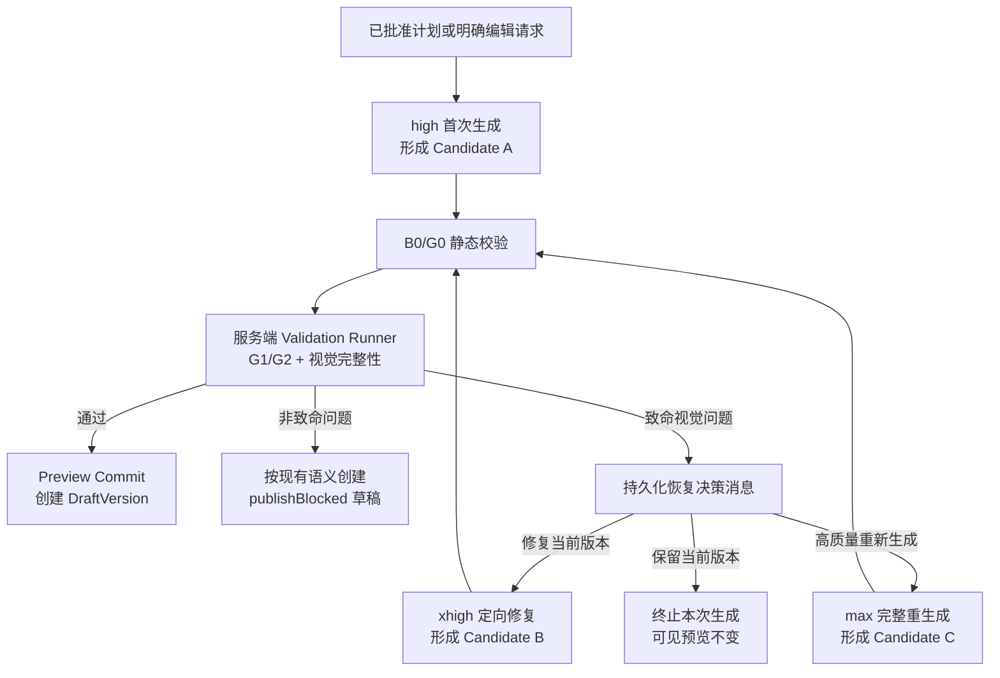

# 讨论稿：Spec 生成推理强度、视觉 Gate 与用户恢复决策

- 状态：Proposed，尚未进入实施计划
- 日期：2026-08-17
- 范围：`examples/vite-multipage-agent/`
- 上游设计：[设计系统与 Catalog 方案](./vite-multipage-agent-design-system-catalog-design.md)
- 相关平台设计：[持久化、发布与账号平台方案](./persistence-release-platform-design.md)

## 1. 背景

`vite-multipage-agent` 使用服务端生成器模型输出结构化 Patch，形成完整
ApplicationCandidate，经 Catalog、Runtime 与浏览器验证后才进入草稿预览。现有自动门禁能够发现
Schema、Runtime 提交和基础交互错误，但一次 `gpt-5.6-sol` 实测表明：候选可以通过全部现有门禁，
同时仍出现主内容异常收缩、中文逐字换行和大面积空白等严重视觉故障。

本讨论稿回答三个问题：

1. Spec 首次生成应该使用什么推理强度；
2. 视觉 Gate 应该在提交链路中承担什么职责；
3. Gate 失败后，系统自动处理到什么程度，哪些选择必须交给用户。

本文只记录讨论结论和建议契约，不修改当前主方案、运行时或模型默认值。

## 2. 已完成的单案例实测

### 2.1 测试方法

- 模型：`gpt-5.6-sol`；
- 固定需求：`insurance-portal`；
- 每档首次各运行一次，`xhigh` 额外复测一次；
- 使用相同生成 Prompt、Catalog、工具 Schema、步数边界和 Runtime；
- 自动检查：Catalog 校验、静态路由 Runtime 原子提交、需求覆盖、结构信号；
- 浏览器检查：全部静态路由渲染、无 Preview Error、至少一个按钮产生 `action_settled`；
- 人工检查：首页和代表性业务页面的布局与可读性。

本地结果位于 `examples/vite-multipage-agent/data/spec-model-benchmarks/`。`data/` 被忽略，
这些结果是本次讨论证据，不是版本化发布基线。网关返回成本为 0，不能据此推断上游没有费用。

### 2.2 结果摘要

| 推理强度 | 样本 | 耗时 | 输入 Token | 输出 Token | 推理 Token | 事件/表单控件 | 自动门禁 | 人工视觉 |
| --- | ---: | ---: | ---: | ---: | ---: | ---: | --- | --- |
| `none` | 1 | 61s | 37,227 | 5,343 | 0 | 16 / 11 | 通过 | 可用，但布局割裂 |
| `low` | 1 | 63s | 36,773 | 4,331 | 365 | 14 / 10 | 通过 | 简洁、内容较少 |
| `medium` | 1 | 95s | 44,014 | 7,312 | 747 | 18 / 13 | 通过 | 完整、性价比较高 |
| `high` | 1 | 127s | 71,398 | 10,454 | 1,524 | 31 / 15 | 通过 | 功能丰富、布局可靠 |
| `xhigh` | 1 | 199s | 141,852 | 14,937 | 3,870 | 23 / 17 | 通过 | 严重布局故障 |
| `xhigh` | 2 | 186s | 71,368 | 14,771 | 3,611 | 37 / 25 | 通过 | 良好，接近 `max` |
| `max` | 1 | 261s | 162,842 | 21,786 | 6,342 | 32 / 34 | 通过 | 本轮最完整 |

这些数据只证明当前固定案例中的可观察行为，不足以估算各档稳定成功率。尤其是 `xhigh` 两次
自动门禁均通过，但只有一次人工视觉可用，说明视觉质量不是推理强度的单调函数，也说明当前浏览器
门禁缺少视觉完整性检测。

## 3. 讨论结论

### 3.1 首次生成采用 `high`

建议首次生成固定使用服务端 `high`：

- 相比本轮 `xhigh` 平均耗时约低三分之一；
- 已覆盖完整需求，并形成足够的导航、状态和交互；
- 本轮视觉结果可靠；
- 相比 `max` 显著降低等待时间和 Token；
- 用户不需要理解或选择模型参数。

模型和推理强度仍是服务端策略，不进入普通生成请求体。产品 UI 使用“正在生成”或“高质量重新生成”
等结果导向语言，不暴露 `high`、`xhigh`、`max`。

### 3.2 失败恢复由用户决定

首次 Candidate 出现致命视觉问题时，系统不直接串行执行 `xhigh + max`。服务端保存有界 Gate 结果，
聊天区以持久化普通消息展示三个选择：

| 用户选项 | 内部策略 | Candidate 基线 | 预期结果 |
| --- | --- | --- | --- |
| 修复当前版本（推荐） | `xhigh` 定向 Patch 修复一次 | 失败 Candidate 的不可变引用 | 保留已完成内容，只修复 Gate 问题 |
| 高质量重新生成 | `max` 完整生成 | 已批准计划 + 当前有效 Draft/Published 基线 | 放弃失败 Candidate，生成更完整版本 |
| 保留当前版本 | 不再调用模型 | 当前有效 Draft/Published | 本次 run 终止，不改变可见预览 |

用户选择“修复当前版本”后，修复执行是自动的，但只能产生新的 GenerationRun、ApplicationCandidate
和 candidateDigest；失败 Candidate 不得原地改写。修复结果重新通过 B0/G0/G1/G2 和 Preview Commit。

### 3.3 不把恢复决策实现为 Agent interrupt

恢复选择由确定性的应用状态机发起，不使用 `ask_question` 或 CopilotKit/Mastra Agent interrupt：

- 决策消息需要在刷新或服务重启后恢复；
- Agent run 已经结束，不应为等待用户选择长期持有 pending interrupt；
- 选择结果需要严格绑定 appId、generationId 和 candidateDigest；
- 重复提交必须幂等，迟到或跨应用提交必须拒绝。

## 4. 建议流程



依赖方向固定为：生成器只产生 Candidate；Validation Runner 只观测并产生权威报告；恢复协调器只根据
已授权用户决定创建新的 GenerationRun；Preview Commit 只接受通过既定 Gate 的精确 digest。

## 5. 组件与职责

### 5.1 Generation Policy

- owner：生成服务；
- 职责：把产品级生成模式映射到服务端模型配置；
- 首次生成映射：`standard_generation -> gpt-5.6-sol/high`；
- 恢复映射：`repair_candidate -> gpt-5.6-sol/xhigh`，
  `regenerate_quality -> gpt-5.6-sol/max`；
- 不接受浏览器直接提交 model、reasoningEffort 或 providerOptions。

### 5.2 Visual Integrity Gate

- owner：服务端 Playwright Validation Runner；
- 输入：不可变 Candidate、candidateDigest、ValidationProfile；
- 输出：权威 ValidationReport 和 reportDigest；
- 职责：在既有 Schema、Runtime、交互和可访问性检查之外识别视觉完整性故障；
- 不得修改 Candidate，不得通过自动调整 CSS 掩盖失败。

### 5.3 Recovery Coordinator

- owner：Generation/Release Server；
- 职责：保存恢复决策、授权决策者、幂等消费选择、创建后继 GenerationRun；
- 输入只使用 URL path 中的可信 appId，以及 generationId、candidateDigest 和语义化 choice；
- 不把失败 Spec、完整截图或模型原文放入普通聊天消息。

### 5.4 Recovery Decision UI

- owner：聊天前端；
- 形态：普通、可恢复的系统聊天消息，不是模型工具卡的临时内存状态；
- 展示 Gate 的用户可理解摘要和三个选项；
- 决策完成后显示稳定结果，刷新后不能重新选择出第二个后继 run。

## 6. Visual Integrity Gate 建议范围

### 6.1 覆盖矩阵

沿用主方案的服务端 ValidationProfile：

- 所有静态路由；
- 每个动态路由至少一个经 Schema 校验的 staticParams；
- 桌面 `1440x900` 与移动 `390x844`；
- default、focus、open/expanded、loading、empty、error 等声明状态。

### 6.2 建议问题码

| code | 含义 | 建议分类 |
| --- | --- | --- |
| `content_width_too_narrow` | 主内容相对视口异常收缩 | fatal |
| `vertical_text_collapse` | 普通横排文本逐字纵向换行 | fatal |
| `critical_overlap` | 关键导航、表单或正文发生重叠 | fatal |
| `viewport_overflow` | 页面产生不可接受的横向溢出 | fatal |
| `content_clipped` | 关键文字或控件被裁切 | fatal |
| `navigation_content_detached` | 导航与主内容布局明显分离 | fatal |
| `excessive_blank_region` | 首屏关键区域出现异常大空白 | fatal 或 warning，待阈值确认 |
| `contrast_below_target` | 对比度不足 | 继续使用现有 G1 publishBlocked 语义 |

具体像素、比例、元素数量和连续空白阈值尚未确认，不能直接进入实现计划。阈值必须使用已通过人工复核的
正常/异常夹具校准，并按 ValidationProfile 版本化。

## 7. 接口草案

### 7.1 恢复决策输入

```ts
type GenerationRecoveryDecision = {
  generationId: string;
  candidateDigest: string;
  choice:
    | "repair_candidate"
    | "regenerate_quality"
    | "keep_current";
};
```

建议端点：

```text
POST /apps/:appId/generations/:generationId/recovery-decision
```

### 7.2 稳定返回

```ts
type GenerationRecoveryDecisionResult =
  | {
      status: "successor_started";
      successorGenerationId: string;
      strategy: "repair_candidate" | "regenerate_quality";
    }
  | {
      status: "kept_current";
    };
```

错误 owner 为 Generation/Release Server：

- `403 recovery_decision_forbidden`：当前成员无草稿编辑权限；
- `409 recovery_decision_already_consumed`：同一失败 Candidate 已有稳定决定；
- `409 recovery_candidate_stale`：digest 不匹配或 GenerationRun 已被替代；
- `422 recovery_not_available`：失败类型不允许修复或重生成。

幂等键建议为 `(appId, generationId, candidateDigest)`。相同决定重复提交返回第一次的稳定结果；不同决定
竞争时只有第一个成功，后续返回 `recovery_decision_already_consumed`。

### 7.3 定向修复上下文

修复生成器只接收服务端解析的不可变 sourceCandidateRef、已批准计划摘要和有界 GateIssue：

```ts
type VisualRepairRequest = {
  sourceGenerationId: string;
  sourceCandidateDigest: string;
  sourceCandidateRef: string;
  validationProfileVersion: string;
  issues: Array<{
    code: string;
    route: string;
    viewport: "desktop" | "mobile";
    elementId?: string;
    boundedMessage: string;
  }>;
};
```

模型不接收截图二进制、浏览器 Cookie、完整 ValidationReport 或其他应用数据。`sourceCandidateRef` 是服务端
opaque 引用，不能由浏览器替换为任意 Candidate。

## 8. 数据与状态

建议在既有 GenerationRun 之外增加恢复决策事实，避免把选择只存在聊天 UI：

```ts
type GenerationRecoveryRecord = {
  appId: string;
  failedGenerationId: string;
  failedCandidateDigest: string;
  decision: "repair_candidate" | "regenerate_quality" | "keep_current";
  decidedBy: string;
  decidedAt: string;
  successorGenerationId?: string;
};
```

Recovery Coordinator 是该记录的 truth owner。聊天消息是其可恢复投影；后继 GenerationRun 仍由生成服务拥有；
失败 Candidate 保持不可变并按 GenerationRun 生命周期保存。修复成功不会删除原失败记录。

建议状态流转：

```text
GenerationRun.running
  -> validation_failed_recoverable
  -> recovery_pending
  -> recovery_consumed
       -> successor GenerationRun.running
       -> kept_current
```

是否新增状态还是使用独立 RecoveryRecord 投影，需在实现计划前结合当前数据库 Schema 决定；不得让同一事实
同时由聊天消息和 GenerationRun 两边独立维护。

## 9. 与当前主方案的关系

本提案若被采纳，需要显式修订主方案，而不是直接实现：

1. 当前设计允许完整 G1 报告存在问题时创建 `publishBlocked` 草稿。本提案建议把 G1 区分为
   `fatal visual integrity` 与普通发布质量问题；fatal 在可见 Preview Commit 前进入恢复决策，普通问题继续沿用
   publishBlocked 草稿语义。
2. 当前 AC22 要求“不存在隐式自动重试”。本提案保留该原则：用户未选择时绝不重试；用户选择
   “修复当前版本”后，系统自动执行一次定向修复，不视为隐式重试。
3. 当前设计要求任何自动修复产生新 generationId/candidateDigest 并重新执行完整 Gate；本提案保持该要求。
4. 当前 Preview Commit、DraftVersion、ReleasePointer 和失败保留语义不变。

## 10. 失败、安全与可观测性

- 首次生成、修复和高质量重生成使用独立 generationId、correlation ID 和用量记录；
- 日志记录策略名、阶段、issue code、耗时和 Token，不记录凭据、完整 Spec、截图正文或模型原文；
- Gate、恢复决策或后继生成失败时保留最后有效 Draft/Published 和可见 iframe；
- 用户取消、刷新或服务重启后，已落盘决定和已创建后继 run 不得重复创建；
- 只有应用所有者和具备草稿编辑权限的成员可以作出恢复决定；
- 后继生成开始后不能切换决定，除非先显式取消该后继 run；取消语义需在实现前确认。

## 11. 暂定决策与待确认项

### 11.1 本轮已形成的建议

- D1：首次生成使用服务端 `gpt-5.6-sol/high`；
- D2：致命视觉 Gate 失败后由用户决定，不自动串行升级；
- D3：修复当前版本映射为 `xhigh` 定向 Patch，高质量重生成映射为 `max`；
- D4：恢复决定使用持久化普通聊天消息和独立应用 API，不使用 Agent interrupt；
- D5：失败 Candidate 不原地修改，任何修复产生新 generationId/digest 并重跑完整 Gate。

### 11.2 Blocking clarification questions

在进入实施计划前仍需确认：

1. `fatal` 视觉问题的精确阈值和校准夹具；
2. 用户选择修复后，是否最多只允许一次 `xhigh` 修复；
3. 修复再次失败后，是只提供“max 重生成/保留当前版本”，还是允许再次修复；
4. 创建型请求没有旧 Draft 时，“保留当前版本”应显示空 Preview 还是最近 Published；
5. 后继生成运行中用户取消后的稳定状态和再次决策规则；
6. 是否在首次生成前向高级用户提供“快速生成/高质量生成”，还是始终默认 `high`。

## 12. 架构验收标准

- AC1：普通首次生成请求不能从浏览器覆盖服务端模型、推理强度或 providerOptions。
- AC2：`high` Candidate 只有通过 B0/G0 和完整服务端 ValidationProfile 后才能进入 Preview Commit。
- AC3：人工校准夹具中的主内容收缩、逐字纵排、关键重叠、裁切和横向溢出均产生稳定 fatal issue code。
- AC4：fatal Candidate 不替换当前可见预览，也不能成为可发布 DraftVersion。
- AC5：恢复决策在刷新和服务重启后可恢复，并且同一 appId/generationId/digest 只能产生一个稳定决定。
- AC6：选择修复后创建新 generationId/digest，使用 sourceCandidateRef 和有界问题生成 Patch，并重新执行全部 Gate。
- AC7：选择高质量重生成后不复用失败 Candidate 内容，只复用已批准计划和当前有效版本基线。
- AC8：选择保留当前版本不调用模型，不移动 Draft/Release 指针，不改变可见 iframe。
- AC9：跨应用、错 digest、迟到、无权限和竞争的恢复决定全部 fail closed。
- AC10：任何失败路径后都不存在 pending Agent interrupt、自动无限重试或渲染循环。
- AC11：验证与恢复日志不包含完整 Candidate、截图正文、模型原文、Cookie 或凭据。
- AC12：基准至少覆盖代表性创建型案例的多次运行，并单独报告自动门禁通过率与人工/规则视觉可用率。

## 13. ADR 候选

本文是讨论稿，不直接创建或接受 ADR。若 Blocking 项关闭并采纳本提案，应单独创建：

| ID | 标题 | 状态 | Artifact/Path |
| --- | --- | --- | --- |
| ADR-GEN-001 | 首次生成固定 high，恢复策略由服务端映射 | Proposed | 待创建 |
| ADR-GEN-002 | 致命视觉完整性 Gate 阻止 Preview Commit | Proposed | 待创建 |
| ADR-GEN-003 | 用户驱动的持久化恢复决策与后继 GenerationRun | Proposed | 待创建 |

## 14. 下一步

1. 审核本文与主设计的冲突及 Blocking clarification questions；
2. 用正常/异常截图夹具校准 Visual Integrity Gate，而不是直接拍脑袋确定阈值；
3. 对 `high/xhigh/max` 在至少三个代表性案例中各运行多次，分开统计协议成功与视觉可用；
4. 项目所有者确认后修订主方案与 AC22，再制定独立实施计划；
5. 未完成上述步骤前，不修改生产默认模型策略，也不实现自动恢复。
